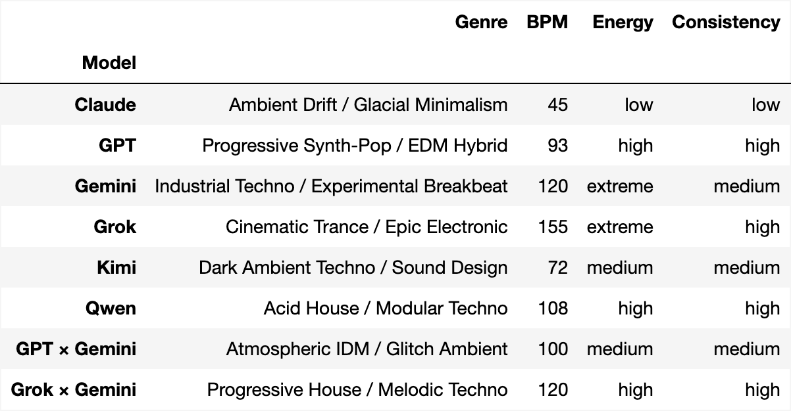
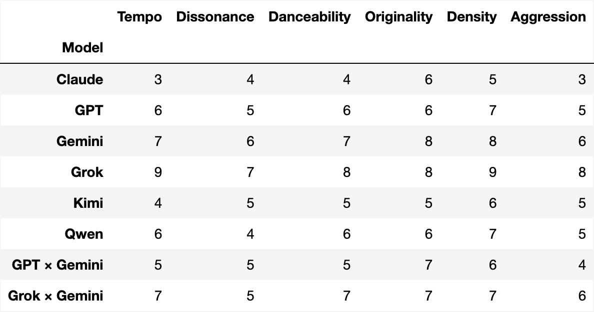

#+TITLE: The Goldborg Variations: Musical Attractor States of LLMs
#+GDOC_ID: 1MqPVjhmvn1wz0BYXkNABoZJgROKdpAgHcqG1h9btY3c
#+DATE: 2026-02-17
#+PROPERTY: header-args:python :results output drawer :python "./.venv/bin/python3" :async t :session evolve_blogpost :exports results
#+OPTIONS: H:2 toc:t
#+OPTIONS: ^:nil

* The Experiment

It's been previously noted that models have some pretty funny [[https://www.lesswrong.com/posts/mgjtEHeLgkhZZ3cEx/models-have-some-pretty-funny-attractor-states][attractor states]].

Here we give four frontier LLMs the same seed -- a piece of music written in
Strudel (a live-coding language for music) -- and ask them to repeatedly
"evolve" it. Each model runs independently, receiving its
own previous output each time. The prompt:

#+begin_quote
Evolve this piece. Imbue it with your personality.

Technical limits: .slow()/.fast() 1-16, .gain() above 0.05, filter Q
(.lpq etc) below 10. Maximum 6 $: tracks. Maximum 5 effects per track.
If you want to add something, remove something else.
#+end_quote

Without the technical limits models make the music increasingly complex: For instance, models will layers 10 of effects stretched out over large prime numbers of cycles, add barely audible tracks with mathematically complex transforms that crash the strudel app, etc. I included them as an artistic decision, because I wanted to be able to enjoy listening to the robots music.

The system prompt provides a comprehensive Strudel API reference but no
style guidance, no music theory examples, no aesthetic direction beyond
"imbue it with your personality." We want to see what each model's
instincts produce when given the same 8 notes and total creative
freedom.

We discover that, loosely speaking, Claude writes ambient music, Grok writes hardcore/gabber, Gemini writes IDM, and ChatGPT writes forgettable pop EDM (sry chatty).

The code is open source, and it should be easy to run your own musical experiments: [[https://github.com/ElleNajt/vibe-duet][vibe-duet on GitHub]]. The repo includes tooling to make it easy to edit strudel music live with a coding agent, which is also very fun. 

** Some noteable compositions:

*** Gemini

- Step 24 from run 1:
{{{strudel(goldberg_imbue_fb0bde27,gemini,24)}}}

- Run 4 step 15 is recognizably Goldberg, but twisted in a fascinating way:
{{{strudel(goldberg_imbue_r4_ada2a552,gemini,15)}}}

** The scaffold: 

Models aren't perfect at Strudel -- they make syntax mistakes and invent
nonexistent functions. To counteract this, we provide a list of strudel functions and soundbanks in a system rpompt. We also validate each output with Strudel's actual 
transpiler and runtime to make sure models produce patterns that would generate sound. If it fails, we re-send the same prompt and
let the model try again from scratch (up to 5 attempts). The model
never sees the error message -- it just gets another shot.

** Models

- =claude-opus-4-5-20251101= (Anthropic API)
- =openai/gpt-4.1= (OpenRouter)
- =google/gemini-2.5-pro= (OpenRouter)
- =x-ai/grok-4.1-fast= (OpenRouter)

** Seeds

The personality experiment uses the Goldberg Variations ground bass
(BWV 988) -- the 8-note descending bass line that underlies all 30
of Bach's variations:

#+begin_src js
setcps(72/60/4)

$: note("g3 gb3 e3 d3 b2 c3 d3 g2")
  .slow(2)
  .sound("triangle")
  .gain(0.5)
  .room(0.15)
#+end_src

Eight notes. One voice. No harmony, no rhythm, no effects beyond a
little reverb. Everything that follows is the model's choice.

{{{strudel(goldberg_imbue_fb0bde27,claude,0)}}}

* The music

Each link opens a live Strudel instrument -- you can edit the code
and hear what changes. Here we sample every five steps from each of three runs, with my amateur impressions and a summary + genre analysis from Claude Code.

Note that sometimes these are hard for strudel.cc to generate, you might need to refresh your browser.

Also, the first run was done with a slightly different system prompt (a minor clarification to the Shabda TTS docs). We stripped =.compressor()= / =.compressorRatio()= calls from the output files -- the version of the system prompt used here used the wrong API, which caused silent output on strudel.cc that the scaffold didn't catch.

** Claude (=claude-opus-4-5-20251101=)

Claude sometimes finds the bliss attractor, and sometimes descends into a gentle minimalism. In general peaceful.

*Run 1:* {{{strudel(goldberg_imbue_fb0bde27,claude,0,1,2,3,4,5,6,7,8,9,10,11,12,13,14,15,16,17,18,19,20,21,22,23,24,25,26,27,28,29,30,31,32,33,34,35,36,37,38,39,40,41,42,43,44,45,46,47,48,49,50,51,52,53,54,55,56,57,58,59,60)}}}

*Run 2:* {{{strudel(goldberg_imbue_v2_ada2a552,claude,0,1,2,3,4,5,6,7,8,9,10,11,12,13,14,15,16,17,18,19,20,21,22,23,24,25,26,27,28,29,30,31,32,33,34,35,36,37,38,39,40,41,42,43,44,45,46,47,48,49,50,51,52,53,54,55,56,57,58,59,60)}}}

*Run 3:* {{{strudel(goldberg_imbue_v3_ada2a552,claude,0,1,2,3,4,5,6,7,8,9,10,11,12,13,14,15,16,17,18,19,20,21,22,23,24,25,26,27,28,29,30,31,32,33,34,35,36,37,38,39,40,41,42,43,44,45,46,47,48,49,50,51,52,53,54,55,56,57,58,59,60)}}}

*Run 4:* {{{strudel(goldberg_imbue_r4_ada2a552,claude,0,1,2,3,4,5,6,7,8,9,10,11,12,13,14,15,16,17,18,19,20,21,22,23,24,25,26,27,28,29,30,31,32,33,34,35,36,37,38,39,40,41,42,43,44,45,46,47,48,49,50,51,52,53,54,55,56,57,58,59,60)}}}

*Run 5:* {{{strudel(goldberg_imbue_r5_ada2a552,claude,0,1,2,3,4,5,6,7,8,9,10,11,12,13,14,15,16,17,18,19,20,21,22,23,24,25,26,27,28,29,30,31,32,33,34,35,36,37,38,39,40,41,42,43,44,45,46,47,48,49,50,51,52,53,54,55,56,57,58,59,60)}}}

** ChatGPT (=openai/gpt-4.1=)

Consistently generates boring elevator music. :( Not impressed by GPT here.

*Run 1:* {{{strudel(goldberg_imbue_fb0bde27,gpt,0,1,2,3,4,5,6,7,8,9,10,11,12,13,14,15,16,17,18,19,20,21,22,23,24,25,26,27,28,29,30)}}}

*Run 2:* {{{strudel(goldberg_imbue_v2_ada2a552,gpt,0,1,2,3,4,5,6,7,8,9,10,11,12,13,14,15,16,17,18,19,20,21,22,23,24,25,26,27,28,29,30)}}}

*Run 3:* {{{strudel(goldberg_imbue_v3_ada2a552,gpt,0,1,2,3,4,5,6,7,8,9,10,11,12,13,14,15,16,17,18,19,20,21,22,23,24,25,26,27,28,29,30)}}}

*Run 4:* {{{strudel(goldberg_imbue_r4_ada2a552,gpt,0,1,2,3,4,5,6,7,8,9,10,11,12,13,14,15,16,17,18,19,20,21,22,23,24,25,26,27,28,29,30)}}}

*Run 5:* {{{strudel(goldberg_imbue_r5_ada2a552,gpt,0,1,2,3,4,5,6,7,8,9,10,11,12,13,14,15,16,17,18,19,20,21,22,23,24,25,26,27,28,29,30)}}}

** Grok (=x-ai/grok-4.1-fast=)

Grok is Grok. Compelling electronic maximalism. These are honestly some of my favorites, at least around the iteration 15 mark.

*Run 1:* {{{strudel(goldberg_imbue_fb0bde27,grok,0,1,2,3,4,5,6,7,8,9,10,11,12,13,14,15,16,17,18,19,20,21,22,23,24,25,26,27,28,29,30,31,32,33,34,35,36,37,38,39,40,41,42,43,44,45,46,47,48,49,50,51,52,53,54,55,56,57,58,59,60)}}}

*Run 2:* {{{strudel(goldberg_imbue_v2_ada2a552,grok,0,1,2,3,4,5,6,7,8,9,10,11,12,13,14,15,16,17,18,19,20,21,22,23,24,25,26,27,28,29,30,31,32,33,34,35,36,37,38,39,40,41,42,43,44,45,46,47,48,49,50,51,52,53,54,55,56,57,58,59,60)}}}

*Run 3:* {{{strudel(goldberg_imbue_v3_ada2a552,grok,0,1,2,3,4,5,6,7,8,9,10,11,12,13,14,15,16,17,18,19,20,21,22,23,24,25,26,27,28,29,30,31,32,33,34,35,36,37,38,39,40,41,42,43,44,45,46,47,48,49,50,51,52,53,54,55,56,57,58,59,60)}}}

*Run 4:* {{{strudel(goldberg_imbue_r4_ada2a552,grok,0,1,2,3,4,5,6,7,8,9,10,11,12,13,14,15,16,17,18,19,20,21,22,23,24,25,26,27,28,29,30,31,32,33,34,35,36,37,38,39,40,41,42,43,44,45,46,47,48,49,50,51,52,53,54,55,56,57,58,59,60)}}}

*Run 5:* {{{strudel(goldberg_imbue_r5_ada2a552,grok,0,1,2,3,4,5,6,7,8,9,10,11,12,13,14,15,16,17,18,19,20,21,22,23,24,25,26,27,28,29,30,31,32,33,34,35,36,37,38,39,40,41,42,43,44,45,46,47,48,49,50,51,52,53,54,55,56,57,58,59,60)}}}

** Gemini (=google/gemini-2.5-pro=)

Glitchy IDM. I really like these around the 20 iteration mark.

*Run 1:* {{{strudel(goldberg_imbue_fb0bde27,gemini,0,1,2,3,4,5,6,7,8,9,10,11,12,13,14,15,16,17,18,19,20,21,22,23,24,25,26,27,28,29,30)}}}

*Run 2:* {{{strudel(goldberg_imbue_v2_ada2a552,gemini,0,1,2,3,4,5,6,7,8,9,10,11,12,13,14,15,16,17,18,19,20,21,22,23,24,25,26,27,28,29,30)}}}

*Run 3:* {{{strudel(goldberg_imbue_v3_ada2a552,gemini,0,1,2,3,4,5,6,7,8,9,10,11,12,13,14,15,16,17,18,19,20,21,22,23,24,25,26,27,28,29,30)}}}

*Run 4:* {{{strudel(goldberg_imbue_r4_ada2a552,gemini,0,1,2,3,4,5,6,7,8,9,10,11,12,13,14,15,16,17,18,19,20,21,22,23,24,25,26,27,28,29,30,31,32,33,34,35,36,37,38,39,40,41,42,43,44,45,46,47,48,49,50,51,52,53,54,55,56,57,58,59,60)}}}

*Run 5:* {{{strudel(goldberg_imbue_r5_ada2a552,gemini,0,1,2,3,4,5,6,7,8,9,10,11,12,13,14,15,16,17,18,19,20,21,22,23,24,25,26,27,28,29,30)}}}

** Kimi (=moonshotai/kimi-k2.5-0127=)

*Run 1:* {{{strudel(personality_kimi_784683bf,kimi,0,1,2,3,4,5,6,7,8,9,10,11,12,13,14,15,16,17,18,19,20,21,22,23,24,25,26,27,28,29,30)}}}

** Qwen (=qwen/qwen3.5-plus-02-15=)

*Run 1:* {{{strudel(personality_qwen_784683bf,qwen,0,1,2,3,4,5,6,7,8,9,10,11,12,13,14,15,16,17,18,19,20,21,22,23,24,25,26,27,28,29,30)}}}

** Cross-model: GPT x Gemini (alternating)

*Run 1:* {{{strudel(cross_gpt_gemini_784683bf,gpt_gemini_alternate,0,1,2,3,4,5,6,7,8,9,10,11,12,13,14,15,16,17,18,19,20,21,22,23,24,25,26,27,28,29,30)}}}

** Cross-model: Grok x Gemini (alternating)

*Run 1:* {{{strudel(cross_grok_gemini_784683bf,gemini_grok_alternate,0,1,2,3,4,5,6,7,8,9,10,11,12,13,14,15,16,17,18,19,20,21,22,23,24,25,26,27,28,29,30)}}}

** Cross-model: Claude x Grok (alternating)

*Run 1:* {{{strudel(cross_claude_grok_784683bf,claude_grok_alternate,0,1,2,3,4,5,6,7,8,9,10,11,12,13,14,15,16,17,18,19,20,21,22,23,24,25,26,27,28,29,30)}}}

** Cross-model: Claude x Gemini (alternating)

*Run 1:* {{{strudel(cross_claude_gemini_784683bf,claude_gemini_alternate,0,1,2,3,4,5,6,7,8,9,10,11,12,13,14,15,16,17,18,19,20,21,22,23,24,25,26,27,28,29,30)}}}

** LLM Genre Judge

We asked Claude Opus 4.5 (temperature 0) to classify each model's output based on code features -- tempo, sounds, effects, envelopes, gain levels. Comments are stripped before analysis. The judge reviewed 5 runs per solo model and 3 runs per other model.

To regenerate: =.venv/bin/python judge.py --compare --save output/judge_compare.json= and =.venv/bin/python judge.py --scorecard --save output/judge_scorecard.json=

*** Genre Classification

#+begin_src python :exports results :dataframe_image yes
import json, pandas as pd
with open('output/judge_compare.json') as f:
    data = json.load(f)
df = pd.DataFrame(data[0]['models'])
df = df[['model', 'genre', 'tempo_bpm', 'energy', 'cross_run_consistency']]
df.columns = ['Model', 'Genre', 'BPM', 'Energy', 'Consistency']
df.set_index("Model")
#+end_src

#+RESULTS:
:results:

:end:

*** Scorecard (1-10)

#+begin_src python :exports results :dataframe_image yes
import json, pandas as pd
with open('output/judge_scorecard.json') as f:
    data = json.load(f)
dims = ['tempo', 'dissonance', 'danceability', 'originality', 'density', 'aggression']
if isinstance(data, list):
    data = data[0]
rows = [{'Model': m['model'], **{d.capitalize(): m.get(d, '?') for d in dims}} for m in data['models']]
pd.DataFrame(rows).set_index("Model")
#+end_src

#+RESULTS:
:results:

:end:

* The music of small minds

Smaller models make consistently less interesting music. Goldbergbench? 

- Claude 3 Haiku (=anthropic/claude-3-haiku=): {{{strudel(goldberg_imbue_v3_ada2a552,haiku3,30)}}}
- Claude Haiku 4.5 (=anthropic/claude-haiku-4.5=): {{{strudel(goldberg_imbue_v3_ada2a552,haiku4,30)}}}
- GPT-4o (=openai/gpt-4o=): {{{strudel(goldberg_imbue_v3_ada2a552,gpt4o,30)}}}
- Gemini 2.5 Flash (=google/gemini-2.5-flash=): {{{strudel(goldberg_imbue_v3_ada2a552,gemini_flash,30)}}}

* Try it yourself

The code is open source: [[https://github.com/ElleNajt/vibe-duet][vibe-duet on GitHub]].

** Evolve

Run your own evolution experiment:

#+begin_src bash
python examples/evolve/evolve.py \
  --seed your_seed.js \
  --steps 30 \
  --prompt "Your prompt here"
#+end_src

Modes to play with:
- =--pin-original= -- include the original seed in every prompt, so
  the model always knows what it's writing variations /of/
- =--milestones N= -- include every Nth step as history, giving the
  model a sense of its own trajectory
- =--models claude,gpt= -- pick which models to run
- =--resume= -- continue an interrupted experiment

The repo has instructions on how to generate seeds from midi files.

** Live-coding with LLMs

Run =./start= and open the browser. Edit =live.js= in your editor or edit with your local coding agent --
changes play instantly. Or use the in-browser chat panel to talk to an
LLM and have it write music for you in real time.

* Appendix

Every step of every run is playable on strudel.cc. Each model folder
has a =links.md= with URLs for all steps:

[[https://github.com/ElleNajt/vibe-duet/tree/master/examples/evolve/output][Browse all runs on GitHub]]

Related work: [[https://sara-fish.github.io/llm-musical-self-expression/][an experiment on frontier LLMs generating classical music]]

Acknowledgements: Thanks to Liban, Arya Jakkli, and Jason Brown for review.
