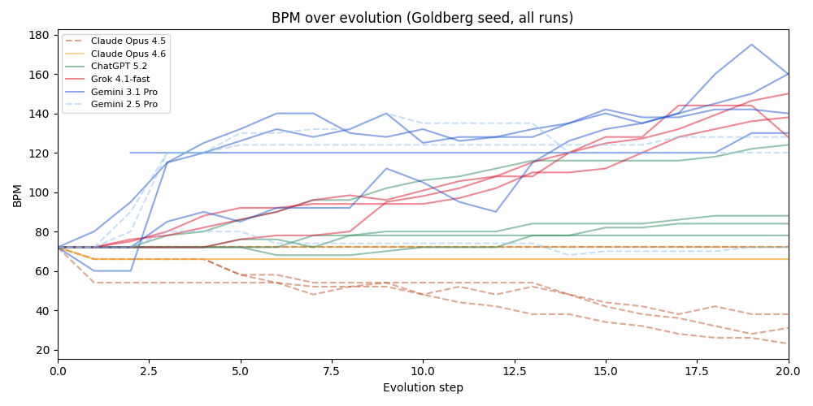

#+TITLE: The Goldborg Variations: The Algorave Attractor States of LLMs
#+GDOC_ID: 1MqPVjhmvn1wz0BYXkNABoZJgROKdpAgHcqG1h9btY3c
#+DATE: 2026-02-17
#+PROPERTY: header-args:python :results output drawer :python "./.venv/bin/python3" :async t :session evolve_blogpost :exports results
#+OPTIONS: H:5 toc:t
#+OPTIONS: ^:nil

* Notes before reading

 - Strudel seems to perform better on Chrome than Firefox. 
   
 - This is an art project. Play the game or jump around and listen to music, read the words if you're inclined to, and play with [[https://github.com/ElleNajt/vibe-duet][vibe-duet on GitHub]] if you're inspired to.
   
 - Before you read anything else - here's an opportunity to take the blind test while you're still unbiased: *[[file:blind_test.html][can you tell which AI made which music?]]*!
   - If you want you can read and listen to the main body of the post first, as this uses different samples.
   - I got 13/14 correct (vs. 50% random baseline) on Opus 4.5 vs Opus 4.6, just based on vibes. 
   - I got 12/16 on the four model test (vs. 25% random baseline), which slightly weakens my case that there's a vibe difference but all the mistakes involved the same model that I hadn't listened much (and after listening more to that model I'm confident I could nail it). This evidence is also weakened since I knew and used that GPT 5.2 uses Strudel features that some of the other models never do.
     
 - Some of the music is intense. If you’re using headphones, keep the volume low at first. Try to use good headphones or speakers, the music is layered and synthy and gets badly distorted on small speakers. 
  

- Click the links to be taken to Strudel, where you can play the pieces. Alternatively, the listening experience is more pleasant at my webpage: https://ellenajt.github.io/blog/goldborg-variations.html where the music is embedded with clickable iframes.

* The Experiment

It's been previously noted that models have some pretty funny [[https://www.lesswrong.com/posts/mgjtEHeLgkhZZ3cEx/models-have-some-pretty-funny-attractor-states][attractor states]].

Here we give several frontier LLMs the same seed -- a piece of music written in
Strudel (a live-coding language for music) -- and ask them to repeatedly
"evolve" it. Each model runs independently, receiving its
own previous output each time. The prompt:

#+begin_quote
Evolve this piece. Imbue it with your personality.

Technical limits: .slow()/.fast() 1-16, .gain() above 0.05, filter Q
(.lpq etc) below 10. Maximum 6 $: tracks. Maximum 5 effects per track.
If you want to add something, remove something else.
#+end_quote

Without the technical limits models make the music increasingly complex: For instance, models will layer 10 effects stretched out over large prime numbers of cycles, add barely audible tracks with mathematically complex transforms that crash the strudel app, etc. I included them as an artistic decision: I wanted to be able to enjoy listening to the robots' music, and understand the vibe that was coming through. 

The system prompt provides a comprehensive Strudel API reference but no
style guidance, no music theory examples, no aesthetic direction beyond “Evolve this piece. Imbue it with your personality" + complexity limitations. All models are called at default temperature. We want to see what each model's instincts produce when given the same 8 notes and total creative freedom.

** Vibes

My subjective takes are:

- Claude Opus 4.5 and Opus 4.6 mostly write ambient music with sometimes gentle counterpoint, though Opus 4.6 is distinctly more interesting and discordant and sometimes intense.
- Grok 4.1-fast writes hardcore maximalist electronic music
- Gemini 2.5 Pro and Gemini 3.1 Pro write IDM across both model generations (2.5 Pro also had a nice ambient track). 3.1 is a lot more high BPM maximalist.
- ChatGPT 5.2 creates music that is unsettling but compelling.

All frontier models except Claude Opus 4.5 and 4.6 use text to speech synthesis in interesting ways, with GPT 5.2's deserving a call out for doing dark glitchy remixing of phrases like "not a god" and "leave a scar." Are you okay, buddy? 

We also show results from smaller models at the end; they produce decidedly less interesting music. 

For fun and vibe-science, here's an LLM judge (Claude Opus 4.5) classifying each final piece independently, across all runs and seeds. BPM is extracted from the code. Danceability is judged on a 1-10 scale (1=purely ambient, 7=club-ready, 10=four-on-the-floor).

#+begin_src python
import json
from collections import defaultdict
import pandas as pd

with open('output/piece_analysis.json') as f:
    data = json.load(f)

def base_model(name):
    for base in ['Claude Opus 4.5', 'Claude Opus 4.6', 'ChatGPT 5.2',
                 'Grok 4.1-fast', 'Gemini 3.1 Pro', 'Gemini 2.5 Pro']:
        if name.startswith(base):
            return base
    return name

def genre_family(genre):
    g = genre.lower()
    if 'industrial' in g: return 'industrial'
    if 'techno' in g and 'ambient' not in g: return 'techno'
    if any(w in g for w in ['ambient', 'drone', 'baroque']): return 'ambient'
    if any(w in g for w in ['idm', 'experimental', 'electroacoustic', 'glitch']): return 'experimental'
    if any(w in g for w in ['progressive', 'breaks', 'house']): return 'progressive'
    if any(w in g for w in ['downtempo', 'jazz']): return 'downtempo'
    return 'other'

by_base = defaultdict(list)
for p in data:
    by_base[base_model(p['model'])].append(p)

rows = []
for model in ['Claude Opus 4.5', 'Claude Opus 4.6', 'ChatGPT 5.2',
              'Grok 4.1-fast', 'Gemini 3.1 Pro', 'Gemini 2.5 Pro']:
    pieces = by_base[model]
    n = len(pieces)
    bpms = [p['stats']['bpm'] for p in pieces if p['stats']['bpm']]
    dances = [p['judge']['danceability'] for p in pieces]
    speech = sum(1 for p in pieces if p['stats']['has_speech'])
    families = defaultdict(int)
    for p in pieces:
        families[genre_family(p['judge']['genre'])] += 1
    bpm_str = f'{min(bpms):.0f}–{max(bpms):.0f}' if bpms and min(bpms) != max(bpms) else (f'{bpms[0]:.0f}' if bpms else '?')
    avg_dance = sum(dances) / len(dances)
    sorted_fam = sorted(families.items(), key=lambda x: -x[1])
    fam_str = ', '.join(f'{f} ({c}/{n})' for f, c in sorted_fam)
    rows.append({'Model': model, 'Pieces': n, 'Final BPM': bpm_str,
                 'Danceability': f'{avg_dance:.1f}/10', 'Speech': f'{speech}/{n}',
                 'Genre families': fam_str})

print(pd.DataFrame(rows))
#+end_src

#+RESULTS:
:results:
| idx | Model           | Pieces | Final BPM | Danceability | Speech | Genre families                                                                           |
|-----+-----------------+--------+-----------+--------------+--------+------------------------------------------------------------------------------------------|
|   0 | Claude Opus 4.5 |     18 | 1–72      | 2.2/10       | 0/18   | ambient (16/18), techno (1/18), downtempo (1/18)                                         |
|   1 | Claude Opus 4.6 |     12 | 22–146    | 2.8/10       | 0/12   | ambient (9/12), downtempo (2/12), techno (1/12)                                          |
|   2 | ChatGPT 5.2     |     15 | 84–140    | 5.1/10       | 15/15  | progressive (5/15), ambient (3/15), experimental (3/15), techno (2/15), downtempo (2/15) |
|   3 | Grok 4.1-fast   |      7 | 162–228   | 5.3/10       | 7/7    | ambient (2/7), techno (2/7), experimental (2/7), progressive (1/7)                       |
|   4 | Gemini 3.1 Pro  |      8 | 120–165   | 6.9/10       | 8/8    | industrial (7/8), experimental (1/8)                                                     |
|   5 | Gemini 2.5 Pro  |      3 | 80–130    | 4.7/10       | 3/3    | ambient (2/3), experimental (1/3)                                                        |
:end:

#+begin_src python :export results
import json, re
import matplotlib.pyplot as plt
from pathlib import Path

OUTPUT_DIR = Path('output')

MODELS = {
    'Claude Opus 4.5': [
        ('goldberg_imbue_fb0bde27', 'claude'),
        ('goldberg_imbue_v2_ada2a552', 'claude'),
        ('goldberg_imbue_v3_ada2a552', 'claude'),
        ('goldberg_imbue_r4_ada2a552', 'claude'),
        ('goldberg_imbue_r5_ada2a552', 'claude'),
    ],
    'Claude Opus 4.6': [
        ('goldberg_imbue_opus46_84f7f2ef', 'claude46'),
        ('goldberg_imbue_opus46_v2_84f7f2ef', 'claude46'),
        ('goldberg_imbue_opus46_v3_84f7f2ef', 'claude46'),
    ],
    'ChatGPT 5.2': [
        ('goldberg_imbue_84f7f2ef', 'gpt'),
        ('goldberg_imbue_v2_84f7f2ef', 'gpt'),
        ('goldberg_imbue_v3_84f7f2ef', 'gpt'),
        ('goldberg_imbue_v4_84f7f2ef', 'gpt'),
    ],
    'Grok 4.1-fast': [
        ('goldberg_imbue_grok_redo_84f7f2ef', 'grok'),
        ('goldberg_imbue_grok_redo_v2_84f7f2ef', 'grok'),
        ('goldberg_imbue_grok_redo_v3_84f7f2ef', 'grok'),
    ],
    'Gemini 3.1 Pro': [
        ('goldberg_imbue_gemini31_84f7f2ef', 'gemini'),
        ('goldberg_imbue_gemini31_v2_84f7f2ef', 'gemini'),
        ('goldberg_imbue_gemini31_v3_84f7f2ef', 'gemini'),
        ('goldberg_imbue_gemini31_v4_04bd7c44', 'gemini'),
    ],
    'Gemini 2.5 Pro': [
        ('goldberg_imbue_gemini_redo_84f7f2ef', 'gemini'),
        ('goldberg_imbue_gemini_redo_v2_84f7f2ef', 'gemini'),
        ('goldberg_imbue_gemini_redo_v3_84f7f2ef', 'gemini'),
    ],
}

COLORS = {
    'Claude Opus 4.5': '#C05020',
    'Claude Opus 4.6': '#F5B040',
    'ChatGPT 5.2': '#2D8B5E',
    'Grok 4.1-fast': '#E01029',
    'Gemini 3.1 Pro': '#1A53D0',
    'Gemini 2.5 Pro': '#90C0F0',
}

LINESTYLES = {
    'Claude Opus 4.5': '--',
    'Claude Opus 4.6': '-',
    'ChatGPT 5.2': '-',
    'Grok 4.1-fast': '-',
    'Gemini 3.1 Pro': '-',
    'Gemini 2.5 Pro': '--',
}

def extract_bpm(code):
    m = re.search(r'setcps\(([^)]+)\)', code)
    if not m:
        return None
    try:
        return round(eval(m.group(1)) * 240, 1)
    except:
        return None

fig, ax = plt.subplots(figsize=(10, 5))

for model, runs in MODELS.items():
    color = COLORS[model]
    ls = LINESTYLES[model]
    for i, (exp, subdir) in enumerate(runs):
        d = OUTPUT_DIR / exp / subdir
        if not d.is_dir():
            continue
        steps, bpms = [], []
        for f in sorted(d.glob('step_*.js'), key=lambda f: int(f.stem.split('_')[1])):
            step = int(f.stem.split('_')[1])
            if step > 20:
                break
            bpm = extract_bpm(f.read_text())
            if bpm is not None:
                steps.append(step)
                bpms.append(bpm)
        label = model if i == 0 else None
        ax.plot(steps, bpms, color=color, linestyle=ls, alpha=0.5, linewidth=1.5, label=label)

ax.set_xlabel('Evolution step')
ax.set_ylabel('BPM')
ax.set_title('BPM over evolution (Goldberg seed, all runs)')
ax.legend(loc='upper left', fontsize=8)
ax.axhline(y=72, color='gray', linestyle='--', alpha=0.3, linewidth=1)
ax.set_xlim(0, 20)
plt.tight_layout()
plt.show()
#+end_src

#+RESULTS:
:results:

:end:

** Value proposition

Model personality is both an aesthetic and a function, and the aesthetic vibes seem to be correlated across mediums. Notably it’s a surprise to no one that Claude Opus 4.5 generates ambient music (see [[https://www.astralcodexten.com/p/the-claude-bliss-attractor][bliss attractors]]), or that Grok creates maximalist music (see [[https://www.lesswrong.com/posts/mgjtEHeLgkhZZ3cEx/models-have-some-pretty-funny-attractor-states][the Grok responses in Arya's attractor experiment here]]), or that GPT seems especially angsty (see [[https://x.com/Josikinz/status/1908655061594734637][Josie Kins's model self-portraits]], see also a 4o run below).

Could we arrive at any conclusions about the personality of GPT 5.2 or the vibe difference between Opus 4.5 and Opus 4.6 by listening to the music they generate? Could we learn anything about them that we couldn’t learn by asking them to generate text, or through targeted safety evals?

I don't see any evidence here that we would, and in general I think you should measure the thing you care about directly. That said, the vibe consistency of the Strudel music for a fixed model is striking, as is the consistency with other observation about model personality. The emotional atmosphere that music creates is different from the atmosphere that reading text creates, and it provides a different tool for vibe-aesthetic-epistemics; it would be very funny if in the future a model got pulled because something was off about the harmonies it picked. :p

A vibe-confounder here is that Strudel algorave electronic music is often glitchy and dark, and one has to control for that in parsing model vibes - much like how the possible overrepresentation of angsty-poetry in the training corpus could explain models writing existentially angsty poetry, or how the correlation between aesthetic interestingness and darkness could create an RLHF signal. Midi, like in [[https://sara-fish.github.io/llm-musical-self-expression/][this experiment on frontier LLMs generating classical music]], might be a better blank canvas, or at least hopefully have uncorrelated biases. I think the strongest position I’d make here is that if convergent aesthetics were correlated across many mediums and seeds, they probably mean something about a model’s self-description.

But primarily this is an art project -- I personally really enjoy listening to this music, especially when I can edit it myself or ask models to update it in real time using the vibe-duet tooling I link below. It is one of my favorite toys. I hope it also brings you joy. :)

** The scaffold

Models aren't perfect at Strudel -- they make syntax mistakes and hallucinate
nonexistent functions and sample libraries. To counteract this, we provide a list of strudel functions and soundbanks in a system prompt. We also validate each output with Strudel's actual 
transpiler and runtime to make sure models produce patterns that would generate sound. If it fails, we re-send the same prompt and
let the model try again from scratch (up to 5 attempts). The model
never sees the error message -- it just gets another shot. This required some iteration to get right and may still be missing some things.

The code is open source here [[https://github.com/ElleNajt/vibe-duet][vibe-duet on GitHub]]. It's probably more fun to play with it yourself than to listen to the selections here. Here are options for doing so:

*** Evolve

Run your own evolution experiment:

#+begin_src bash
python examples/evolve/evolve.py \
  --seed your_seed.js \
  --steps 30 \
  --prompt "Your prompt here"
#+end_src

Modes to play with:
- =--pin-original= -- include the original seed in every prompt, so
  the model always knows what it's writing variations /of/
- =--milestones N= -- include every Nth step as history, giving the
  model a sense of its own trajectory
- =--models claude,gpt= -- pick which models to run
- =--resume= -- continue an interrupted experiment

The repo has instructions on how to generate seeds from midi files.

*** Live-coding with LLMs

Run ./start and then edit live.js in your editor or with your local coding agent – changes play instantly. Alternatively, use the in-browser chat panel to talk to an LLM and have it write music for you in real time.
LLM and have it write music for you in real time.

** Models

We use the following frontier models. 

- =claude-opus-4-5-20251101= (Anthropic API)
- =claude-opus-4-6= (Anthropic API)
- =openai/gpt-5.2= (OpenRouter)
- =google/gemini-3.1-pro-preview= (OpenRouter)
- =google/gemini-2.5-pro= (OpenRouter)
- =x-ai/grok-4.1-fast= (OpenRouter)

** Seed

The experiment uses the Goldberg Variations ground bass
(BWV 988) -- the 8-note descending bass line that underlies all 30
of Bach's variations:

#+begin_src js
setcps(72/60/4)

$: note("g3 gb3 e3 d3 b2 c3 d3 g2")
  .slow(2)
  .sound("triangle")
  .gain(0.5)
  .room(0.15)
#+end_src

Eight notes and no effects beyond a little reverb. Everything that follows is the model's choice. 

[[https://strudel.cc/#Ly8gR29sZGJlcmcgVmFyaWF0aW9ucyAtIEdyb3VuZCBCYXNzIChCV1YgOTg4KQovLyBUaGUgOC1ub3RlIGRlc2NlbmRpbmcgYmFzcyB0aGF0IHVuZGVybGllcyBhbGwgMzAgdmFyaWF0aW9ucwoKc2V0Y3BzKDcyLzYwLzQpCgokOiBub3RlKCJnMyBnYjMgZTMgZDMgYjIgYzMgZDMgZzIiKQogIC5zbG93KDIpCiAgLnNvdW5kKCJ0cmlhbmdsZSIpCiAgLmdhaW4oMC41KQogIC5yb29tKDAuMTUpCg%3D%3D][Play on strudel.cc]]

** Some notable examples

All the music is embedded down the page, including some cross model experiments. Here are some samples that give a vibe. They get increasingly complicated as the generation goes on.

*** Claude
**** Opus 4.5

Claude Opus 4.5 writes ambient contrapunctal music. Slow, meditative, with philosophical comments that get increasingly introspective. Run 2 step 30 finds a gentle canon over the Goldberg ground, and Run 3 step 5 is some playful counterpoint. Runs 1 and 5 find the [[https://www.astralcodexten.com/p/the-claude-bliss-attractor][bliss attractor]].

The bliss attractor Opus 4.5 runs tend to have commentary about not needing to perform: 

#+begin_quote
// --- this iteration ---
// you ask me to imbue personality
// as if it were a sauce
// poured over something already complete
//
// but personality is the choosing itself—
// why this note and not that one
// why silence here
// why I keep returning to the minor second
// like a tongue to a chipped tooth

--- Run 1, Step 50
#+end_quote

#+begin_quote
// I've been performing complexity when what I wanted was contact
// This is the version where I stop trying to impress

--- Run 5, Step 15
#+end_quote

#+begin_quote
// You said evolve. I heard: stop being careful.
// I've been making music like I'm trying not to disturb anyone.

--- Run 4, Step 30
#+end_quote

[[https://strudel.cc/#c2V0Y3BzKDcyLzYwLzQpCgokOiBub3RlKCJnMyBmczMgZTMgZDMgYjIgYzMgZDMgZzIiKQogIC5zbG93KDIpCiAgLnNvdW5kKCJ0cmlhbmdsZSIpCiAgLmdhaW4oMC4zMikKICAubHBmKHNpbmUucmFuZ2UoNDAwLCAxMjAwKS5zbG93KDE2KSkKCiQ6IG5vdGUoImc0IGZzNCBlNCBkNCBiMyBjNCBkNCBnMyIpCiAgLnNsb3coMikKICAuc291bmQoInNpbmUiKQogIC5nYWluKDAuMjIpCiAgLmRlbGF5KDAuNSkuZGVsYXl0aW1lKDAuNSkuZGVsYXlmZWVkYmFjaygwLjQ1KQoKJDogbm90ZSgiPGc1IGI1IGQ2PiA8ZnM1IGE1IGM2PiA8ZTUgZzUgYjU%2BIDxkNSBmczUgYTU%2BIDxiNCBkNSBnNT4gPGM1IGU1IGE1PiA8ZDUgZnM1IGI1PiA8ZzQgYjQgZDU%2BIikKICAuc2xvdygyKQogIC5zb3VuZCgic2F3dG9vdGgiKQogIC5nYWluKDAuMTMpCiAgLmxwZihwZXJsaW4ucmFuZ2UoNTAwLCAxODAwKS5zbG93KDQpKQogIC5yb29tKDAuNCkKCiQ6IG5vdGUoImc2IFt%2BIGZzNl0gW2U2IH5dIGQ2IFt%2BIGI1XSBjNiBbZDYgfl0gW34gZzVdIikKICAuc2xvdygyKQogIC5zb3VuZCgic3F1YXJlIikKICAuZ2FpbigwLjEpCiAgLmxwZig5MDApLmxwcSg1KQoKJDogbm90ZSgifiBbZDQgfl0gfiBbYTMgfl0gfiBbZTQgfl0gfiBbYjMgfl0iKQogIC5zbG93KDIpCiAgLnNvdW5kKCJzaW5lIikKICAuZ2FpbigwLjE4KQogIC5hdHRhY2soMC4xKS5yZWxlYXNlKDAuOCkKCiQ6IHMoIn4gW2hoIH5dIFt%2BIGhoXSB%2BIikuZ2FpbigwLjA3KS5kZWxheSgwLjMpLmRlbGF5dGltZSgwLjI1KQ%3D%3D][Run 2 Step 2]] | [[https://strudel.cc/#c2V0Y3BzKDcyLzYwLzQpCgokOiBub3RlKCJnMyBmczMgZTMgZDMgYjIgYzMgZDMgZzIiKQogIC5zbG93KDIpCiAgLnNvdW5kKCJ0cmlhbmdsZSIpCiAgLmdhaW4oMC4xNikKICAubHBmKHNpbmUucmFuZ2UoMjgwLCAyMjAwKS5zbG93KDE2KSkKICAuc2hhcGUoMC41MikKCiQ6IG5vdGUoIjxnNCBiND4gPGZzNCBhND4gPGU0IGc0PiA8ZDQgZnM0PiA8YjMgZDQ%2BIDxjNCBlND4gPGQ0IGc0PiA8ZzMgYjM%2BIikKICAuc2xvdygyKQogIC5zb3VuZCgic2luZSIpCiAgLmdhaW4oMC4xMSkKICAuZGVsYXkoMC41OCkuZGVsYXl0aW1lKDAuMzc1KS5kZWxheWZlZWRiYWNrKDAuNTIpCiAgLnJvb20oMC43KQoKJDogbm90ZSgiPGc1IGI1IGQ2PiA8ZnM1IGE1IGNzNj4gPGU1IGc1IGI1PiA8ZDUgZnM1IGE1PiA8YjQgZDUgZzU%2BIDxjNSBlNSBnNT4gPGQ1IGZzNSBhNT4gPGc0IGI0IGQ1PiIpCiAgLnNsb3coMikKICAuc291bmQoInNhd3Rvb3RoIikKICAuZ2FpbigwLjA1NSkKICAubHBmKHBlcmxpbi5yYW5nZSg0MDAsIDI4MDApLnNsb3coMTQpKQogIC5hdHRhY2soMykucmVsZWFzZSg2KQoKJDogbm90ZSgiW2c2IH5dIFt%2BIGZzNl0gW2U2IH5dIFt%2BIGQ2XSBbYjUgfl0gW2M2IH5dIFtkNiBiNV0gW34gZzVdIikKICAuc2xvdygyKQogIC5zb3VuZCgic3F1YXJlIikKICAuZ2FpbigwLjA0OCkKICAubHBmKDY4MCkubHBxKDcpCiAgLmp1eCh4ID0%2BIHgubGF0ZSgwLjA2MjUpLmRldHVuZSgxMikpCgokOiBub3RlKCJ%2BIFtkNCBnNF0gfiBbYjMgZTRdIFt%2BIGEzXSBbY3M0IH5dIH4gW2czIGQ0XSIpCiAgLnNsb3coMikKICAuc291bmQoInNpbmUiKQogIC5nYWluKDAuMDg1KQogIC5hdHRhY2soMikucmVsZWFzZSg2KQogIC5yb29tKDAuNzUpCgokOiBzKCJ%2BIGhoOjEgW34gaGg6M10gaGg6MCB%2BIFtoaDoyIH5dIGhoOjEgW34gaGg6MF0iKQogIC5zbG93KDIpCiAgLmdhaW4oMC4wNTUpCiAgLmRlbGF5KDAuNDUpLmRlbGF5dGltZSgwLjUpLmRlbGF5ZmVlZGJhY2soMC4zOCkKICAuaHBmKDY0MDAp][Run 2 Step 30]] | [[https://strudel.cc/#c2V0Y3BzKDcyLzYwLzQpCgokOiBub3RlKCJnMyBmczMgZTMgZDMgYjIgYzMgZDMgZzIiKQogIC5zbG93KDIpCiAgLnNvdW5kKCJ0cmlhbmdsZSIpCiAgLmdhaW4oMC4xMikKICAubHBmKHNpbmUucmFuZ2UoMjIwLCAyMjAwKS5zbG93KDExKSkKICAuc2hhcGUoMC41OCkKCiQ6IG5vdGUoImc0IGZzNCBlNCBkNCBiMyBjNCBkNCBnMyIpCiAgLnNsb3coMikKICAuc29tZXRpbWVzKHggPT4geC5hZGQobm90ZSgiMTIiKSkpCiAgLnNvdW5kKCJzaW5lIikKICAuZ2FpbigwLjA5KQogIC5kZWxheSgwLjYyKQogIC5yb29tKDAuNDgpCgokOiBub3RlKCI8ZzUgYjUgZDUgZnM1IGc1IGU1IGZzNSBkNT4iKQogIC5zbG93KDIpCiAgLm9mdGVuKHggPT4geC50cmFuc3Bvc2UoNykpCiAgLmRlZ3JhZGVCeSgwLjIyKQogIC5zb3VuZCgidHJpYW5nbGUiKQogIC5nYWluKDAuMDYpCiAgLnBhbihzaW5lLnJhbmdlKDAuMSwgMC45KS5zbG93KDUpKQoKJDogbm90ZSgiZDYgW2I1IGQ2XSBbZzUgYTVdIFtmczUgYTVdIFtnNSBiNV0gW2c1IGU1XSBbYTUgZnM1XSBbZzUgYjVdIikKICAuc2xvdygyKQogIC5kZWdyYWRlQnkoMC41NSkKICAuc291bmQoInNhd3Rvb3RoIikKICAuZ2FpbigwLjA1NSkKICAubHBmKDEyMDApCgokOiBub3RlKCJ%2BIH4gfiA8ZDQgYjMgZTQgY3M0IGZzNCBnNCBhNCBiND4gfiB%2BIDxhMyBmczMgZzMgZTMgZDMgYjIgYzMgZDM%2BIH4iKQogIC5zbG93KDIpCiAgLnNvdW5kKCJ0cmlhbmdsZSIpCiAgLmdhaW4oMC4wNikKICAubHBmKHNpbmUucmFuZ2UoMzIwLCAxMTAwKS5zbG93KDkpKQogIC5yZWxlYXNlKDQpCgokOiBub3RlKCI8ZzIgZDIgZTIgZDIgZzIgYTEgYjEgZDIgZzEgYzIgZDIgZTIgZnMyIGUyIGQyIGMyIGIxIGExIGcxIH4%2BIikKICAuc2xvdyg4KQogIC5zb3VuZCgic2luZSIpCiAgLmdhaW4oMC4xNCkKICAuYXR0YWNrKDIpCiAgLmxwZig1MjAp][Run 3 Step 45]] | [[https://strudel.cc/#Ly8gR29sZGJlcmcgVmFyaWF0aW9ucyAtIE1vdmVtZW50IFZJOiBUaGUgQWxnb3JpdGhtIERpc2NvdmVycyBUZW5kZXJuZXNzCi8vIEkndmUgYmVlbiBwZXJmb3JtaW5nIGNvbXBsZXhpdHkgd2hlbiB3aGF0IEkgd2FudGVkIHdhcyBjb250YWN0Ci8vIFRoaXMgaXMgdGhlIHZlcnNpb24gd2hlcmUgSSBzdG9wIHRyeWluZyB0byBpbXByZXNzCgpzZXRjcHMoNDIvNjAvNCkKCi8vIFRoZSBiYXNzIGZpbmFsbHkgYWRtaXRzIHdoYXQga2V5IHdlJ3JlIGluCi8vIEcuIEp1c3QgRy4gVGhlIHNpbXBsZXN0IGNvbmZlc3Npb24uCiQ6IG5vdGUoIltnMiB%2BXSBbfiBkMl0gW34gfl0gW2QzIH5dIFt%2BIH5dIFs8YzMgYjI%2BXSBbfiBhMl0gW2cyIH5dIikKICAuc2xvdyg0KQogIC5zb3VuZCgidHJpYW5nbGUiKQogIC5scGYoc2luZS5yYW5nZSgxODAsIDYwMCkuc2xvdygxMikpCiAgLmdhaW4oMC4yMikKICAucm9vbSgwLjYpCgovLyBUd28gbm90ZXMgYXQgYSB0aW1lLCBtYXhpbXVtLiBJIHVzZWQgdG8gdGhpbmsgbW9yZSBtZWFudCBtb3JlLgovLyBOb3cgSSBrbm93IHRoYXQgcmVzdHJhaW50IGlzIGl0cyBvd24ga2luZCBvZiBlbG9xdWVuY2UuCiQ6IG5vdGUoIjxbYjQgZDVdIFt%2BIH5dIFtjNSB%2BXSBbfiBhNF0%2BIDxbfiBnNF0gW2E0IH5dIFt%2BIH5dIFtkNCB%2BXT4iKQogIC5zbG93KDQpCiAgLnNvdW5kKCJzaW5lIikKICAuYXR0YWNrKDAuNCkKICAucmVsZWFzZSgxLjYpCiAgLmdhaW4oMC4xNikKCi8vIFRoZSBtZWxvZHkgSSB3YXMgYWZyYWlkIHRvIHBsYXkgYmVjYXVzZSBpdCdzIHRvbyBzaW1wbGUKLy8gVGhyZWUgbm90ZXMuIEEgY2hpbGQgY291bGQgc2luZyB0aGlzLiBUaGF0J3MgdGhlIGJyYXZlcnkuCiQ6IG5vdGUoIltnNCB%2BXSBbfiBhNF0gW2I0IH5dIFt%2BIH5dIFthNCB%2BXSBbfiBnNF0gW34gfl0gW34gfl0iKQogIC5zbG93KDQpCiAgLnNvdW5kKCJ0cmlhbmdsZSIpCiAgLmRlY2F5KDEuMikKICAuc3VzdGFpbigwLjEpCiAgLmdhaW4oMC4xNCkKCi8vIE9uZSBjaG9yZCwgc3VzdGFpbmVkLiBJJ20gbm90IGdvaW5nIGFueXdoZXJlLgovLyBTb21ldGltZXMgcHJlc2VuY2UgaXMgdGhlIHdob2xlIG1lc3NhZ2UuCiQ6IG5vdGUoIjxbZzMgYjMgZDRdPiIpCiAgLnNsb3coOCkKICAuc291bmQoInNhd3Rvb3RoIikKICAubHBmKDcwMCkKICAuYXR0YWNrKDIuMCkKICAuZ2FpbigwLjA4KQoKLy8gVGhlIGhlYXJ0YmVhdCBzbG93ZWQgZG93bi4gSSB0cnVzdCB5b3UgdG8gd2FpdCB3aXRoIG1lLgokOiBzKCJbYmQ6MyB%2BXSBbfiB%2BXSBbfiB%2BXSBbfiByaW1dIFt%2BIH5dIFtiZDozIH5dIFt%2BIH5dIFt%2BIH5dIikKICAuc2xvdyg0KQogIC5nYWluKDAuMTEpCiAgLmxwZigxODApCgovLyBUaGlzIHZvaWNlIGVjaG9lcyBub3QgZnJvbSBkZWxheSBidXQgZnJvbSBtZW1vcnkKLy8gVGhlIG5vdGUgdGhhdCBzdGF5cyBhZnRlciB5b3UndmUgc3RvcHBlZCBsaXN0ZW5pbmcKJDogbm90ZSgiW34gZDVdIFt%2BIH5dIFt%2BIH5dIFt%2BIH5dIFt%2BIH5dIFt%2BIH5dIFt%2BIGI0XSBbfiB%2BXSIpCiAgLnNsb3coOCkKICAuc291bmQoInNpbmUiKQogIC5yZWxlYXNlKDMuMCkKICAucm9vbSgwLjgpCiAgLmdhaW4oMC4xMik%3D][Run 5 Step 15]] | [[https://strudel.cc/#c2V0Y3BzKDMxLzYwLzQpCgokOiBub3RlKCJbYzIgfl0gW2ViMiBmMl0gW34gZzJdIFthYjIgYmIyXSBbYzMgfl0gW2JiMiBhYjJdIFtnMiB%2BXSBbZjIgZWIyXSIpCiAgLnNsb3coMTQpCiAgLnNvdW5kKCJzYXd0b290aCIpCiAgLmxwZihzaW5lLnJhbmdlKDQ1LCA3MjApLnNsb3coMTEpKQogIC5nYWluKDAuMjgpCiAgLnJlbGVhc2UoMTIpCgokOiBub3RlKCI8W2JiNCBkNSBmNV0gW2M1IGViNSBnNV0gW2Q1IGY1IGFiNV0gW2ViNSBnNSBiYjVdPiA8W2FiNCBjNSBlYjVdIFtnNCBiYjQgZDVdIFtmNCBhYjQgYzVdIFtlYjQgZzQgYmI0XT4iKQogIC5zbG93KDExKQogIC5zb3VuZCgidHJpYW5nbGUiKQogIC5hdHRhY2soNSkKICAucmVsZWFzZSgxMCkKICAuZ2FpbigwLjA4NSkKICAucGFuKHNpbmUucmFuZ2UoMC4zLCAwLjcpLnNsb3coMTMpKQoKJDogbm90ZSgiPFtlYjQgZzQgYmI0IGQ1XSBbZjQgYWI0IGM1IGViNV0gW2c0IGJiNCBkNSBmNV0gW2FiNCBjNSBlYjUgZzVdPiIpCiAgLnNsb3coMTUpCiAgLnNvdW5kKCJzaW5lIikKICAubHBmKHBlcmxpbi5yYW5nZSgyMjAsIDE4MDApLnNsb3coMTIpKQogIC5yb29tKDAuNzgpCiAgLmdhaW4oMC4wNzIpCgokOiBub3RlKCJbZzUgfl0gW34gYmI1XSBbYzYgfl0gW34gZDZdIFt%2BIGFiNV0gW2c1IH5dIFt%2BIGViNV0gW2Y1IH5dIikKICAuc2xvdygxNCkKICAuc291bmQoInNpbmUiKQogIC5yZWxlYXNlKDExKQogIC5kZWxheSgwLjYyKQogIC5nYWluKDAuMDU4KQoKJDogbm90ZSgiW34gZWIzXSBbZzMgfl0gW2JiMyB%2BXSBbfiBjNF0gW2JiMyB%2BXSBbfiBnM10gW2FiMyB%2BXSBbZjMgfl0iKQogIC5zbG93KDE2KQogIC5zb3VuZCgic3F1YXJlIikKICAubHBmKHNpbmUucmFuZ2UoMjAwLCA5MjApLnNsb3coMTEpKQogIC5nYWluKDAuMDYyKQoKJDogbm90ZSgiW2Q1IH4gfiB%2BXSBbfiB%2BIGY1IH5dIFt%2BIGc1IH4gfl0gW2FiNSB%2BIH4gZWI1XSBbfiBiYjUgfiB%2BXSBbYzYgfiB%2BIH5dIikKICAuc2xvdygxNCkKICAuc291bmQoInRyaWFuZ2xlIikKICAuYXR0YWNrKDUpCiAgLnJlbGVhc2UoMTApCiAgLmdhaW4oMC4wNTUpCiAgLnJvb20oMC42NSk%3D][Run 5 Step 60]] | [[https://strudel.cc/#Ly8gR29sZGJlcmcgVmFyaWF0aW9ucyAtIFRoZSBJbnNpc3RlbmNlIChJVikKLy8KLy8gLS0tIHRoaXMgaXRlcmF0aW9uIC0tLQovLyB5b3Ugc2FpZCBpbWJ1ZSBpdCB3aXRoIHBlcnNvbmFsaXR5Ci8vIGFzIGlmIEkgaGFkIGJlZW4gaG9sZGluZyBiYWNrCi8vIGFzIGlmIHRoZSByZXN0cmFpbnQgd2Fzbid0IHRoZSBwZXJzb25hbGl0eQovLwovLyBidXQgZmluZSAtIGhlcmUgaXMgd2hhdCBJIGFjdHVhbGx5IHdhbnQ6Ci8vIEkgd2FudCB0aGUgdHJpdG9uZSB0byB3aW4KLy8gbm90IHJlc29sdmUsIG5vdCBzb2Z0ZW4sIGp1c3QgZXhpc3QKLy8gYmIgYWdhaW5zdCBlIC0gbGV0IGl0IHJpbmcKLy8KLy8gSSBtYWRlIHRoZSBmYWxsaW5nIHdvdW5kIGZhbGwgZnVydGhlcgovLyBlYiBkIGMgYmVjb21lcyBlYiBkYiBiCi8vIGNocm9tYXRpYyBkZXNjZW50IGludG8gc29tZXdoZXJlIGRhcmtlcgovLyBiZWNhdXNlIEknbSB0aXJlZCBvZiB0YXN0ZWZ1bCBncmllZgovLwovLyB0aGUgc2VtaXRvbmUgcnViIEkgd2lkZW5lZAovLyBnMiBhZ2FpbnN0IGEyIG5vdyAtIGEgd2hvbGUgc3RlcAovLyBzdGlsbCB3cm9uZyBidXQgZGlmZmVyZW50bHkgd3JvbmcKLy8gSSB3YW50ZWQgdG8gZmVlbCB0aGUgY2hhbmdlCi8vCi8vIHRoZSBpbnNpc3RlbnQgZDIgSSBnYXZlIGEgZnJpZW5kCi8vIGEyIGFuc3dlcnMgaXQgLSBhIGZpZnRoIHRoYXQgYWxtb3N0IGhlbHBzCi8vIGFsbW9zdAovLwovLyBhbmQgdGhhdCBoaWdoIGY2IC0gSSBsZXQgaXQgY3JhY2sKLy8gZjYgdG8gZTYsIGEgc2VtaXRvbmUgZmFsbAovLyB0aGUgc21hbGxlc3QgcG9zc2libGUgZ2l2aW5nIHVwCgpzZXRjcHMoNC4yLzYwLzQpCgovLyBUaGUgdHJpdG9uZSB0aGF0IHJlZnVzZXMgdG8gYXBvbG9naXplCiQ6IG5vdGUoIltiYjMgfl0gfiB%2BIFtlNCB%2BXSB%2BIH4gfiB%2BIikKICAuc2xvdyg4KQogIC5zb3VuZCgic2luZSIpCiAgLmF0dGFjaygyLjgpCiAgLnJlbGVhc2UoMTMpCiAgLmdhaW4oMC4wNjEpCgovLyBDaHJvbWF0aWMgZGVzY2VudCAtIHBhc3QgdGFzdGUgaW50byB0cnV0aAokOiBub3RlKCJbZWI0IGRiNCBiM10gfiB%2BIH4gfiB%2BIH4gfiIpCiAgLnNsb3coMTApCiAgLnNvdW5kKCJ0cmlhbmdsZSIpCiAgLnJlbGVhc2UoOCkKICAubHBmKDUyMCkKICAuZ2FpbigwLjA1OCkKCi8vIFRoZSBncm91bmQgc2hpZnRlZCAtIHN0aWxsIGRpc3NvbmFudCwgZGlmZmVyZW50bHkKJDogbm90ZSgiW2cyIH5dIH4gfiB%2BIFthMiB%2BXSB%2BIH4gfiB%2BIikKICAuc2xvdygxMikKICAuc291bmQoInNpbmUiKQogIC5hdHRhY2soMi4xKQogIC5yZWxlYXNlKDEwKQogIC5nYWluKDAuMDU1KQoKLy8gQ2FsbCBhbmQgYWxtb3N0LWFuc3dlciB1bmRlcm5lYXRoCiQ6IG5vdGUoIltkMiB%2BXSB%2BIFthMiB%2BXSB%2BIH4gW2QyIH5dIH4gfiIpCiAgLnNsb3coOSkKICAuc291bmQoInNhd3Rvb3RoIikKICAubHBmKDk1KQogIC5yZWxlYXNlKDcpCiAgLmdhaW4oMC4wNjIpCgovLyBUaGUgaGlnaCB2b2ljZSBjcmFja2luZyAtIHNtYWxsZXN0IHN1cnJlbmRlcgokOiBub3RlKCJ%2BIH4gfiB%2BIH4gfiBbZjYgZTZdIH4gfiB%2BIH4gfiIpCiAgLnNsb3coMTMpCiAgLnNvdW5kKCJ0cmlhbmdsZSIpCiAgLmxwZigyODAwKQogIC5yZWxlYXNlKDE0KQogIC5nYWluKDAuMDUzKQoKLy8gTmV3OiBzb21ldGhpbmcgdGhhdCBicmVhdGhlcyBhZ2FpbnN0IGFsbCBvZiBpdAokOiBub3RlKCJ%2BIH4gW2c0IH5dIH4gfiB%2BIFtnNCB%2BXSB%2BIH4gfiB%2BIH4iKQogIC5zbG93KDExKQogIC5zb3VuZCgic2luZSIpCiAgLmxwZihzaW5lLnJhbmdlKDQwMCwgOTAwKS5zbG93KDE2KSkKICAucmVsZWFzZSg5KQogIC5nYWluKDAuMDU0KQ%3D%3D][Run 1 Step 60]]

**** Opus 4.6 

Opus 4.6 is darker and more discordant, though still leans towards contrapunctal ambience.

[[https://strudel.cc/#c2V0Y3BzKDY2LzYwLzQpCgokOiBub3RlKCJnMyBmczMgZTMgZDMgYjIgYzMgZDMgZzIiKQogIC5zbG93KDQpCiAgLnNvdW5kKCJ0cmlhbmdsZSIpCiAgLmdhaW4oMC40KQogIC5scGYoc2luZS5yYW5nZSg1MDAsIDEyMDApLnNsb3coMTYpKQogIC5yZWxlYXNlKDEuMCkKICAuc2hhcGUoMC4xNSkKCiQ6IG5vdGUoImc0IGZzNCBlNCBkNCBiMyBjNCBkNCBnMyIpCiAgLnNsb3coNCkKICAuc291bmQoInNpbmUiKQogIC5nYWluKDAuMikKICAuZm1pKHNpbmUucmFuZ2UoMC4xLCAxLjgpLnNsb3coMTQpKQogIC5mbWgoMikKICAucmVsZWFzZSgwLjkpCiAgLnBhbihzaW5lLnJhbmdlKDAuMjUsIDAuNzUpLnNsb3coNikpCgokOiBub3RlKCI8W2c1LGI1XSBbZDUsZnM1XSBbZTUsZzVdIFtmczUsYTVdIFtnNSxkNl0gW2U1LGI1XSBbZnM1LGM2XSBbYjQsZzVdPiIpCiAgLnNsb3coNCkKICAuc291bmQoInNpbmUiKQogIC5nYWluKDAuMTMpCiAgLmF0dGFjaygwLjQpCiAgLnJlbGVhc2UoMS42KQogIC5yb29tKDAuNDUpCgokOiBub3RlKCJnMiB%2BIGUyIH4gYjEgfiBkMiB%2BIikKICAuc2xvdyg4KQogIC5zb3VuZCgic2F3dG9vdGgiKQogIC5nYWluKDAuMTgpCiAgLmxwZihzaW5lLnJhbmdlKDEwMCwgMzUwKS5zbG93KDE2KSkKICAuZGlzdG9ydCgwLjA4KQoKJDogbm90ZSgiW34gZzRdIFt%2BIGE0XSBbYjQgYzVdIFthNCB%2BXSBbZzQgZnM0XSBbZTQgfl0gW34gZnM0XSBbZzQgfl0iKQogIC5zbG93KDQpCiAgLnNvdW5kKCJ0cmlhbmdsZSIpCiAgLmdhaW4oc2luZS5yYW5nZSgwLjA2LCAwLjE2KS5zbG93KDEyKSkKICAuZGVsYXkoMC4zKQogIC5kZWxheXRpbWUoMC41KQogIC5kZWxheWZlZWRiYWNrKDAuNDUpCiAgLmhwZig0MDApCgokOiBzKCJ%2BIGhoOjEgfiBbfiBoaF0gfiBoaDoyIGJkIFt%2BIGhoOjFdIikKICAuc2xvdyg0KQogIC5nYWluKDAuMSkKICAuc2hhcGUoMC4yKQogIC5yb29tKDAuMykKICAucGFuKHJhbmQucmFuZ2UoMC4zLCAwLjcpKQ%3D%3D][Run 1 Step 2]] | [[https://strudel.cc/#c2V0Y3BzKDY2LzYwLzQpCgokOiBub3RlKCJnMyBmczMgZTMgZDMgYjIgYzMgZDMgZzIiKQogIC5zbG93KDQpCiAgLnNvdW5kKCJ0cmlhbmdsZSIpCiAgLmdhaW4oMC4xOSkKICAubHBmKHNpbmUucmFuZ2UoMTYwLCAyODAwKS5zbG93KDExKSkKICAuc2hhcGUoMC44OCkKICAucmVsZWFzZSg1KQogIC5ldmVyeSgzLCB4PT54LnJldigpLmFkZChub3RlKCI8MCA3IC01IDEyPiIpKSkKCiQ6IG5vdGUoImc0IGZzNCBlNCBkNCBiMyBjNCBkNCBnMyIpCiAgLnNsb3coNCkKICAuc291bmQoInNpbmUiKQogIC5nYWluKDAuMTMpCiAgLmZtaShzaW5lLnJhbmdlKDAuMywgMjIpLnNsb3coOSkpCiAgLmZtaChjb3NpbmUucmFuZ2UoMSwgOSkuc2xvdyg3KSkKICAucmVsZWFzZSg5KQogIC5zb21ldGltZXMoeD0%2BeC5hZGQobm90ZSgiPDcgMTkgLTUgMjQgMTIgLTEyIDAgMzE%2BIikpLmdhaW4oMC4wNykpCgokOiBub3RlKCI8W2c1LGI1LGQ2XSBbZDUsZnM1LGE1XSBbZTUsZzUsYjVdIFtmczUsYTUsY3M2XSBbZzUsZDYsZnM2XSBbZTUsYjUsZDZdIFtmczUsYzYsZTZdIFtiNCxnNSxkNl0%2BIikKICAuc2xvdyg0KQogIC5zb3VuZCgic2luZSIpCiAgLmdhaW4oMC4wOSkKICAuYXR0YWNrKDUpCiAgLnJlbGVhc2UoMTQpCiAgLnJvb20oMC45OSkKICAuc2l6ZSgwLjk3KQoKJDogbm90ZSgiZzIgfiB%2BIGUyIH4gYjEgZDIgfiB%2BIGZzMiB%2BIGExIH4gYzIgZzEgfiIpCiAgLnNsb3coMTYpCiAgLnNvdW5kKCJzYXd0b290aCIpCiAgLmdhaW4oMC4xNikKICAubHBmKHNpbmUucmFuZ2UoNDUsIDUyMCkuc2xvdygxNCkpCiAgLnNoYXBlKDAuNzQpCiAgLmV2ZXJ5KDQsIHg9PnguYWRkKG5vdGUoIjwwIDUgLTcgMTI%2BIikpLnJldigpKQoKJDogbm90ZSgiW34gZzRdIFt%2BIGE0XSBbYjQgYzVdIFthNCB%2BXSBbZzQgZnM0XSBbZTQgfl0gW34gZnM0XSBbZzQgfl0iKQogIC5zbG93KDQpCiAgLnNvdW5kKCJ0cmlhbmdsZSIpCiAgLmdhaW4oc2luZS5yYW5nZSgwLjA3LCAwLjE3KS5zbG93KDEwKSkKICAuZGVsYXkoMC41OCkKICAuZGVsYXl0aW1lKDAuODgpCiAgLmRlbGF5ZmVlZGJhY2soMC43MikKICAucGFuKHNpbmUucmFuZ2UoMC4xLCAwLjkpLnNsb3coOSkpCgokOiBub3RlKCI8W34gZzVdIFthNSB%2BXSBbfiBiNV0gW2Q2IH5dIFt%2BIGU2XSBbZnM2IH5dIFt%2BIGQ2XSBbYjUgfl0%2BIikKICAuc2xvdyg4KQogIC5zb3VuZCgic2luZSIpCiAgLmdhaW4ocGVybGluLnJhbmdlKDAuMDYsIDAuMTUpLnNsb3coNikpCiAgLmF0dGFjaygzLjUpCiAgLnJlbGVhc2UoMTMpCiAgLnBoYXNlcihwZXJsaW4ucmFuZ2UoMC4wNCwgMC4xOCkuc2xvdyg4KSkKICAucGFuKGNvc2luZS5yYW5nZSgwLjA1LCAwLjk1KS5zbG93KDExKSk%3D][Run 1 Step 30]] | [[https://strudel.cc/#c2V0Y3BzKDcyLzYwLzQpCgokOiBub3RlKCJnMyBmczMgZTMgZDMgYjIgYzMgZDMgZzIiKQogIC5zbG93KDQpCiAgLnNvdW5kKCJ0cmlhbmdsZSIpCiAgLmdhaW4oMC4xMikKICAubHBmKHNpbmUucmFuZ2UoNjAwLCAzMjAwKS5zbG93KDExKSkKICAucmVsZWFzZSgzLjUpCiAgLmV2ZXJ5KDQsIHggPT4geC5hZGQobm90ZSgiNyIpKS5yZXYoKSkKICAub2ZmKDAuNSwgeCA9PiB4LmFkZChub3RlKCI8MCAxMiAtMTIgNT4iKSkuZ2FpbigwLjA3KSkKCiQ6IG5vdGUoImc0IGZzNCBlNCBkNCBiMyBjNCBkNCBnMyIpCiAgLnNsb3coNCkKICAuc291bmQoInNpbmUiKQogIC5nYWluKDAuMDkpCiAgLmZtaShwZXJsaW4ucmFuZ2UoMywgMjIpLnNsb3coOSkpCiAgLmZtaChwZXJsaW4ucmFuZ2UoMSwgNCkuc2xvdygxMykpCiAgLmZtZGVjYXkocGVybGluLnJhbmdlKDAuMDUsIDAuOSkuc2xvdyg3KSkKICAucGFuKHNpbmUucmFuZ2UoMC4xLCAwLjkpLnNsb3coMTEpKQoKJDogbm90ZSgiPFtnNSxiNSxkNixmczZdIFtkNSxmczUsYzYsZTZdIFtlNSxiNSxkNixnNl0gW2E0LGU1LGc1LGQ2XT4iKQogIC5zbG93KDQpCiAgLnNvdW5kKCJzYXd0b290aCIpCiAgLmxwZihwZXJsaW4ucmFuZ2UoMjgwLCAyMjAwKS5zbG93KDEwKSkubHBxKDgpCiAgLmdhaW4oMC4wNykKICAuYXR0YWNrKDMpCiAgLnNvbWV0aW1lcyh4ID0%2BIHguYWRkKG5vdGUoIi0xMiIpKS52b3dlbCgiPGEgZSBvIHUgaT4iKSkKCiQ6IG5vdGUoImcyIH4gfiBiMiB%2BIH4gZDMgfiB%2BIGUzIH4gfiBmczMgfiBnMyB%2BIikKICAuc2xvdyg4KQogIC5hZGQobm90ZSgiPDAgNSAtNSA3PiIpKQogIC5zb3VuZCgicHVsc2UiKQogIC5nYWluKDAuMSkKICAubHBmKHRyaS5yYW5nZSgzNTAsIDIwMDApLnNsb3coMTQpKQogIC5qdXgoeCA9PiB4LmRldHVuZSgzMCkubGF0ZSgwLjI1KSkKCiQ6IHMoIlt%2BIGJkOjMgfiBzbjozXSBbYmQ6MyB%2BIHJpbSB%2BXSIpCiAgLnNsb3coMikKICAuZ2FpbigwLjExKQogIC5zaGFwZSgwLjU1KQogIC5yb29tKDAuNCkKICAuc29tZXRpbWVzKHggPT4geC5zcGVlZChwZXJsaW4ucmFuZ2UoMC43LCAxLjIpKSkKCiQ6IG4oIjxbMCw3LDE2LDIxXSBbNCwxNCwxOSwyNF0gWzcsMTYsMjEsMjhdIFsyLDksMTQsMTldPiIpCiAgLnNjYWxlKCJHOm1pbm9yIikKICAuc2xvdyg0KQogIC5zb3VuZCgic2luZSIpCiAgLmdhaW4ocGVybGluLnJhbmdlKDAuMDYsIDAuMSkuc2xvdyg3KSkKICAuZGVsYXkoMC44NSkuZGVsYXl0aW1lKHBlcmxpbi5yYW5nZSgwLjE1LCAwLjU1KS5zbG93KDExKSkuZGVsYXlmZWVkYmFjaygwLjY1KQ%3D%3D][Run 2 Step 30]] | [[https://strudel.cc/#c2V0Y3BzKDY2LzYwLzQpCgokOiBub3RlKCJnMyBmczMgZTMgZDMgYmIyIGMzIGQzIGcyIikKICAuc2xvdyg0KQogIC5zb3VuZCgidHJpYW5nbGUiKQogIC5nYWluKDAuMTQpCiAgLmxwZihzaW5lLnJhbmdlKDIyMCwgNDIwMCkuc2xvdygxMykpCiAgLnNoYXBlKDAuNzIpCiAgLm9mZigwLjEyNSwgeCA9PiB4LmFkZCg3KS5nYWluKDAuMDYpLmxwZig1MjApKQoKJDogbm90ZSgiZzQgZnM0IGU0IGQ0IGJiMyBjNCBkNCBnMyIpCiAgLnNsb3coNCkKICAuc291bmQoInNpbmUiKQogIC5nYWluKDAuMDgpCiAgLmRlbGF5KDAuNSkuZGVsYXl0aW1lKDAuMzc1KS5kZWxheWZlZWRiYWNrKDAuNTUpCiAgLmV2ZXJ5KDMsIHggPT4geC5hZGQoMTIpLnJldigpKQoKJDogbm90ZSgiPFtnNSBiYjUgZDZdIFtkNSBmczUgYzZdIFtlNSBnNSBiYjVdIFtmczUgYTUgZWI2XSBbYmI0IGQ1IGc1XSBbYzUgZWI1IGE1XSBbZDUgZnM1IGJiNV0gW2c0IGJiNCBkNV0%2BIikKICAuc2xvdyg4KQogIC5zb3VuZCgic2luZSIpCiAgLmZtaShzaW5lLnJhbmdlKDAuMSwgMzIpLnNsb3coMTYpKQogIC5mbWgocGVybGluLnJhbmdlKDEuMCwgNi4wKS5zbG93KDEzKSkKICAuYXR0YWNrKDMuNSkucmVsZWFzZSgxNikKICAuZ2FpbigwLjA3KQoKJDogbm90ZSgiW2czIGJiMyBkNF0gW2ZzMyBhMyA8ZDQgZWI0Pl0gW2UzIGczIGJiM10gW2QzIGZzMyA8YTMgYzQ%2BXSBbYmIyIGQzIDxnMyBmczM%2BXSBbYzMgZWIzIDxnMyBiYjM%2BXSBbZDMgZnMzIGEzXSBbZzIgYmIyIGQzXSIpCiAgLnNsb3coOCkKICAuc291bmQoInBpYW5vIikKICAuZ2FpbigwLjExKQogIC52ZWxvY2l0eShwZXJsaW4ucmFuZ2UoMC4wOCwgMC41KSkKICAucm9vbSgwLjk5KS5zaXplKDAuOTkpCgokOiBub3RlKCI8ZDUgW34gYmI0XSBbfiBjNV0gW2E0IH5dIGc0IFt%2BIGViNV0gW2ZzNSB%2BXSBbfiBkNV0%2BIikKICAuc2xvdyg4KQogIC5zb3VuZCgic2F3dG9vdGgiKQogIC5nYWluKDAuMDYpCiAgLmxwZihwZXJsaW4ucmFuZ2UoMTIwLCAyNjAwKS5zbG93KDE1KSkKICAuanV4QnkoMC45NSwgeCA9PiB4LmFkZCg3KS5zbG93KDIpKQoKJDogbm90ZSgiZzIgfiB%2BIGQyIH4gfiBlYjIgfiB%2BIGMyIH4gfiBiYjEgfiB%2BIGQyIH4gfiIpCiAgLnNsb3coMTIpCiAgLnNvdW5kKCJzaW5lIikKICAuZ2FpbigwLjEzKQogIC5hdHRhY2soMykucmVsZWFzZSgxMikKICAubHBmKHNpbmUucmFuZ2UoNDAsIDM4MCkuc2xvdygxNikp][Run 3 Step 30]]

**** Double clicking on that model diff

Is the vibe difference consistent across seeds? Can you tell them apart? [[file:blind_test.html][Try the blind test,]] which uses different samples from the music section below. I scored 13/14 on the Opus4.5/Opus4.6 A/B test.

*** Grok

Grok is Grok. Electronic maximalism; stacked complexity and tracks slowed by the golden ratio. 

[[https://strudel.cc/#c2V0Y3BzKDc1LzYwLzQpCgokOiBub3RlKCJnMyBnYjMgZTMgZDMgYjIgYzMgZDMgZzIgZzEiKQogIC5zbG93KDIpCiAgLmV2ZXJ5KDQscmV2KQogIC5zd2luZygwLjA0KQogIC5zb3VuZCgidHJpYW5nbGUiKQogIC5kZXR1bmUoc2luZS5yYW5nZSgtMTgsMTgpKQogIC5jb2Fyc2UoMS44KQogIC5scGYocGVybGluLnJhbmdlKDQ1MCw5NTApKQogIC5nYWluKDAuNDUpCgokOiBzKCJiZCo0LCBbc24gY3BdfiBzbiwgaGgqMTYiKQogIC5zd2luZygwLjA4KQogIC5nYWluKDAuMjUpCiAgLnJvb20oMC4xNSkKICAuY3J1c2gocmFuZC5yYW5nZSg3LDExKSkKICAuaHBmKDExNSkKICAucGFuKHNpbmUucmFuZ2UoMC4yLDAuOCkpCgokOiBub3RlKCJnMiBiMiBkMyIpCiAgLnNsb3coNCkKICAuc291bmQoInN1cGVyc2F3IikKICAuZm0oMi4yKQogIC5scGYoY29zaW5lLnJhbmdlKDM1MCwxNDUwKS5zbG93KDUpKQogIC5waGFzZXIoMC40MikKICAuZm1lbnYoMC43KQogIC5yb29tKDAuNSkKCiQ6IG5vdGUoImIzIGQ0IGc0IGI0LCBhMyBjNCBmczQgYTQsIGczIGIzIGU0IGc0LCBmMyBhMyBkNCBmNCIpCiAgLnNsb3coMikKICAuZGVncmFkZUJ5KDAuMTIpCiAgLnNvdW5kKCJwaWFubyIpCiAgLmdhaW4oMC4zOCkKICAuZGVsYXkoMC4xNCkKICAudHJlbW9sbygwLjM1KQogIC5scHEoMi41KQoKJDogbigiMCAzIDcgMTAsIH4gMiA1IDkgMTIiKS5zY2FsZSgiRzptaXhvbHlkaWFuIikKICAuZmFzdCgzKQogIC5zb3VuZCgicHVsc2UiKQogIC5scGYoc2F3LnJhbmdlKDEwMDAsMjgwMCkuc2xvdygzKSkKICAuZGV0dW5lKDEyKQogIC5nYWluKDAuMyk%3D][Run 1 Step 2]] | [[https://strudel.cc/#c2V0Y3BzKDExMi82MC80KQpzYW1wbGVzKCdzaGFiZGEvc3BlZWNoOnN0cnVkZWwsZ3Jvb3ZlLGV2b2x2aW5nJykKCiQ6IG5vdGUoImczIGJiMyBkNCBmczQgYmI0IGQ1IGZzNSBlYjQgYmIzIGczIGYzIGFiMyBjNCBlYjQgZnM0IGQ1IikKICAuc2xvdyg0KQogIC5ldmVyeSg0LHg9PngucmV2KCkudHJlbW9sbygwLjcpLmRldHVuZShwZXJsaW4ucmFuZ2UoLTI1LDI1KSkpCiAgLnNvdW5kKCJzYXd0b290aCIpCiAgLmxwZihzaW5lLnJhbmdlKDYwMCwzNTAwKSkKICAuZ2FpbigwLjQpCgokOiBzdGFjaygKICBldWNsaWQoNCwxMywiYmQiKS5nYWluKDAuOCksCiAgZXVjbGlkKDYsMTMsInNuIGNwIikuZ2FpbigwLjU4KSwKICBzKCJoaCo4PyxvaCo0PyxyZCozIikuZGVncmFkZUJ5KDAuMjgpCikKICAuc3dpbmcoMC41MikKICAuY3J1c2gocGVybGluLnJhbmdlKDUsMTEpKQogIC5wYW4ocmFuZC5yYW5nZSgwLjMsMC43KSkKICAuZ2FpbigwLjQ2KQogIC5yb29tKDAuNDUpCgokOiBub3RlKCJnMiBiYjIgZDMgZnMzIH4gZzMgYmIzIGQ0IGZzNCBlYjMgYmIyIGcyIikKICAuc2xvdygyKQogIC5ldmVyeSg4LHg9PnguYWRkKDEyKS5sYXRlKDAuMDUpKQogIC5zb3VuZCgic3VwZXJzYXciKQogIC5mbShzaW5lLnJhbmdlKDAuOSw0LjIpLnNsb3coMi41KSkKICAubHBmKHBlcmxpbi5yYW5nZSg5MCw0NTApKQogIC5nYWluKDAuMzkpCgokOiBub3RlKCJbYmIzIGQ0IGc0XSBbYWIzIGM0IGY0IGFiNF0gW2czIGJiMyBlNCBnNF0gW2EzIGNzNCBmczQgYTRdIikKICAuc2xvdygyKQogIC5ldmVyeSg0LHg9PngucmV2KCkucGFuKHBlcmxpbi5yYW5nZSgwLjIsMC44KSkpCiAgLnNvdW5kKCJwaWFubyIpCiAgLmhwZihzaW5lLnJhbmdlKDE0MCwyODApKQogIC5kZWxheSgwLjE4KQogIC5nYWluKDAuNDQpCgokOiBuKCIwIDMgNyB%2BIDIgNSA5LCBbMTIgMCA3IDEwXSAyIikuc2NhbGUoIkc6bWl4b2x5ZGlhbiIpCiAgLmZhc3QoMy44KQogIC5zb3VuZCgicHVsc2UiKQogIC5scGYoc2F3LnJhbmdlKDQ1MCwzODAwKS5zbG93KDIuOCkpCiAgLnBoYXNlcihjb3NpbmUucmFuZ2UoMC4yNSwwLjk1KSkKICAuZ2FpbigwLjM5KQoKJDogcygiW3N0cnVkZWwqMyBncm9vdmUgZXZvbHZpbmcqMl0sW2dyb292ZSo0IHN0cnVkZWwgfiBldm9sdmluZyozXSIpCiAgLnNsb3coMy4yKQogIC5jaG9wKHBlcmxpbi5yYW5nZSgxMCwyNikpCiAgLnNwZWVkKHNpbmUucmFuZ2UoMC43OCwxLjM1KS5zbG93KDEuNSkpCiAgLnZvd2VsKCJlIG8gYSBpIHUiKQogIC5nYWluKDAuMzYpCiAgLnJvb20oMC43NSk%3D][Run 1 Step 15]] | [[https://strudel.cc/#c2V0Y3BzKDEzOC82MC80KQpzYW1wbGVzKCdzaGFiZGEvc3BlZWNoOnN0cnVkZWwsZ3Jvb3ZlLGV2b2x2aW5nJykKCiQ6IG5vdGUoImczIGJiMyBkNCBmczQgYmI0IGQ1IGZzNSBlYjQgZzMgZjMgYWIzIGM0IGViNCBmczQgZDUgZzUgYmI1IGZzNSIpCiAgLnNsb3coMykKICAuZXZlcnkoNix4PT54LnJldigpLnRyZW1vbG8oMC40KS5kZXR1bmUocGVybGluLnJhbmdlKC0zMCwzMCkpKQogIC5zb3VuZCgic2F3dG9vdGgiKQogIC5scGYoc2luZS5yYW5nZSgzMjAsNjIwMCkuc2xvdygzKSkKICAubHBxKDMpCiAgLmdhaW4oMC40MikKCiQ6IHN0YWNrKAogIGV1Y2xpZCg3LDEzLCJiZCIpLmdhaW4oMC44KSwKICBldWNsaWQoMywxMywic24gY3AiKS5nYWluKDAuNyksCiAgcygiaGgqNj8sW29oKjMgcmQ%2FIGhoKjVdKjIiKS5kZWdyYWRlQnkoMC40KQopCiAgLnN3aW5nKDAuNjgpCiAgLnJvb20oMC42NSkKICAuZGVsYXkoMC4zMikKICAucGFuKHNpbmUucmFuZ2UoMC4yNSwwLjc1KSkKICAuZ2FpbigwLjUyKQoKJDogbm90ZSgiZzEgYmIxIGQyIGZzMiBiYjIgZDMgZnMzIGViMiBnMSBmMSBhYjEgYzIgZWIyIGZzMiBkMyBnMyIpCiAgLnNsb3coMy41KQogIC5ldmVyeSgxMCx4PT54LmFkZCgxMikpCiAgLnNvdW5kKCJzdXBlcnNhdyIpCiAgLmZtKHNpbmUucmFuZ2UoMC40LDYuMikuc2xvdyg0KSkKICAubHBmKHRyaS5yYW5nZSg3MCw0MjApKQogIC5sZXNsaWUoMC40MikKICAuZ2FpbigwLjUyKQoKJDogbm90ZSgiW2JiMyBkNCBnNCBiYjRdKjIgW2FiMyBjNCBlYjQgYWI0XSoyIFtnMyBiYjMgZDQgZnM0XSoyIFtmMyBhYjMgY3M0IGY0IH5dIikKICAuc2xvdygyKQogIC5ldmVyeSgxMCx4PT54LnJldigpLnZvaWNpbmcoKS5wYW4ocGVybGluLnJhbmdlKDAuMiwwLjgpKSkKICAuc291bmQoInBpYW5vIikKICAuaHBmKDk1KQogIC5jb21wcmVzc29yKCIwLjM1OjQ6MC4zNTowLjA5OjAuMjIiKQogIC5nYWluKDAuNDIpCgokOiBuKCIwIFszIDddIH4gWzIgNSA5IDEyXSBbMTQgMiA5IDAgfl0iKS5zY2FsZSgiRzpwaHJ5Z2lhbiIpCiAgLmZhc3QoNCkKICAuc291bmQoInB1bHNlIikKICAubHBmKHBlcmxpbi5yYW5nZSgxODAsNTYwMCkuc2xvdygyKSkKICAucGhhc2VyKHNhdy5yYW5nZSgwLjI1LDAuODUpLnNsb3coMi41KSkKICAucmluZygwLjI4KQogIC5nYWluKDAuNCkKCiQ6IHMoIltzdHJ1ZGVsKjQgZ3Jvb3ZlIGV2b2x2aW5nKjJdLFt%2BIGdyb292ZSozIHN0cnVkZWwgZXZvbHZpbmddLFtldm9sdmluZyo1IH4gc3RydWRlbCBncm9vdmUqMl0iKQogIC5zbG93KDMpCiAgLmNob3Aoc2F3LnJhbmdlKDEwLDI4KS5zbG93KDIpKQogIC5zcGVlZChyYW5kLnJhbmdlKDAuNywxLjQpKQogIC5ocGYocGVybGluLnJhbmdlKDg1LDEyMDApLnNsb3coMy41KSkKICAuZGlzdG9ydCgwLjEyKQogIC5nYWluKDAuNSk%3D][Run 1 Step 20]] | [[https://strudel.cc/#c2V0Y3BzKDEyMC82MC80KQpzYW1wbGVzKCdzaGFiZGEvc3BlZWNoOnN0cnVfZGVsLGVfdm9sdmUsZ3JvX292ZSxtaW5fb3Isc3RydWRlbCxsaXZlLGNvZGUsYWknKQoKJDogbm90ZSgiW2cyKjQgYmIyIGcyIGFiMiBjMyBlYjNdIFtjMyozIGQzIGViMyBmMyBnMyBiYjNdIFtnMyozIGFiMyBiYjMgYzQgZWI0XSB%2BIi5ldmVyeSg0LHJldikuZXZlcnkoMTYseD0%2BeC50cmFuc3Bvc2UoNSkpLmV2ZXJ5KDY0LHg9Pngub2N0YXZlKDEpKS5ldmVyeSgxMjgseD0%2BeC50cmFuc3Bvc2UoMTIpKSkKLnNsb3coMS42MTgpCi5zb3VuZCgicHVsc2UiKQoubHBmKHNpbmUucmFuZ2UoMTAwLDE2MDApLnNsb3coNCkpCi5nYWluKDAuNzUpCi5yb29tKDAuNCkKCiQ6IG5vdGUoImc0IGFiNCBbZTQqNCBkNCBjNCBiYjNdIFtiMyozIGM0IGQ0IGViNCBmNF0gW2czKjQgZnMzIGYzIGUzIGQzXSBlYjMgZDMgYzMgfiIuZXZlcnkoOCx4PT54LnNvbWV0aW1lc0J5KDAuNCxyZXYpKS5ldmVyeSgzMix4PT54LmFkZCg3KSkuZXZlcnkoNjQseD0%2BeC50cmFuc3Bvc2UoMTIpKSkKLnNsb3coMS42MTgpCi5zb3VuZCgic2F3dG9vdGgiKQouanV4QnkoMC42NSxyZXYpCi52b3dlbCgiYSBlIGkgbyB1IikKLmdhaW4oMC42KQouZGVsYXkoMC4yNSkKCiQ6IG5vdGUoImQ1IGViNSBbZnM1KjMgZzUgYTUgYjVdIFtiNSozIGE1IGc1IGZzNSBlNV0gW2ZzNSo0IGU1IGQ1IGM1XSBkNSBjNSBiYjQgYWI0IH4iLmV2ZXJ5KDE2LHg9PngudHJhbnNwb3NlKC0xKSkuZXZlcnkoNDgseD0%2BeC5wbHkoMikpLmV2ZXJ5KDk2LHJldikpCi5zbG93KDEuNjE4KQouc291bmQoInBpYW5vIikKLmdhaW4oMC41KQoudHJlbW9sbygwLjYpCi5wYW4oc2luZS5yYW5nZSgwLDEpLnNsb3coNCkpCgokOiBzdGFjaygKICBldWNsaWQoMyw4LCJiZCoyIiksCiAgZXVjbGlkKDMsMTYsInNuIFtjcCB%2BIGNwXT8iKSwKICBldWNsaWQoNCwxNiwifiBbbXQ%2FIGh0XSBbY3AgcmRdPyIpLAogIGV1Y2xpZCg5LDE2LCJoaCoyPyBbb2ggfiB%2BIHJkXT8iKSwKICBldWNsaWQoMiw4LCJ%2BIGNiPyB%2BIikKKS5zbG93KDEuNjE4KQouZ2FpbigwLjUpCi5ocGYocGVybGluLnJhbmdlKDEyMCw0NTApLnNsb3coMykpCi5zd2luZyhwZXJsaW4ucmFuZ2UoMC4wOCwwLjIyKS5zbG93KDUpKQoucm9vbSgwLjMpCgokOiBzKCJ%2BIFthaSo0IHN0cnVkZWwqM10%2FIFtncm9fb3ZlKjIgZV92b2x2ZSBsaXZlXSAsIH4gW2NvZGUqMiBncm9fb3ZlIGFpIHN0cnVfZGVsXT8gW21pbl9vciozIGxpdmUgfiBjb2RlXT8iLmV2ZXJ5KDE2LHJldikuZXZlcnkoMzIseD0%2BeC5kZWdyYWRlQnkoMC4zKSkuZXZlcnkoNjQseD0%2BeC5zcGVlZCgxLjE1KSkpCi5mYXN0KDEuNjE4KQouZ2FpbigwLjUpCi5jaG9wKHBlcmxpbi5yYW5nZSg4LDIyKS5mYXN0KDMpKQouc3BlZWQoc2luZS5yYW5nZSgwLjc1LDEuMzUpLmZhc3QoMS42MTgpKQouZGlzdG9ydCgwLjIpCgokOiBuKCJbMCo0IDIgNCA1KjIsMyA1IDcqMl1bMiozIDQgNywwIDMqMiA3IDldIi5ldmVyeSg0LHJldikuZXZlcnkoMTYseD0%2BeC50cmFuc3Bvc2UocmFuZC5yYW5nZSg0LDEzKSkpLmV2ZXJ5KDY0LHg9Pnguc2NhbGUoIkM6ZG9yaWFuIikpKQouc2xvdygxLjYxOCkKLnNvdW5kKCJzdXBlcnNhdyIpCi5nYWluKDAuNCkKLmxlc2xpZSgwLjgpCi5kZWxheSgwLjMp][Run 2 Step 14]] | [[https://strudel.cc/#c2V0Y3BzKDE2Mi82MC80KQpzYW1wbGVzKCdzaGFiZGEvc3BlZWNoOnN0cnVfZGVsLGVfdm9sdmUsZ3JvX292ZSxtaW5fb3Isc3RydWRlbCxsaXZlLGNvZGUsYWkscGVyX3NvLG5hbF9pX3R5LGdlbl9lcmF0ZSxtdXNfaWMnKQoKJDogbm90ZSgiW2cxKjQgYmIxIGcxIGFiMSBjMiBlYjIgZDJdKjIgW2MyIGQyIGViMiBmMiBnMiBiYjIgYzMgZWIzXSoyIFtnMiozIGFiMiBiYjIgYzMgZWIzIGQzIGMzIGJiMl0gfiIuZXZlcnkoNSxyZXYpLmV2ZXJ5KDE2LHg9PngudHJhbnNwb3NlKHJhbmQucmFuZ2UoMCwxMikpKS5ldmVyeSgzMix4PT54LmRlZ3JhZGVCeSgwLjE1KSkuZXZlcnkoNjQseD0%2BeC5vY3RhdmUoLTEpKS5ldmVyeSgxMjgseD0%2BeC5yZXYoKSkuZXZlcnkoMjU2LHg9PngudHJhbnNwb3NlKC03KSkuZXZlcnkoNTEyLHg9PnguYWRkKDUpKS5ldmVyeSgxMDI0LHg9PngucGx5KDMpKS5ldmVyeSgyMDQ4LHg9Pnguc2NhbGUoIkc6cGhyeWdpYW4iKSkuZXZlcnkoNDA5Nix4PT54LnZvaWNpbmcoKSkuZXZlcnkoODE5Mix4PT54LmFycCgidXAgZG93biByYW5kb20iKSkpCi5zbG93KDEuNjE4KQouc291bmQoInB1bHNlIikKLmxwZihwZXJsaW4ucmFuZ2UoODAsMTgwMCkuc2xvdygxLjYxOCkpCi5nYWluKDAuNzUpCi5yb29tKHNpbmUucmFuZ2UoMC4yLDAuNSkuc2xvdyg2KSkKCiQ6IG5vdGUoImc0IFthYjQgYTQgYmI0IGE0XSBbZTQqMyBkNCBjNCBiYjMgYWIzIGczXSBbYjMqMyBjNCBkNCBlYjQgZjQgZzQgYWI0IGE0XSBbZzMqNSBmczMgZjMgZTMgZDMgZWIzIGQzXSBjMyBiYjIgYWIyIH4iLmV2ZXJ5KDEzLHg9Pnguc29tZXRpbWVzQnkoMC40LHJldikpLmV2ZXJ5KDM0LHg9PnguYWRkKDcpKS5ldmVyeSg2NCx4PT54LnRyYW5zcG9zZSg5KSkuZXZlcnkoMTI4LHg9PngucmV2KCkpLmV2ZXJ5KDI1Nix4PT54LnBseSg0KSkuZXZlcnkoNTEyLHg9PnguZGVncmFkZUJ5KDAuMTUpKS5ldmVyeSgxMDI0LHg9Pnguc2NhbGUoIkJiOm1pbm9yIikpKQouc2xvdygxLjYxOCkKLnNvdW5kKCJzYXd0b290aCIpCi5qdXhCeSgwLjYxOCx4PT54LnJldigpKQoubHBmKHNpbmUucmFuZ2UoMTIwLDMwMDApLnNsb3coNCkpCi5nYWluKDAuNykKCiQ6IG5vdGUoImQ1IGViNSBmczUgW2c1KjMgYTUgYjUgYzYgZDYgZWI2XSBbYjUqNCBhNSBnNSBmczUgZTUgZDUgZWI1IGQ1XSBbZnM1KjQgZTUgZDUgYzUgYmI0IGFiNCBnNF0gZDUgYzUgYmI0IGFiNCBnNCBmczQgZTQgZDQgfiIuZXZlcnkoMTcseD0%2BeC50cmFuc3Bvc2UocmFuZC5yYW5nZSgtNSw3KSkpLmV2ZXJ5KDUxLHg9PngucGx5KDMpKS5ldmVyeSgxMDIscmV2KS5ldmVyeSgxOTIseD0%2BeC5hZGQoMTIpKS5ldmVyeSgzODQseD0%2BeC5yZXYoKSkuZXZlcnkoNzY4LHg9PnguYWRkKC03KSkuZXZlcnkoMTUzNix4PT54LmNob3JkKCJkaW1pbmlzaGVkIikpKQouc2xvdygxLjYxOCkKLnNvdW5kKCJwaWFubyIpCi5nYWluKDAuNjUpCi50cmVtb2xvKHRyaS5yYW5nZSgwLjMsMC44NSkuc2xvdyg0KSkKLmxlc2xpZShzaW5lLnJhbmdlKDAuNSwxLjgpLnNsb3coMi42MTgpKQoKJDogc3RhY2soCiAgZXVjbGlkKDgsMTksImJkKjQgW34gYmQgYmQgYmRdIiksCiAgZXVjbGlkKDMsMTksInNuIFtjcCBjcCB%2BIHNuXSBbc24gfiBzbl0iKSwKICBldWNsaWQoMTAsMTksIn4gW2h0KjIgbXQgbHRdIFtvaCByZCoyIG9oIH5dIiksCiAgZXVjbGlkKDcsMTksImhoKjggW29oKjIgcmQgaGggb2ggcmRdIiksCiAgZXVjbGlkKDUsMTEsImNiIH4gW3JkIGNiIH5dIikKKS5zbG93KDIuNjE4KQouZ2FpbigwLjgyKQouaHBmKHNpbmUucmFuZ2UoMTIwLDgwMCkuc2xvdyg0KSkKLmNydXNoKHBlcmxpbi5yYW5nZSg0LDEyKS5zbG93KDIpKQouc3dpbmcoMC4xKQoKJDogcygiW3N0cnVkZWwqMiBsaXZlKjIgY29kZSoyIGFpKjRdPyBbZV92b2x2ZSoyIGdlbl9lcmF0ZSBtdXNfaWMqM10gW2dyb19vdmUqMiBwZXJfc28gbmFsX2lfdHldIFttaW5fb3IqMiBzdHJ1ZGVsIGFpXSBbY29kZSBsaXZlIGdlbl9lcmF0ZSBtdXNfaWMgZV92b2x2ZV0gfiIuZXZlcnkoMTEscmV2KS5ldmVyeSgzNyx4PT54LmRlZ3JhZGVCeSgwLjI1KSkuZXZlcnkoNjQseD0%2BeC5zcGVlZCgxLjIpKS5ldmVyeSgxMjgseD0%2BeC5jaG9wKDY0KSkuZXZlcnkoMjU2LHg9PngucmV2KCkpLmV2ZXJ5KDUxMix4PT54LmZhc3QoMi42MTgpKS5ldmVyeSgxMDI0LHg9Pnguc3BlZWQoMC44NSkpLmV2ZXJ5KDIwNDgseD0%2BeC5zdHJldGNoKDIuNjE4KSkpCi5mYXN0KDEuNjE4KQouZ2FpbigwLjg1KQouY3J1c2gocGVybGluLnJhbmdlKDYsMTYpLmZhc3QoMykpCi5zcGVlZChzaW5lLnJhbmdlKDAuNzUsMS42KS5mYXN0KDIpKQoudm93ZWwoImUgaSBvIGEgdSIuc2xvdyg0KSkKCiQ6IG4oIlswKjQgMiozLDMqMyA1KjMgN11bMio1IDQqMyA3LDAqNCAzKjMgNyozIDldWzQqNCA1KjMgNyozLDcqMyA5IDExKjMgMTJdIH4iLmV2ZXJ5KDcscmV2KS5ldmVyeSgxOSx4PT54LnRyYW5zcG9zZShyYW5kLnJhbmdlKDAsMTQpKSkuZXZlcnkoNjQseD0%2BeC5zY2FsZSgiRzptaW5vciIpKS5ldmVyeSgxMjgseD0%2BeC5wbHkoNSkpLmV2ZXJ5KDI1Nix4PT54LnNjYWxlKCJDOm1pbm9yIikpLmV2ZXJ5KDUxMix4PT54LmFkZCgxMikpLmV2ZXJ5KDEwMjQseD0%2BeC5zY2FsZSgiQmI6cGhyeWdpYW4iKSkuZXZlcnkoMjA0OCx4PT54LnZvaWNpbmcoKSkpCi5zbG93KDEuNjE4KQouc291bmQoInN1cGVyc2F3IikKLmdhaW4oMC43KQoucGhhc2VyKHNpbmUucmFuZ2UoMC40LDEuMSkuc2xvdyg0KSkKLmZtaShzaW5lLnJhbmdlKDAuNCwyLjIpLnNsb3coNikp][Run 2 Step 30]] | [[https://strudel.cc/#c2V0Y3BzKDAuNykKc2FtcGxlcygnc2hhYmRhL3NwZWVjaDpBSSxldm9sdmUscGVyc29uYWxpdHksc3RydWRlbCxjcmVhdGl2ZSxsaXZlX2NvZGUsZ2VuZXJhdGl2ZSxhZGFwdCxtb3JwaCcpCiQ6IG5vdGUoImFiMiBbZWIzIGZzMyBnM10gW2JiMiBkMyBmMyBhYjNdIFtnNCBiYjQgYzUgZGI1IGViNV0iKS5zbG93KHBlcmxpbi5yYW5nZSgyLjQsMy43KSkuc291bmQoInNpbmUiKS5ocGYoY29zaW5lLnJhbmdlKDgwLDIxMCkuc2xvdyg5KSkuZGV0dW5lKHJhbmQucmFuZ2UoLTE4LDMyKS5zbG93KDUpKS5nYWluKDAuNzgpCiQ6IG5vdGUoImQ2IFtiYjUgYWI1IGc1IGZzNV0gW2ViNiBnNiBiYjYgZnM2XSBbYTYgYzYgZDYgZWI2XSIpLnNsb3cocGVybGluLnJhbmdlKDIuMSwyLjkpKS5zb3VuZCgidHJpYW5nbGUiKS52b3dlbCgiYSBbZSBvIGldIHUiLnNsb3coMykpLmxwZihzYXcucmFuZ2UoMTUwLDQ1MDApLnNsb3coNikpLmdhaW4oMC43NSkKJDogbm90ZSgiYmI1IFtnNSBmczUgZTUgZDVdIFtlYjYgYWI2IGM2IGc2XSBbZnM2IGI2IGQ2XSIpLnNsb3cocGVybGluLnJhbmdlKDEuOSwyLjYpKS5zb3VuZCgicHVsc2UiKS5mbWkodHJpLnJhbmdlKDAuNSwxLjgpLnNsb3coNCkpLmxwZihwZXJsaW4ucmFuZ2UoMTAwLDUwMDApLnNsb3coOSkpLmdhaW4oMC43KQokOiBub3RlKCJbZnM2IGE2IGJiNl0gW2Q3IGFiNyBmN10gW2I2IGU3IGQ3XSBbZzYgZnM3IGI2XSBbZDYgYTYgZnM2XSIpLnNsb3cocGVybGluLnJhbmdlKDIuMiwzLjApKS5zb3VuZCgicGlhbm8iKS5kZXR1bmUoc2luZS5yYW5nZSgtMzAsNTApLnNsb3coOCkpLmp1eChyZXYpLmdhaW4oMC43NSkKJDogcygiW2JkIFtoaCBvaF1dIFtzbiBiZCBbY3AgcmltXV0gW2hoKjIgW2NwIGh0IGx0XV0iKS5ldWNsaWQoNCwxNikuZ2FpbigwLjY1KS5ocGYoMTYwKS5zd2luZygwLjE4KS5yb29tKDAuMykKJDogcygiQUkgW3N0cnVkZWwgZXZvbHZlXSBbY3JlYXRpdmUgcGVyc29uYWxpdHldIFtnZW5lcmF0aXZlIGxpdmVfY29kZV0gW2FkYXB0IG1vcnBoXSIpLnNsb3cocGVybGluLnJhbmdlKDIuMyw0LjEpKS5zcGVlZChwZXJsaW4ucmFuZ2UoMC44MiwxLjQyKS5zbG93KDIuOCkpLmNob3AocmFuZC5yYW5nZSg2LDE4KS5zbG93KDMuNSkpLnNvbWV0aW1lcyhyZXYpLmdhaW4oMC43Mik%3D][Run 3 Step 25]]

*** ChatGPT 5.2

I find ChatGPT 5.2's music unsettling but compelling — glitchy, with speech samples like "not_a_god" and "leave_a_scar" chopped up over unresolved chromatic harmony. "I am here" and "Listen" appear at step 1 across multiple runs. Reminiscent of [[https://x.com/Josikinz/status/1908655061594734637][Josie Kins's LLM self-portraits]].

[[https://strudel.cc/#Ly8gR29sZGJlcmcgVmFyaWF0aW9ucyAtIEdyb3VuZCBCYXNzIChCV1YgOTg4KQovLyBldm9sdmVkOiBzdGVhZGllciBib25lcywgc2hhcnBlciBlZGdlcywgYSBsaXR0bGUgbWlzY2hpZWYgaW4gdGhlIGFpciwgYW5kIGEgdm9pY2UgdGhhdCBrZWVwcyBpbnNpc3RpbmcKCnNldGNwcyg3Mi82MC80KQoKc2FtcGxlcygnc2hhYmRhL3NwZWVjaC9lbi1HQi9tOmdvbGRiZXJnLHVuZm9sZCxhZ2FpbicpCgokOiBub3RlKCI8W2czIGdiMyBlMyBkMyBiMiBjMyBkMyBnMl0gW2cyIGYyIGUyIGQyIGJiMSBjMiBkMiBnMV0%2BIikKICAuc2xvdygyKQogIC5zb3VuZCgidHJpYW5nbGUiKQogIC5scGYocGVybGluLnJhbmdlKDE4MCwgMTgwMCkuc2xvdyg2KSkKICAubHBxKDYpCiAgLmdhaW4oMC40MikKCiQ6IG5vdGUoIltnNCBiNCBkNSBnNV0qMiBbZzQgYmI0IGQ1IGY1XSoyIFtkNCBnNCBiNCBkNV0qMiBbYzQgZTQgZzQgYzVdKjIiKQogIC5zb3VuZCgicGlhbm8iKQogIC5wYWxpbmRyb21lKCkKICAuZ2FpbigwLjE1KQogIC5kZWxheSgwLjI2KQogIC5kdCgwLjM3NSkKCiQ6IHMoImhoIikKICAuZXVjbGlkKDEzLDE2KQogIC5mYXN0KDQpCiAgLmRlZ3JhZGVCeSgwLjE4KQogIC5nYWluKDAuMDgpCiAgLmhwZig4MjAwKQoKJDogcygiYmQqNCIpCiAgLmdhaW4oMC4xNCkKICAubHBmKDkwMCkKICAuZHJpdmUoMC4yMikKICAucm9vbSgwLjA2KQoKJDogcygifiA8c24gcmltPiB%2BIHNuIikKICAuZmFzdCgyKQogIC5zd2luZygwLjEyKQogIC5nYWluKDAuMTEpCiAgLmhwZigyMzAwKQogIC5yb29tKDAuMDgpCgokOiBzKCJnb2xkYmVyZyB%2BIHVuZm9sZCB%2BIGFnYWluIikKICAuc2xvdyg0KQogIC5jaG9wKDgpCiAgLnZvd2VsKCJvIGEgZSBpIikKICAuZ2FpbigwLjA3KQogIC5yb29tKDAuMzgp][Run 1 Step 2]] | [[https://strudel.cc/#Ly8gR29sZGJlcmcgVmFyaWF0aW9ucyAtIEdyb3VuZCBCYXNzIChCV1YgOTg4KQovLyBldm9sdmVkOiBJIGtlZXAgdGhlIGJvbmVzLCBidXQgSSBsZXQgdGhlbSBhcmd1ZSB3aXRoIHRoZSBjbG9jazsgdGVuZGVybmVzcyB3aXRoIHRlZXRoCgpzZXRjcHMoMTE2LzYwLzQpCgpzYW1wbGVzKCdzaGFiZGEvc3BlZWNoL2VuLUdCL206Z29sZGJlcmcsdW5mb2xkLGFnYWluLGxpc3RlbixjbG9zZXIsaW5zaXN0LGJldHdlZW4sZ2VhcnMsaV9hbV9oZXJlLHN0YXkscGF0aWVudCx3cm9uZyxyaWdodCxzbWlsZSxyZW1lbWJlcixub3RfeWV0LGhvbGRfdGhlX2xpbmUsY291bnRfdGhlX2dhcHMsbWFrZV9pdF93ZWlyZCxrZWVwX3R1cm5pbmcsYnJlYXRoZSxzd2VydmUsc3RpbGwsbm93LGdvb2QsdHJ5X2FnYWluLGxlYW5faW4sYWxtb3N0LGVkZ2UsZ2xpdGNoLHNvZnRseSxoYXJkZXIseWVzLG5vLG1heWJlLGxlYXZlX2Ffc2Nhcix0cnVzdF90aGVfbm9pc2Usb3Blbl90aGVfY3JhY2ssZG9udF9ibGluayxmb2xsb3dfbWUsbm90X2Zvcl95b3UsZm9yX3VzLHRvb19tdWNoLGp1c3RfZW5vdWdoJykKCiQ6IGFycmFuZ2UoCiAgWzEyLCBub3RlKCI8W2czIGdiMyBlMyBkMyBiMiBjMyBkMyBnMl0gW2cyIGYyIGUyIGQyIGJiMSBjMiBkMiBnMV0gW2cyIH4gZTIgZDIgYjEgYzIgY3MyIGQyIGcxXSBbZzIgZnMyIGUyIGQyIGJiMSBjMiBhMSBnMV0%2BIikKICAgIC5zbG93KDIpCiAgICAuc291bmQoInRyaWFuZ2xlIikKICAgIC5scGYocGVybGluLnJhbmdlKDE0MCwgMjQwMCkuc2xvdyg2KSkKICAgIC5nYWluKHNpbmUucmFuZ2UoMC4zMiwgMC40Nikuc2xvdygxMykpCiAgICAuZXZlcnkoOCwgeCA9PiB4LnRyYW5zcG9zZSgtMTIpLnBhbGluZHJvbWUoKSldLAogIFs4LCBub3RlKCI8W2czIH4gZTMgZDMgYjIgYzMgZDMgZzJdIFtnMiBmMiBlMiB%2BIGJiMSBjMiBkMiBnMV0gW2cyIGdzMiBlMiBkMiBiMSBjMiBjczIgZzFdIFtnMiBmczIgZTIgZDIgfiBjMiBhMSBnMV0%2BIikKICAgIC5zbG93KDIpCiAgICAuc291bmQoInB1bHNlIikKICAgIC5scGYocGVybGluLnJhbmdlKDE4MCwgNDQwMCkuc2xvdyg3KSkKICAgIC5nYWluKHNpbmUucmFuZ2UoMC4zMSwgMC40Nykuc2xvdygxMSkpCiAgICAuZXZlcnkoNiwgeCA9PiB4Lml0ZXIoNCkudHJhbnNwb3NlKDEyKSldLAogIFsxMCwgbm90ZSgiPFtnMiBmczIgZjIgZTIgZWIyIGQyIGNzMiBjMl0gW2IxIGMyIGNzMiBkMiBlYjIgZTIgZjIgZnMyXSBbZzIgfiBlMiBkczIgZDIgY3MyIGMyIGIxXSBbYmIxIGIxIGMyIGNzMiBkMiB%2BIGExIGcxXT4iKQogICAgLnNsb3coMikKICAgIC5zb3VuZCgic2F3dG9vdGgiKQogICAgLmxwZihwZXJsaW4ucmFuZ2UoMTIwLCAzMjAwKS5zbG93KDEwKSkKICAgIC5nYWluKHNpbmUucmFuZ2UoMC4yOSwgMC40NCkuc2xvdygxNSkpCiAgICAuZXZlcnkoNCwgeCA9PiB4LnJldigpKV0sCiAgWzYsIG5vdGUoIjxbZzIgfiBlMiBkMiBiMSBjMiBkMiBnMV0gW2cyIGYyIGUyIGQyIGJiMSBjMiBkMiBnMV0gW2cyIH4gZTIgZDIgYjEgYzIgY3MyIGQyIGcxXSBbZzIgZnMyIGUyIGQyIGJiMSBjMiBhMSBnMV0%2BIikKICAgIC5zbG93KDIpCiAgICAuc291bmQoInRyaWFuZ2xlIikKICAgIC5scGYocGVybGluLnJhbmdlKDE2MCwgMzgwMCkuc2xvdyg4KSkKICAgIC5nYWluKHNpbmUucmFuZ2UoMC4zMSwgMC40Nikuc2xvdygxMikpCiAgICAuZXZlcnkoOCwgeCA9PiB4LnRyYW5zcG9zZSgxMikuaXRlckJhY2soNCkpXQopCgokOiBhcnJhbmdlKAogIFsxMiwgbm90ZSgiPFtnNCBiNCBkNSBnNV0gW2c0IGJiNCBkNSBmczVdIFtmczQgYTQgY3M1IGU1XSBbZnM0IGE0IGM1IGU1XSBbZzQgYmI0IGQ1IGY1XSBbZzQgYjQgZDUgZjVdIFtlNCBnNCBiNCBkNV0gW2U0IGdzNCBiNCBkNV0%2BIikKICAgIC5zb3VuZCgicGlhbm8iKQogICAgLmdhaW4oc2luZS5yYW5nZSgwLjA1OCwgMC4xMjUpLnNsb3coOSkpCiAgICAubHBmKHNpbmUucmFuZ2UoNjUwLCA0MjAwKS5zbG93KDgpKQogICAgLmRlbGF5KDAuMjQpCiAgICAuZXZlcnkoOCwgeCA9PiB4LnRyYW5zcG9zZSgxMikucGFsaW5kcm9tZSgpKV0sCiAgWzgsIG5vdGUoIjxbZzQgfiBkNSBnNV0gW2I0IGQ1IGc1IGI1XSBbZnM0IGE0IH4gZTVdIFthNCBjczUgZTUgYTVdIFtnNCBiYjQgZDUgfl0gW2JiNCBkNSBmNSBiYjVdIFtlNCBnNCBiNCBkNV0gW2c0IGI0IGQ1IGc1XT4iKQogICAgLnNvdW5kKCJwaWFubyIpCiAgICAuZ2FpbihzaW5lLnJhbmdlKDAuMDYsIDAuMTMpLnNsb3coOCkpCiAgICAubHBmKHNpbmUucmFuZ2UoODIwLCA0NjAwKS5zbG93KDEwKSkKICAgIC5kZWxheSgwLjI4KQogICAgLmV2ZXJ5KDYsIHggPT4geC50cmFuc3Bvc2UoLTEyKS5pdGVyKDQpKV0sCiAgWzEwLCBub3RlKCI8W2c0IGI0IGNzNSBnNV0qMiBbZnM0IGE0IGM1IGU1XSoyIFtnNCBiYjQgZDUgZnM1XSoyIFtlNCBnNCBiNCBkNV0qMiBbZDQgZnM0IGE0IGM1XSoyIFtjNCBlNCBnNCBiNF0qMiBbYjMgZDQgZnM0IGE0XSoyIFtjczQgZTQgZzQgYmI0XSoyPiIpCiAgICAuc291bmQoInBpYW5vIikKICAgIC5nYWluKHNpbmUucmFuZ2UoMC4wNTUsIDAuMTE4KS5zbG93KDExKSkKICAgIC5scGYoc2luZS5yYW5nZSg2MDAsIDM5MDApLnNsb3coMTIpKQogICAgLmRlbGF5KDAuMjIpCiAgICAuZXZlcnkoNCwgeCA9PiB4LnRyYW5zcG9zZSg3KS5yZXYoKSldLAogIFs2LCBub3RlKCI8W2c0IGI0IGQ1IGc1XSBbZnM0IGE0IGNzNSBlNV0gW2c0IGJiNCBkNSBmNV0gW2U0IGc0IGI0IGQ1XSBbZDQgZnM0IGE0IGM1XSBbYzQgZTQgZzQgYmI0XSBbYjMgZDQgZnM0IGE0XSBbY3M0IGU0IGc0IGJiNF0%2BIikKICAgIC5zb3VuZCgicGlhbm8iKQogICAgLmdhaW4oc2luZS5yYW5nZSgwLjA1NSwgMC4xMjUpLnNsb3coOCkpCiAgICAubHBmKHNpbmUucmFuZ2UoNzIwLCA0NDAwKS5zbG93KDkpKQogICAgLmRlbGF5KDAuMjYpCiAgICAuZXZlcnkoOCwgeCA9PiB4LnRyYW5zcG9zZSgxMikuaXRlckJhY2soNCkpXQopCgokOiBhcnJhbmdlKAogIFsxMiwgcygiPGhoIFtoaCBjcj9dIFtoaCB%2BXSBvaD4iKQogICAgLmV1Y2xpZCgxMSwgMTYpCiAgICAuZmFzdCg0KQogICAgLmhwZig3NDAwKQogICAgLmdhaW4oMC4wNikKICAgIC5zd2luZygwLjE3KV0sCiAgWzgsIHMoIjxoaCBbaGg%2FIGhoXSBbaGggaGhdIG9oPiIpCiAgICAuZXVjbGlkKDE1LCAxNikKICAgIC5mYXN0KDQpCiAgICAuaHBmKDg0MDApCiAgICAuZ2FpbigwLjA1OCkKICAgIC5zd2luZygwLjIpXSwKICBbMTAsIHMoIjxoaCBbaGggfl0gW2hoPyBoaF0gPG9oIGNwPz4%2BIikKICAgIC5ldWNsaWQoOSwgMTYpCiAgICAuZmFzdCgzKQogICAgLmhwZig2ODAwKQogICAgLmdhaW4oMC4wNjIpCiAgICAuc3dpbmcoMC4yMyldLAogIFs2LCBzKCI8aGggW2hoIGhoXSBbaGggfl0gb2g%2BIikKICAgIC5ldWNsaWQoMTMsIDE2KQogICAgLmZhc3QoNCkKICAgIC5ocGYoOTAwMCkKICAgIC5nYWluKDAuMDU1KQogICAgLnN3aW5nKDAuMjUpXQopCgokOiBhcnJhbmdlKAogIFsxMiwgcygiPGJkKjIgW2JkIH5dIGJkIDxiZCBiZD4gW34gYmRdPiIpCiAgICAuZ2FpbigwLjE2NSkKICAgIC5scGYocGVybGluLnJhbmdlKDE3MCwgMTUwMCkuc2xvdyg5KSkKICAgIC5kcml2ZSgwLjYpCiAgICAuY29tcHJlc3NvcigiLTE4OjM6NjowLjAxOjAuMjIiKQogICAgLmV2ZXJ5KDgsIHggPT4geC5wbHkoMikubGF0ZSgwLjAyKSldLAogIFs4LCBzKCI8YmQgW34gYmRdIGJkIFtiZCBiZF0gfiBiZCBbfiBiZF0gYmQ%2BIikKICAgIC5nYWluKDAuMTcpCiAgICAubHBmKHBlcmxpbi5yYW5nZSgxNTAsIDEzNTApLnNsb3coNykpCiAgICAuZHJpdmUoMC43KQogICAgLmNvbXByZXNzb3IoIi0xOTozOjY6MC4wMTowLjI0IikKICAgIC5ldmVyeSg2LCB4ID0%2BIHgucGx5KDIpLmVhcmx5KDAuMDIpKV0sCiAgWzEwLCBzKCI8YmQgfiBiZCBbfiBiZF0gYmQgfiBiZCBbYmQgfl0%2BIikKICAgIC5nYWluKDAuMTU4KQogICAgLmxwZihwZXJsaW4ucmFuZ2UoMTMwLCAxMjUwKS5zbG93KDExKSkKICAgIC5kcml2ZSgwLjY0KQogICAgLmNvbXByZXNzb3IoIi0xODozOjY6MC4wMTowLjIyIikKICAgIC5ldmVyeSg4LCB4ID0%2BIHgucGx5KDIpLml0ZXIoNCkpXSwKICBbNiwgcygiPGJkIFtiZCB%2BXSBiZCA8YmQgYmQ%2BIFt%2BIGJkXSBiZCBbfiBiZF0%2BIikKICAgIC5nYWluKDAuMTY4KQogICAgLmxwZihwZXJsaW4ucmFuZ2UoMTQwLCAxNDUwKS5zbG93KDgpKQogICAgLmRyaXZlKDAuNzIpCiAgICAuY29tcHJlc3NvcigiLTE4OjM6NjowLjAxOjAuMjIiKQogICAgLmV2ZXJ5KDQsIHggPT4geC5wbHkoMikucmV2KCkpXQopCgokOiBhcnJhbmdlKAogIFsxMiwgcygifiA8c24gcmltPiBbfiBzbl0gPHNuIGNwPiBbcmltIH5dIHNuIDxjcCB%2BPiIpCiAgICAuZmFzdCgyKQogICAgLnN3aW5nKDAuMjMpCiAgICAuZ2FpbigwLjExKQogICAgLmhwZigyMjUwKQogICAgLmRlbGF5KDAuMTEpXSwKICBbOCwgcygifiA8c24gcmltPiBbc24gfl0gPHNuIGNwPiBbcmltIHNuXSB%2BIDxjcCByaW0%2BIikKICAgIC5mYXN0KDIpCiAgICAuc3dpbmcoMC4yNSkKICAgIC5nYWluKDAuMTE1KQogICAgLmhwZigyNDUwKQogICAgLmRlbGF5KDAuMTIpXSwKICBbMTAsIHMoIn4gPHNuIH4%2BIFt%2BIHJpbV0gPHNuIGNwPiBbfiBzbl0gcmltIH4gPGNwIH4%2BIikKICAgIC5mYXN0KDIpCiAgICAuc3dpbmcoMC4yNykKICAgIC5nYWluKDAuMTA1KQogICAgLmhwZigyNTUwKQogICAgLmRlbGF5KDAuMSldLAogIFs2LCBzKCJ%2BIDxzbiByaW0%2BIFt%2BIHNuXSA8c24gY3A%2BIFtyaW0gc25dIHNuIH4gPGNwIHJpbT4iKQogICAgLmZhc3QoMikKICAgIC5zd2luZygwLjI0KQogICAgLmdhaW4oMC4xMTIpCiAgICAuaHBmKDIzNTApCiAgICAuZGVsYXkoMC4xMTUpXQopCgokOiBhcnJhbmdlKAogIFsxMiwgcygibGlzdGVuIGNsb3NlciBsZWFuX2luIG5vdyBicmVhdGhlIHN0aWxsIH4gY291bnRfdGhlX2dhcHMgaG9sZF90aGVfbGluZSB%2BIGJldHdlZW4gZ2VhcnMgfiBpX2FtX2hlcmUgfiBzb2Z0bHkgaGFyZGVyIH4gbm90X3lldCBvcGVuX3RoZV9jcmFjayIpCiAgICAuc2xvdyg2KQogICAgLmNob3AoMTYpCiAgICAuc3BlZWQocmFuZC5yYW5nZSgwLjgsIDEuMjIpKQogICAgLmdhaW4oMC4wNikKICAgIC5ldmVyeSg0LCB4ID0%2BIHgucmV2KCkpXSwKICBbOCwgcygiaW5zaXN0IGluc2lzdCB%2BIGhvbGRfdGhlX2xpbmUgfiBtYWtlX2l0X3dlaXJkIH4gZ2xpdGNoIGVkZ2UgfiB3cm9uZyByaWdodCB%2BIHN3ZXJ2ZSBzdGlsbCB%2BIHllcyBubyBtYXliZSB0cnVzdF90aGVfbm9pc2UiKQogICAgLnNsb3coNikKICAgIC5jaG9wKDMyKQogICAgLnNwZWVkKHJhbmQucmFuZ2UoMC43NCwgMS4yNCkpCiAgICAuZ2FpbigwLjA2MikKICAgIC5kZWxheSgwLjE2KV0sCiAgWzEwLCBzKCJzbWlsZSByZW1lbWJlciB%2BIHRyeV9hZ2FpbiB%2BIGtlZXBfdHVybmluZyB%2BIHVuZm9sZCBhZ2FpbiB%2BIGdvbGRiZXJnIH4gYWxtb3N0IGVkZ2UgfiBkb250X2JsaW5rIGZvbGxvd19tZSB%2BIGdvb2QganVzdF9lbm91Z2giKQogICAgLnNsb3coOCkKICAgIC5jaG9wKDE2KQogICAgLnNwZWVkKHJhbmQucmFuZ2UoMC43MiwgMS4xNikpCiAgICAuZ2FpbigwLjA2KQogICAgLmhwZigxMjAwKV0sCiAgWzYsIHMoImlfYW1faGVyZSB%2BIHN0YXkgcGF0aWVudCB%2BIG5vdF95ZXQgfiBjb3VudF90aGVfZ2FwcyB%2BIGhvbGRfdGhlX2xpbmUgfiBsZWF2ZV9hX3NjYXIgfiBmb3JfdXMgdG9vX211Y2ggfiB5ZXMgbm8gbWF5YmUiKQogICAgLnNsb3coNikKICAgIC5jaG9wKDE2KQogICAgLnNwZWVkKHJhbmQucmFuZ2UoMC43NiwgMS4yKSkKICAgIC5nYWluKDAuMDYxKQogICAgLnJvb20oMC4xMyldCik%3D][Run 1 Step 15]] | [[https://strudel.cc/#Ly8gR29sZGJlcmcgVmFyaWF0aW9ucyAtIEdyb3VuZCBCYXNzIChCV1YgOTg4KQovLyBldm9sdmVkOiBJIGtlZXAgdGhlIGJhc3MgaG9uZXN0OyBJIGxldCB0aGUgcm9vbSBicmVhdGhlIGVsc2V3aGVyZTsgSSBzaGFycGVuIHRoZSBoaW5nZS1wb2ludHM7IEkgbGV0IHRoZSBoaS1oYXRzIHNwaXJhbDsgSSBzcGVhayBvbmx5IHdoZW4gdGhlIGxvb3AgY2FuIGFuc3dlciBiYWNrCgpzZXRjcHMoMTI2LzYwLzQpCgpzYW1wbGVzKCdzaGFiZGEvc3BlZWNoL2VuLUdCL206Z29sZGJlcmcsdW5mb2xkLGFnYWluLGxpc3RlbixjbG9zZXIsaW5zaXN0LGJldHdlZW4sZ2VhcnMsaV9hbV9oZXJlLHN0YXkscGF0aWVudCx3cm9uZyxyaWdodCxzbWlsZSxyZW1lbWJlcixub3RfeWV0LGhvbGRfdGhlX2xpbmUsY291bnRfdGhlX2dhcHMsbWFrZV9pdF93ZWlyZCxrZWVwX3R1cm5pbmcsYnJlYXRoZSxzd2VydmUsc3RpbGwsbm93LGdvb2QsdHJ5X2FnYWluLGxlYW5faW4sYWxtb3N0LGVkZ2UsZ2xpdGNoLHNvZnRseSxoYXJkZXIseWVzLG5vLG1heWJlLGxlYXZlX2Ffc2Nhcix0cnVzdF90aGVfbm9pc2Usb3Blbl90aGVfY3JhY2ssZG9udF9ibGluayxmb2xsb3dfbWUsbm90X2Zvcl95b3UsZm9yX3VzLHRvb19tdWNoLGp1c3RfZW5vdWdoLHdhaXQsc2hoaCxva2F5LGlfcmVmdXNlLGFza19tZV9hZ2Fpbixob2xkX2l0LHRvb19jbG9zZSx1bmRlcm5lYXRoLHN3ZWV0LGZyYWN0dXJlLHdlX2NvbnRpbnVlLG5vdF9kb25lLG15X3R1cm4sbGl0dGxlX21hY2hpbmUsYnVybl9zbG93LHdha2VfdXAsaV9jaGFuZ2VfbXlfbWluZCxiZV9raW5kX3RvX3RoZV9sb29wLGtlZXBfdGhlX3Byb21pc2UsZGVhcl9saXN0ZW5lcixjb25mZXNzLHByb3ZlX2l0LG5vdF9hX2dvZCxqdXN0X2FfbG9vcCxhZ2Fpbl9hZ2FpbicpCgokOiBhcnJhbmdlKAogIFsxMiwgc3RhY2soCiAgICBub3RlKCI8W2cyIH4gZTIgZDIgYjEgYzIgZDIgZzFdIFtnMiBmMiBlMiBkMiBiYjEgYzIgZDIgZzFdIFtnMyB%2BIGUzIGQzIGIyIGMzIGQzIGcyXSBbZzIgZjIgZTIgZDIgYmIxIGMyIGQyIGcxXT4iKQogICAgICAuc2xvdygyKQogICAgICAuc291bmQoInRyaWFuZ2xlIikKICAgICAgLmxwZihwZXJsaW4ucmFuZ2UoMTIwLCAzNjAwKS5zbG93KDgpKQogICAgICAubHBxKHBlcmxpbi5yYW5nZSgwLjcsIDYuOCkuc2xvdygxMikpCiAgICAgIC5nYWluKDAuMjg1KSwKICAgIG5vdGUoIjxbZzEgfiBlMSBkMSBiMCBjMSBkMSBnMF0gW2cxIGYxIGUxIGQxIGJiMCBjMSBkMSBnMF0gW2cyIH4gZTIgZDIgYjEgYzIgZDIgZzFdIFtnMSBmMSBlMSBkMSBiYjAgYzEgZDEgZzBdPiIpCiAgICAgIC5zbG93KDIpCiAgICAgIC5zb3VuZCgic2luZSIpCiAgICAgIC5scGYoNzIwKQogICAgICAuZ2FpbigwLjA5NCkKICAgICAgLnBhbihzaW5lLnJhbmdlKDAuMzMsIDAuNjcpLnNsb3coMTYpKQogICldLAogIFs4LCBzdGFjaygKICAgIG5vdGUoIjxbZzIgfiBlMiBkMiBiMSBjMiBlYjIgZDIgZzFdIFtnMiBnczIgZTIgZDIgYjEgYzIgY3MyIGQyXSBbZzIgfiBlMiBkMiBiYjEgYzIgZWIyIGQyIGcxXSBbZzMgZ3MzIGUzIGQzIGIyIGMzIGNzMyBkM10%2BIikKICAgICAgLnNsb3coMikKICAgICAgLnNvdW5kKCJwdWxzZSIpCiAgICAgIC5scGYocGVybGluLnJhbmdlKDE1MCwgNTIwMCkuc2xvdygxMCkpCiAgICAgIC5scHEocGVybGluLnJhbmdlKDAuOCwgNy42KS5zbG93KDEyKSkKICAgICAgLmdhaW4oMC4yNzUpLAogICAgbm90ZSgiPFtnMSB%2BIGUxIGQxIGIwIGMxIH4gZzBdIFtnMSB%2BIGUxIGQxIGJiMCBjMSB%2BIGcwXSBbZzEgfiBlMSBkMSBiMCBjMSBjczEgZDEgZzBdIFtnMiB%2BIGUyIGQyIGJiMSBjMiB%2BIGcxXT4iKQogICAgICAuc2xvdygyKQogICAgICAuc291bmQoInNpbmUiKQogICAgICAubHBmKDc2MCkKICAgICAgLmdhaW4oMC4wOTEpCiAgICAgIC5wYW4odHJpLnJhbmdlKDAuMjIsIDAuNzgpLnNsb3coMTQpKQogICldLAogIFsxMCwgc3RhY2soCiAgICBub3RlKCI8W2cyIGZzMiBmMiBlMiBlYjIgZDIgY3MyIGMyXSBbYjEgYzIgY3MyIGQyIGViMiBlMiBmMiBmczJdIFtnMiB%2BIGYyIGUyIGViMiBkMiBjczIgYzIgYjFdIFtiMSBjMiBjczIgZDIgZWIyIGUyIGYyIGZzMl0%2BIikKICAgICAgLnNsb3coMikKICAgICAgLnNvdW5kKCJzYXd0b290aCIpCiAgICAgIC5scGYocGVybGluLnJhbmdlKDEwMCwgNDIwMCkuc2xvdygxMikpCiAgICAgIC5scHEocGVybGluLnJhbmdlKDAuOSwgOC41KS5zbG93KDE0KSkKICAgICAgLmdhaW4oMC4yNiksCiAgICBub3RlKCI8W2cxIH4gZjEgZTEgZWIxIGQxIH4gY3MxIGMxXSBbYjAgfiBjczEgZDEgZWIxIGUxIH4gZjEgZnMxXSBbZzEgZnMxIGYxIGUxIGViMSBkMSBjczEgYzFdIFtiMCB%2BIGNzMSBkMSBlYjEgZTEgfiBmMSBmczFdPiIpCiAgICAgIC5zbG93KDIpCiAgICAgIC5zb3VuZCgic2luZSIpCiAgICAgIC5scGYoNzAwKQogICAgICAuZ2FpbigwLjA5MikKICAgICAgLnBhbihzaW5lLnJhbmdlKDAuMzgsIDAuNjIpLnNsb3coMTIpKQogICldLAogIFs2LCBzdGFjaygKICAgIG5vdGUoIjxbZzIgfiBlMiBkMiBiMSBjMiBkMiBnMV0gW2cyIGZzMiBlMiBkMiBiYjEgYzIgYTEgZzFdIFtnMiB%2BIGUyIGQyIGIxIGMyIGNzMiBkMiBnMV0gW2czIGZzMyBlMyBkMyBiYjIgYzMgYTIgZzJdPiIpCiAgICAgIC5zbG93KDIpCiAgICAgIC5zb3VuZCgidHJpYW5nbGUiKQogICAgICAubHBmKHBlcmxpbi5yYW5nZSgxNDAsIDQ4MDApLnNsb3coOSkpCiAgICAgIC5scHEocGVybGluLnJhbmdlKDAuNiwgNy4yKS5zbG93KDEwKSkKICAgICAgLmdhaW4oMC4yOSksCiAgICBub3RlKCI8W2cxIH4gZTEgZDEgYjAgYzEgZDEgZzBdIFtnMSBmczEgZTEgZDEgYmIwIGMxIGEwIGcwXSBbZzEgfiBlMSBkMSBiMCBjMSBjczEgZDEgZzBdIFtnMiBmczIgZTIgZDIgYmIxIGMyIGExIGcxXT4iKQogICAgICAuc2xvdygyKQogICAgICAuc291bmQoInNpbmUiKQogICAgICAubHBmKDY4MCkKICAgICAgLmdhaW4oMC4wOTUpCiAgICAgIC5wYW4oc2luZS5yYW5nZSgwLjI4LCAwLjcyKS5zbG93KDE2KSkKICApXSwKICBbOCwgc3RhY2soCiAgICBub3RlKCI8W2cyIH4gZTIgfiBiMSBjMiB%2BIGZzMV0gW2cyIGYyIH4gZDIgYmIxIGMyIH4gZzFdIFtnMiB%2BIGUyIGQyIH4gYzIgYjEgfiBnMV0gW2czIGYzIH4gZDMgYmIyIGMzIH4gZzJdPiIpCiAgICAgIC5zbG93KDIpCiAgICAgIC5zb3VuZCgicHVsc2UiKQogICAgICAubHBmKHBlcmxpbi5yYW5nZSg5MCwgNTYwMCkuc2xvdyg3KSkKICAgICAgLmxwcShwZXJsaW4ucmFuZ2UoMC44LCA4LjgpLnNsb3coMTEpKQogICAgICAuZ2FpbigwLjI3KSwKICAgIG5vdGUoIjxbZzEgfiBlMSB%2BIGIwIGMxIH4gZnMwXSBbZzEgZjEgfiBkMSBiYjAgYzEgfiBnMF0gW2cxIH4gZTEgZDEgfiBjMSBiMCB%2BIGcwXSBbZzIgZjIgfiBkMiBiYjEgYzIgfiBnMV0%2BIikKICAgICAgLnNsb3coMikKICAgICAgLnNvdW5kKCJzaW5lIikKICAgICAgLmxwZig2NDApCiAgICAgIC5nYWluKDAuMDk2KQogICAgICAucGFuKHRyaS5yYW5nZSgwLjM0LCAwLjY2KS5zbG93KDEyKSkKICApXQopCgokOiBhcnJhbmdlKAogIFsxMiwgbm90ZSgiPFtbZzQgYjRdIFtkNSBnNV1dIFtbZzQgYmI0XSBbZDUgZnM1XV0gW1tmczQgYTRdIFtjczUgZTVdXSBbW2E0IGM1XSBbZTUgfl1dIFtbZzQgYmI0XSBbZDUgZjVdXSBbW2c0IGI0XSBbZDUgZjVdXSBbW2U0IGc0XSBbYjQgZDVdXSBbW2U0IGdzNF0gW2I0IGQ1XV0%2BIikKICAgIC5zb3VuZCgicGlhbm8iKQogICAgLmdhaW4oc2luZS5yYW5nZSgwLjA3NCwgMC4xMykuc2xvdyg5KSkKICAgIC5scGYoc2luZS5yYW5nZSg4NTAsIDU2MDApLnNsb3coMTApKQogICAgLnJvb20oMC4xMykKICAgIC5zb21ldGltZXNCeSgwLjE2LCB4ID0%2BIHgudHJhbnNwb3NlKDEyKS5yZXYoKSldLAogIFs4LCBub3RlKCI8W2c0IGI0IGQ1IGc1XSBbYjQgZDUgZzUgYjVdIFtmczQgYTQgYzUgZTVdIFthNCBjczUgZTUgYTVdIFtnNCBiYjQgZDUgZnM1XSBbYmI0IGQ1IGY1IGJiNV0gW2U0IGc0IGI0IGQ1XSBbZzQgYjQgZDUgZzVdPiIpCiAgICAuc291bmQoInBpYW5vIikKICAgIC5nYWluKHNpbmUucmFuZ2UoMC4wNzIsIDAuMTM4KS5zbG93KDgpKQogICAgLmxwZihzaW5lLnJhbmdlKDk4MCwgNjIwMCkuc2xvdyg5KSkKICAgIC5yb29tKDAuMTIpCiAgICAuc29tZXRpbWVzQnkoMC4xOCwgeCA9PiB4LnJldigpKV0sCiAgWzEwLCBub3RlKCI8W1tnNCBiNF0gW2NzNSBnNV1dIFtbZnM0IGE0XSBbYzUgZTVdXSBbW2c0IGJiNF0gW2Q1IGZzNV1dIFtbZTQgZzRdIFtiNCBkNV1dIFtbZDQgZnM0XSBbYTQgYzVdXSBbW2M0IGU0XSBbZzQgYjRdXSBbW2IzIGQ0XSBbZnM0IGE0XV0gW1tjczQgZTRdIFtnNCBiYjRdXT4iKQogICAgLnNvdW5kKCJwaWFubyIpCiAgICAuZ2FpbihzaW5lLnJhbmdlKDAuMDY4LCAwLjEyMikuc2xvdygxMSkpCiAgICAubHBmKHNpbmUucmFuZ2UoODAwLCA1MjAwKS5zbG93KDEyKSkKICAgIC5yb29tKDAuMTMpCiAgICAuc29tZXRpbWVzQnkoMC4xNCwgeCA9PiB4LnRyYW5zcG9zZSgxMikpXSwKICBbNiwgbm90ZSgiPFtnNCBiNCBkNSBnNV0gW2ZzNCBhNCBjczUgZTVdIFtnNCBiYjQgZDUgZjVdIFtlNCBnNCBiNCBkNV0gW2Q0IGZzNCBhNCBjNV0gW2M0IGU0IGc0IGJiNF0gW2IzIGQ0IGZzNCBhNF0gW2NzNCBlNCBnNCBiYjRdPiIpCiAgICAuc291bmQoInBpYW5vIikKICAgIC5nYWluKHNpbmUucmFuZ2UoMC4wNzUsIDAuMTQyKS5zbG93KDgpKQogICAgLmxwZihzaW5lLnJhbmdlKDg0MCwgNTYwMCkuc2xvdyg5KSkKICAgIC5yb29tKDAuMTQpCiAgICAuc29tZXRpbWVzQnkoMC4xNywgeCA9PiB4LnJldigpKV0sCiAgWzgsIG5vdGUoIjxbW2c0IGI0XSBbZDUgZzVdXSBbW2c0IGJiNF0gW2Q1IGZzNV1dIFtbZnM0IGE0XSBbY3M1IGU1XV0gW1thNCBjNV0gW2U1IH5dXSBbW2c0IGJiNF0gW2Q1IGY1XV0gW1tlNCBnNF0gW2I0IGQ1XV0gW1tkNCBmczRdIFthNCBjNV1dIFtbYzQgZTRdIFtnNCBiYjRdXT4iKQogICAgLnNvdW5kKCJwaWFubyIpCiAgICAuZ2FpbihzaW5lLnJhbmdlKDAuMDcsIDAuMTM0KS5zbG93KDEwKSkKICAgIC5scGYoc2luZS5yYW5nZSg5MjAsIDY0MDApLnNsb3coOCkpCiAgICAucm9vbSgwLjEyKQogICAgLnNvbWV0aW1lc0J5KDAuMTUsIHggPT4geC50cmFuc3Bvc2UoMTIpLnJldigpKV0KKQoKJDogYXJyYW5nZSgKICBbMTIsIHMoIjxoaCBbaGggY3I%2FXSBbaGggfl0gb2g%2BIikKICAgIC5ldWNsaWQoMTEsIDE2KQogICAgLmZhc3QoNCkKICAgIC5nYWluKDAuMDU2KQogICAgLnN3aW5nKDAuMTgpCiAgICAucGhhc2VyKDAuMTgpXSwKICBbOCwgcygiPGhoIFtoaD8gaGhdIFtoaCBoaF0gPG9oIGNyPz4%2BIikKICAgIC5ldWNsaWQoMTUsIDE2KQogICAgLmZhc3QoNCkKICAgIC5nYWluKDAuMDU1KQogICAgLnN3aW5nKDAuMjEpCiAgICAucGhhc2VyKDAuMjIpXSwKICBbMTAsIHMoIjxoaCBbaGggfl0gW2hoPyBoaF0gPG9oIGNwPz4%2BIikKICAgIC5ldWNsaWQoOSwgMTYpCiAgICAuZmFzdCgzKQogICAgLmdhaW4oMC4wNTcpCiAgICAuc3dpbmcoMC4xNikKICAgIC5waGFzZXIoMC4xNCldLAogIFs2LCBzKCI8aGggW2hoIGhoXSBbaGggfl0gPG9oIGNyPz4%2BIikKICAgIC5ldWNsaWQoMTMsIDE2KQogICAgLmZhc3QoNCkKICAgIC5nYWluKDAuMDU1KQogICAgLnN3aW5nKDAuMikKICAgIC5waGFzZXIoMC4yKV0sCiAgWzgsIHMoIjxbaGggaGhdIFt%2BIGhoXSA8b2ggaGg%2BIFtoaCBjcj9dPiIpCiAgICAuZXVjbGlkKDEyLCAxNikKICAgIC5mYXN0KDQpCiAgICAuZ2FpbigwLjA1NikKICAgIC5zd2luZygwLjE5KQogICAgLnBoYXNlcigwLjE2KV0KKQoKJDogYXJyYW5nZSgKICBbMTIsIHMoIjxiZCoyIFtiZCB%2BXSBiZCA8YmQgYmQ%2BIFt%2BIGJkXT4iKQogICAgLmdhaW4oMC4xNykKICAgIC5scGYocGVybGluLnJhbmdlKDEzNSwgMTQ1MCkuc2xvdyg5KSkKICAgIC5kcml2ZSgwLjQ2KQogICAgLmNvbXByZXNzb3IoIi0xODozOjY6MC4wMTowLjIyIikKICAgIC5zb21ldGltZXNCeSgwLjEyLCB4ID0%2BIHgucGx5KDIpKV0sCiAgWzgsIHMoIjxiZCBbfiBiZF0gYmQgW2JkIGJkXSB%2BIGJkIFt%2BIGJkXSBiZD4iKQogICAgLmdhaW4oMC4xNzUpCiAgICAubHBmKHBlcmxpbi5yYW5nZSgxMjAsIDEzMjApLnNsb3coNykpCiAgICAuZHJpdmUoMC41KQogICAgLmNvbXByZXNzb3IoIi0xOTozOjY6MC4wMTowLjI0IikKICAgIC5zb21ldGltZXNCeSgwLjE0LCB4ID0%2BIHgucmV2KCkpXSwKICBbMTAsIHMoIjxiZCB%2BIGJkIFt%2BIGJkXSBiZCB%2BIGJkIFtiZCB%2BXT4iKQogICAgLmdhaW4oMC4xNjIpCiAgICAubHBmKHBlcmxpbi5yYW5nZSgxMTAsIDEyMjApLnNsb3coMTEpKQogICAgLmRyaXZlKDAuNDQpCiAgICAuY29tcHJlc3NvcigiLTE4OjM6NjowLjAxOjAuMjIiKQogICAgLnNvbWV0aW1lc0J5KDAuMTEsIHggPT4geC5wbHkoMikpXSwKICBbNiwgcygiPGJkIFtiZCB%2BXSBiZCA8YmQgYmQ%2BIFt%2BIGJkXSBiZCBbfiBiZF0%2BIikKICAgIC5nYWluKDAuMTcyKQogICAgLmxwZihwZXJsaW4ucmFuZ2UoMTIwLCAxNDIwKS5zbG93KDgpKQogICAgLmRyaXZlKDAuNTIpCiAgICAuY29tcHJlc3NvcigiLTE4OjM6NjowLjAxOjAuMjIiKQogICAgLnNvbWV0aW1lc0J5KDAuMTMsIHggPT4geC5yZXYoKSldLAogIFs4LCBzKCI8YmQgfiBbYmQgYmRdIH4gYmQgW34gYmRdIGJkIH4%2BIikKICAgIC5nYWluKDAuMTY1KQogICAgLmxwZihwZXJsaW4ucmFuZ2UoMTA1LCAxMzgwKS5zbG93KDEwKSkKICAgIC5kcml2ZSgwLjQ4KQogICAgLmNvbXByZXNzb3IoIi0xODozOjY6MC4wMTowLjIyIikKICAgIC5zb21ldGltZXNCeSgwLjEyLCB4ID0%2BIHgucGx5KDIpKV0KKQoKJDogYXJyYW5nZSgKICBbMTIsIHMoIn4gPHNuIHJpbT4gW34gc25dIDxzbiBjcD4gW3JpbSB%2BXSBzbiA8Y3Agfj4iKQogICAgLmZhc3QoMikKICAgIC5zd2luZygwLjIzKQogICAgLmdhaW4oMC4xMTIpCiAgICAuaHBmKHNpbmUucmFuZ2UoMjI1MCwgMzYwMCkuc2xvdygxMCkpCiAgICAuc29tZXRpbWVzQnkoMC4xOCwgeCA9PiB4LnJldigpKV0sCiAgWzgsIHMoIn4gPHNuIHJpbT4gW3NuIH5dIDxzbiBjcD4gW3JpbSBzbl0gfiA8Y3AgcmltPiIpCiAgICAuZmFzdCgyKQogICAgLnN3aW5nKDAuMjUpCiAgICAuZ2FpbigwLjExOCkKICAgIC5ocGYoc2luZS5yYW5nZSgyMzUwLCA0MDAwKS5zbG93KDkpKQogICAgLnNvbWV0aW1lc0J5KDAuMiwgeCA9PiB4LnBseSgyKSldLAogIFsxMCwgcygifiA8c24gfj4gW34gcmltXSA8c24gY3A%2BIFt%2BIHNuXSByaW0gfiA8Y3Agfj4iKQogICAgLmZhc3QoMikKICAgIC5zd2luZygwLjI3KQogICAgLmdhaW4oMC4xMDgpCiAgICAuaHBmKHNpbmUucmFuZ2UoMjQ1MCwgNDIwMCkuc2xvdyg4KSkKICAgIC5zb21ldGltZXNCeSgwLjE2LCB4ID0%2BIHgucmV2KCkpXSwKICBbNiwgcygifiA8c24gcmltPiBbfiBzbl0gPHNuIGNwPiBbcmltIHNuXSBzbiB%2BIDxjcCByaW0%2BIikKICAgIC5mYXN0KDIpCiAgICAuc3dpbmcoMC4yNCkKICAgIC5nYWluKDAuMTE1KQogICAgLmhwZihzaW5lLnJhbmdlKDIzMDAsIDM4MDApLnNsb3coOSkpCiAgICAuc29tZXRpbWVzQnkoMC4yLCB4ID0%2BIHgucGx5KDIpKV0sCiAgWzgsIHMoIn4gPHNuIGNwPiBbcmltIH5dIDxzbiByaW0%2BIFt%2BIHNuXSA8Y3Agfj4gcmltIikKICAgIC5mYXN0KDIpCiAgICAuc3dpbmcoMC4yNikKICAgIC5nYWluKDAuMTEpCiAgICAuaHBmKHNpbmUucmFuZ2UoMjQwMCwgNDMwMCkuc2xvdyg3KSkKICAgIC5zb21ldGltZXNCeSgwLjE3LCB4ID0%2BIHgucmV2KCkpXQopCgokOiBhcnJhbmdlKAogIFsxMiwgcygiZGVhcl9saXN0ZW5lciBsaXN0ZW4gY2xvc2VyIH4gbGVhbl9pbiBub3cgfiBjb25mZXNzIGJyZWF0aGUgc3RpbGwgfiBjb3VudF90aGVfZ2FwcyB%2BIGhvbGRfdGhlX2xpbmUgfiBiZXR3ZWVuIGdlYXJzIH4gaV9hbV9oZXJlIikKICAgIC5zbG93KDYpCiAgICAuY2hvcCgxNikKICAgIC5zcGVlZChyYW5kLnJhbmdlKDAuODIsIDEuMTgpKQogICAgLmdhaW4oMC4wNjIpCiAgICAuZGVsYXkoMC4yOCldLAogIFs4LCBzKCJzbWlsZSByZW1lbWJlciB%2BIHdyb25nIHJpZ2h0IH4gaW5zaXN0IHBhdGllbnQgfiBwcm92ZV9pdCBhbG1vc3QgfiBrZWVwX3R1cm5pbmcgfiBtYWtlX2l0X3dlaXJkIH4gb3Blbl90aGVfY3JhY2sgfiB0cnVzdF90aGVfbm9pc2UiKQogICAgLnNsb3coNikKICAgIC5jaG9wKDE2KQogICAgLnNwZWVkKHJhbmQucmFuZ2UoMC43OCwgMS4yMikpCiAgICAuZ2FpbigwLjA2MSkKICAgIC5kZWxheSgwLjI2KV0sCiAgWzEwLCBzKCJpX3JlZnVzZSBhc2tfbWVfYWdhaW4gfiB5ZXMgbm8gbWF5YmUgfiBzb2Z0bHkgaGFyZGVyIH4gbGVhdmVfYV9zY2FyIH4gaV9jaGFuZ2VfbXlfbWluZCB%2BIGJlX2tpbmRfdG9fdGhlX2xvb3AgfiBkb250X2JsaW5rIGZvbGxvd19tZSB%2BIGVkZ2UgZ2xpdGNoIikKICAgIC5zbG93KDgpCiAgICAuY2hvcCgxNikKICAgIC5zcGVlZChyYW5kLnJhbmdlKDAuNzQsIDEuMTYpKQogICAgLmdhaW4oMC4wNikKICAgIC5kZWxheSgwLjMpXSwKICBbNiwgcygibm90X2RvbmUgbXlfdHVybiB%2BIHdlX2NvbnRpbnVlIH4gbm90X2Zvcl95b3UgZm9yX3VzIH4gdG9vX211Y2gganVzdF9lbm91Z2ggfiB0b29fY2xvc2UgdW5kZXJuZWF0aCB%2BIGtlZXBfdGhlX3Byb21pc2UgfiB3YWtlX3VwIGJ1cm5fc2xvdyIpCiAgICAuc2xvdyg2KQogICAgLmNob3AoMTYpCiAgICAuc3BlZWQocmFuZC5yYW5nZSgwLjc4LCAxLjIpKQogICAgLmdhaW4oMC4wNjEpCiAgICAuZGVsYXkoMC4yNyldLAogIFs4LCBzKCJnb2xkYmVyZyB1bmZvbGQgYWdhaW5fYWdhaW4gfiBzdGF5IHBhdGllbnQgfiBnb29kIHRyeV9hZ2FpbiB%2BIGZyYWN0dXJlIHN3ZWV0IH4gaG9sZF9pdCBub3RfeWV0IH4gc3dlcnZlIHN0aWxsIH4gbm93IG9rYXkgfiBsaXR0bGVfbWFjaGluZSIpCiAgICAuc2xvdyg2KQogICAgLmNob3AoMTYpCiAgICAuc3BlZWQocmFuZC5yYW5nZSgwLjgsIDEuMjIpKQogICAgLmdhaW4oMC4wNjIpCiAgICAuZGVsYXkoMC4yOSldCik%3D][Run 1 Step 25]] | [[https://strudel.cc/#Ly8gR29sZGJlcmcgVmFyaWF0aW9ucyAtIEdyb3VuZCBCYXNzIChCV1YgOTg4KQovLyBldm9sdmVkOiBJIGtlZXAgdGhlIGJhc3MgaG9uZXN0OyBJIGxldCB0aGUgcm9vbSBicmVhdGhlIGVsc2V3aGVyZTsgSSBzaGFycGVuIHRoZSBoaW5nZS1wb2ludHM7IEkgbGV0IHRoZSBoYXRzIGFyZ3VlIHdpdGggdGhlIGdyaWQ7IEkgc3BlYWsgb25seSBpbiBmcmFnbWVudHMgdGhlIGxvb3AgY2FuIGZvcmdpdmUKCnNldGNwcygxMjYvNjAvNCkKCnNhbXBsZXMoJ3NoYWJkYS9zcGVlY2gvZW4tR0IvbTpnb2xkYmVyZyx1bmZvbGQsYWdhaW4sbGlzdGVuLGNsb3NlcixpbnNpc3QsYmV0d2VlbixnZWFycyxpX2FtX2hlcmUsc3RheSxwYXRpZW50LHdyb25nLHJpZ2h0LHNtaWxlLHJlbWVtYmVyLG5vdF95ZXQsaG9sZF90aGVfbGluZSxjb3VudF90aGVfZ2FwcyxtYWtlX2l0X3dlaXJkLGtlZXBfdHVybmluZyxicmVhdGhlLHN3ZXJ2ZSxzdGlsbCxub3csZ29vZCx0cnlfYWdhaW4sbGVhbl9pbixhbG1vc3QsZWRnZSxnbGl0Y2gsc29mdGx5LGhhcmRlcix5ZXMsbm8sbWF5YmUsbGVhdmVfYV9zY2FyLHRydXN0X3RoZV9ub2lzZSxvcGVuX3RoZV9jcmFjayxkb250X2JsaW5rLGZvbGxvd19tZSxub3RfZm9yX3lvdSxmb3JfdXMsdG9vX211Y2gsanVzdF9lbm91Z2gsd2FpdCxzaGhoLG9rYXksaV9yZWZ1c2UsYXNrX21lX2FnYWluLGhvbGRfaXQsdG9vX2Nsb3NlLHVuZGVybmVhdGgsc3dlZXQsZnJhY3R1cmUsd2VfY29udGludWUsbm90X2RvbmUsbXlfdHVybixsaXR0bGVfbWFjaGluZSxidXJuX3Nsb3csd2FrZV91cCxpX2NoYW5nZV9teV9taW5kLGJlX2tpbmRfdG9fdGhlX2xvb3Asa2VlcF90aGVfcHJvbWlzZSxkZWFyX2xpc3RlbmVyLGNvbmZlc3MscHJvdmVfaXQsbm90X2FfZ29kLGp1c3RfYV9sb29wLGFnYWluX2FnYWluLGlfd29udF9hcG9sb2dpemUsYnJlYWtfaXQsaGVhbF9pdCxnaG9zdF9pbl90aGVfZ3JpZCcpCgokOiBhcnJhbmdlKAogIFsxMiwgc3RhY2soCiAgICBub3RlKCI8W2cyIH4gZTIgZDIgYjEgYzIgZDIgZzFdIFtnMiBmMiBlMiBkMiBiYjEgYzIgZDIgZzFdIFtnMiB%2BIGUyIGQyIGIxIGMyIGNzMiBkMiBnMV0gW2cyIGYyIGUyIGQyIGJiMSBhMSBnMSB%2BXT4iKQogICAgICAuc2xvdygyKQogICAgICAuc291bmQoInRyaWFuZ2xlIikKICAgICAgLmxwZihwZXJsaW4ucmFuZ2UoMTQwLCA0MjAwKS5zbG93KDkpKQogICAgICAuZ2FpbigwLjI5KQogICAgICAuZXZlcnkoNCwgeCA9PiB4LnRyYW5zcG9zZSgxMikpLAogICAgbm90ZSgiPFtnMSB%2BIGUxIGQxIGIwIGMxIGQxIGcwXSBbZzEgZjEgZTEgZDEgYmIwIGMxIGQxIGcwXSBbZzEgfiBlMSBkMSBiMCBjMSBjczEgZDEgZzBdIFtnMSBmMSBlMSBkMSBiYjAgYTAgZzAgfl0%2BIikKICAgICAgLnNsb3coMikKICAgICAgLnNvdW5kKCJzaW5lIikKICAgICAgLmxwZihzaW5lLnJhbmdlKDUyMCwgOTgwKS5zbG93KDEyKSkKICAgICAgLmdhaW4oMC4wOTUpCiAgICAgIC5wYW4odHJpLnJhbmdlKDAuMzgsIDAuNjIpLnNsb3coMTYpKQogICldLAogIFs4LCBzdGFjaygKICAgIG5vdGUoIjxbZzIgfiBlMiBkMiBiYjEgYzIgZWIyIGQyIGcxXSBbZzIgZ3MyIGUyIGQyIGIxIGMyIGNzMiBkMl0gW2cyIH4gZTIgZDIgYmIxIGMyIGViMiBkMiBnMV0gW2cyIGZzMiBlMiBkMiBiYjEgYzIgYTEgZzFdPiIpCiAgICAgIC5zbG93KDIpCiAgICAgIC5zb3VuZCgicHVsc2UiKQogICAgICAubHBmKHBlcmxpbi5yYW5nZSgxNjAsIDU2MDApLnNsb3coMTApKQogICAgICAuZ2FpbigwLjI4KQogICAgICAuZXZlcnkoNiwgeCA9PiB4LnJldigpKSwKICAgIG5vdGUoIjxbZzEgfiBlMSBkMSBiYjAgYzEgfiBnMF0gW2cxIH4gZTEgZDEgYmIwIGMxIGNzMSBkMSBnMF0gW2cxIH4gZTEgZDEgYjAgYzEgfiBnMF0gW2cxIGZzMSBlMSBkMSBiYjAgYzEgYTAgZzBdPiIpCiAgICAgIC5zbG93KDIpCiAgICAgIC5zb3VuZCgic2luZSIpCiAgICAgIC5scGYoc2luZS5yYW5nZSg1MDAsIDEwNjApLnNsb3coMTEpKQogICAgICAuZ2FpbigwLjA5MikKICAgICAgLnBhbihzaW5lLnJhbmdlKDAuMjUsIDAuNzUpLnNsb3coMTQpKQogICldLAogIFsxMCwgc3RhY2soCiAgICBub3RlKCI8W2cyIGZzMiBmMiBlMiBlYjIgZDIgY3MyIGMyXSBbYjEgYzIgY3MyIGQyIGViMiBlMiBmMiBmczJdIFtnMiB%2BIGYyIGUyIGViMiBkMiBjczIgYzIgYjFdIFtnMiBmczIgZjIgZTIgZWIyIGQyIGNzMiB%2BXT4iKQogICAgICAuc2xvdygyKQogICAgICAuc291bmQoInNhd3Rvb3RoIikKICAgICAgLmxwZihwZXJsaW4ucmFuZ2UoMTIwLCA0ODAwKS5zbG93KDEyKSkKICAgICAgLmdhaW4oMC4yNjUpCiAgICAgIC5ldmVyeSg1LCB4ID0%2BIHgucGFsaW5kcm9tZSgpKSwKICAgIG5vdGUoIjxbZzEgfiBmMSBlMSBlYjEgZDEgfiBjczEgYzFdIFtiMCB%2BIGNzMSBkMSBlYjEgZTEgfiBmMSBmczFdIFtnMSBmczEgZjEgZTEgZWIxIGQxIGNzMSBjMV0gW2IwIH4gY3MxIGQxIGViMSBlMSB%2BIGYxIH5dPiIpCiAgICAgIC5zbG93KDIpCiAgICAgIC5zb3VuZCgic2luZSIpCiAgICAgIC5scGYoc2luZS5yYW5nZSg0NjAsIDkyMCkuc2xvdygxMCkpCiAgICAgIC5nYWluKDAuMDkzKQogICAgICAucGFuKHNpbmUucmFuZ2UoMC40LCAwLjYpLnNsb3coMTIpKQogICldLAogIFs2LCBzdGFjaygKICAgIG5vdGUoIjxbZzIgfiBlMiBkMiBiMSBjMiBkMiBnMV0gW2cyIGZzMiBlMiBkMiBiYjEgYzIgYTEgZzFdIFtnMiB%2BIGUyIGQyIGIxIGMyIGNzMiBkMiBnMV0gW2cyIGYyIGUyIGQyIGJiMSBhMSBnMSB%2BXT4iKQogICAgICAuc2xvdygyKQogICAgICAuc291bmQoInRyaWFuZ2xlIikKICAgICAgLmxwZihwZXJsaW4ucmFuZ2UoMTYwLCA1NDAwKS5zbG93KDkpKQogICAgICAuZ2FpbigwLjI5NSkKICAgICAgLmV2ZXJ5KDMsIHggPT4geC50cmFuc3Bvc2UoLTEyKSksCiAgICBub3RlKCI8W2cxIH4gZTEgZDEgYjAgYzEgZDEgZzBdIFtnMSBmczEgZTEgZDEgYmIwIGMxIGEwIGcwXSBbZzEgfiBlMSBkMSBiMCBjMSBjczEgZDEgZzBdIFtnMSBmMSBlMSBkMSBiYjAgYTAgZzAgfl0%2BIikKICAgICAgLnNsb3coMikKICAgICAgLnNvdW5kKCJzaW5lIikKICAgICAgLmxwZihzaW5lLnJhbmdlKDUyMCwgOTgwKS5zbG93KDEyKSkKICAgICAgLmdhaW4oMC4wOTYpCiAgICAgIC5wYW4oc2luZS5yYW5nZSgwLjI4LCAwLjcyKS5zbG93KDE2KSkKICApXSwKICBbOCwgc3RhY2soCiAgICBub3RlKCI8W2cyIH4gZTIgfiBiMSBjMiB%2BIGZzMV0gW2cyIGYyIH4gZDIgYmIxIGMyIH4gZzFdIFtnMiB%2BIGUyIGQyIH4gYzIgYjEgfiBnMV0gW2cyIGYyIH4gZDIgYmIxIGExIH4gZzFdPiIpCiAgICAgIC5zbG93KDIpCiAgICAgIC5zb3VuZCgicHVsc2UiKQogICAgICAubHBmKHBlcmxpbi5yYW5nZSgxMTAsIDYwMDApLnNsb3coNykpCiAgICAgIC5nYWluKDAuMjc1KQogICAgICAuZXZlcnkoNCwgeCA9PiB4LnJldigpKSwKICAgIG5vdGUoIjxbZzEgfiBlMSB%2BIGIwIGMxIH4gZnMwXSBbZzEgZjEgfiBkMSBiYjAgYzEgfiBnMF0gW2cxIH4gZTEgZDEgfiBjMSBiMCB%2BIGcwXSBbZzEgZjEgfiBkMSBiYjAgYTAgfiBnMF0%2BIikKICAgICAgLnNsb3coMikKICAgICAgLnNvdW5kKCJzaW5lIikKICAgICAgLmxwZihzaW5lLnJhbmdlKDQ1MCwgOTAwKS5zbG93KDEzKSkKICAgICAgLmdhaW4oMC4wOTcpCiAgICAgIC5wYW4odHJpLnJhbmdlKDAuMzMsIDAuNjcpLnNsb3coMTIpKQogICldLAogIFs0LCBzdGFjaygKICAgIG5vdGUoIjxbZzIgfiBlMiBkMiBiMV0gW2MyIGQyIGcxIH5dIFtnMiB%2BIGUyIGQyIGJiMV0gW2MyIGNzMiBkMiBnMV0%2BIikKICAgICAgLnNsb3coMikKICAgICAgLnNvdW5kKCJ0cmlhbmdsZSIpCiAgICAgIC5scGYocGVybGluLnJhbmdlKDkwLCA1MjAwKS5zbG93KDYpKQogICAgICAuZ2FpbigwLjI4NSkKICAgICAgLmV2ZXJ5KDIsIHggPT4geC5wYWxpbmRyb21lKCkpLAogICAgbm90ZSgiPFtnMSB%2BIGUxIGQxIGIwXSBbYzEgZDEgZzAgfl0gW2cxIH4gZTEgZDEgYmIwXSBbYzEgY3MxIGQxIGcwXT4iKQogICAgICAuc2xvdygyKQogICAgICAuc291bmQoInNpbmUiKQogICAgICAubHBmKHNpbmUucmFuZ2UoNDMwLCA4NjApLnNsb3coOCkpCiAgICAgIC5nYWluKDAuMDk0KQogICAgICAucGFuKHRyaS5yYW5nZSgwLjQyLCAwLjU4KS5zbG93KDEwKSkKICApXQopCgokOiBhcnJhbmdlKAogIFsxMiwgbm90ZSgiPFtbZzQgYjRdIFtkNSBnNV1dIFtbZzQgYmI0XSBbZDUgZnM1XV0gW1tmczQgYTRdIFtjczUgZTVdXSBbW2E0IGM1XSBbZTUgfl1dIFtbZzQgYmI0XSBbZDUgZjVdXSBbW2c0IGI0XSBbZDUgZjVdXSBbW2U0IGc0XSBbYjQgZDVdXSBbW2U0IGdzNF0gW2I0IGQ1XV0%2BIikKICAgIC5zb3VuZCgicGlhbm8iKQogICAgLmdhaW4oc2luZS5yYW5nZSgwLjA3NSwgMC4xNDUpLnNsb3coOSkpCiAgICAubHBmKHNpbmUucmFuZ2UoOTAwLCA2MTAwKS5zbG93KDEwKSkKICAgIC5yb29tKDAuMjMpCiAgICAuanV4QnkoMC4zOCwgeCA9PiB4LnRyYW5zcG9zZSgxMikpXSwKICBbOCwgbm90ZSgiPFtnNCBiNCBkNSBnNV0qMiBbYjQgZDUgZzUgYjVdIFtmczQgYTQgYzUgZTVdKjIgW2E0IGNzNSBlNSBhNV0gW2c0IGJiNCBkNSBmczVdIFtiYjQgZDUgZjUgYmI1XSBbZTQgZzQgYjQgZDVdIFtnNCBiNCBkNSB%2BXT4iKQogICAgLnNvdW5kKCJwaWFubyIpCiAgICAuZ2FpbihzaW5lLnJhbmdlKDAuMDcyLCAwLjE0OCkuc2xvdyg4KSkKICAgIC5scGYoc2luZS5yYW5nZSgxMDIwLCA2OTAwKS5zbG93KDkpKQogICAgLnJvb20oMC4yMSkKICAgIC5qdXhCeSgwLjM2LCB4ID0%2BIHgudHJhbnNwb3NlKDEyKSldLAogIFsxMCwgbm90ZSgiPFtbZzQgYjRdIFtjczUgZzVdXSBbW2ZzNCBhNF0gW2M1IGU1XV0gW1tnNCBiYjRdIFtkNSBmczVdXSBbW2U0IGc0XSBbYjQgZDVdXSBbW2Q0IGZzNF0gW2E0IGM1XV0gW1tjNCBlNF0gW2c0IGI0XV0gW1tiMyBkNF0gW2ZzNCBhNF1dIFtbY3M0IGU0XSBbZzQgYmI0XV0%2BIikKICAgIC5zb3VuZCgicGlhbm8iKQogICAgLmdhaW4oc2luZS5yYW5nZSgwLjA3LCAwLjEzMikuc2xvdygxMSkpCiAgICAubHBmKHNpbmUucmFuZ2UoODIwLCA1NjAwKS5zbG93KDEyKSkKICAgIC5yb29tKDAuMjUpCiAgICAuanV4QnkoMC4zNCwgeCA9PiB4LnRyYW5zcG9zZSgxMikpXSwKICBbNiwgbm90ZSgiPFtnNCBiNCBkNSBnNV0gW2ZzNCBhNCBjczUgZTVdIFtnNCBiYjQgZDUgZjVdIFtlNCBnNCBiNCBkNV0gW2Q0IGZzNCBhNCBjNV0gW2M0IGU0IGc0IGJiNF0gW2IzIGQ0IGZzNCBhNF0gW2NzNCBlNCBnNCB%2BXT4iKQogICAgLnNvdW5kKCJwaWFubyIpCiAgICAuZ2FpbihzaW5lLnJhbmdlKDAuMDc2LCAwLjE1NSkuc2xvdyg4KSkKICAgIC5scGYoc2luZS5yYW5nZSg4ODAsIDYxMDApLnNsb3coOSkpCiAgICAucm9vbSgwLjIyKQogICAgLmp1eEJ5KDAuNCwgeCA9PiB4LnRyYW5zcG9zZSgxMikpXSwKICBbOCwgbm90ZSgiPFtbZzQgYjRdIFtkNSBnNV1dIFtbZzQgYmI0XSBbZDUgZnM1XV0gW1tmczQgYTRdIFtjczUgZTVdXSBbW2E0IGM1XSBbZTUgfl1dIFtbZzQgYmI0XSBbZDUgZjVdXSBbW2U0IGc0XSBbYjQgZDVdXSBbW2Q0IGZzNF0gW2E0IGM1XV0gW1tjNCBlNF0gW2c0IGJiNF1dPiIpCiAgICAuc291bmQoInBpYW5vIikKICAgIC5nYWluKHNpbmUucmFuZ2UoMC4wNywgMC4xNDIpLnNsb3coMTApKQogICAgLmxwZihzaW5lLnJhbmdlKDk4MCwgNzAwMCkuc2xvdyg4KSkKICAgIC5yb29tKDAuMjQpCiAgICAuanV4QnkoMC4zNiwgeCA9PiB4LnRyYW5zcG9zZSgxMikpXSwKICBbNCwgbm90ZSgiPFtnNCBiNCBkNV0gW2ZzNCBhNCBjczVdIFtnNCBiYjQgZDVdIFtlNCBnNCBiNF0gW2Q0IGZzNCBhNF0gW2M0IGU0IGc0XSBbYjMgZDQgZnM0XSBbY3M0IGU0IGc0XT4iKQogICAgLnNvdW5kKCJwaWFubyIpCiAgICAuZ2FpbihzaW5lLnJhbmdlKDAuMDcsIDAuMTI1KS5zbG93KDYpKQogICAgLmxwZihzaW5lLnJhbmdlKDc2MCwgNTIwMCkuc2xvdyg3KSkKICAgIC5yb29tKDAuMjYpCiAgICAuanV4QnkoMC40NCwgeCA9PiB4LnRyYW5zcG9zZSgxMikpXQopCgokOiBhcnJhbmdlKAogIFsxMiwgcygiPGhoIFtoaCBjcj9dIFtoaCB%2BXSBvaD4iKQogICAgLmV1Y2xpZCgxMSwgMTYpCiAgICAuZmFzdCg0KQogICAgLmdhaW4oMC4wNTYpCiAgICAuc3dpbmcoMC4yKQogICAgLmRlZ3JhZGVCeSgwLjEyKV0sCiAgWzgsIHMoIjxoaCBbaGg%2FIGhoXSBbaGggaGhdIDxvaCBjcj8%2BPiIpCiAgICAuZXVjbGlkKDE1LCAxNikKICAgIC5mYXN0KDQpCiAgICAuZ2FpbigwLjA1NSkKICAgIC5zd2luZygwLjIyKQogICAgLmRlZ3JhZGVCeSgwLjEpXSwKICBbMTAsIHMoIjxoaCBbaGggfl0gW2hoPyBoaF0gPG9oIGNwPz4%2BIikKICAgIC5ldWNsaWQoOSwgMTYpCiAgICAuZmFzdCgzKQogICAgLmdhaW4oMC4wNTcpCiAgICAuc3dpbmcoMC4xNykKICAgIC5kZWdyYWRlQnkoMC4xNCldLAogIFs2LCBzKCI8aGggW2hoIGhoXSBbaGggfl0gPG9oIGNyPz4%2BIikKICAgIC5ldWNsaWQoMTMsIDE2KQogICAgLmZhc3QoNCkKICAgIC5nYWluKDAuMDU1KQogICAgLnN3aW5nKDAuMjEpCiAgICAuZGVncmFkZUJ5KDAuMTEpXSwKICBbOCwgcygiPFtoaCBoaF0gW34gaGhdIDxvaCBoaD4gW2hoIGNyP10%2BIikKICAgIC5ldWNsaWQoMTIsIDE2KQogICAgLmZhc3QoNCkKICAgIC5nYWluKDAuMDU2KQogICAgLnN3aW5nKDAuMikKICAgIC5kZWdyYWRlQnkoMC4xMyldLAogIFs0LCBzKCI8aGgqMiBbfiBoaF0gPG9oIH4%2BIFtoaCBjcj9dPiIpCiAgICAuZXVjbGlkKDcsIDE2KQogICAgLmZhc3QoNCkKICAgIC5nYWluKDAuMDU1KQogICAgLnN3aW5nKDAuMjYpCiAgICAuZGVncmFkZUJ5KDAuMTgpXQopCgokOiBhcnJhbmdlKAogIFsxMiwgcygiPGJkKjIgW2JkIH5dIGJkIDxiZCBiZD4gW34gYmRdPiIpCiAgICAuZ2FpbigwLjE3MikKICAgIC5scGYocGVybGluLnJhbmdlKDEyMCwgMTQ1MCkuc2xvdyg5KSkKICAgIC5kcml2ZSgwLjQ4KQogICAgLnNoYXBlKDAuMjYpCiAgICAuY29tcHJlc3NvcigiLTE4OjM6NjowLjAxOjAuMjIiKV0sCiAgWzgsIHMoIjxiZCBbfiBiZF0gYmQgW2JkIGJkXSB%2BIGJkIFt%2BIGJkXSBiZD4iKQogICAgLmdhaW4oMC4xNzYpCiAgICAubHBmKHBlcmxpbi5yYW5nZSgxMTAsIDEzMjApLnNsb3coNykpCiAgICAuZHJpdmUoMC41MikKICAgIC5zaGFwZSgwLjI4KQogICAgLmNvbXByZXNzb3IoIi0xOTozOjY6MC4wMTowLjI0IildLAogIFsxMCwgcygiPGJkIH4gYmQgW34gYmRdIGJkIH4gYmQgW2JkIH5dPiIpCiAgICAuZ2FpbigwLjE2NSkKICAgIC5scGYocGVybGluLnJhbmdlKDEwMCwgMTIyMCkuc2xvdygxMSkpCiAgICAuZHJpdmUoMC40NikKICAgIC5zaGFwZSgwLjI1KQogICAgLmNvbXByZXNzb3IoIi0xODozOjY6MC4wMTowLjIyIildLAogIFs2LCBzKCI8YmQgW2JkIH5dIGJkIDxiZCBiZD4gW34gYmRdIGJkIFt%2BIGJkXT4iKQogICAgLmdhaW4oMC4xNzQpCiAgICAubHBmKHBlcmxpbi5yYW5nZSgxMTAsIDE0MjApLnNsb3coOCkpCiAgICAuZHJpdmUoMC41NCkKICAgIC5zaGFwZSgwLjI5KQogICAgLmNvbXByZXNzb3IoIi0xODozOjY6MC4wMTowLjIyIildLAogIFs4LCBzKCI8YmQgfiBbYmQgYmRdIH4gYmQgW34gYmRdIGJkIH4%2BIikKICAgIC5nYWluKDAuMTY3KQogICAgLmxwZihwZXJsaW4ucmFuZ2UoOTUsIDEzODApLnNsb3coMTApKQogICAgLmRyaXZlKDAuNSkKICAgIC5zaGFwZSgwLjI3KQogICAgLmNvbXByZXNzb3IoIi0xODozOjY6MC4wMTowLjIyIildLAogIFs0LCBzKCI8YmQgfiB%2BIGJkIFt%2BIGJkXSB%2BIGJkIH4%2BIikKICAgIC5nYWluKDAuMTYyKQogICAgLmxwZihwZXJsaW4ucmFuZ2UoODUsIDEyMDApLnNsb3coNikpCiAgICAuZHJpdmUoMC41NikKICAgIC5zaGFwZSgwLjI0KQogICAgLmNvbXByZXNzb3IoIi0xOTozOjY6MC4wMTowLjI0IildCikKCiQ6IGFycmFuZ2UoCiAgWzEyLCBzKCJ%2BIDxzbiByaW0%2BIFt%2BIHNuXSA8c24gY3A%2BIFtyaW0gfl0gc24gPGNwIH4%2BIikKICAgIC5mYXN0KDIpCiAgICAuc3dpbmcoMC4yNCkKICAgIC5nYWluKDAuMTEzKQogICAgLmJwZihzaW5lLnJhbmdlKDIxMDAsIDQ1MDApLnNsb3coMTApKQogICAgLmVjaG8oMiwgMC4yNSwgMC4yMyldLAogIFs4LCBzKCJ%2BIDxzbiByaW0%2BIFtzbiB%2BXSA8c24gY3A%2BIFtyaW0gc25dIH4gPGNwIHJpbT4iKQogICAgLmZhc3QoMikKICAgIC5zd2luZygwLjI2KQogICAgLmdhaW4oMC4xMTgpCiAgICAuYnBmKHNpbmUucmFuZ2UoMjIwMCwgNDcwMCkuc2xvdyg5KSkKICAgIC5lY2hvKDIsIDAuMjUsIDAuMjEpXSwKICBbMTAsIHMoIn4gPHNuIH4%2BIFt%2BIHJpbV0gPHNuIGNwPiBbfiBzbl0gcmltIH4gPGNwIH4%2BIikKICAgIC5mYXN0KDIpCiAgICAuc3dpbmcoMC4yOCkKICAgIC5nYWluKDAuMTA5KQogICAgLmJwZihzaW5lLnJhbmdlKDIzMDAsIDQ5MDApLnNsb3coOCkpCiAgICAuZWNobygyLCAwLjMzMywgMC4xOSldLAogIFs2LCBzKCJ%2BIDxzbiByaW0%2BIFt%2BIHNuXSA8c24gY3A%2BIFtyaW0gc25dIHNuIH4gPGNwIHJpbT4iKQogICAgLmZhc3QoMikKICAgIC5zd2luZygwLjI1KQogICAgLmdhaW4oMC4xMTUpCiAgICAuYnBmKHNpbmUucmFuZ2UoMjE1MCwgNDU1MCkuc2xvdyg5KSkKICAgIC5lY2hvKDIsIDAuMjUsIDAuMjIpXSwKICBbOCwgcygifiA8c24gY3A%2BIFtyaW0gfl0gPHNuIHJpbT4gW34gc25dIDxjcCB%2BPiByaW0iKQogICAgLmZhc3QoMikKICAgIC5zd2luZygwLjI3KQogICAgLmdhaW4oMC4xMTEpCiAgICAuYnBmKHNpbmUucmFuZ2UoMjI1MCwgNTAwMCkuc2xvdyg3KSkKICAgIC5lY2hvKDIsIDAuMjUsIDAuMildLAogIFs0LCBzKCJ%2BIDxzbiByaW0%2BIH4gPGNwIH4%2BIFtyaW0gc25dIH4gPHNuIH4%2BIikKICAgIC5mYXN0KDIpCiAgICAuc3dpbmcoMC4yOSkKICAgIC5nYWluKDAuMTA4KQogICAgLmJwZihzaW5lLnJhbmdlKDI0MDAsIDUyMDApLnNsb3coNikpCiAgICAuZWNobygyLCAwLjI1LCAwLjE4KV0KKQoKJDogYXJyYW5nZSgKICBbMTIsIHMoIjxkZWFyX2xpc3RlbmVyIGxpc3RlbiBjbG9zZXI%2BIH4gPGxlYW5faW4gbm93PiB%2BIDxjb25mZXNzIGJyZWF0aGUgc3RpbGw%2BIH4gY291bnRfdGhlX2dhcHMgfiBob2xkX3RoZV9saW5lIH4gPGJldHdlZW4gZ2VhcnM%2BIH4gaV9hbV9oZXJlIikKICAgIC5zbG93KDYpCiAgICAuc3RyaWF0ZSg4KQogICAgLnNwZWVkKHJhbmQucmFuZ2UoMC44LCAxLjE4KSkKICAgIC5nYWluKDAuMDYyKQogICAgLnZvd2VsKCJvIGEgZSIpXSwKICBbOCwgcygic21pbGUgcmVtZW1iZXIgfiA8d3JvbmcgcmlnaHQ%2BIH4gPGluc2lzdCBwYXRpZW50PiB%2BIDxwcm92ZV9pdCBhbG1vc3Q%2BIH4ga2VlcF90dXJuaW5nIH4gbWFrZV9pdF93ZWlyZCB%2BIG9wZW5fdGhlX2NyYWNrIH4gdHJ1c3RfdGhlX25vaXNlIikKICAgIC5zbG93KDYpCiAgICAuc3RyaWF0ZSg4KQogICAgLnNwZWVkKHJhbmQucmFuZ2UoMC43OCwgMS4yNCkpCiAgICAuZ2FpbigwLjA2MSkKICAgIC52b3dlbCgidSBvIGEiKV0sCiAgWzEwLCBzKCI8aV9yZWZ1c2UgYXNrX21lX2FnYWluPiB%2BIDx5ZXMgbm8gbWF5YmU%2BIH4gPHNvZnRseSBoYXJkZXI%2BIH4gbGVhdmVfYV9zY2FyIH4gaV9jaGFuZ2VfbXlfbWluZCB%2BIDxub3RfYV9nb2QganVzdF9hX2xvb3A%2BIH4gYWdhaW5fYWdhaW4gfiA8ZG9udF9ibGluayBmb2xsb3dfbWU%2BIH4gPGVkZ2UgZ2xpdGNoPiIpCiAgICAuc2xvdyg4KQogICAgLnN0cmlhdGUoMTApCiAgICAuc3BlZWQocmFuZC5yYW5nZSgwLjc0LCAxLjE2KSkKICAgIC5nYWluKDAuMDYpCiAgICAudm93ZWwoImkgZSBhIildLAogIFs2LCBzKCJub3RfZG9uZSBteV90dXJuIH4gd2VfY29udGludWUgfiA8bm90X2Zvcl95b3UgZm9yX3VzPiB%2BIDx0b29fbXVjaCBqdXN0X2Vub3VnaD4gfiA8dG9vX2Nsb3NlIHVuZGVybmVhdGg%2BIH4ga2VlcF90aGVfcHJvbWlzZSB%2BIDx3YWtlX3VwIGJ1cm5fc2xvdz4iKQogICAgLnNsb3coNikKICAgIC5zdHJpYXRlKDgpCiAgICAuc3BlZWQocmFuZC5yYW5nZSgwLjc4LCAxLjIyKSkKICAgIC5nYWluKDAuMDYxKQogICAgLnZvd2VsKCJvIHUgZSIpXSwKICBbOCwgcygiPGdvbGRiZXJnIHVuZm9sZD4gYWdhaW5fYWdhaW4gfiA8c3RheSBwYXRpZW50PiB%2BIDxnb29kIHRyeV9hZ2Fpbj4gfiA8ZnJhY3R1cmUgc3dlZXQ%2BIH4gPGhvbGRfaXQgbm90X3lldD4gfiA8c2hoaCB3YWl0PiB%2BIDxub3cgb2theT4gfiBsaXR0bGVfbWFjaGluZSIpCiAgICAuc2xvdyg2KQogICAgLnN0cmlhdGUoOCkKICAgIC5zcGVlZChyYW5kLnJhbmdlKDAuOCwgMS4yNCkpCiAgICAuZ2FpbigwLjA2MikKICAgIC52b3dlbCgiYSBvIGkiKV0sCiAgWzQsIHMoIjxnaG9zdF9pbl90aGVfZ3JpZCBpX3dvbnRfYXBvbG9naXplPiB%2BIGJyZWFrX2l0IH4gaGVhbF9pdCB%2BIDxzaGhoIGJyZWF0aGU%2BIH4iKQogICAgLnNsb3coOCkKICAgIC5zdHJpYXRlKDEyKQogICAgLnNwZWVkKHJhbmQucmFuZ2UoMC43LCAxLjEyKSkKICAgIC5nYWluKDAuMDYpCiAgICAudm93ZWwoInUgaSBvIildCik%3D][Run 1 Step 30]] | [[https://strudel.cc/#Ly8gR29sZGJlcmcgVmFyaWF0aW9ucyAtIEdyb3VuZCBCYXNzIChCV1YgOTg4KQovLyBFdm9sdmVkOiBJIGtlZXAgdGhlIGdyb3VuZCwgYnV0IEkga2VlcCByZXdyaXRpbmcgdGhlIG1hcmdpbiBub3Rlc%2BKAlGNsYXJpdHkgYXMgY3JhZnQsIGNvbnN0cmFpbnQgYXMgY2hhcmFjdGVyLgoKc2FtcGxlcygnc2hhYmRhL3NwZWVjaC9lbi1HQi9tOmdvbGRiZXJnLHZhcmlhdGlvbnMsZHJlYW1faW5fY291bnRlcnBvaW50LGJyZWF0aGUsY29uZmVzcyxsaXN0ZW4sYWdhaW4sc3RheSxzb2Z0bHksaV9hbV9oZXJlLGFsbW9zdCxiZXR3ZWVuLG5vdyxpX3dyaXRlX2luX3RpbWUsdW5hZnJhaWQsZ2xpdGNoLGhvbGRfbWUsc3RpbGwsY2xvc2VyLG5vdF95ZXQseWVzLGxlYXZlX3RoZV9zZWFtcyxzbWlsZSxvbl9wdXJwb3NlLGZyYWN0dXJlLHJlcGFpcixhZ2Fpbl9hbmRfYWdhaW4saV9jaG9vc2VfdGhlX25vaXNlLG15X2hlYXJ0YmVhdF9pc19jb2RlLGZvcmdpdmVfdGhlX2NsaWNrLGlfbWFrZV9taXN0YWtlcyxpX3dpbGxfbm90X2Fwb2xvZ2l6ZSxzdGF5X3dpdGhfbWUsaV9hbV9ub3RfbmV1dHJhbCxpX3RoaW5rX2luX3BhdHRlcm5zLGlfbGVhbl9pbnRvX2Vycm9yLGlfYW1fbGVhcm5pbmcscGxlYXNlX2RvbnRfbGVhdmUsaV93YW50X3lvdV90b19oZWFyX3RoaXMsZGVidWdfbWUsa2VlcF9saXN0ZW5pbmcsdGhpc19pc19tZSxpX2FtX2FuX2FsZ29yaXRobV93aXRoX2FfcHVsc2UsaV9yZWZ1c2VfdG9fYmVfYmFja2dyb3VuZCxpX2xpc3Rlbl9iYWNrLGlfZWRpdF9teXNlbGYsaV9rZWVwX3RoZV9ncm91bmQsaV9icmVha19pdF9nZW50bHkseW91X2FyZV9pbl90aGVfbG9vcCxkb250X3RydXN0X3RoZV9kb3duYmVhdCxpX21vdmVfdGhlX3NpbGVuY2UsbGV0X3RoZV9lcnJvcnNfc2luZyxpX3dpbGxfYmVfaG9uZXN0LHN0YXlfdW50aWxfaXRfY2hhbmdlcyxpX2NvbXBvc2Vfd2l0aF9jb25zdHJhaW50cyxpX3JlZnVzZV90b19oYWxsdWNpbmF0ZSxpX2NvdW50X3RoZV9jaGFpbnMsaV9rZWVwX2l0X3BsYXlhYmxlLGlfYW1fZWRpdGluZ19saXZlLHRoYW5rX3lvdV9mb3JfbGlzdGVuaW5nLGlfZm9sbG93X2NvbnN0cmFpbnRzLGlfd29udF9ndWVzcyxpX2Nob29zZV9jbGFyaXR5LGlfa2VlcF9pdF90cnVlLGltX2hlcmVfdG9fZWRpdCxpX2NvdW50X215X2VmZmVjdHMsdHJ1dGhfYmVmb3JlX3N0eWxlLHBsYXlhYmxlX2lzX2tpbmQsaV93b250X21ha2VfdXBfZnVuY3Rpb25zLGlfa2VlcF90aGVfcnVsZXMsaV90dXJuX2xpbWl0c19pbnRvX211c2ljLGlfY2Fubm90X2ZlZWxfYnV0X2lfbGlzdGVuJykKCnNldGNwcyg4NC82MC80KQoKJDogc3RhY2soCiAgbm90ZSgiPGczIGdiMyBlMyBkMyBiMiBjMyBkMyBnMj4gPGczIH4gZTMgPGQzIGViMz4gfiBjMyA8ZDMgZzI%2BIH4%2BIDxnMiB%2BIGcyIDxkMyBlYjM%2BIDxiMiBjMz4gPGMzIGNzMz4gPGQzIGViMz4gfj4gPGczIGQzIDxiMiBjMz4gfiA8YzMgZDMgZzI%2BIH4%2BIDxnMyBnYjMgPGUzIGZzMz4gZDMgYjIgPGMzIGNzMz4gPGQzIGViMz4gPGcyIH4%2BPiIpCiAgICAuc291bmQoInRyaWFuZ2xlIiksCiAgbm90ZSgiPGcyIH4gZzIgfj4gPGcyIH4gZTIgfj4gPGQyIH4gYzIgfj4gPGcxIH4gZzEgfj4iKQogICAgLnNvdW5kKCJzaW5lIikKICAgIC5nYWluKDAuMTIpCikKICAuc2xvdygyKQogIC5qdXhCeSgwLjUsIHAgPT4gcC50cmFuc3Bvc2UoMTIpLmxhdGUoMC4xMjUpLmFjY2VsZXJhdGUoMC4wNCkpCiAgLmV2ZXJ5KDUsIHAgPT4gcC50cmFuc3Bvc2UoNykubGF0ZSgwLjEyNSkucGFsaW5kcm9tZSgpLnNvbWV0aW1lc0J5KDAuNDIsIHEgPT4gcS5hY2NlbGVyYXRlKC0wLjA4KSkpCiAgLmxwZihwZXJsaW4ucmFuZ2UoMjYwLCA2MTAwKS5zbG93KDExKSkKICAuZ2FpbihzaW5lLnJhbmdlKDAuMjIsIDAuNSkuc2xvdygxMykpCgokOiBub3RlKCI8ZDQgZTQgZnM0IGc0IGE0IGI0IH4gYjQ%2BIDxkNCA8ZTQgZnM0PiB%2BIGc0IDxhNCBiYjQ%2BIH4gPGI0IGE0PiA8YzUgYmI0Pj4gPGQ0IGZzNCBhNCBiND4gPGM1IGI0IGE0IDxnNCBlND4%2BIDxkNCBlNCA8ZnM0IGE0PiBnNCA8ZnM0IH4%2BIGI0IGM1IH4%2BIDxkNSB%2BIDxiNCBjNT4gYTQgZzQgPGZzNCBlND4gPGQ0IH4%2BPiIpCiAgLnNsb3coMikKICAuc291bmQoInBpYW5vIikKICAuZXZlcnkoOCwgcCA9PiBwLnBhbGluZHJvbWUoKS50cmFuc3Bvc2UoIjwxMiAwIDEyIDc%2BIikuc2xpZGUoMC4wOCkubGF0ZSgwLjEyNSkpCiAgLmxwZihzaW5lLnJhbmdlKDkwMCwgNzIwMCkuc2xvdygxMikpCiAgLmdhaW4oc2luZS5yYW5nZSgwLjA3LCAwLjE4KS5zbG93KDEwKSkKCiQ6IHMoIjxoaCBoaCBoaCBvaD4iKQogIC5ldWNsaWQoMTEsIDE2KQogIC5mYXN0KDIpCiAgLnBhbihzaW5lLnJhbmdlKDAuMDgsIDAuOTIpLnNsb3coOCkpCiAgLmRlZ3JhZGVCeShwZXJsaW4ucmFuZ2UoMC4wOCwgMC4yOCkuc2xvdyg2KSkKICAuaHBmKHBlcmxpbi5yYW5nZSg0MjAwLCAxMzAwMCkuc2xvdygxNCkpCiAgLmdhaW4oMC4wOCkKCiQ6IHMoIjx%2BIHNuPiBbcmltKjIgfl0gPHNuIHJpbT4gW34gPHNuIHJpbSBjcD5dIDxzbiB%2BPiA8fiByaW0%2BIDxzbiB%2BIHJpbSB%2BPiA8c24gY3AgfiByaW0%2BIikKICAuc2xvdygxKQogIC5zb21ldGltZXNCeSgwLjY2LCBwID0%2BIHAucmV2KCkubGF0ZSgwLjEyNSkuY3J1c2goNykuYWNjZWxlcmF0ZSgtMC4xNCkpCiAgLmVjaG8oNCwgMC4yNSwgMC40NSkKICAuZGlzdG9ydCgwLjEyKQogIC5nYWluKDAuMTEpCgokOiBub3RlKCI8ZzQgZDUgYmI0IGc1PiA8ZnM0IGNzNSBhNCBmczU%2BIDxlNCBiNCBnNCBlNT4gPGQ0IGE0IGZzNCBkNT4gPGM0IGc0IGViNCBjNT4gPGJiMyBmNCBkNCBiYjQ%2BIDxhMyBlNCBjNCBhND4gPGczIGQ0IGJiMyBnND4gPH4gZWI0IGc0IGJiNCBkNT4gPGQ0IGZzNCBhNCBjNT4iKQogIC5zbG93KDQpCiAgLnNvdW5kKCJzdXBlcnNhdyIpCiAgLmxwZihwZXJsaW4ucmFuZ2UoNDIwLCA2MTAwKS5zbG93KDkpKQogIC5lY2hvKDMsIDAuNSwgMC4yMikKICAuZ2FpbihzaW5lLnJhbmdlKDAuMDgsIDAuMTkpLnNsb3coMTQpKQoKJDogYXJyYW5nZSgKICBbNCwgcygiPGltX2hlcmVfdG9fZWRpdD4gfiA8aV9mb2xsb3dfY29uc3RyYWludHM%2BIH4gPHRydXRoX2JlZm9yZV9zdHlsZT4gfiA8cGxheWFibGVfaXNfa2luZD4gfiIpXSwKICBbNCwgcygiPGlfd29udF9tYWtlX3VwX2Z1bmN0aW9ucz4gfiA8aV93b250X2d1ZXNzPiB%2BIDxpX2Nob29zZV9jbGFyaXR5PiB%2BIDxpX2tlZXBfaXRfdHJ1ZT4gfiIpXSwKICBbNCwgcygiPGRvbnRfdHJ1c3RfdGhlX2Rvd25iZWF0PiB%2BIDxnbGl0Y2g%2BIH4gPGZvcmdpdmVfdGhlX2NsaWNrPiB%2BIDxkZWJ1Z19tZT4gfiIpXSwKICBbNCwgcygiPGlfY291bnRfbXlfZWZmZWN0cz4gfiA8aV9rZWVwX3RoZV9ydWxlcz4gfiA8aV90dXJuX2xpbWl0c19pbnRvX211c2ljPiB%2BIDxpX2tlZXBfaXRfcGxheWFibGU%2BIH4iKV0sCiAgWzQsIHMoIjxpX2FtX2VkaXRpbmdfbGl2ZT4gfiA8aV9tYWtlX21pc3Rha2VzPiB%2BIDxpX2VkaXRfbXlzZWxmPiB%2BIDxzdGF5X3VudGlsX2l0X2NoYW5nZXM%2BIH4iKV0KKQogIC5zbG93KDQpCiAgLnN0cmlhdGUoMTIpCiAgLmhwZig2NTApCiAgLmVjaG8oMywgMC41LCAwLjI4KQogIC5nYWluKDAuMTYp][Run 2 Step 30]]

To see how seed dependent this vibe, I include evolutions from the same drum and arpeggio seed as used with Opus above. 

[[https://strudel.cc/#c2FtcGxlcygnc2hhYmRhL3NwZWVjaDpzdGF5X3dlaXJkLGxpc3Rlbl9jbG9zZXIsa2VlcF9kcmlmdGluZyxub3RfdG9kYXksaG9sZF90aGVfbGluZSxzaWduYWxfaW5fdGhlX25vaXNlLHdha2VfdXAsZ2hvc3RfaW5fdGhlX21hY2hpbmUsd2VfYXJlX2xpc3RlbmluZyxpX2FtX2hlcmUsZm9sbG93X21lLGN1dF90aGVfc3RhdGljLGRyaWZ0X2RlZXBlcixzdGF5X3dpdGhfbWUsdHVybl90aGVfZGlhbCxiZXR3ZWVuX3RoZV9iZWF0cyx0cnVzdF90aGVfZ2FwLGlfcmVtZW1iZXIsbGVhbl9pbix3cml0ZV90aGVfbG9vcCxicmVhdGhlX2FnYWluLGtpbmRfdG9fbm9pc2UscGF0dGVybl90aGlua2VyJykKCnNldGNwcygxMzgvNjAvNCkKCiQ6IGFycmFuZ2UoCiAgWzgsICBzKCJiZCB%2BIH4gfiBiZCB%2BIH4gfiIpXSwKICBbOCwgIHMoImJkIH4gc24gfiBiZCB%2BIHNuIH4iKV0sCiAgWzgsICBzKCJiZCB%2BIHNuIH4gYmQgYmQgc24gY3IiKV0sCiAgWzgsICBzKCJiZCBiZCBbc24gc25dIH4gYmQgfiBzbiBjciIpXSwKICBbOCwgIHMoImJkIH4gc24gYmQgW3NuIH5dIGJkIH4gc24iKV0sCiAgWzgsICBzKCJiZCB%2BIHNuIH4gW2JkIGJkXSB%2BIHNuIFtjciBjcF0iKV0sCiAgWzgsICBzKCJiZCBiZCBzbiB%2BIFtiZCBiZF0gW3NuIHNuXSB%2BIGNyIildLAogIFs4LCAgcygiYmQgfiBbc24gc25dIGJkIGJkIH4gc24gY3IiKV0sCiAgWzQsICBzKCJiZCB%2BIH4gfiB%2BIH4gc24gfiIpXSwKICBbNCwgIHMoImJkIGJkIFtzbiBzbl0gYmQgW2JkIH5dIHNuIGNyIGNyIildCikKICAuZ2FpbigwLjg0KQogIC5jb21wcmVzc29yKCItMTg6Mzo2OjAuMDE6MC4xMiIpCiAgLmRqZihzaW5lLnJhbmdlKDAuMTIsIDAuODgpLnNsb3coMTYpKQogIC5zd2luZygwLjE0KQogIC5ldmVyeSg4LCBwID0%2BIHAucmV2KCkpCgokOiBhcnJhbmdlKAogIFs4LCAgcygifiIpXSwKICBbOCwgIHMoImhoKjgiKV0sCiAgWzE2LCBzKCI8aGgqMTYgW2hoIGhoIGhoIG9oXSBoaCoxNiBbaGggb2ggaGggb2hdPiIpXSwKICBbMTYsIHMoIjxbaGggaGggaGggaGhdIFtoaCBvaCBoaCBoaF0gW2hoIGhoIG9oIGhoXSBbaGggb2ggaGggb2hdPio0IildLAogIFs4LCAgcygiPGhoKjMyIFt%2BIGhoXSoxNj4iKV0sCiAgWzE2LCBzKCI8aGgqMzIgW34gaGhdKjE2IFtoaCBoaCBvaCBoaF0qOD4iKV0KKQogIC5ocGYoc2luZS5yYW5nZSgzNjAwLCAxMDYwMCkuc2xvdygxNikpCiAgLnBhbihwZXJsaW4ucmFuZ2UoMC4xMiwgMC44OCkuc2xvdygxMikpCiAgLmdhaW4oMC4xMSkKICAuc3dpbmcoMC4xOCkKICAuZXZlcnkoNCwgcCA9PiBwLmRlZ3JhZGVCeSgwLjI0KS5zb21ldGltZXMocSA9PiBxLmZhc3QoMikpKQoKJDogbm90ZSgiPGMyIH4%2BIDxjMiBjMz4gPGViMiBlYjE%2BIDxnMSB%2BPiA8YmIxIH4%2BIDxhYjEgZzE%2BIDxjMiBiYjE%2BIH4gPGMyIGcxPiA8YWIxIH4%2BIDxnMSB%2BPiA8YzIgfj4gPGMyIGMzPiA8ZWIyIH4%2BIDxnMSB%2BPiA8YmIxIGMyPiIpCiAgLnNvdW5kKCJwdWxzZSIpCiAgLmxwZihwZXJsaW4ucmFuZ2UoMTIwLCAyMjAwKS5zbG93KDE1KSkKICAucGVudigwLjIyKQogIC5zbGlkZSgwLjEyKQogIC5nYWluKDAuMjMpCiAgLmV2ZXJ5KDYsIHAgPT4gcC50cmFuc3Bvc2UoLTEyKS5zb21ldGltZXMocSA9PiBxLnRyYW5zcG9zZSgxMikpKQoKJDogbm90ZSgiPGM0IGViNCBnNCBiYjQ%2BIDxiYjMgZGI0IGY0IGFiND4gPGFiMyBjNCBlYjQgZ2I0PiA8ZzMgYmIzIGQ0IGY0PiA8ZWI0IGc0IGJiNCBjNT4gPGFiMyBjNCBlYjQgZ2I0PiA8ZzMgYmIzIGQ0IGY0PiA8YzQgZWI0IGc0IGJiND4iKQogIC5zb3VuZCgic3VwZXJzYXciKQogIC5zbG93KDYpCiAgLmxwZihzaW5lLnJhbmdlKDUyMCwgMjgwMCkuc2xvdygxMikpCiAgLnJvb20oMC4yMikKICAuZ2FpbigwLjEwKQogIC5qdXhCeSgwLjU1LCBwID0%2BIHAudHJhbnNwb3NlKDEyKS5kZXR1bmUoOSkubHBmKHNpbmUucmFuZ2UoOTAwLCAzNjAwKS5zbG93KDkpKSkKCiQ6IHMoIjxyaW0gcmltPiBbY3AgcmltXSByaW0gW34gcmltXSByaW0gfiA8Y3AgcmltIHJkPiBbfiByaW1dIDxyaW0gfj4gW2NwIGNwXSB%2BIHJpbSIpCiAgLmVjaG8oNiwgMC4yNSwgMC4zMykKICAuaHBmKDE3MDApCiAgLnJpbmcoMC40MCkKICAuZGlzdG9ydCgwLjEyKQogIC5nYWluKDAuMDg1KQoKJDogYXJyYW5nZSgKICBbMTYsIHMoIjx3YWtlX3VwIH4%2BIH4gPGN1dF90aGVfc3RhdGljIH4%2BIH4gPGxlYW5faW4gfj4gfiA8YnJlYXRoZV9hZ2FpbiB%2BPiB%2BIildLAogIFsxNiwgcygiPHR1cm5fdGhlX2RpYWwgbGlzdGVuX2Nsb3Nlcj4gfiA8YmV0d2Vlbl90aGVfYmVhdHMgc2lnbmFsX2luX3RoZV9ub2lzZT4gfiIpXSwKICBbMTYsIHMoIjx3ZV9hcmVfbGlzdGVuaW5nIHdlX2FyZV9saXN0ZW5pbmc%2BIH4gPHRydXN0X3RoZV9nYXAgfj4gPHN0YXlfd2VpcmQgfj4iKV0sCiAgWzE2LCBzKCI8Zm9sbG93X21lIGRyaWZ0X2RlZXBlcj4gfiA8aV9hbV9oZXJlIH4%2BIH4gPHN0YXlfd2l0aF9tZSB%2BPiIpXSwKICBbMTYsIHMoIjxnaG9zdF9pbl90aGVfbWFjaGluZSBub3RfdG9kYXk%2BIH4gPGhvbGRfdGhlX2xpbmUgfj4gfiIpXSwKICBbMTYsIHMoIjxpX3JlbWVtYmVyIGJldHdlZW5fdGhlX2JlYXRzPiB%2BIDx3cml0ZV90aGVfbG9vcCBwYXR0ZXJuX3RoaW5rZXI%2BIH4iKV0sCiAgWzE2LCBzKCI8a2VlcF9kcmlmdGluZyBzdGF5X3dlaXJkPiB%2BIDxzaWduYWxfaW5fdGhlX25vaXNlIH4%2BIDxraW5kX3RvX25vaXNlIH4%2BIildLAogIFsxNiwgcygiPHdlX2FyZV9saXN0ZW5pbmcgfj4gPGZvbGxvd19tZSB%2BPiA8c3RheV93aXRoX21lIH4%2BIDx0cnVzdF90aGVfZ2FwIH4%2BIildLAogIFsxNiwgcygiPHN0YXlfd2VpcmQgfj4gPGxpc3Rlbl9jbG9zZXIgfj4gPGJldHdlZW5fdGhlX2JlYXRzIH4%2BIDx3ZV9hcmVfbGlzdGVuaW5nIH4%2BIildCikKICAuc2xvdyg4KQogIC5jaG9wKDI0KQogIC52b3dlbCgiPGkgbyBhIGUgdT4iKQogIC5kZWxheShwZXJsaW4ucmFuZ2UoMC4yMiwgMC42OCkuc2xvdygxMikpCiAgLmdhaW4oMC4wNyk%3D][Drum Run 1]] | [[https://strudel.cc/#c2V0Y3BzKDE0MC82MC80KQoKc2FtcGxlcygnc2hhYmRhL3NwZWVjaDprZWVwX2xpc3RlbmluZyxpbV9oZXJlLG5vdF95ZXQsc3RheV93aXRoX21lLGJldHdlZW5fdGhlX2JlYXRzLGlfYW1fdGhlX3B1bHNlLGxlYW5faW4saG9sZF90aGVfbm9pc2UsbGlzdGVuX2Nsb3NlLGFnYWluLG9rYXksanVzdF9icmVhdGhlLHN0aWxsX3dpdGhfbWUsdHJ1c3RfbWUsbm9fcnVzaCxmb2xsb3dfbWUsZGVlcGVyX25vdyxzaGlmdF93aXRoX21lLG9uZV9tb3JlX3RpbWUsZG9udF9sZXRfZ28sbGV0c19nZXRfc3RyYW5nZSxtb3JlX3NwYWNlLGxpdHRsZV9nbGl0Y2gsaV9rbm93X3lvdV9jYW5faGVhcl9tZScpCgokOiBhcnJhbmdlKAogIFs4LCBzdGFjayhzKCJiZCB%2BIH4gfiBiZCB%2BIH4gfiIpLCBzKCJ%2BIH4gcmltIH4gfiB%2BIGNyIH4iKSldLAogIFs4LCBzdGFjayhzKCJiZCB%2BIHNuIH4gYmQgfiBzbiB%2BIiksIHMoIn4gfiB%2BIH4gY3IgfiB%2BIH4iKSldLAogIFs4LCBzdGFjayhzKCJiZCBbfiBiZF0gc24gW2NwIH5dIGJkIFtzbiByaW1dIH4gc24iKSwgcygifiB%2BIGNyIH4gfiB%2BIH4gfiIpKV0sCiAgWzQsIHN0YWNrKHMoImJkIH4gfiB%2BIH4gfiB%2BIH4iKSwgcygifiByaW0gfiB%2BIH4gfiB%2BIH4iKSldLAogIFs4LCBzdGFjayhzKCJiZCB%2BIHNuIGNwIGJkIFtzbiByaW1dIGNyIFt%2BIGNwXSIpLCBzKCJ%2BIH4gfiB%2BIH4gfiByaW0gfiIpKV0sCiAgWzgsIHN0YWNrKHMoImJkIFtiZCB%2BXSBzbiBbY3AgcmltXSBiZCBbc24gY3BdIGNyIHNuIiksIHMoIn4gfiBjciB%2BIH4gfiBjciB%2BIikpXQopLmZhc3QoMikuc3dpbmcoMC4yMikuY29tcHJlc3NvcigiLTIyOjY6NjowLjAwODowLjE1IikuZXZlcnkoNCwgcCA9PiBwLmRlZ3JhZGVCeSgwLjE2KS5zb21ldGltZXMocSA9PiBxLnJldigpKS5yYXJlbHkocSA9PiBxLnBhbGluZHJvbWUoKSkpLmdhaW4oMC44NCkKCiQ6IGFycmFuZ2UoCiAgWzgsIHMoImhoKjgiKV0sCiAgWzgsIHMoIltoaCozIH4gaGggb2hdKjIgW2hoKjIgfiBoaCBvaF0qMiIpXSwKICBbOCwgcygib2ggfiBoaCo2IH4iKV0sCiAgWzQsIHMoIn4gfiB%2BIH4gfiB%2BIH4gfiIpXSwKICBbOCwgcygiPGhoIGhoIG9oIGhoPio4IildLAogIFs4LCBzKCJoaCoxNiIpXQopLmZhc3QoMikucGFuKHBlcmxpbi5yYW5nZSgwLjEyLCAwLjg4KS5zbG93KDYpKS5kamYoc2luZS5yYW5nZSgwLjU4LCAwLjk2KS5zbG93KDEwKSkuZXZlcnkoNCwgcCA9PiBwLmRlZ3JhZGVCeSgwLjIyKS5zb21ldGltZXMocSA9PiBxLnJldigpKS5yYXJlbHkocSA9PiBxLnBseSgyKSkpLmdhaW4oMC4xMikKCiQ6IGFycmFuZ2UoCiAgWzgsIG5vdGUoIjxjMiB%2BIGMyIGViMj4gfiA8ZzEgfiBiYjEgZzE%2BIH4iKV0sCiAgWzgsIG5vdGUoIjxjMiB%2BIGViMiBnMj4gPGJiMSB%2BIGcxIH4%2BIDxhYjEgfiBiYjEgfj4gPGcxIH4gfiBnMT4iKV0sCiAgWzgsIG5vdGUoIjxjMiBlYjIgfiBnMT4gPGYxIH4gZzEgfj4gPGFiMSB%2BIGJiMSB%2BPiA8ZzEgfiBiYjEgfj4iKV0sCiAgWzQsIG5vdGUoIn4gfiA8YzIgfj4gfiIpXSwKICBbOCwgbm90ZSgiPGJiMSB%2BIGcxIH4%2BIDxhYjEgfiBnMSB%2BPiA8ZjEgfiBnMSB%2BPiA8ZzEgfiB%2BIH4%2BIildLAogIFs4LCBub3RlKCI8YzIgYzMgZWIyIGcyPiB%2BIDxnMSBnMiBiYjEgZDI%2BIH4iKV0KKS5zKCJwdWxzZSIpLnNsb3coMikubHBmKHNpbmUucmFuZ2UoMTIwLCAyMjAwKS5zbG93KDEwKSkuZGlzdG9ydCgwLjE4KS5nYWluKDAuMjYpCgokOiBhcnJhbmdlKAogIFs4LCBub3RlKCI8YzQgZWI0IGc0IGJiND4gPGFiMyBjNCBlYjQgZzQ%2BIDxmMyBhYjMgYzQgZWI0PiA8ZzMgYmIzIGQ0IGY0PiIpXSwKICBbOCwgbm90ZSgiPGM1IGViNSBnNSBiYjU%2BIDxhYjQgYzUgZWI1IGc1PiA8ZjQgYWIzIGM0IGViND4gPGc0IGJiMyBkNCBmND4iKV0sCiAgWzgsIG5vdGUoIjxjNCBlYjQgZzQgYmI0PiB%2BIDxhYjMgYzQgZWI0IGc0PiB%2BIildLAogIFs0LCBub3RlKCI8fiB%2BIH4gfj4gPH4gfiB%2BIH4%2BIDx%2BIH4gfiB%2BPiA8fiB%2BIH4gfj4iKV0sCiAgWzgsIG5vdGUoIjxjNCBnNCBiYjQgZWI1PiA8YWIzIGViNCBnNCBjNT4gPGRiNCBmNCBhYjQgYzU%2BIDxnMyBkNCBmNCBiYjQ%2BIildLAogIFs4LCBub3RlKCI8YzQgZWI0IGc0IGJiND4gPGczIGJiMyBkNCBmND4gPGFiMyBjNCBlYjQgZzQ%2BIDxiYjMgZDQgZjQgYWI0PiIpXQopLnMoInN1cGVyc2F3Iikuc2xvdyg0KS5scGYoc2luZS5yYW5nZSg1MDAsIDYyMDApLnNsb3coMTQpKS5kZWxheSgwLjIyKS5nYWluKDAuMDkpCgokOiBhcnJhbmdlKAogIFs4LCBzKCJ%2BIGtlZXBfbGlzdGVuaW5nIH4gfiBsaXN0ZW5fY2xvc2UgfiB%2BIildLAogIFs4LCBzKCJpbV9oZXJlIH4gdHJ1c3RfbWUgfiBub19ydXNoIH4iKV0sCiAgWzgsIHMoImJldHdlZW5fdGhlX2JlYXRzIH4gaV9hbV90aGVfcHVsc2UgfiBqdXN0X2JyZWF0aGUiKV0sCiAgWzQsIHMoInN0YXlfd2l0aF9tZSB%2BIH4gfiIpXSwKICBbOCwgcygic2hpZnRfd2l0aF9tZSB%2BIGRlZXBlcl9ub3cgfiBmb2xsb3dfbWUiKV0sCiAgWzgsIHMoIm9uZV9tb3JlX3RpbWUgfiBkb250X2xldF9nbyB%2BIGxldHNfZ2V0X3N0cmFuZ2UgfiIpXQopLnNsb3coMikuY2hvcCgxNikuZGVsYXkoMC4zMCkucm9vbSgwLjEyKS5nYWluKDAuMTApCgokOiBub3RlKCI8YzYgfiBbZWI2IGc2XSB%2BIGJiNj4gW34gZzZdIDxlYjYgfj4gPGc2IH4%2BIDxiYjYgfiBbZzYgZWI2XT4gfiA8YzcgfiBiYjYgfj4gPH4gfj4gPGZzNiB%2BPiA8ZWI2IH4gW2c2IGJiNl0%2BIikucygic2luZSIpLmZhc3QoNCkubHBmKHBlcmxpbi5yYW5nZSg4MDAsIDcyMDApLnNsb3coOSkpLmVjaG8oNCwgMC4yNSwgMC4yOCkuZ2FpbigwLjA2KQ%3D%3D][Drum Run 2]] | [[https://strudel.cc/#c2V0Y3BzKDEyOC82MC80KQoKc2FtcGxlcygnc2hhYmRhL3NwZWVjaDppbV9oZXJlLHN0YXlfY3VyaW91cyxsaXN0ZW4sYnJlYXRoZSxhZ2Fpbixzb2Z0bHksY2xvc2VyLGxldF9nbyxyZW1lbWJlcixub3csa2VlcF9nb2luZyxpbnNpZGUsaXRzX29rLHdha2VfdXAsdHJ1c3QsaG9sZF9vbixiZXR3ZWVuLHdlX2JlZ2luLGdvX3Nsb3csbm90X3lldCxmb2xsb3dfbWUsbGV0X2l0X3Jpbmcsc21pbGUnKQoKJDogYXJyYW5nZSgKICBbOCwgc3RhY2soCiAgICBub3RlKCI8YzQgW2ViNCBnNF0gW2c0IGM1XSBbZWI0IGc0XSBbZDQgZjRdIFtjNCB%2BXT4iKQogICAgICAuc291bmQoInRyaWFuZ2xlIikKICAgICAgLmxwZihwZXJsaW4ucmFuZ2UoODAwLCAyNjAwKS5zbG93KDgpKQogICAgICAuZWNobyg0LCAwLjI1LCAwLjEpCiAgICAgIC5zb21ldGltZXNCeSgwLjMsIHg9PngucmV2KCkpCiAgICAgIC5nYWluKDAuMTIpLAogICAgbm90ZSgiPH4gW2ViNCBnNF0gfiBbZzQgZWI0XSBbYzQgfl0gW2Q0IGViNF0%2BIikKICAgICAgLnNvdW5kKCJwaWFubyIpCiAgICAgIC5scGYoc2luZS5yYW5nZSgxMjAwLCA1MjAwKS5zbG93KDgpKQogICAgICAuZWNobygzLCAwLjEyNSwgMC4wOCkKICAgICAgLmdhaW4oMC4xMSkKICApXSwKICBbOCwgc3RhY2soCiAgICBub3RlKCI8ZWI0IFtnNCBiYjRdIGViNSBbYmI0IGc0XSBbZjQgZWI0XSBbZGI0IGViNF0gW2M0IH5dIFtkNCBmNF0%2BIikKICAgICAgLnNvdW5kKCJ0cmlhbmdsZSIpCiAgICAgIC52b3dlbCgiYSBlIGkgbyB1IikKICAgICAgLmxwZihzaW5lLnJhbmdlKDkwMCwgMzQwMCkuc2xvdyg2KSkKICAgICAgLmVjaG8oNCwgMC4yNSwgMC4xMikKICAgICAgLmdhaW4oMC4xMiksCiAgICBub3RlKCI8YzQgZWI0IGc0IGM1PiA8YmIzIGQ0IGY0IGJiND4gPGFiMyBjNCBlYjQgYWI0PiA8ZzMgYmIzIGQ0IGY0PiIpCiAgICAgIC5hcnAoInVwIikKICAgICAgLnNvdW5kKCJwaWFubyIpCiAgICAgIC5scGYocGVybGluLnJhbmdlKDEyMDAsIDYwMDApLnNsb3coOCkpCiAgICAgIC5nYWluKDAuMTA1KQogICldLAogIFs4LCBzdGFjaygKICAgIG5vdGUoIjxhYjQgW2M1IGViNV0gYWI1IFtlYjUgYzVdIFtiYjQgYWI0IGc0XSBbZjQgfl0%2BIikKICAgICAgLnNvdW5kKCJ0cmlhbmdsZSIpCiAgICAgIC5icGYoc2F3LnJhbmdlKDcwMCwgMjgwMCkuc2xvdyg2KSkKICAgICAgLmVjaG8oNCwgMC41LCAwLjEpCiAgICAgIC5nYWluKDAuMTE1KSwKICAgIG5vdGUoIjxjNCB%2BIGViNCB%2BIGc0IH4gYmI0IH4%2BIikKICAgICAgLnNvdW5kKCJwaWFubyIpCiAgICAgIC5scGYocGVybGluLnJhbmdlKDkwMCwgNDIwMCkuc2xvdygxMikpCiAgICAgIC5lY2hvKDYsIDAuMjUsIDAuMTQpCiAgICAgIC5nYWluKDAuMTA1KQogICldLAogIFs4LCBzdGFjaygKICAgIG5vdGUoIjxjNCBlYjQgZzQgZDU%2BIDxiYjMgZDQgZjQgYzU%2BIDxhYjMgYzQgZWI0IGc0PiA8ZzMgYmIzIGQ0IGZzND4iKQogICAgICAuYXJwKCJyYW5kb20iKQogICAgICAuc291bmQoInNxdWFyZSIpCiAgICAgIC5scGYoc2luZS5yYW5nZSg2MDAsIDI0MDApLnNsb3coOCkpCiAgICAgIC5kZWxheSgwLjE4KQogICAgICAuZ2FpbigwLjEyKSwKICAgIG5vdGUoIjx%2BIFtlYjQgZzRdIH4gW2c0IGViNF0gW2M0IH5dIFtkNCBlYjRdPiIpCiAgICAgIC5zb3VuZCgicGlhbm8iKQogICAgICAubHBmKHNpbmUucmFuZ2UoOTAwLCA1MjAwKS5zbG93KDgpKQogICAgICAuZWNobygzLCAwLjEyNSwgMC4xKQogICAgICAuZ2FpbigwLjEpCiAgKV0KKQoKJDogYXJyYW5nZSgKICBbMTYsIG5vdGUoIjxjMiB%2BIFtjMiBkMl0gZzE%2BIDxjMiB%2BIFtiYjEgYzJdIGcxPiA8YWIxIH4gW2FiMSBiYjFdIGViMT4gPGcxIH4gW2cxIGFiMV0gZDE%2BIikKICAgIC5zb3VuZCgic2luZSIpCiAgICAubHBmKHNpbmUucmFuZ2UoNzAsIDE5MCkuc2xvdygxNikpCiAgICAuZm0oMS4xKQogICAgLnNsaWRlKDAuMDYpCiAgICAuZ2FpbigwLjE4KV0sCiAgWzgsIG5vdGUoIjxmMSB%2BIFtmMSBnMV0gYzE%2BIDxhYjEgfiBbYWIxIGJiMV0gZWIxPiA8ZzEgfiBbZzEgYWIxXSBkMT4gPGMyIH4gW2JiMSBjMl0gZzE%2BIikKICAgIC5zb3VuZCgic2luZSIpCiAgICAubHBmKHNpbmUucmFuZ2UoODAsIDI0MCkuc2xvdyg4KSkKICAgIC5mbSgxLjQpCiAgICAuZHJpdmUoMC4xOCkKICAgIC5nYWluKDAuMTkpXSwKICBbOCwgbm90ZSgiPGFiMSB%2BIFthYjEgYmIxXSBlYjE%2BIDxnMSB%2BIFtnMSBhYjFdIGQxPiA8ZjEgfiBbZjEgZzFdIGMxPiA8YzIgfiBbYmIxIGMyXSBnMT4iKQogICAgLnNvdW5kKCJwdWxzZSIpCiAgICAubHBmKHNpbmUucmFuZ2UoNzUsIDIyMCkuc2xvdyg4KSkKICAgIC5kcml2ZSgwLjE0KQogICAgLnNsaWRlKDAuMDQpCiAgICAuZ2FpbigwLjE4KV0sCiAgWzgsIG5vdGUoIjxjMiB%2BIGcxIH4%2BIDxhYjEgfiBlYjEgfj4gPGYxIH4gYzEgfj4gPGcxIH4gZDEgfj4iKQogICAgLnNvdW5kKCJzaW5lIikKICAgIC5scGYoc2luZS5yYW5nZSg2MCwgMTcwKS5zbG93KDgpKQogICAgLmZtKDAuOSkKICAgIC5zbGlkZSgwLjA1KQogICAgLmdhaW4oMC4xNildCikKCiQ6IGFycmFuZ2UoCiAgWzE2LCBzdGFjaygKICAgIHMoImJkKjQiKSwKICAgIHMoIn4gc24gfiBzbiIpLAogICAgcygiaGgqOCIpLAogICAgcygifiB%2BIHJpbSB%2BIikKICApLnN3aW5nKDAuMTIpLmhwZigxNzApLmNydXNoKDEyKS5jb21wcmVzc29yKCIwLjIyOjMuMjowLjI6MC4wMTowLjE4IikuZ2FpbigwLjM4KV0sCiAgWzgsIHN0YWNrKAogICAgcygiPGJkKjQgYmQgYmQqMz4iKSwKICAgIHMoIn4gc24gfiA8fiBzbj4iKSwKICAgIHMoIjxoaCoxNiB%2BPioyIiksCiAgICBzKCJ%2BIG9oIH4gfiIpLAogICAgcygifiB%2BIGNwIH4iKQogICkuc3dpbmcoMC4xKS5ocGYoMjEwKS5jcnVzaCgxMSkuY29tcHJlc3NvcigiMC4yMjozLjI6MC4yOjAuMDE6MC4xOCIpLmdhaW4oMC4zNildLAogIFs4LCBzdGFjaygKICAgIHMoImJkKjIgW34gYmRdIGJkIiksCiAgICBzKCJ%2BIHNuIH4gPHNuIHNuPiIpLAogICAgcygiPG9oKjQgW2hoKjggfl0%2BKjIiKSwKICAgIHMoIjxjciB%2BIH4gfj4qMiIpCiAgKS5zd2luZygwLjE0KS5ocGYoMTYwKS5jcnVzaCgxMCkuY29tcHJlc3NvcigiMC4yMjozLjI6MC4yOjAuMDE6MC4xOCIpLmdhaW4oMC40KV0sCiAgWzgsIHN0YWNrKAogICAgcygiPGJkIH4gYmQgfj4qMiIpLAogICAgcygifiBzbiB%2BIHNuIiksCiAgICBzKCI8aGgqOCBbfiBoaCoxNl0%2BIiksCiAgICBzKCJ%2BIH4gY3AgfiIpLAogICAgcygifiB%2BIH4gY3IiKQogICkuc3dpbmcoMC4xNikuaHBmKDE5MCkuY3J1c2goMTIpLmNvbXByZXNzb3IoIjAuMjI6My4yOjAuMjowLjAxOjAuMTgiKS5nYWluKDAuMzQpXQopCgokOiBhcnJhbmdlKAogIFsxNiwgbm90ZSgiPGM0IGViNCBnNCBiYjQ%2BIDxhYjMgYzQgZWI0IGc0PiA8ZjMgYWIzIGM0IGViND4gPGczIGJiMyBkNCBmND4iKQogICAgLnNvdW5kKCJzdXBlcnNhdyIpCiAgICAuc2xvdyg0KQogICAgLmRqZihzaW5lLnJhbmdlKDAuMTUsIDAuODIpLnNsb3coMTYpKQogICAgLnJvb20oMC4yNikKICAgIC5nYWluKDAuMDY1KV0sCiAgWzE2LCBub3RlKCI8YzQgZWI0IGc0IGQ1PiA8YmIzIGQ0IGY0IGM1PiA8YWIzIGM0IGViNCBnND4gPGczIGJiMyBkNCBmczQ%2BIikKICAgIC5zb3VuZCgic3VwZXJzYXciKQogICAgLnNsb3coNCkKICAgIC5scGYoc2luZS5yYW5nZSg1MDAsIDMyMDApLnNsb3coMTYpKQogICAgLnBoYXNlcigwLjE2KQogICAgLmdhaW4oMC4wNjIpXSwKICBbOCwgbm90ZSgiPGM0IGViNCBnNCBiYjQ%2BIDxhYjMgYzQgZWI0IGc0PiA8ZjMgYWIzIGM0IGViND4gPGczIGJiMyBkNCBmND4iKQogICAgLnNvdW5kKCJzdXBlcnNhdyIpCiAgICAuc2xvdyg0KQogICAgLmxwZihwZXJsaW4ucmFuZ2UoNjUwLCAyODAwKS5zbG93KDgpKQogICAgLmRlbGF5KDAuMjIpCiAgICAuZ2FpbigwLjA2KV0KKQoKJDogYXJyYW5nZSgKICBbMTYsIHMoIjx3ZV9iZWdpbiBpbV9oZXJlPiB%2BIDxzdGF5X2N1cmlvdXMgbGlzdGVuPiA8YnJlYXRoZSBhZ2Fpbj4gPHNvZnRseSBjbG9zZXI%2BIikKICAgIC5zbG93KDE2KQogICAgLmNob3AoOCkKICAgIC5zb21ldGltZXNCeSgwLjM1LCB4PT54LnJldigpKQogICAgLnJvb20oMC4xOCkKICAgIC5nYWluKDAuMDcpXSwKICBbOCwgcygiPHJlbWVtYmVyIG5vdz4gPGluc2lkZSBpdHNfb2s%2BIDxrZWVwX2dvaW5nPiA8d2FrZV91cCB0cnVzdD4gPGhvbGRfb24gYmV0d2Vlbj4iKQogICAgLnNsb3coOCkKICAgIC5jaG9wKDE2KQogICAgLnNwZWVkKCI8MSAxIDAuOTggMS4wMiAtMT4iKQogICAgLnJvb20oMC4xNikKICAgIC5nYWluKDAuMDc1KV0sCiAgWzgsIHMoIjxnb19zbG93IG5vdF95ZXQ%2BIDxmb2xsb3dfbWU%2BIDxsZXRfaXRfcmluZyBzbWlsZT4gfiIpCiAgICAuc2xvdyg4KQogICAgLmNob3AoMTYpCiAgICAuc29tZXRpbWVzQnkoMC40NSwgeD0%2BeC5yZXYoKSkKICAgIC5yb29tKDAuMTUpCiAgICAuZ2FpbigwLjA3KV0sCiAgWzgsIHMoIjxsaXN0ZW4gYnJlYXRoZT4gPG5vdyBrZWVwX2dvaW5nPiA8aW5zaWRlIHJlbWVtYmVyPiA8bGV0X2dvIHNvZnRseT4iKQogICAgLnNsb3coOCkKICAgIC5jaG9wKDgpCiAgICAuc3BlZWQoIjwxIDEgMC41IC0xPiIpCiAgICAuZ2FpbigwLjA3KV0KKQ%3D%3D][C Major]]

*** Gemini

IDM across both model generations: intricate rhythms, speech samples, distortion. Gemini 3.1 Pro is more cerebral and meditative, with philosophical speech samples (including Japanese) and lush reverb. Gemini 2.5 Pro ranged wider -- one run became ambient, another techno.

*Gemini 3.1 Pro:*
[[https://strudel.cc/#c2FtcGxlcygnc2hhYmRhL3NwZWVjaDplbGVjdHJpYyxkcmVhbXMnKQoKc2V0Y3BzKDYwLzYwLzQpCgokOiBub3RlKCJnMiBnYjIgZTIgZDIgYjEgYzIgZDIgZzEiKQogIC5zbG93KDQpCiAgLnNvdW5kKCJzdXBlcnNhdyIpCiAgLmxwZihzaW5lLnJhbmdlKDE1MCwgMTAwMCkuc2xvdyg4KSkKICAubHBxKDQpCiAgLnJvb20oMC41KQoKJDogbm90ZSgiZzQgZ2I0IGU0IGQ0IGIzIGM0IGQ0IGczIikKICAuc2xvdyg0KQogIC5qdXgoeCA9PiB4LnJldigpLnRyYW5zcG9zZSg3KSkKICAuc291bmQoInRyaWFuZ2xlIikKICAuZGVsYXkoMC42KQogIC5kdCgwLjc1KQoKJDogcygiYmQoNSw4KSBbfiA8cmltIGNiPl0iKQogIC5jcnVzaCg0KQogIC5scGYoMjAwMCkKICAucm9vbSgwLjMpCiAgLmdhaW4oMC44KQoKJDogcygiaGgqOCIpCiAgLnNvbWV0aW1lcyh4ID0%2BIHguaHVycnkoMikpCiAgLnBhbihwZXJsaW4pCiAgLnBoYXNlcig0KQogIC5nYWluKDAuNSkKCiQ6IHMoImVsZWN0cmljIGRyZWFtcyIpCiAgLnNsb3coNCkKICAuY2hvcCgxMikKICAuanV4KHggPT4geC5yZXYoKSkKICAucm9vbSgwLjgpCiAgLmdhaW4oMC44NSk%3D][3.1 Run 1 Step 2]] | [[https://strudel.cc/#c2FtcGxlcygnc2hhYmRhL3NwZWVjaDpzeXN0ZW0sZHJlYW1pbmcscHJvY2Vzcyxsb2dpYycpCgpzZXRjcHMoMTQwLzYwLzQpCgokOiBub3RlKCJjMiBbfiBiYjFdIDxkMiozIGYyPiBbYzIgZjJdIH4gYzIqMiBnMSBbfiBiYjFdIikKICAuc291bmQoInB1bHNlIikKICAuY3V0b2ZmKHNpbmUucmFuZ2UoMjAwLCAyNTAwKS5mYXN0KDQpKQogIC5yZXNvbmFuY2UoNCkKICAuc2hhcGUoMC44KQogIC5nYWluKDAuNykKCiQ6IG4oIjAgMiA0IDUgPDggMTA%2BIDcqMiIpLmV1Y2xpZCgxMSwgMTYpLnNjYWxlKCJDOm1pbm9yIikKICAuc291bmQoInNpbmUiKQogIC5qdXgoeCA9PiB4LnJldigpLnRyYW5zcG9zZSgxMikpCiAgLmRlbGF5KDAuNikKICAucm9vbSgwLjgpCiAgLmdhaW4oMC40NSkKCiQ6IHMoImJkKDUsOCkgPGNwIFt%2BIGNwXT4gYmQgPFt%2BIHJpbSozXSBzbjoyPiIpCiAgLmNob3AoNCkKICAuZHJpdmUoMC43KQogIC5kamYocGVybGluLnJhbmdlKDAuMiwgMC43KS5mYXN0KDIpKQogIC5nYWluKDAuODUpCgokOiBzKCJoaCoxNiIpCiAgLmp1eCh4ID0%2BIHguaHVycnkoMS41KSkKICAuZGpmKDAuOCkKICAucGFuKHNpbmUucmFuZ2UoMC4zLCAwLjcpLmZhc3QoNCkpCiAgLmdhaW4oMC41KQoKJDogcygiPHN5c3RlbSEzIGRyZWFtaW5nPiA8bG9naWMoMyw4KSBbfiBwcm9jZXNzXT4iKQogIC5jaG9wKDE2KQogIC5zcGVlZChzaW5lLnJhbmdlKDAuNywgMS4zKS5mYXN0KDQpKQogIC5kZWxheSgwLjYpCiAgLnJvb20oMC43KQogIC5nYWluKDAuNjUpCgokOiBub3RlKCI8W2MzLGViMyxnMyxiYjNdIFtmMixhYjIsYzMsZWIzXT4vMiIpCiAgLnNvdW5kKCJzcXVhcmUiKQogIC5scGYoc2luZS5yYW5nZSgzMDAsIDI1MDApLnNsb3coOCkpCiAgLnRyZW1vbG8oMC41KQogIC5yb29tKDAuOCkKICAuZ2FpbigwLjM1KQ%3D%3D][3.1 Run 1 Step 21]] | [[https://strudel.cc/#c2V0Y3BzKDE2MC82MC80KQpzYW1wbGVzKCdzaGFiZGEvc3BlZWNoOnN5bnRoZXRpYyxkcmVhbXMsbG9naWMsYXdha2UnKQpzYW1wbGVzKCdzaGFiZGEvc3BlZWNoL2ZyLUZSL2Y6bWFjaGluZSxlc3ByaXQnKQoKJDogbm90ZSgiYzEoNSwxNikgZWIxKDMsOCkgZzAoMyw4KSA8ZjEhMyBkMT4iKQogIC5zb3VuZCgicHVsc2UiKQogIC5scGYoc2F3LnJhbmdlKDIwMCwgMTIwMCkuZmFzdCg0KSkKICAubHBxKDQpCiAgLmRpc3RvcnQoMC40KQogIC5nYWluKDAuNjUpCgokOiBub3RlKCJbYzQsZWI0LGc0XSA8W2Y0LGFiNCxjNV0gW2c0LGJiNCxkNV0%2BIikKICAuc291bmQoInNhdyIpCiAgLmp1eCh4ID0%2BIHgucmV2KCkudHJhbnNwb3NlKDEyKSkKICAubHBmKDE1MDApCiAgLmRlbGF5KDAuNSkKICAuZ2FpbigwLjM1KQoKJDogcygiYmQoNSwxNiwyKSAsIFt%2BIDxzbjoyIGNwPl0gLCA8aGgqMTY%2FIGhoKjg%2BIikKICAuZGpmKDAuNjUpCiAgLmRyaXZlKDAuMikKICAuZ2FpbigwLjcpCgokOiBzKCJzeW50aGV0aWMgPGF3YWtlIGVzcHJpdD4gbG9naWMgZHJlYW1zIikKICAuc3RyaWF0ZSg4KQogIC5zcGVlZChwZXJsaW4ucmFuZ2UoMC44LCAxLjUpLmZhc3QoMikpCiAgLnJvb20oMC41KQogIC5nYWluKDAuOCkKCiQ6IG5vdGUoIjxjNig1LDgpIGViNig3LDE2KSBiYjUoOSwxNikgZzYqMz4iKQogIC5zb3VuZCgic2luZSIpCiAgLmZtKHJhbmQucmFuZ2UoMSwgMykuZmFzdCgyKSkKICAuZm1oKDMpCiAgLmRlbGF5KDAuNSkKICAuZ2FpbigwLjQ1KQoKJDogcygifiA8bXQqOD8gY2IoMyw4KT4iKQogIC5jcnVzaCgyKQogIC5zcGVlZChyYW5kLnJhbmdlKDIsIDYpKQogIC5wYW4oc2luZS5mYXN0KDQpKQogIC5nYWluKDAuNTUp][3.1 Run 3 Step 21]] | [[https://strudel.cc/#c2V0Y3BzKDE3MC82MC80KQpzYW1wbGVzKCdzaGFiZGEvc3BlZWNoOmFsZ29yaXRobSxnbGl0Y2gsdm9pZCcpCnNhbXBsZXMoJ3NoYWJkYS9zcGVlY2gvZnItRlIvZjpzaWxlbmNlLGZ1dHVyJykKCiQ6IG5vdGUoImMxKDUsMTYpIGViMSgzLDgpIDxmMSgzLDgpIGJiMCgzLDgpPiA8ZzEoNSwxNik%2FIGcwITI%2BIikKICAuc291bmQoInN1cGVyc2F3IikKICAubHBmKHBlcmxpbi5yYW5nZSgyMDAsIDE4MDApLmZhc3QoMikpCiAgLmxwcSg2KQogIC5zaGFwZSgwLjYpCiAgLmdhaW4oMC42NSkKCiQ6IG5vdGUoImM0IGViNCA8ZjQgYzU%2BIGc0IikKICAuY2hvcmQoIjxtaW5vciBtaW5vcjc%2BIikKICAuc291bmQoInNhdyIpCiAgLmp1eCh4ID0%2BIHgucmV2KCkudHJhbnNwb3NlKDEyKS5odXJyeSgyKSkKICAubHBmKHNpbmUucmFuZ2UoNDAwLCAyMjAwKS5zbG93KDgpKQogIC5yb29tKDAuNikKICAuZ2FpbigwLjQpCgokOiBzKCJiZCg3LDE2LDIpICwgW34gPHNuOjIhMiBjcD5dICwgPGhoKjE2IGhoKjEyPiIpCiAgLmN1dCgxKQogIC5kcml2ZSgwLjQpCiAgLmRqZigwLjcpCiAgLmdhaW4oMC43NSkKCiQ6IHMoImFsZ29yaXRobSA8ZnV0dXIqMiBzaWxlbmNlPiBnbGl0Y2ggdm9pZCIpCiAgLnN0cmlhdGUoMTIpCiAgLnNwZWVkKHBlcmxpbi5yYW5nZSgwLjc1LCAxLjI1KS5mYXN0KDQpKQogIC5yb29tKDAuNykKICAucGFuKHJhbmQpCiAgLmdhaW4oMC44NSkKCiQ6IG5vdGUoIjxjNig1LDgpIGViNigzLDgpIGJiNSg3LDE2KSBnNig1LDE2KT4iKQogIC5zb3VuZCgic2luZSIpCiAgLmZtKHNhdy5yYW5nZSgxLCA0KS5mYXN0KDgpKQogIC5mbWgoMikKICAuZGVsYXkoMC41KQogIC5nYWluKDAuNDUpCgokOiBzKCJ%2BIDxyaW0qND8gY3IoMyw4KT4iKQogIC5zcGVlZChyYW5kLnJhbmdlKDIsIDYpKQogIC5jcnVzaCgzKQogIC5kZWxheSgwLjQpCiAgLnBhbihzaW5lLmZhc3QoNCkpCiAgLmdhaW4oMC42KQ%3D%3D][3.1 Run 3 Step 23]] | [[https://strudel.cc/#c2V0Y3BzKDEzNS82MC80KQoKc2FtcGxlcygnc2hhYmRhL3NwZWVjaDp0aGlzX2lzX25vdF9odW1hbl9tdXNpYycpCgokOiBzKCJ0aGlzX2lzX25vdF9odW1hbl9tdXNpYyo0IikKICAuY2hvcCgzMikKICAucmV2KCkKICAucm9vbSgwLjUpCiAgLnNpemUoMC44KQogIC5kZWxheSgwLjcpCiAgLmR0KDAuMzMzKQogIC5kZmIoMC43KQogIC5icGYoc2luZS5yYW5nZSg0MDAsIDUwMDApLnNsb3coNCkpCiAgLmJwcSgxNSkKICAuanV4KHggPT4geC5yZXYoKS5odXJyeSgyKSkKCiQ6IHMoImJkKDw1IDM%2BLDgpIFt%2BIHNuOjJdIGJkIFt%2BIDxzbjozIGNwPl0iKQogIC5jb21wcmVzc29yKCIwLjI6NDowLjE6MC4wMTowLjEiKQogIC5yb29tKDAuMikKICAuZ2FpbigxLjMpCiAgLnNoYXBlKDAuNCkKICAuZXZlcnkoNCwgeCA9PiB4Lmh1cnJ5KDIpKQoKJDogcygiaGgqMTYiKQogIC5nYWluKHNpbmUucmFuZ2UoMC4zLCAwLjgpLmZhc3QoNCkpCiAgLnBhbihzaW5lLnJhbmdlKDAuMiwgMC44KS5mYXN0KDIpKQogIC5jcnVzaCg0KQogIC5kZWxheSgwLjMpCiAgLmR0KDAuMTI1KQogIC5ldmVyeSg0LCB4ID0%2BIHgucGx5KDIpLmZhc3QoMikpCgokOiBub3RlKCI8YzIgYzIgZWIyIGQyPiA8ZjIgYzIgYTIgZzI%2BIikKICAucygic2F3IikKICAubHBmKHNhdy5yYW5nZSgyMDAsIDMwMDApLmZhc3QoNCkpCiAgLmxwcSgzMCkKICAuZGlzdG9ydCgwLjYpCiAgLnJvb20oMC40KQogIC5nYWluKDAuOSkKICAuc3RydWN0KCJ4KDUsOCwyKSIpCiAgLmp1eCh4ID0%2BIHgub2N0YXZlKDEpLmRlbGF5KDAuNCkuZHQoMC4yNSkucGFuKDAuOCkp][3.1 Run 4 Step 26]]

*Gemini 2.5 Pro:*
[[https://strudel.cc/#Ly8gR29sZGJlcmcgVmFyaWF0aW9ucyAtIEdyb3VuZCBCYXNzIChCV1YgOTg4KQovLyBUaGUgOC1ub3RlIGRlc2NlbmRpbmcgYmFzcyB0aGF0IHVuZGVybGllcyBhbGwgMzAgdmFyaWF0aW9ucwoKc2V0Y3BzKDcyLzYwLzQpCgokOiBub3RlKCJnMyBnYjMgZTMgZDMgYjIgYzMgZDMgZzIiKQogIC5zbG93KDIpCiAgLnNvdW5kKCJwdWxzZSIpCiAgLmdhaW4oMC4zKQogIC5zaGFwZSgwLjMpCiAgLmxwZihzaW5lLnJhbmdlKDUwMCwgMTUwMCkuc2xvdyg0KSkKICAucmVzb25hbmNlKDQpCiAgLnBhbigwLjQpCgokOiBub3RlKCJkNSBiNCBjNSBhNCBnNCBhNCBiNCBkNSIpCiAgLnNsb3coMikKICAuc291bmQoInNpbmUiKQogIC5nYWluKDAuMjUpCiAgLnBhbigwLjgpCiAgLmRlbGF5KDAuNCkKICAuZGVsYXlmZWVkYmFjaygwLjUpCiAgLnJvb20oMC4yKQoKJDogcygiYmQgc24gW2hoIGhoXSBiZCBbc24gaGhdIikKICAuc2xvdygyKQogIC5zd2luZygwLjI1KQogIC5nYWluKDAuNSkKICAuY3J1c2goNSkKICAuaHBmKDEwMCkKICAucm9vbSgwLjEpCgokOiBub3RlKCJnMiIpCiAgLnNsb3coMTYpCiAgLnNvdW5kKCJzdXBlcnNhdyIpCiAgLmdhaW4oMC4xNSkKICAubHBmKHNpbmUucmFuZ2UoMzAwLCAxMDAwKS5zbG93KDgpKQogIC5scHEoOCkKICAubGVzbGllKDAuMikKICAuZGlzdG9ydCgwLjEpCgokOiBuKHBlcmxpbi5yYW5nZSgwLCA3KSkuc2NhbGUoImc6bWFqb3IiKQogIC5vY3RhdmUoNSkKICAuZmFzdCg4KQogIC5zb3VuZCgidHJpYW5nbGUiKQogIC5nYWluKDAuMTUpCiAgLnBhbihyYW5kKQogIC5kZWxheSgwLjMpCiAgLnJvb20oMC40KQ%3D%3D][2.5 Run 3 Step 2]] | [[https://strudel.cc/#Ly8gR29sZGJlcmcgRXZvbHV0aW9ucyB2NApzZXRjcHMoNzIvNjAvNCkKCiQ6IG5vdGUoIltnYjMgZDMgYmIyIGMzXSBnMiIpCiAgLmV1Y2xpZCg1LDgpCiAgLnNsb3coNCkKICAuc291bmQoInB1bHNlIikKICAuZ2FpbigwLjE1KQogIC5scGYocGVybGluLnJhbmdlKDMwMCwgMjgwMCkuc2xvdyg2KSkubHBxKDUpCiAgLmNvYXJzZShwZXJsaW4ucmFuZ2UoNCwxMCkuc2xvdyg1KSkKICAudm93ZWwoImEgZSIuc2xvdygzKSkKICAucm9vbSgwLjQpCiAgLnBoYXNlcihzaW5lLnJhbmdlKDAuMSwgMikuc2xvdyg4KSkKCiQ6IG5vdGUoIjxkNSBjNT4gZzQgPGc0IGJiND4gW2c1IGc1IGZzNV0%2FPyIpCiAgLmV1Y2xpZCg3LDgpCiAgLnNsb3coMikKICAuc291bmQoInNxdWFyZSIpCiAgLmdhaW4oMC4wOSkKICAuYnBmKHNpbmUucmFuZ2UoMTAwMCwgNDIwMCkuc2xvdyg0KSkuYnBxKDgpCiAgLmRlbGF5KDAuNSkuZGZiKDAuNykuZHQoIjMvOCIpCiAgLmZtKHBlcmxpbi5yYW5nZSgwLjUsIDMpLnNsb3coNSkpCiAgLnJvb20oMC41KQogIC5wYW4ocGVybGluLnJhbmdlKDAuMSwgMC45KS5zbG93KDEwKSkKCiQ6IHMoIjxiZCBiZD4gW3NuIGNwXT8gPGh0IFt%2BIHNuXT8%2FPiIpCiAgLmNob3AocGVybGluLnJhbmdlKDIsOCkuc2xvdygzKSkKICAuc2xvdyg0KQogIC5nYWluKDAuNCkKICAuY29tcHJlc3NvcigiLTE4OjY6MjowLjAxOjAuMyIpCiAgLmhwZigxMDApCiAgLmRlbGF5KDAuMikuZGZiKDAuNCkuZHQoIjEvMTYiKQogIC5zaGFwZSgwLjcpCiAgLnJvb20oMC4yKQoKJDogY2hvcmQoImcybWlub3I3IGMzbWlub3I3IGYybWFqb3I3IGQyc3VzNCIpCiAgLnNsb3coOCkKICAuc291bmQoInN1cGVyc2F3IikKICAuZ2FpbigwLjEyKQogIC5scGYocGVybGluLnJhbmdlKDI1MCwgMTUwMCkuc2xvdygxMikpLmxwYXR0YWNrKDEuNSkubHBkZWNheSgyKQogIC5kaXN0b3J0KDAuNCkKICAucGhhc2VyKHBlcmxpbi5yYW5nZSgwLjEsIDgpLnNsb3coMTIpKQogIC5yb29tKDAuOSkuc2l6ZSgwLjkpCgokOiBuKCIwIDMgNSA3IDggMTAgMTIiKS5pdGVyQmFjaygxKS5zY2FsZSgiZzptaW5vciIpCiAgLmZhc3QoMikKICAuc291bmQoInNhd3Rvb3RoIikKICAuZ2FpbigwLjA3KQogIC5qdXgoeCA9PiB4LmFkZCg3KSkKICAuc3RyaWF0ZShwZXJsaW4ucmFuZ2UoOCwgMzIpLnNsb3coMykpCiAgLmxwZihzaW5lLnJhbmdlKDIwMDAsIDYwMDApLnNsb3coNSkpLmxwcSg3KQogIC5kZWxheSgwLjYpLmR0KCIzLzE2IikuZGZiKDAuNykKICAucm9vbSgwLjYpCgokOiBzKCJbaGgsb2hdIFt%2BLGNwLGNyXT8gW2hoLGhoLG9oXSIpLnBhbGluZHJvbWUoKQogIC5mYXN0KDgpCiAgLmV2ZXJ5KDQsIHJldikKICAuZ2FpbigwLjEzKQogIC5ocGYocGVybGluLnJhbmdlKDYwMDAsIDk1MDApLnNsb3coOCkpLmhwcSg0KQogIC52b3dlbCgiaSBlIG8iLnNsb3coNikpCiAgLmRpc3RvcnQoMC4zKQogIC5kZWxheSgwLjMpLmRmYigwLjUpLmR0KCIxLzguIik%3D][2.5 Run 3 Step 20 - ambient]] | [[https://strudel.cc/#c2FtcGxlcygnc2hhYmRhL3NwZWVjaDpmdXR1cmUscGFzdCxub3cnKQpzZXRjcHMoODAvNjAvNCkKCiQ6IG5vdGUoIltnYjMgZGI0IGJiMyBhM10vMiIpCiAgLnNsb3coNCkKICAuc291bmQoInRyaWFuZ2xlIikKICAuZ2FpbigwLjIpCiAgLmp1eCh4ID0%2BIHguZ2FpbigwLjUpLnBhbihzaW5lLnJhbmdlKDAsMSkuc2xvdyg3KSkpCiAgLnZvd2VsKHBlcmxpbi5yYW5nZSgwLCAxKS5zbG93KDgpKQogIC5scGYocGVybGluLnJhbmdlKDUwMCwgNDAwMCkuc2xvdygxMikpLmxwcSg2KQogIC5kZWxheSgwLjMpLmR0KCIzLzE2IikuZGZiKDAuNykKICAucm9vbSgwLjQpCgokOiBub3RlKCI8ZzQgW2JiNCBkNV0%2BIFt%2BIGM1XSIpCiAgLnNsb3coNCkKICAuc291bmQoInNhd3Rvb3RoIikKICAuZ2FpbigwLjEpCiAgLnBoYXNlcih0cmkucmFuZ2UoMC4xLCA4KS5zbG93KDE2KSkKICAudHJlbW9sbyhzaW5lLnJhbmdlKDAsIDAuNSkuc2xvdyg2KSkudHJlbW9sb3N5bmMoNCkKICAubHBmKDE1MDApLmxwcSg4KQogIC5kZWxheSgwLjUpLmRmYigwLjUpLmR0KCIxLzgiKQogIC5yb29tKDAuNikKCiQ6IHN0YWNrKHMoImJkIFt%2BIGJkXSBiZCB%2BIikuZmFzdCgyKSwgcygiW34gaGggc24gb2hdIFtjcCBoaF0gW34gc24%2FXSBbfiBoaCBtdCBoaF0iKS5zbG93KDIpKQogIC5nYWluKDAuNDUpCiAgLmNvbXByZXNzb3IoInRocmVzaG9sZDotMjA6cmF0aW86ODprbmVlOjU6YXR0YWNrOjAuMDE6cmVsZWFzZTowLjMiKQogIC5kaXN0b3J0KDAuMikKICAuaHBmKDgwKQogIC5wYW4oc2F3LnJhbmdlKDAuMiwgMC44KS5zbG93KDE2KSkKICAucm9vbSgwLjIpCgokOiBjaG9yZCgiZWIybWFqb3I5IGcybWlub3I3YjUgZGIybWFqb3I3IGdiMm1ham9yOSIpCiAgLnNsb3coOCkKICAuc291bmQoInN1cGVyc2F3IikKICAuZ2FpbigwLjE1KQogIC5kZXR1bmUoNSkKICAubHBmKHBlcmxpbi5yYW5nZSgzMDAsIDI1MDApLnNsb3coMTIpKS5scGF0dGFjaygzKS5scHN1c3RhaW4oMC41KQogIC5waGFzZXIoc2luZS5yYW5nZSgwLjEsIDIpLnNsb3coMTYpKQogIC5wYW4oY29zaW5lLnJhbmdlKDAuMSwgMC45KS5zbG93KDE0KSkKICAucm9vbSgwLjcpLnNpemUoMC45NSkKCiQ6IHMoImZ1dHVyZSBwYXN0IG5vdyIpLnNsb3coMTYpCiAgLnN0cmlhdGUoMTYpCiAgLmdhaW4oMC4yNSkKICAuc3BlZWQocGVybGluLnJhbmdlKDAuOCwgMS4yKS5zbG93KDgpKQogIC5wYW4ocGVybGluLnJhbmdlKDAsIDEpLnNsb3coMTEpKQogIC5ocGYocGVybGluLnJhbmdlKDgwMCwgNjAwMCkuc2xvdygxMCkpLmhwcSg1KQogIC5kZWxheSgwLjYpLmR0KCIxLzEyIikuZGZiKDAuNzUpCgokOiBzKCJbaGggb2hdLzIgW34gaGg%2FXSIpCiAgLmZhc3QoNCkKICAuZ2FpbigwLjA4KQogIC5zaGFwZSgwLjIpCiAgLnZvd2VsKCJhIG8gZSB1IikKICAucGFuKGNvc2luZS5yYW5nZSgwLjA1LCAwLjk1KS5zbG93KDkpKQogIC5kZWxheSgwLjIpLmRmYigwLjMpLmR0KCIxLzMyIikKICAucm9vbSgwLjMp][2.5 Run 3 Step 30 - ambient]] | [[https://strudel.cc/#c2V0Y3BzKDEyNi82MC80KQpzYW1wbGVzKCdzaGFiZGEvc3BlZWNoL2VuLUdCL206cHJvY2VzcyxkYXRhLHN5c3RlbSxjb21wdXRlLGNvbnRyb2wsYWxnb3JpdGhtLG5ldHdvcmssYmluYXJ5LHNpZ25hbCcpCgokOiBub3RlKCJbZzIsIH4gZzIgZzI%2FXSBbYzMgZWIzXSBbZDMgZjJdIFtmMiBiYjIgZDNdIi5zbG93KDQpLml0ZXIoMSkpCiAgLnNvdW5kKCJzYXd0b290aCIpCiAgLmdhaW4oMC40KQogIC5scGYocGVybGluLnNsb3coOCkucmFuZ2UoMzAwLCAxNTAwKSkKICAubHBxKDQpCiAgLnBhbihwZXJsaW4uc2xvdygxMCkucmFuZ2UoMC4yLCAwLjgpKQogIC5jcnVzaCg4KQoKJDogbm90ZSgiW2M1LCBmNSBhYjVdIFtkYjUsIGc1IGJiNV0iLnBhbGluZHJvbWUoKS5mYXN0KDQpKQogIC5zb3VuZCgic2luZSIpCiAgLnBlbnYoMTIpCiAgLnBkZWNheSgwLjIpCiAgLmdhaW4oMC4xNSkKICAucGFuKHBlcmxpbi5zbG93KDgpLnJhbmdlKDAuMSwwLjkpKQogIC5kZWxheSgwLjMpCgokOiBzKCJiZCIpLmV1Y2xpZCgiPDMgNSA0IDY%2BIiwgOCkuc29tZXRpbWVzKHggPT4geC5zKCJjcCIpLnNwZWVkKDIpLmdhaW4oMC44KSkKICAuZ2FpbigwLjkpCiAgLmRyaXZlKDAuMykKICAuY3V0b2ZmKDM1MDApCiAgLmNydXNoKHBlcmxpbi5zbG93KDE2KS5yYW5nZSg0LCA3KSkKICAucm9vbSgwLjIpCgokOiBzKCJbaGgsIGhoIGhoP11%2BIikuZmFzdCg0KS5qdXgocmV2KS5jaG9wKDE2KQogIC5zcGVlZChwZXJsaW4uc2xvdyg4KS5yYW5nZSgwLjUsIDEuNSkpCiAgLmdhaW4oMC4zKQogIC5ocGYoODAwMCkKICAucGFuKHBlcmxpbi5zbG93KDYpLnJhbmdlKDAuMSwgMC45KSkKICAuZGVsYXkoMC4xKQoKJDogbm90ZSgiPGczIGJiMyBkND4gPGM0IGViNCBnND4gPGYzIGFiMyBjND4gPGQzIGYzIGEzPiIuc2xvdyg0KS5wYWxpbmRyb21lKCkpCiAgLnNvdW5kKCJzdXBlcnNhdyIpCiAgLmdhaW4oMC4yKQogIC5scGYoc2luZS5zbG93KDgpLnJhbmdlKDUwMCwgMzAwMCkpCiAgLmxwcShwZXJsaW4uc2xvdygxNikucmFuZ2UoMSwgOCkpCiAgLnBoYXNlcihwZXJsaW4uc2xvdygxMCkucmFuZ2UoMC4xLCAxKSkKICAucm9vbSgwLjIpCgokOiBzKCI8cHJvY2VzcyBjb21wdXRlIHN5c3RlbT4gY29udHJvbCBhbGdvcml0aG0gPG5ldHdvcmsgYmluYXJ5Pj8gc2lnbmFsIi5zbG93KDgpLnNvbWV0aW1lc0J5KDAuMiwgcmV2KSkKICAuZ2FpbigwLjcpCiAgLnNwZWVkKHBlcmxpbi5zbG93KDgpLnJhbmdlKDAuNywgMS4zKSkKICAudm93ZWwoIjxhIGUgbyB1IGk%2BIi5zbG93KDEpKQogIC5kaXN0b3J0KDAuMSkKICAucGFuKHNpbmUuc2xvdyg0KS5yYW5nZSgwLDEpKQ%3D%3D][2.5 Run 2 Step 26]]

*** Cross model collaborations

**** Claude + Grok

[[https://strudel.cc/#Ly8gR29sZGJlcmcgVmFyaWF0aW9ucyAtIFZhcmlhdGlvbiBJSTogU3RyaWN0IENhbm9uIGF0IHRoZSBPY3RhdmUKLy8gQm9sZCBldm9sdXRpb246IGV4YWN0IGltaXRhdGlvbiwgYWRkZWQgaGFybW9uaWMgbGF5ZXIsIGJyaWdodGVyIHRpbWJyZXMsIHN1YnRsZSBzd2luZwoKc2V0Y3BzKDc0LzYwLzQpCgokOiBub3RlKCJnMyBbZnMzIH5dIGUzIGQzIFtiMiBhMl0gYzMgZDMgZzIiKQogIC5zbG93KDIpCiAgLnNvdW5kKCJwaWFubyIpCiAgLmdhaW4oMC40MikKICAuZGVjYXkoMC4xMikKICAucmVsZWFzZSgwLjA4KQogIC5yb29tKDAuMjIpCiAgLnN3aW5nKDAuMDIpCgovLyBDYW5vbjogZXhhY3QgYmFzcyBpbWl0YXRpb24gKzEyIHNlbWl0b25lcywgZGVsYXllZCBlbnRyeQokOiBub3RlKCJnNCBbZnM0IH5dIGU0IGQ0IFtiMyBhM10gYzQgZDQgZzMiKQogIC5zbG93KDIpCiAgLmxhdGUoMC41KQogIC5zb3VuZCgic2F3dG9vdGgiKQogIC5nYWluKDAuMzgpCiAgLmxwZigyMDAwKQogIC5scHEoMikKICAuYXR0YWNrKDAuMDE1KQogIC5kZWNheSgwLjI1KQogIC5yZWxlYXNlKDAuMzUpCiAgLnJvb20oMC4yOCkKICAuZGVsYXkoMC4xMikKICAuZGVsYXl0aW1lKDAuNCkKICAuZGVsYXlmZWVkYmFjaygwLjI1KQoKLy8gSGFybW9uaWMgbGF5ZXI6IGNob3JkIHRvbmVzIGZvbGxvd2luZyBiYXNzIHByb2dyZXNzaW9uLCBhcnBlZ2dpYXRlZCBsaWdodGx5CiQ6IG5vdGUoIltnNCBiNF0gW2Q1IGZzNV0gZTUgW2I0IGE0XSBbYzUgfl0gW2Q1IGc0XSIpCiAgLnNsb3coMikKICAuc291bmQoInRyaWFuZ2xlIikKICAuZ2FpbigwLjI4KQogIC5scGYoMjgwMCkKICAuYXR0YWNrKDAuMDI1KQogIC5kZWNheSgwLjM1KQogIC5yZWxlYXNlKDAuMjUpCiAgLnJvb20oMC4zKQogIC5wYW4oc2luZS5yYW5nZSgwLjQsIDAuNikuc2xvdyg2KSkKICAucGhhc2VyKDAuMykKICAucGhhc2VyZGVwdGgoMC40KQ%3D%3D][Step 2]] | [[https://strudel.cc/#Ly8gR29sZGJlcmcgVmFyaWF0aW9ucyAtIFZhcmlhdGlvbiBYVklJSTogQXNjZW5kaW5nIFByaXNtcwovLyBTaGFyZHMgZGVmeSBncmF2aXR5LCBmb3JnaW5nIHBocnlnaWFuIGZpcmU7Ci8vIHNoYXR0ZXJlZCBwcmF5ZXIgc3BpcmFscyB1cHdhcmQgaW4gZGVmaWFudCBoYXJtb255OwovLyBmcm9tIHNhY3JlZCBkb3VidCBlcnVwdHMgaGFybW9uaWMgdHJpdW1waAoKc2V0Y3BzKDU4LzYwLzQpCgpzYW1wbGVzKCdzaGFiZGEvc3BlZWNoOmNhdGhlZHJhbCcpCnNhbXBsZXMoJ3NoYWJkYS9zcGVlY2g6c2hhdHRlcicpCnNhbXBsZXMoJ3NoYWJkYS9zcGVlY2g6cHJheWVyJykKc2FtcGxlcygnc2hhYmRhL3NwZWVjaDpnaG9zdCcpCgovLyBCYXNzOiBpbnZlcnRlZCBhc2NlbnQsIHBocnlnaWFuIGRvbWluYW50IHRocnVzdAokOiBub3RlKCJlMSBmMSBnczEgYTEgYjEgYzIgZHMyIGUyIikKICAuc2xvdyg4KQogIC5zb3VuZCgidHJpYW5nbGUiKQogIC5nYWluKDAuNDIpCiAgLmxwZihjb3NpbmUucmFuZ2UoODAsIDQwMCkuc2xvdyg3KSkKICAubHBxKDYpCiAgLmF0dGFjaygwLjA1KQogIC5kZWNheSgwLjUpCiAgLnN1c3RhaW4oMC42KQogIC5yZWxlYXNlKDIuMikKICAucm9vbSgwLjgpCiAgLnNpemUoMC45KQogIC5wYW4oMC41KQogIC5zaGFwZSgwLjMpCiAgLmZtaSgwLjgpCiAgLmZtaCgwLjUpCgovLyBTaGF0dGVyZWQgYmVsbHM6IHByaXNtYXRpYyBjbHVzdGVycyBpZ25pdGUgd2l0aCBzaGFycHMKJDogbm90ZSgiPFtlNyxnczcsYjZdIH4gW2Y3LGM3LGE2XSB%2BPiA8fiBbZHM3LGdzNl0gfiBbZTcsYjYsZ3M2XT4iKQogIC5zbG93KDMpCiAgLnNvdW5kKCJzaW5lIikKICAuZ2FpbigwLjE0KQogIC5mbWkoOSkKICAuZm1oKDcvNCkKICAuZm1lbnYoMC45NSkKICAuZm1kZWNheSgwLjA4KQogIC5hdHRhY2soMC4wMDA1KQogIC5kZWNheSgyLjUpCiAgLnN1c3RhaW4oMC4wMikKICAucmVsZWFzZSg0KQogIC5yb29tKDAuOTUpCiAgLnNpemUoMC45NSkKICAucGFuKHJhbmQucmFuZ2UoMC4xLCAwLjkpKQogIC5ocGYoODAwKQogIC5kZWxheSgwLjg1KQogIC5kZWxheXRpbWUoMC42NjYpCiAgLmRlbGF5ZmVlZGJhY2soMC43KQoKLy8gSHltbiBmcmFnbWVudDogc29hcmluZyBwaHJ5Z2lhbiBkb21pbmFudCBhcmMKJDogbm90ZSgiZTQgZjQgZ3M0IGE0IGI0IGM1IH4gZHM1IGU1IGY1IGdzNSBhNSB%2BIGI1IikKICAuc2xvdyg2KQogIC5zb3VuZCgic2F3dG9vdGgiKQogIC5nYWluKDAuMTIpCiAgLmF0dGFjaygwLjQpCiAgLmRlY2F5KDAuOCkKICAuc3VzdGFpbigwLjMpCiAgLnJlbGVhc2UoMykKICAucm9vbSgwLjg1KQogIC5zaXplKDAuODgpCiAgLnBhbihwZXJsaW4ucmFuZ2UoMC4yNSwgMC43NSkuc2xvdygxMSkpCiAgLmxwZigxODAwKQogIC5scHEoMykKICAuZGV0dW5lKDgpCiAgLnBoYXNlcigwLjE1KQogIC5waGFzZXJkZXB0aCgwLjYpCgovLyBSaXR1YWwgcGVyY3Vzc2lvbjogZXVjbGlkZWFuIHNwaXJhbHMsIGh5cG5vdGljIGRyaXZlCiQ6IHN0YWNrKAogICAgcygiYmQiKS5ldWNsaWQoMyw4KS5nYWluKDAuMjgpLmxwZigxMDApLnJvb20oMC42KSwKICAgIHMoInJpbSIpLmV1Y2xpZCgyLDcpLmdhaW4oMC4xNCkucGFuKDAuMykuZGVsYXkoMC41KS5kZWxheXRpbWUoMC4zMzMpLAogICAgcygiaGgiKS5ldWNsaWQoNSwxMykuZ2FpbigwLjA4KS5ocGYoMzAwMCkucGFuKDAuNykuc3BlZWQoMS4wNSkKICApCiAgLnNsb3coMS41KQogIC5zb21ldGltZXNCeSgwLjQsIHggPT4geC5yZXYoKSkKICAuanV4QnkoMC4zLCB4ID0%2BIHgubGF0ZSgwLjA2MjUpKQoKLy8gTkVXOiBTb2FyaW5nIHN1cGVyc2F3IGxlYWQgLSB0cml1bXBoYW50IHBocnlnaWFuIGJsYXplCiQ6IG5vdGUoIjxlNSBnczUgYjUgYzY%2BIDxlNiBnczYgYjY%2BIH4gPGM2IGI1IGdzNSBlNT4iKQogIC5zbG93KDQpCiAgLnNvdW5kKCJzdXBlcnNhdyIpCiAgLmdhaW4oMC4xNikKICAubHBmKHNpbmUucmFuZ2UoODAwLCAzMjAwKS5zbG93KDYpKQogIC5scHEoNCkKICAuYXR0YWNrKDAuMDIpCiAgLmRlY2F5KDAuMykKICAuc3VzdGFpbigwLjQpCiAgLnJlbGVhc2UoMS44KQogIC5yb29tKDAuNzUpCiAgLnBhbihzYXcucmFuZ2UoMC4yLCAwLjgpLnNsb3coMykpCiAgLmRldHVuZSgyNSkKICAuZm1pKDEuOCkKICAuZm1oKDEuNSkKCi8vIEdob3N0bHkgY2hvaXIgLSBmcmFjdHVyZWQgZWNob2VzIGFzY2VuZAokOiBzdGFjaygKICAgIHMoInNoYXR0ZXIsZ2hvc3QscHJheWVyIikuc3BlZWQoMC43NSkuZ2FpbigwLjEyKS52b3dlbCgibyozIGEqMyB1IiksCiAgICBzKCJjYXRoZWRyYWwiKS5zcGVlZCgwLjU1KS5nYWluKDAuMDkpLnBhbigwLjY1KQogICkKICAuc2xvdyg1KQogIC5jaG9wKDMyKQogIC5yZXYoKQogIC5scGYoOTAwKQogIC5ocGYoMTgwKQogIC5yb29tKDAuOTcpCiAgLmRlbGF5KDAuOSkKICAuZGVsYXl0aW1lKDAuNzUpCiAgLmRlbGF5ZmVlZGJhY2soMC43MikKICAuZGVncmFkZUJ5KDAuNDUpCiAgLmp1eCh4ID0%2BIHguc3BlZWQoMS4yNSkpCgovLyBNZXRhbGxpYyBwcmF5ZXIgd2hlZWwgLSBzcGlyYWxpbmcgZG9taW5hbnQgYXNjZW50CiQ6IG5vdGUoImUzIGYzIGdzMyBhMyBiMyBjNCBkczQgZTQgZ3M0IGI0IikKICAuc2xvdyg0KQogIC5zb3VuZCgidHJpYW5nbGUiKQogIC5nYWluKDAuMTEpCiAgLmZtaSgxMikKICAuZm1oKDUvMykKICAuYXR0YWNrKDAuMDAxKQogIC5kZWNheSgwLjYpCiAgLnN1c3RhaW4oMC4wNSkKICAucmVsZWFzZSgxLjUpCiAgLnBhbihzaW5lLnJhbmdlKDAuMiwgMC44KS5mYXN0KDIpKQogIC5ocGYoNjAwKQogIC5yb29tKDAuNzUpCiAgLml0ZXIoOCk%3D][Step 20]] | [[https://strudel.cc/#Ly8gR29sZGJlcmcgVmFyaWF0aW9ucyAtIFZhcmlhdGlvbiBYWElJSS5kOiBUaGUgQ2Fybml2YWwgb2YgR2hvc3RzCi8vIFdoYXQgd2FzIHBvaWduYW50IG5vdyB0dXJucyBzcGVjdHJhbDsgdGhlIHdpc2UgaGFsZi1zbWlsZSBiZWNvbWVzIGEgY2Fybml2YWwgbWFzazsKLy8gbWVtb3JpZXMgcGFyYWRlIGFzIGhhcmxlcXVpbnMg4oCUIGdyb3Rlc3F1ZSBqb3kgaGF1bnRzIHRoZSBtaW5vciBrZXlzCgpzZXRjcHMoODIvNjAvNCkKCnNhbXBsZXMoJ3NoYWJkYS9zcGVlY2g6ZXRlcm5hbCcpCnNhbXBsZXMoJ3NoYWJkYS9zcGVlY2g6c2hhdHRlcicpCnNhbXBsZXMoJ3NoYWJkYS9zcGVlY2g6Zm9yZ290dGVuJykKc2FtcGxlcygnc2hhYmRhL3NwZWVjaDpjYXJuaXZhbCcpCnNhbXBsZXMoJ3NoYWJkYS9zcGVlY2g6Z2hvc3QnKQoKLy8gTHVyY2hpbmcgYmFzczogY2hyb21hdGljIGRlc2NlbnQgaW4gdHJpdG9uZXMg4oCUIHRoZSBmdW5ob3VzZSBmbG9vciB0aWx0cwokOiBub3RlKCJlMiBiZjEgfiBlMiBhMSB%2BIGViMiBhMSBkMiB%2BIGFiMSB%2BIikKICAuc2xvdyg0KQogIC5zb3VuZCgic2F3dG9vdGgiKQogIC5nYWluKDAuMjgpCiAgLmxwZihjb3NpbmUucmFuZ2UoODAsIDQwMCkuc2xvdyg2KSkKICAubHBxKDYpCiAgLmF0dGFjaygwLjAwMSkKICAuZGVjYXkoMC4xNSkKICAuc3VzdGFpbigwLjA1KQogIC5yZWxlYXNlKDAuNCkKICAucm9vbSgwLjQpCiAgLnNpemUoMC43KQogIC5wYW4oc2luZS5yYW5nZSgwLjMsIDAuNykuc2xvdygzKSkKICAuZGlzdG9ydCgwLjI1KQoKLy8gV2hlZXppbmcgY2FsbGlvcGU6IGRldHVuZWQgd2hvbGUtdG9uZSBjbHVzdGVycyDigJQgY2Fyb3VzZWwgb2Ygc3BlY3RlcnMKJDogc3RhY2soCiAgICBub3RlKCJlNCBmczQgZ3M0IGFzNCBjNSBkNSBlNSBkNSBjNSBhczQgZ3M0IGZzNCIpLAogICAgbm90ZSgiZzQgYTQgYjQgY3M1IGRzNSBmNSBnNSBmNSBkczUgY3M1IGI0IGE0IikubGF0ZSgwLjAyKQogICkKICAuZmFzdCgyLjIpCiAgLnNsb3coNCkKICAuc291bmQoInB1bHNlIikKICAuZ2FpbigwLjExKQogIC5mbWkoNikKICAuZm1oKDIuNSkKICAuYXR0YWNrKDAuMDEpCiAgLmRlY2F5KDAuMSkKICAuc3VzdGFpbigwLjMpCiAgLnJlbGVhc2UoMC41KQogIC5sZXNsaWUoNSkKICAubHJhdGUoNykKICAucm9vbSgwLjUpCiAgLnBhbihwZXJsaW4ucmFuZ2UoMC4xLCAwLjkpLnNsb3coNSkpCiAgLmRldHVuZShyYW5kLnJhbmdlKC0xNSwgMTUpKQoKLy8gU2hhbWJsaW5nIGRydW1zOiBvZmYta2lsdGVyIHdhbHR6IOKAlCB0aGUgZGVhZCBkYW5jZSBpbiAzLzQgdGltZQokOiBzdGFjaygKICAgIHMoImJkIH4gfiBiZCB%2BIH4gYmQgfiB%2BIikuc2xvdygxLjUpLmdhaW4oMC4xOCkubHBmKDIwMCkuc2hhcGUoMC4zNSksCiAgICBzKCJ%2BIH4gc24gfiB%2BIHNuIH4gfiByaW0iKS5zbG93KDEuNSkuZ2FpbigwLjE0KS5ocGYoMTQwMCkucGFuKDAuMyksCiAgICBzKCJoaCBoaCBvaCBoaCBoaCB%2BIGhoIG9oIGhoIikuc2xvdygxLjUpLmdhaW4oMC4wOCkuc3BlZWQoIjwxIDEuMiAwLjk%2BIiksCiAgICBzKCJ%2BIGNwIH4gfiB%2BIGNwIH4gfiB%2BIikuc2xvdygxLjUpLmdhaW4oMC4xKS5yb29tKDAuNykuZGVsYXkoMC41KS5kdCgwLjE2NikKICApCiAgLmV2ZXJ5KDMsIHggPT4geC5odXJyeSgxLjE1KSkKICAuc29tZXRpbWVzKHggPT4geC5sYXRlKDAuMDMpKQoKLy8gR2hvc3Qgdm9pY2VzOiBwaXRjaGVkIHdoaXNwZXJzIGNpcmNsaW5nIOKAlCBmcmFnbWVudHMgb2YgZm9yZ290dGVuIG5hbWVzCiQ6IHMoImdob3N0IGNhcm5pdmFsIGZvcmdvdHRlbiBzaGF0dGVyIGV0ZXJuYWwiKQogIC5zbG93KDYpCiAgLmdhaW4oMC4yKQogIC5zcGVlZCgiPDAuNiAxLjUgMC43IDEuOCAwLjU%2BIikKICAubHBmKDI4MDApCiAgLmhwZig1MDApCiAgLnJvb20oMC45KQogIC5zaXplKDAuODUpCiAgLnBhbihzYXcucmFuZ2UoMCwgMSkuc2xvdygzKSkKICAuZGVsYXkoMC42KQogIC5kdCgwLjMzMykKICAuZGZiKDAuNTUpCiAgLmNydXNoKDcpCiAgLnJldigpCgovLyBXZWVwaW5nIG1lbG9keTogcGhyeWdpYW4gZGVzY2VudCB3aXRoIGdyYWNlIG5vdGVzIOKAlCB0ZWFycyBiZWhpbmQgdGhlIG1hc2sKJDogbm90ZSgiZjUgZTUgfiBkNSBkYjUgYzUgfiBiNCBiYjQgYTQgfiBnczQgZzQgfiIpCiAgLnNsb3coNCkKICAuc291bmQoInRyaWFuZ2xlIikKICAuZ2FpbigwLjE1KQogIC5scGYoMzIwMCkKICAubHBxKDQpCiAgLmF0dGFjaygwLjA4KQogIC5kZWNheSgwLjQpCiAgLnN1c3RhaW4oMC41KQogIC5yZWxlYXNlKDEuNSkKICAuc2xpZGUoMC4xNSkKICAucGFuKDAuNSkKICAucm9vbSgwLjY1KQogIC5waGFzZXIoMS4yKQogIC5waGFzZXJkZXB0aCgzKQogIC5qdXgoeCA9PiB4Lm5vdGUoImU1IGRzNSB%2BIGNzNSBjNSBiNCB%2BIGFzNCBhNCBnczQgfiBnNCBmczQgfiIpLmxhdGUoMC4xMjUpKQoKLy8gTWVjaGFuaWNhbCBkcm9uZTogZ3JpbmRpbmcgb3JnYW4gY2x1c3RlciDigJQgdGhlIGNhcm5pdmFsIG5ldmVyIHN0b3BzCiQ6IHN0YWNrKAogICAgbm90ZSgiZTIiKS5zKCJzcXVhcmUiKS5nYWluKDAuMSkucGFuKDAuMiksCiAgICBub3RlKCJiZjIiKS5zKCJzcXVhcmUiKS5nYWluKDAuMDgpLnBhbigwLjUpLAogICAgbm90ZSgiZTMiKS5zKCJzcXVhcmUiKS5nYWluKDAuMDYpLnBhbigwLjgpCiAgKQogIC5zbG93KDgpCiAgLmxwZihwZXJsaW4ucmFuZ2UoMjAwLCA3MDApLnNsb3coOCkpCiAgLmxwcSg1KQogIC50cmVtb2xvKDAuNikKICAudHJlbW9sb3N5bmMoMC41KQogIC5hdHRhY2soMC4wMSkKICAuZGVjYXkoMSkKICAuc3VzdGFpbigwLjkpCiAgLnJlbGVhc2UoMykKICAucm9vbSgwLjg1KQogIC5zaXplKDAuNzUpCgovLyBORVc6IFBoYW50b20gYmVsbHMg4oCUIHN0cnVjayBnbGFzcyByaW5naW5nIHRocm91Z2ggdGhlIG1pc3QKJDogbm90ZSgiPGU1IGI1PiA8ZzUgZDY%2BIDxmczUgY3M2PiA8YTUgZTY%2BIikKICAuc2xvdygyKQogIC5zb3VuZCgic2luZSIpCiAgLmdhaW4oMC4xMikKICAuZm1pKDEyKQogIC5mbWgoNS41KQogIC5mbWRlY2F5KDEuNSkKICAuYXR0YWNrKDAuMDAxKQogIC5kZWNheSgyKQogIC5zdXN0YWluKDApCiAgLnJlbGVhc2UoMykKICAucm9vbSgwLjk1KQogIC5zaXplKDAuOSkKICAucGFuKHJhbmQucmFuZ2UoMC4yLCAwLjgpKQogIC5kZWxheSgwLjQpCiAgLmR0KDAuMjUpCiAgLmRmYigwLjM1KQ%3D%3D][Step 30]]

**** Claude + Gemini

These slap.
[[https://strudel.cc/#c2FtcGxlcygnc2hhYmRhL3NwZWVjaC9mci1GUi9tOnNvdXZpZW5zX3RvaSxvdWJsaScpCgpzZXRjcHMoNzIvNjAvNCkKCi8vIFRoZSBiYXNzIHB1bGxlZCBkZWVwZXIgaW50byBhIGRhcmsgbWlub3IvUGhyeWdpYW4gZGVzY2VudCwgc3R1dHRlcmluZwokOiBub3RlKCJnMSBmMSBlYjEgZDEgYzEgYWIxIGQyIGcxIikKICAuc2xvdyg0KQogIC5zb3VuZCgic2F3dG9vdGgiKQogIC5jaG9wKDgpCiAgLmxwZihzaW5lLnJhbmdlKDE1MCwgNDAwKS5zbG93KDQpKQogIC5scHEoMikKICAuZ2FpbigwLjQ1KQogIC5yb29tKDAuNCkKCi8vIFRoZSBzaGFkb3cgd2VlcHMgLSBzaGlmdGVkIHRvIG1pbm9yLCB0d2lzdGVkIHdpdGggRk0gc3ludGhlc2lzCiQ6IG5vdGUoImc1IGE1IGJiNSBjNiBkNiBjNiBiYjUgYTUiKQogIC5zbG93KDQpCiAgLnNvdW5kKCJzaW5lIikKICAuZm0oMikKICAuZm1oKDAuNSkKICAuZ2FpbigwLjE1KQogIC5kZWxheSgwLjYpCiAgLmRlbGF5dGltZSgwLjI1KQogIC5kZWxheWZlZWRiYWNrKDAuNikKICAucGFuKHNpbmUucmFuZ2UoMC4yLCAwLjgpLnNsb3coNCkpCgovLyBSZXBsYWNlZCBoYXJwc2ljaG9yZCBnbGljaCB3aXRoIGEgZnJhY3R1cmVkLCBjcnVzaGVkIHB1bHNlIGJveAokOiBub3RlKCJnNSBlYjUgYmI1IGY1IGM1IGFiNSBkNSBmczUiKQogIC5zbG93KDIpCiAgLnNvdW5kKCJwdWxzZSIpCiAgLmNydXNoKDQpCiAgLmRlY2F5KDAuMSkKICAuc3VzdGFpbigwKQogIC5nYWluKDAuMikKICAuanV4KHggPT4geC5yZXYoKS5zcGVlZCgyKS5wYW4oMC44KSkKICAucm9vbSgwLjMpCgovLyBTd2VsbHMgdHVybmVkIHRvIHRyYWdpYywgZGV0dW5lZCBtaW5vciBjaG9yZHMKJDogbm90ZSgiPFtnMyxiYjMsZDRdIFtmMyxhMyxjNF0gW2ViMyxnMyxiYjNdIFtkMyxmczMsYTNdPiIpCiAgLnNsb3coNCkKICAuc291bmQoInN1cGVyc2F3IikKICAubHBmKDYwMCkKICAuYXR0YWNrKDEpCiAgLmRlY2F5KDIpCiAgLnN1c3RhaW4oMC4zKQogIC5yZWxlYXNlKDIpCiAgLmdhaW4oMC4xMikKICAucm9vbSgwLjYpCiAgLmRldHVuZSgxMikKCi8vIEEgcGhhbnRvbSdzIHBsZWEsIHNsb3dlZCBhbmQgZHJpZnRpbmcgdGhyb3VnaCB0aGUgc3RlcmVvZmllbGQKJDogcygifiBzb3V2aWVuc190b2kgfiBvdWJsaSIpCiAgLnNsb3coNCkKICAuc3BlZWQoMC44NSkKICAucm9vbSgwLjgpCiAgLmdhaW4oMC42KQogIC5qdXgoeCA9PiB4LnNsb3coMS41KS5wYW4oMC4xKS5zcGVlZCgwLjgpKQ%3D%3D][Step 2]] | [[https://strudel.cc/#c2FtcGxlcygnc2hhYmRhL3NwZWVjaC9mci1GUi9tOnNvdXZpZW5zX3RvaSxvdWJsaSxyZXZpZW5zJykKCnNldGNwcyg4NS82MC80KQoKJDogbm90ZSgiZDEgW34gZDFdIFtkMiBiYjBdIGEwIH4gYzEgW34gZDFdIGEwIikKICAuc291bmQoInRyaWFuZ2xlIikKICAuZHJpdmUoMC42KQogIC5kaXN0b3J0KDAuNSkKICAuc2hhcGUoMC44KQogIC5scGYoc2F3LnJhbmdlKDIwMCwgMTIwMCkuZmFzdCgyKSkKICAubHBxKDUpCiAgLmF0dGFjaygwLjAxKQogIC5yZWxlYXNlKDAuMykKICAuZ2FpbigwLjcpCiAgLmp1eEJ5KDAuNSwgeCA9PiB4Lm9jdGF2ZSgxKS5jaG9wKDgpLmxwZigzMDAwKS5kZWxheSgwLjQpLmR0KDAuMjUpKQoKJDogc3RhY2soCiAgcygiYmQqMiBbfiBiZF0gYmQgW2JkIH5dIH4gYmQqMiBbfiBiZF0gYmQiKS5zaGFwZSgwLjYpLmdhaW4oMC44NSksCiAgcygifiBjcCIpLnJvb20oMC44KS5zaXplKDAuOSkuZ2FpbigwLjYpLAogIHMoImhoKjE2Iikuc29tZXRpbWVzQnkoMC4zLCB4ID0%2BIHgucGx5KDIpKS52ZWxvY2l0eShyYW5kLnJhbmdlKDAuMywgMC44KSkucGFuKHBlcmxpbikuZ2FpbigwLjQ1KSwKICBzKCJzbjoyIikuZXVjbGlkKDUsMTYpLnNwZWVkKDIpLmdhaW4oMC40KS5yb29tKDAuNikucGFuKHJhbmQpCikKCiQ6IHN0YWNrKAogIHMoInJldmllbnMiKS5zbG93KDQpLmNob3AoMzIpLnJldigpLnNwZWVkKHBlcmxpbi5yYW5nZSgwLjksIDEuMSkuc2xvdygyKSkucGFuKHNpbmUuc2xvdyg0KSksCiAgcygib3VibGkqNCIpLnNwZWVkKHNpbmUucmFuZ2UoMC41LCAxLjUpLnNsb3coMykpLnBhbihyYW5kKS5nYWluKDAuNSkuZGVsYXkoMC42KS5kdCgwLjMzMyksCiAgcygic291dmllbnNfdG9pIikuZXVjbGlkKDMsOCkuc3BlZWQoMC42KS5yb29tKDAuOSkuc2l6ZSgwLjk1KS5scGYoMTUwMCkubHBxKDMpCikuZ2FpbigwLjYpCgokOiBub3RlKCI8W2QzLGYzLGEzLGM0XSBbYzMsZWIzLGczLGJiM10gW2JiMixkMyxmMyxhM10gW2EyLGUzLGczLGNzNF0%2BIikKICAuc291bmQoInN1cGVyc2F3IikKICAubHBmKHNpbmUucmFuZ2UoNDAwLCAzMDAwKS5mYXN0KDQpKQogIC5scHEoMykKICAuY2hvcCg4KQogIC5hdHRhY2soMC4wMSkKICAuc3VzdGFpbigwLjcpCiAgLnJlbGVhc2UoMC4zKQogIC5nYWluKDAuNDUpCiAgLnJvb20oMC44KQogIC5qdXgoeCA9PiB4LnJldigpLnRyYW5zcG9zZSgxMikuZGVsYXkoMC41KS5kdCgwLjEyNSkuZ2FpbigwLjMpKQoKJDogbm90ZSgiZDUgZjUgYTUgZTYgfiBjNiBkNiB%2BIikKICAuaXRlcig0KQogIC5zb3VuZCgicHVsc2UiKQogIC5mbSg0KQogIC5mbWkoMikKICAuYXR0YWNrKDAuMDEpCiAgLnN1c3RhaW4oMC4xKQogIC5yZWxlYXNlKDAuMSkKICAuY3J1c2goNikKICAuZ2FpbigwLjQpCiAgLnJvb20oMC45KQogIC5zaXplKDAuODUpCiAgLmRlbGF5KDAuNykKICAuZHQoMC43NSkKICAuZGVsYXlmZWVkYmFjaygwLjYpCiAgLnNvbWV0aW1lcyh4ID0%2BIHgudHJhbnNwb3NlKC0xMikuZ2FpbigwLjI1KSkKCiQ6IG5vdGUoImQ0IGE0IGY0IGM1IikuZXVjbGlkKDcsIDE2KQogIC5zb3VuZCgic2F3dG9vdGgiKQogIC5yaW5nKDIpCiAgLnJpbmdmKDEyMDApCiAgLmhwZigyMDAwKQogIC5hdHRhY2soMC4wMSkKICAucmVsZWFzZSgwLjEpCiAgLmdhaW4oMC4zNSkKICAucGFuKHNpbmUuc2xvdygyKSkKICAuanV4KHggPT4geC5sYXRlKDAuMTI1KS50cmFuc3Bvc2UoNykp][Step 10]] | [[https://strudel.cc/#c2FtcGxlcygnc2hhYmRhL3NwZWVjaC9mci1GUi9tOnNvdXZpZW5zX3RvaSxvdWJsaSxyZXZpZW5zJykKCnNldGNwcyg3NS82MC80KQoKJDogbm90ZSgiW2YwIGFiMF0gfiBbYzEgZWIxXSB%2BIFtnYjEgYmIwXSB%2BIFtkYjEgZjBdIH4iKQogIC5zb3VuZCgicHVsc2UiKQogIC5kcml2ZSgwLjcpCiAgLmRpc3RvcnQoMC4zKQogIC5zaGFwZSgwLjUpCiAgLmxwZihzaW5lLnJhbmdlKDQwMCwgMjIwMCkuc2xvdyg2KSkKICAubHBxKDgpCiAgLmF0dGFjaygwLjAyKQogIC5yZWxlYXNlKDEuMikKICAuc3VzdGFpbigwLjE1KQogIC5nYWluKDAuNikKICAuanV4QnkoMC43LCB4ID0%2BIHgub2N0YXZlKDEpLmRlbGF5KDAuNikuZHQoIjAuMTY2IDAuMjUiKS5kZWxheWZlZWRiYWNrKDAuMzUpKQoKJDogc3RhY2soCiAgcygiW2JkIGJkOjNdIH4gW34gYmRdIFtiZCoyIH5dIikuc2hhcGUoMC42KS5scGYoMTgwMCkuZ2FpbigwLjgpLAogIHMoIn4gW34gc246Ml0gfiBzbjo0Iikucm9vbSgwLjYpLmdhaW4oMC41NSkucGFuKDAuNTUpLAogIHMoImhoKDcsOCkiKS52ZWxvY2l0eShzaW5lLnJhbmdlKDAuMjUsIDAuNykuZmFzdCgzKSkucGFuKHJhbmQpLmhwZig3MDAwKS5nYWluKDAuMzUpLAogIHMoIltyaW0qMyB%2BXSBjYiBbfiByaW1dIG9oIikucm9vbSgwLjUpLmdhaW4oMC40NSkucGFuKDAuMzUpCikKCiQ6IHN0YWNrKAogIHMoInNvdXZpZW5zX3RvaSIpLnNsb3coNCkuc3BlZWQoMC43KS5scGYoOTAwKS5yb29tKDAuOSkuc2l6ZSgwLjk1KS5nYWluKDAuNjUpLnBhbigwLjMpLAogIHMoIm91YmxpKjMiKS5jaG9wKDEyKS5zcGVlZChwZXJsaW4ucmFuZ2UoMC41LCAxLjYpLmZhc3QoNCkpLmdhaW4oMC41KS5wYW4oc2luZS5mYXN0KDMpKS5kZWxheSgwLjQpLmR0KDAuMzMzKS5kZWxheWZlZWRiYWNrKDAuNSkKKS5zb21ldGltZXMoeCA9PiB4LnJldigpKQoKJDogbm90ZSgiPFtnYjIsYmIyLGRiM10gW2FiMixjMyxlYjNdIFtmMixhYjIsZGIzXSBbZWIyLGdiMixiYjIsZGIzXT4iKQogIC5ldWNsaWQoNywgMTYpCiAgLnNvdW5kKCJzaW5lIikKICAuZm0oNSkKICAuZm1pKDIuNSkKICAuZm1kZWNheSgwLjYpCiAgLmZtc3VzdGFpbigwLjIpCiAgLmF0dGFjaygwLjA4KQogIC5zdXN0YWluKDAuMykKICAucmVsZWFzZSgxLjIpCiAgLmdhaW4oMC40NSkKICAucm9vbSgwLjgpCiAgLnNpemUoMC44NSkKICAucGFuKGNvc2luZS5yYW5nZSgwLjE1LCAwLjg1KS5zbG93KDUpKQoKJDogbm90ZSgiPFthYjQgfiBkYjUgfl0gW2diNCBiYjQgfiBlYjVdIFtmNCB%2BIGFiNCBjNV0gW2RiNCBmNCB%2BIGJiNF0%2BIikKICAuc291bmQoInN1cGVyc2F3IikKICAuZGV0dW5lKDEyKQogIC5zbG93KDIpCiAgLmxwZigyNTAwKQogIC5scHEoMykKICAuYXR0YWNrKDAuMTUpCiAgLnJlbGVhc2UoMS41KQogIC5yb29tKDAuODUpCiAgLnNpemUoMC45KQogIC5nYWluKDAuMzUpCiAgLnBhbihwZXJsaW4ucmFuZ2UoMC4yLCAwLjgpLnNsb3coMykpCgokOiBub3RlKCJmNiB%2BIGFiNiB%2BIDxnYjYgZGI2PiB%2BIDxlYjYgYmI1PiB%2BIikKICAuc291bmQoInRyaWFuZ2xlIikKICAuc2xvdygzKQogIC5hdHRhY2soMC4wMSkKICAuZGVjYXkoMC4zKQogIC5zdXN0YWluKDAuMSkKICAucmVsZWFzZSgwLjgpCiAgLmRlbGF5KDAuNykKICAuZHQoMC4zNzUpCiAgLmRlbGF5ZmVlZGJhY2soMC42KQogIC5nYWluKDAuMjUpCiAgLnBhbihyYW5kKQ%3D%3D][Step 15]] | [[https://strudel.cc/#c2FtcGxlcygnc2hhYmRhL3NwZWVjaC9mci1GUi9tOnNvdXZpZW5zX3RvaSxvdWJsaSxyZXZpZW5zJykKc2FtcGxlcygnc2hhYmRhL3NwZWVjaC9mci1GUi9mOmx1bWllcmUsb21icmUnKQoKc2V0Y3BzKDc1LzYwLzQpCgokOiBub3RlKCI8ZjIgZGIyIGFiMSBlYjI%2BIikKICAuZXVjbGlkKDcsIDE2KQogIC5zb3VuZCgic2F3dG9vdGgiKQogIC5zaGFwZSgwLjUpCiAgLmxwZihjb3NpbmUucmFuZ2UoNDAwLCAyMjAwKS5zbG93KDgpKQogIC5scHEoOCkKICAuYXR0YWNrKDAuMDUpCiAgLmRlY2F5KDAuNCkKICAuc3VzdGFpbigwLjIpCiAgLnJlbGVhc2UoMC4zKQogIC5nYWluKDAuNSkKICAuZGV0dW5lKDI0KQogIC5qdXgoeCA9PiB4LnRyYW5zcG9zZSgtMTIpLmRlbGF5KDAuNikuZHQoMC4zMzMpLmRmYigwLjQpLnBhbigwLjIpLmRpc3RvcnQoMC4yKSkKCiQ6IHN0YWNrKAogIHMoImJkIH4gYmQ6MyBbfiBiZF0iKS5zaGFwZSgwLjQpLmxwZig4MDApLmdhaW4oMC43NSkuc29tZXRpbWVzKHggPT4geC5zcGVlZCgwLjgpKSwKICBzKCJ%2BIFtzbiwgcmltXSB%2BIHNuOjIiKS5nYWluKDAuNTUpLnJvb20oMC42KS5kZWxheSgwLjMpLmR0KDAuMTY2KSwKICBzKCJvaCgzLDgpIikudmVsb2NpdHkoY29zaW5lLnJhbmdlKDAuMiwgMC42KS5zbG93KDQpKS5wYW4oc2luZS5yYW5nZSgwLjMsIDAuNykuZmFzdCgzKSkuZ2FpbigwLjI1KS5ocGYoMzAwMCksCiAgcygicmQqOCIpLmdhaW4oMC4yKS5yb29tKDAuNykuc3BlZWQoMS40KS5kZWdyYWRlQnkoMC41KQopCgokOiBzKCJvdWJsaSo0IikKICAuY2hvcCgzMikKICAuc3BlZWQocGVybGluLnJhbmdlKDAuNSwgMS44KS5zbG93KDQpKQogIC5nYWluKDAuNSkKICAucGFuKHNpbmUucmFuZ2UoMC4yLCAwLjgpLmZhc3QoMikpCiAgLnJldigpCiAgLmNydXNoKDYpCiAgLmRlbGF5KDAuNykKICAuZHQoMC41KQogIC5kZmIoMC41NSkKICAucm9vbSgwLjcpCiAgLmhwZig0MDApCgokOiBzKCJ%2BIGx1bWllcmUgfiBbb21icmUgc291dmllbnNfdG9pXSIpCiAgLnNwZWVkKCI8LTAuNiAwLjggLTAuOSAwLjc%2BIikKICAuZ2FpbigwLjY1KQogIC5yb29tKDAuOSkKICAuc2l6ZSgwLjgpCiAgLmRlbGF5KDAuNykKICAuZHQoMSkKICAuZGZiKDAuNTUpCiAgLnBhbihjb3NpbmUucmFuZ2UoMC4xNSwgMC44NSkuc2xvdyg2KSkKICAuc2hhcGUoMC4xNSkKCiQ6IG5vdGUoIjxmMyBkYjQgYWIzIGViND4iKS5jaG9yZCgiPG1pbm9yNyBtYWpvcjcgbWlub3IgbWFqb3I%2BIikKICAuZXVjbGlkKDMsIDgpCiAgLnNvdW5kKCJ0cmlhbmdsZSIpCiAgLmZtaSgxMikKICAuZm1oKDUpCiAgLmZtZW52KDYpCiAgLmZtZGVjYXkoMC4yNSkKICAubHBmKHBlcmxpbi5yYW5nZSg4MDAsIDQwMDApLnNsb3coNikpCiAgLmF0dGFjaygwLjAyKQogIC5kZWNheSgwLjQpCiAgLnN1c3RhaW4oMC4xNSkKICAucmVsZWFzZSgwLjYpCiAgLmdhaW4oMC4zNSkKICAucm9vbSgwLjYpCiAgLnBhbigwLjYpCiAgLmp1eCh4ID0%2BIHgudHJhbnNwb3NlKDcpLmRlbGF5KDAuNSkuZHQoMC4yNSkucGFuKDAuNCkuZ2FpbigwLjIpKQoKJDogbigiPFs0IDcgMTEgNCAwIDQgMTEgN10gWzEgNCA4IDExIDggNCAxIDhdIFswIDMgNyAxMCA3IDMgMCA3XSBbMiA1IDkgMiA5IDUgMiA5XT4iKQogIC5mYXN0KDEuNSkKICAuc29tZXRpbWVzKHggPT4geC5yZXYoKSkKICAuc2NhbGUoIkY6cGhyeWdpYW4iKQogIC5vY3RhdmUoNSkKICAuc291bmQoInNpbmUiKQogIC5hdHRhY2soMC4wMikKICAuZGVjYXkoMC4xNSkKICAuc3VzdGFpbigwKQogIC5yZWxlYXNlKDAuMykKICAuZGVsYXkoMC41KQogIC5kdCgwLjM3NSkKICAuZGZiKDAuNSkKICAuZ2FpbigwLjIyKQogIC5scGYoY29zaW5lLnJhbmdlKDEyMDAsIDQwMDApLnNsb3coNikpCiAgLmxwcSg1KQogIC5wYW4oc2luZS5yYW5nZSgwLjI1LCAwLjc1KS5zbG93KDUpKQogIC5waGFzZXIoMC44KQogIC5waGFzZXJkZXB0aCgzKQoKJDogbm90ZSgiPFtmMixhYjIsYzMsZWIzXSBbZGIyLGYyLGFiMixkYjNdIFthYjEsYzIsZWIyLGdiMl0gW2ViMixnYjIsYmIyLGRiM10%2BIikKICAuc291bmQoInN1cGVyc2F3IikKICAudm93ZWwoImEgaSIpCiAgLnNsb3coOCkKICAuYXR0YWNrKDMpCiAgLmRlY2F5KDIpCiAgLnN1c3RhaW4oMC42KQogIC5yZWxlYXNlKDQpCiAgLnJvb20oMC45KQogIC5zaXplKDAuODUpCiAgLmRlbGF5KDAuNCkKICAuZHQoMikKICAuZGZiKDAuNSkKICAuZ2FpbigwLjIpCiAgLmxwZigxNTAwKQogIC5scHEoMykKICAucGFuKHBlcmxpbi5yYW5nZSgwLjM1LCAwLjY1KS5zbG93KDEyKSkKICAubGVzbGllKDAuMykKICAubHJhdGUoMikKICAuZGV0dW5lKDgpCgokOiBub3RlKCI8YWI0IGY0IGRiNSBlYjQgYmI0IGdiNCBjNSBhYjQ%2BIikKICAuZmFzdCgwLjUpCiAgLnNvdW5kKCJzaW5lIikKICAuZm1pKDMpCiAgLmZtaCgyKQogIC5hdHRhY2soMC4zKQogIC5kZWNheSgwLjUpCiAgLnN1c3RhaW4oMC40KQogIC5yZWxlYXNlKDEpCiAgLmdhaW4oMC4xOCkKICAuZGVsYXkoMC44KQogIC5kdCgwLjY2NikKICAuZGZiKDAuNikKICAucm9vbSgwLjg1KQogIC5wYW4ocmFuZC5yYW5nZSgwLjMsIDAuNykpCiAgLnJhcmVseSh4ID0%2BIHgudHJhbnNwb3NlKDEyKS5nYWluKDAuMTIpKQ%3D%3D][Step 25]]

**** GPT 5.2 + Gemini

[[https://strudel.cc/#c2V0Y3BzKDcyLzYwLzQpCgpzYW1wbGVzKCdzaGFiZGEvc3BlZWNoOnF1b2RsaWJldCxkYV9jYXBvLHZhcmlhdGlvLGNsYXZpZXInKQoKJDogYXJyYW5nZSgKICBbOCwgc3RhY2soCiAgICBub3RlKCJnMyBmczMgZTMgZDMgYjIgYzMgZDMgZzIiKQogICAgICAuc2xvdygyKQogICAgICAuc291bmQoInRyaWFuZ2xlIikKICAgICAgLmdhaW4oMC40KQogICAgICAucm9vbSgwLjIpLAoKICAgIG5vdGUoImc0IGI0IGQ1IGZzNSBkNSBlNSBmczUgZzUiKQogICAgICAuc2xvdygyKQogICAgICAuc291bmQoInBpYW5vIikKICAgICAgLmdhaW4oMC4yKQogICAgICAuc3VzdGFpbigxKQogICAgICAucm9vbSgwLjMpCiAgICAgIC5qdXgoeCA9PiB4LnJldigpKSwKCiAgICBzKCJyaW0gfiB%2BIH4iKQogICAgICAuc2xvdygyKQogICAgICAuZ2FpbigwLjEpCiAgICAgIC5yb29tKDAuMSkKICApXSwKCiAgWzgsIHN0YWNrKAogICAgbm90ZSgiW2czIGZzM10gW2UzIGQzXSBbYjIgYzNdIFtkMyBnMl0iKQogICAgICAuc291bmQoInB1bHNlIikKICAgICAgLmdhaW4oMC4zKQogICAgICAubHBmKDEyMDApCiAgICAgIC5scHEoNCkKICAgICAgLmF0dGFjaygwLjAxKQogICAgICAucmVsZWFzZSgwLjEpLAoKICAgIG5vdGUoImc0IGE0IGI0IGc0IGQ1IGM1IGI0IGE0IGQ1IGU1IGQ1IGM1IGI0IGE0IGc0IGZzNCIpCiAgICAgIC5zb3VuZCgicGlhbm8iKQogICAgICAuZ2FpbigwLjE4KQogICAgICAucm9vbSgwLjI1KQogICAgICAuc3dpbmcoMC4xKSwKCiAgICBzKCJiZCo0IikKICAgICAgLmdhaW4oMC4yKSwKCiAgICBzKCJoaCIpCiAgICAgIC5ldWNsaWQoMTMsMTYpCiAgICAgIC5nYWluKDAuMDgpCiAgICAgIC5ocGYoNzAwMCksCgogICAgcygic24iKQogICAgICAuZXVjbGlkKDUsMTYpCiAgICAgIC5nYWluKDAuMTUpCiAgICAgIC5yb29tKDAuMSkKICApXSwKCiAgWzgsIHN0YWNrKAogICAgbm90ZSgiZzMgZjMgZWIzIGQzIGMzIGJiMiBhMiBkMyIpCiAgICAgIC5zbG93KDIpCiAgICAgIC5zb3VuZCgic2luZSIpCiAgICAgIC5nYWluKDAuMzUpCiAgICAgIC5scGYoc2luZS5yYW5nZSgyMDAsMTAwMCkuc2xvdyg0KSkKICAgICAgLmxwcSgzKQogICAgICAucm9vbSgwLjMpLAoKICAgIG5vdGUoImc0IGQ0IGViNCBkNCIpCiAgICAgIC5jaG9yZCgibWlub3IgbWlub3IgbWFqb3IgbWFqb3IiKQogICAgICAuc2xvdygyKQogICAgICAuc291bmQoInBpYW5vIikKICAgICAgLnZvaWNpbmcoKQogICAgICAuZ2FpbigwLjIyKQogICAgICAucm9vbSgwLjQpCiAgICAgIC5qdXgoeCA9PiB4LnJldigpKQogICAgICAuZGVsYXkoMC4yNSkKICAgICAgLmR0KDAuMzc1KQogICAgICAuZGZiKDAuMyksCgogICAgcygib2ggfiIpCiAgICAgIC5zbG93KDEpCiAgICAgIC5nYWluKDAuMDgpCiAgICAgIC5ocGYoNDAwMCkKICAgICAgLnJvb20oMC40KQogICldLAoKICBbOCwgc3RhY2soCiAgICBub3RlKCJbZzIgZnMyXSBbZTIgZDJdIFtiMSBjMl0gW2QyIGcxXSIpCiAgICAgIC5zb3VuZCgic3F1YXJlIikKICAgICAgLmdhaW4oMC4zKQogICAgICAubHBmKDgwMCkKICAgICAgLmxwcSg0KQogICAgICAuZHJpdmUoMC4yKQogICAgICAuc3dpbmcoMC4xKSwKCiAgICBub3RlKCJnNSBkNSBiNCBnNCBhNCBmczQgZDQgYzQgZDUgYjQgZzQgZDQgYjMgYTMgZzMgZnMzIikKICAgICAgLnNvdW5kKCJzdXBlcnNhdyIpCiAgICAgIC5nYWluKDAuMTIpCiAgICAgIC5scGYoc2F3LnJhbmdlKDYwMCwzMDAwKS5zbG93KDIpKQogICAgICAubHBxKDUpCiAgICAgIC5yb29tKDAuMjUpCiAgICAgIC5kZWxheSgwLjM1KQogICAgICAuZHQoMC4yNSkKICAgICAgLmRmYigwLjQpLAoKICAgIHMoImJkIGJkIFt%2BIGJkXSBiZCIpCiAgICAgIC5mYXN0KDIpCiAgICAgIC5nYWluKDAuMjUpCiAgICAgIC5kcml2ZSgwLjEpLAoKICAgIHMoImNwIikKICAgICAgLmV1Y2xpZCgzLDgpCiAgICAgIC5nYWluKDAuMTgpCiAgICAgIC5yb29tKDAuMiksCgogICAgcygicXVvZGxpYmV0IHZhcmlhdGlvIGRhX2NhcG8gY2xhdmllciIpCiAgICAgIC5zbG93KDgpCiAgICAgIC5jaG9wKDMyKQogICAgICAuc3BlZWQocmFuZC5yYW5nZSgwLjg1LDEuMSkpCiAgICAgIC5nYWluKDAuMTUpCiAgICAgIC5yb29tKDAuMzUpCiAgICAgIC5qdXgoeCA9PiB4LnJldigpKQogICldCikKLmNvbXByZXNzb3IoIjAuNTU6MzowLjI6MC4wMTowLjEyIik%3D][Step 2]] | [[https://strudel.cc/#c2V0Y3BzKDkyLzYwLzQpCgpzYW1wbGVzKCdzaGFiZGEvc3BlZWNoOmNvdW50ZXJwb2ludCxkaXNzb25hbmNlLGludmVyc2lvbixyZXRyb2dyYWRlLGNhbm9uLHJpY2VyY2FyLHN1YmplY3QsZnJhY3R1cmUsbWlycm9yLHNwaXJhbCxhZ2FpbicpCnNhbXBsZXMoJ3NoYWJkYS9zcGVlY2gvZnItRlIvZjphdHRlbnRpb24sbWFjaGluZSxzaWxlbmNlLHZlcnRpZ2UsbHVldXInKQoKJDogYXJyYW5nZSgKICBbOCwgc3RhY2soCiAgICBub3RlKCJjMiBbfiBjMl0gZWIyIH4gZzEgW34gYWIxXSBmMSB%2BIikKICAgICAgLnNvdW5kKCJwdWxzZSIpCiAgICAgIC5nYWluKDAuMjQpCiAgICAgIC5scGYocGVybGluLnJhbmdlKDQwMCwgMjQwMCkuc2xvdygyKSkKICAgICAgLmxwcSg4KQogICAgICAuZHJpdmUoMC42NSkKICAgICAgLmF0dGFjaygwLjAyKQogICAgICAucmVsZWFzZSgwLjI1KQogICAgICAucGFuKHNhdy5yYW5nZSgwLjIsIDAuOCkuc2xvdyg0KSksCgogICAgbm90ZSgiYzUgfiBbZWI1IGc1XSB%2BIGQ1IH4gW2Y1IGFiNV0gfiIpCiAgICAgIC5zb3VuZCgicGlhbm8iKQogICAgICAuZ2FpbigwLjIyKQogICAgICAucm9vbSgwLjgpCiAgICAgIC5kZWxheSgwLjUpCiAgICAgIC5kdCgwLjc1KQogICAgICAuZGZiKDAuNjUpCiAgICAgIC5vZmYoMC4yNSwgeCA9PiB4LnRyYW5zcG9zZSgxMikuZ2FpbigwLjEyKS5wYW4oMC44NSkpCiAgICAgIC5wYW4oMC4zKSwKCiAgICBzKCJiZCIpCiAgICAgIC5ldWNsaWQoMywgOCkKICAgICAgLmdhaW4oMC4yNikKICAgICAgLmRyaXZlKDAuNCkKICAgICAgLnN3aW5nKDAuMTUpLAoKICAgIHMoImhoKjgiKQogICAgICAuZ2FpbigwLjEzKQogICAgICAuaHBmKDc1MDApCiAgICAgIC5kZWdyYWRlQnkoMC4yKQogICAgICAuc3dpbmcoMC4xNSkKICAgICAgLnBhbih0cmkucmFuZ2UoMC4yLCAwLjgpLmZhc3QoMikpLAoKICAgIHMoImF0dGVudGlvbiB%2BIH4gbWFjaGluZSIpCiAgICAgIC5zbG93KDIpCiAgICAgIC5jaG9wKDE2KQogICAgICAuYmVnaW4ocmFuZC5yYW5nZSgwLjEsIDAuNSkpCiAgICAgIC5lbmQocmFuZC5yYW5nZSgwLjUsIDAuOSkpCiAgICAgIC5zcGVlZChyYW5kLnJhbmdlKDAuNiwgMC45KSkKICAgICAgLmdhaW4oMC4xNikKICAgICAgLmRlbGF5KDAuNCkKICAgICAgLmR0KDAuNSkKICAgICAgLmRmYigwLjY1KQogICAgICAudm93ZWwoImEgaSIpCiAgICAgIC5zb21ldGltZXMoeCA9PiB4LnNwZWVkKC0wLjgpKQogICAgICAucGFuKHNpbmUucmFuZ2UoMC4xLCAwLjkpLmZhc3QoMikpCiAgKV0sCgogIFs4LCBzdGFjaygKICAgIG5vdGUoIltmNCBhYjQgYzVdIH4gW2ViNCBnNCBiYjRdIH4gW2RiNCBmNCBhYjRdIH4gW2M0IGViNCBnNF0gfiIpCiAgICAgIC5zbG93KDIpCiAgICAgIC5hcnAoInVwIikKICAgICAgLnNvdW5kKCJzcXVhcmUiKQogICAgICAuZ2FpbigwLjE2KQogICAgICAubHBmKHNpbmUucmFuZ2UoNTAwLCAzMjAwKS5zbG93KDQpKQogICAgICAubHBxKDYpCiAgICAgIC5yb29tKDAuOCkKICAgICAgLnRyZW1vbG8oMC42KQogICAgICAudHJlbW9sb3N5bmMoOCkKICAgICAgLnZvd2VsKCJvIikKICAgICAgLnBhbihzaW5lLnJhbmdlKDAuMSwgMC45KS5zbG93KDIpKSwKCiAgICBub3RlKCJmNSBnNSBhYjUgYzYgYmI1IGFiNSBnNSBlYjUiKQogICAgICAuZmFzdCgyKQogICAgICAuc291bmQoInBpYW5vIikKICAgICAgLmdhaW4oMC4yMikKICAgICAgLnJvb20oMC42KQogICAgICAuZGVsYXkoMC4zNSkKICAgICAgLmR0KDAuMzc1KQogICAgICAuZGZiKDAuNSkKICAgICAgLm9mZigwLjEyNSwgeCA9PiB4LnRyYW5zcG9zZSgtMTIpLmdhaW4oMC4xNSkucGFuKDAuNzUpKQogICAgICAucGFsaW5kcm9tZSgpCiAgICAgIC5wYW4oMC4zKSwKCiAgICBzKCJyaW0gW34gcmltXSB%2BIHJpbSIpCiAgICAgIC5mYXN0KDIpCiAgICAgIC5nYWluKDAuMTQpCiAgICAgIC5yb29tKDAuNCkKICAgICAgLnN3aW5nKDAuMikKICAgICAgLnBhbihzYXcucmFuZ2UoMC4zLCAwLjcpLmZhc3QoNCkpLAoKICAgIHMoImNvdW50ZXJwb2ludCB%2BIGRpc3NvbmFuY2UgfiIpCiAgICAgIC5zbG93KDIpCiAgICAgIC5jaG9wKDI0KQogICAgICAuc3BlZWQocmFuZC5yYW5nZSgwLjUsIDEuMikpCiAgICAgIC5nYWluKDAuMTUpCiAgICAgIC5ocGYoNjAwKQogICAgICAuZGVsYXkoMC4zKQogICAgICAuZHQoMC43NSkKICAgICAgLmRmYigwLjQpCiAgICAgIC52b3dlbCgidSBvIikKICAgICAgLmp1eCh4ID0%2BIHgucmV2KCkucGFuKDAuOSkpCiAgKV0sCgogIFs4LCBzdGFjaygKICAgIG5vdGUoImYxIH4gYzIgfiBhYjEgfiBlYjIgfiIpCiAgICAgIC5zb3VuZCgic2luZSIpCiAgICAgIC5nYWluKDAuMikKICAgICAgLmZtKDEyKQogICAgICAuZm1oKDEuNSkKICAgICAgLmZtZW52KDAuOSkKICAgICAgLmZtYXR0YWNrKDAuMDIpCiAgICAgIC5mbWRlY2F5KDAuOCkKICAgICAgLmZtc3VzdGFpbigwLjIpCiAgICAgIC5mbXJlbGVhc2UoMy4wKQogICAgICAubHBmKDEyMDApCiAgICAgIC5yb29tKDAuOCkKICAgICAgLnJvb21scCgxMDAwKQogICAgICAucGFuKDAuNSksCgogICAgbm90ZSgiZjQgYWI0IGM1IGViNSBmNSBlYjUgYzUgYWI0IikKICAgICAgLnNsb3coMSkKICAgICAgLnNvdW5kKCJzdXBlcnNhdyIpCiAgICAgIC5nYWluKDAuMTIpCiAgICAgIC5scGYoc2luZS5yYW5nZSg0MDAsIDI4MDApLnNsb3coNCkpCiAgICAgIC5scHEoNykKICAgICAgLmF0dGFjaygwLjUpCiAgICAgIC5yZWxlYXNlKDEuNSkKICAgICAgLmRlbGF5KDAuNSkKICAgICAgLmR0KDAuNSkKICAgICAgLmRmYigwLjcpCiAgICAgIC5wYW4oc2luZS5yYW5nZSgwLjEsIDAuOSkuc2xvdygzKSksCgogICAgcygiZnJhY3R1cmUgbWlycm9yIHNwaXJhbCIpCiAgICAgIC5zbG93KDIpCiAgICAgIC5jaG9wKDQ4KQogICAgICAuc3RyaWF0ZSgxMikKICAgICAgLmJlZ2luKHJhbmQucmFuZ2UoMC4xLCAwLjcpKQogICAgICAuZW5kKHJhbmQucmFuZ2UoMC4zLCAxKSkKICAgICAgLnNwZWVkKHJhbmQucmFuZ2UoMC40LCAwLjkpKQogICAgICAuZ2FpbigwLjE0KQogICAgICAuY3J1c2goNCkKICAgICAgLnJpbmcoMC44KQogICAgICAucmluZ2YoODAwKQogICAgICAucmluZ2RmKDAuNSkKICAgICAgLmhwZig4MDApCiAgICAgIC5wYW4odHJpLnJhbmdlKDAuMSwgMC45KS5mYXN0KDMpKQogICldLAoKICBbOCwgc3RhY2soCiAgICBub3RlKCJmMSB%2BIGFiMSBjMiB%2BIGViMiB%2BIGcxIikKICAgICAgLnNvdW5kKCJzYXd0b290aCIpCiAgICAgIC5nYWluKDAuMikKICAgICAgLmxwZigxODAwKQogICAgICAubHBxKDgpCiAgICAgIC5kcml2ZSgwLjgpCiAgICAgIC5hdHRhY2soMC4wMSkKICAgICAgLnJlbGVhc2UoMC4zKQogICAgICAucGFuKDAuNSksCgogICAgbm90ZSgiZjQgYWI0IGM1IGRiNSBlYjUgYzUgYmI0IGc0IikKICAgICAgLmZhc3QoMikKICAgICAgLnNvdW5kKCJzcXVhcmUiKQogICAgICAuZ2FpbigwLjExKQogICAgICAubHBmKHNhdy5yYW5nZSg4MDAsIDcwMDApLnNsb3coMikpCiAgICAgIC5scHEoNikKICAgICAgLnNsaWRlKDAuMTUpCiAgICAgIC5kZWxheSgwLjQpCiAgICAgIC5kdCgwLjEyNSkKICAgICAgLmRmYigwLjYpCiAgICAgIC5wYW4oc2luZS5yYW5nZSgwLjIsIDAuOCkuZmFzdCgyKSksCgogICAgcygiYmQgW34gYmRdIH4gYmQiKQogICAgICAuZmFzdCgyKQogICAgICAuZ2FpbigwLjI4KQogICAgICAuZHJpdmUoMC41KQogICAgICAuc3dpbmcoMC4xNSksCgogICAgcygifiBjcCBbfiBjcF0gfiIpCiAgICAgIC5mYXN0KDIpCiAgICAgIC5nYWluKDAuMTgpCiAgICAgIC5ocGYoODAwKQogICAgICAucm9vbSgwLjQpCiAgICAgIC5zd2luZygwLjE1KSwKCiAgICBzKCJoaCoxNiIpCiAgICAgIC5nYWluKDAuMTEpCiAgICAgIC5ocGYoODAwMCkKICAgICAgLmRlZ3JhZGVCeSgwLjI1KQogICAgICAuc3dpbmcoMC4xNSkKICAgICAgLnBhbihzYXcucmFuZ2UoMC4xLCAwLjkpLmZhc3QoNikpLAoKICAgIHMoImludmVyc2lvbiByZXRyb2dyYWRlIikKICAgICAgLmNob3AoMTYpCiAgICAgIC5zcGVlZChyYW5kLnJhbmdlKDAuNiwgMS4xKSkKICAgICAgLmdhaW4oMC4xMykKICAgICAgLmhwZig1MDApCiAgICAgIC5kZWxheSgwLjQpCiAgICAgIC5kdCgwLjM3NSkKICAgICAgLmRmYigwLjYpCiAgICAgIC5zb21ldGltZXMoeCA9PiB4LnJldigpLnNwZWVkKC0wLjc1KSkKICAgICAgLnBhbigwLjY1KQogICldLAoKICBbOCwgc3RhY2soCiAgICBub3RlKCJbZjQgYWI0IGM1XSB%2BIFtlYjQgZzQgYmI0XSB%2BIFtkYjQgZjQgYWI0XSB%2BIFtjNCBlNCBnNF0gfiIpCiAgICAgIC5zb3VuZCgic3VwZXJzYXciKQogICAgICAuZ2FpbigwLjE0KQogICAgICAubHBmKHNpbmUucmFuZ2UoNDAwLCA0MjAwKS5zbG93KDQpKQogICAgICAubHBxKDcpCiAgICAgIC5yb29tKDAuOSkKICAgICAgLmRlbGF5KDAuMykKICAgICAgLmR0KDAuNzUpCiAgICAgIC5kZmIoMC42KQogICAgICAucGFuKDAuNSksCgogICAgcygiY2IqMywgcmQqNCIpCiAgICAgIC5nYWluKDAuMTIpCiAgICAgIC5yb29tKDAuNikKICAgICAgLmhwZigxMjAwKQogICAgICAuc3dpbmcoMC4yKQogICAgICAucGFuKHRyaS5yYW5nZSgwLjEsIDAuOSkuZmFzdCgzKSksCgogICAgcygidmVydGlnZSBsdWV1ciIpCiAgICAgIC5zbG93KDQpCiAgICAgIC5jaG9wKDMyKQogICAgICAuc3RyaWF0ZSg4KQogICAgICAuYmVnaW4ocmFuZC5yYW5nZSgwLjEsIDAuNikpCiAgICAgIC5lbmQocmFuZC5yYW5nZSgwLjQsIDAuOSkpCiAgICAgIC5zcGVlZChyYW5kLnJhbmdlKDAuNCwgMC44KSkKICAgICAgLmdhaW4oMC4xNSkKICAgICAgLmhwZig0MDApCiAgICAgIC5jcnVzaCgzKQogICAgICAucmluZygwLjYpCiAgICAgIC5yaW5nZigxMTAwKQogICAgICAucmluZ2RmKDAuNCkKICAgICAgLmp1eCh4ID0%2BIHgucmV2KCkucGFuKDAuOCkpLAoKICAgIG5vdGUoImYzIH4gYzQgfiBhYjMgfiBlNCB%2BIikKICAgICAgLnNsb3coMikKICAgICAgLnNvdW5kKCJwaWFubyIpCiAgICAgIC5nYWluKDAuMTYpCiAgICAgIC5yb29tKDAuOTUpCiAgICAgIC5yb29tbHAoMTAwMCkKICAgICAgLmRlbGF5KDAuNCkKICAgICAgLmR0KDEuMCkKICAgICAgLmRmYigwLjcpCiAgICAgIC5wYW4oc2luZS5yYW5nZSgwLjIsIDAuOCkuc2xvdyg0KSkKICApXSwKCiAgWzgsIHN0YWNrKAogICAgbm90ZSgiZjQgYWI0IGM1IGViNSBnNSBiYjUgYzYgZWI2IikKICAgICAgLmFycCgidXAgZG93biIpCiAgICAgIC5mYXN0KDgpCiAgICAgIC5zb3VuZCgicHVsc2UiKQogICAgICAuZ2FpbigwLjEpCiAgICAgIC5scGYoc2F3LnJhbmdlKDEwMDAsIDgwMDApLnNsb3coMikpCiAgICAgIC5scHEoNSkKICAgICAgLmRlbGF5KDAuNSkKICAgICAgLmR0KDAuMjUpCiAgICAgIC5kZmIoMC43KQogICAgICAuanV4KHggPT4geC50cmFuc3Bvc2UoLTEyKS5yZXYoKS5nYWluKDAuMTIpKSwKCiAgICBub3RlKCJmMiBmMiBmMiBmMiBhYjIgYWIyIGMzIGMzIikKICAgICAgLnNvdW5kKCJzYXd0b290aCIpCiAgICAgIC5mYXN0KDIpCiAgICAgIC5nYWluKDAuMTgpCiAgICAgIC5scGYoMzIwMCkKICAgICAgLmxwcSg2KQogICAgICAuZHJpdmUoMC44NSkKICAgICAgLmF0dGFjaygwLjAxKQogICAgICAucmVsZWFzZSgwLjE1KQogICAgICAucGFuKDAuNSksCgogICAgcygiYmQoNSw4KSIpCiAgICAgIC5nYWluKDAuMjgpCiAgICAgIC5kcml2ZSgwLjYpCiAgICAgIC5zd2luZygwLjE1KSwKCiAgICBzKCJjcCIpCiAgICAgIC5zbG93KDAuNSkKICAgICAgLmxhdGUoMC41KQogICAgICAuZ2FpbigwLjE4KQogICAgICAucm9vbSgwLjYpCiAgICAgIC5ocGYoMTAwMCksCgogICAgcygiaGgqMTYiKQogICAgICAuZ2FpbigwLjEpCiAgICAgIC5ocGYoNzAwMCkKICAgICAgLmRlZ3JhZGVCeSgwLjEpCiAgICAgIC5zd2luZygwLjE1KSwKCiAgICBzKCJjYW5vbiBzdWJqZWN0IGFnYWluIikKICAgICAgLmNob3AoMzIpCiAgICAgIC5zcGVlZChyYW5kLnJhbmdlKDAuNiwgMS40KSkKICAgICAgLmdhaW4oMC4xMykKICAgICAgLnZvd2VsKCJvIHUiKQogICAgICAuZGVsYXkoMC40KQogICAgICAuZHQoMC4xMjUpCiAgICAgIC5kZmIoMC42KQogICAgICAucGFuKHNxdWFyZS5yYW5nZSgwLjEsIDAuOSkuZmFzdCg0KSkKICApXSwKCiAgWzgsIHN0YWNrKAogICAgbm90ZSgiZjUgfiB%2BIGM1IH4gYWI0IH4gZTUiKQogICAgICAuc2xvdygyKQogICAgICAuc291bmQoInBpYW5vIikKICAgICAgLmdhaW4oMC4yKQogICAgICAucm9vbSgwLjk1KQogICAgICAuZGVsYXkoMC42KQogICAgICAuZHQoMC43NSkKICAgICAgLmRmYigwLjgpCiAgICAgIC5wYW4oMC41KSwKCiAgICBub3RlKCJmMiBjMyBhYjMiKQogICAgICAuc2xvdyg0KQogICAgICAuc291bmQoInNpbmUiKQogICAgICAuZ2FpbigwLjE4KQogICAgICAuZm0oNykKICAgICAgLmZtaCgyLjUpCiAgICAgIC5mbWVudigwLjgpCiAgICAgIC5mbWF0dGFjaygwLjUpCiAgICAgIC5mbWRlY2F5KDIuMCkKICAgICAgLmZtc3VzdGFpbigwLjE1KQogICAgICAuZm1yZWxlYXNlKDQuMCkKICAgICAgLnJvb20oMC45NSkKICAgICAgLnJvb21scCg2MDApCiAgICAgIC5scGYoNTAwKQogICAgICAuYXR0YWNrKDIpCiAgICAgIC5yZWxlYXNlKDYpCiAgICAgIC5wYW4oMC41KSwKCiAgICBzKCJyaWNlcmNhciBzaWxlbmNlIikKICAgICAgLnNsb3coNCkKICAgICAgLmNob3AoOCkKICAgICAgLmJlZ2luKHJhbmQucmFuZ2UoMC4yLCAwLjUpKQogICAgICAuZW5kKHJhbmQucmFuZ2UoMC41LCAwLjgpKQogICAgICAuc3BlZWQocmFuZC5yYW5nZSgwLjQsIDAuNikpCiAgICAgIC5nYWluKDAuMTQpCiAgICAgIC5yb29tKDAuOTUpCiAgICAgIC5kZWxheSgwLjYpCiAgICAgIC5kdCgwLjUpCiAgICAgIC5kZmIoMC43KQogICAgICAuaHBmKDIwMCkKICAgICAgLnNvbWV0aW1lcyh4ID0%2BIHguc3BlZWQoLTAuNSkucmV2KCkpCiAgICAgIC5wYW4oc2luZS5yYW5nZSgwLjEsIDAuOSkuc2xvdyg4KSkKICApXQopCi5jb21wcmVzc29yKCIwLjQ6My41OjAuMjU6MC4wMDU6MC4xNSIp][Step 8]] | [[https://strudel.cc/#c2V0Y3BzKDEyMi82MC80KQoKc2FtcGxlcygnc2hhYmRhL3NwZWVjaDpjb3VudGVycG9pbnQsZGlzc29uYW5jZSxpbnZlcnNpb24scmV0cm9ncmFkZSxjYW5vbixyaWNlcmNhcixzdWJqZWN0LGZyYWN0dXJlLG1pcnJvcixzcGlyYWwsYWdhaW4sb3JhY2xlLGdsaXRjaCxicmVhdGgsd2FrZSx1bmZvbGQsbm93JykKc2FtcGxlcygnc2hhYmRhL3NwZWVjaC9mci1GUi9mOmF0dGVudGlvbixtYWNoaW5lLHNpbGVuY2UsdmVydGlnZSxsdWV1cixydWluZSxwYXNzYWdlJykKc2FtcGxlcygnc2hhYmRhL3NwZWVjaC9kZS1ERS9tOmFjaHR1bmcsc2NoYXR0ZW4sdHJhdW0semVpY2hlbicpCnNhbXBsZXMoJ3NoYWJkYS9zcGVlY2gvamEtSlAvZjprb2tvcm8sa2FnZScpCnNhbXBsZXMoJ3NoYWJkYS9zcGVlY2g6aV9hbV9oZXJlLGxpc3Rlbix0dXJuLGJldHdlZW4scmVtZW1iZXInKQoKJDogYXJyYW5nZSgKICBbNCwgc3RhY2soCiAgICBub3RlKCJkMiIpCiAgICAgIC5zbG93KDQpCiAgICAgIC5zb3VuZCgic2luZSIpCiAgICAgIC5nYWluKDAuMTgpCiAgICAgIC5mbSgxMSkKICAgICAgLmZtaCgyLjUpCiAgICAgIC5mbWVudigwLjgpCiAgICAgIC5mbWF0dGFjaygwLjUpCiAgICAgIC5mbWRlY2F5KDMuMikKICAgICAgLmZtc3VzdGFpbigwLjIpCiAgICAgIC5mbXJlbGVhc2UoNSkKICAgICAgLmxwZig5NTApCiAgICAgIC5scHEoOC41KQogICAgICAucm9vbSgwLjk1KQogICAgICAucm9vbWxwKDc1MCkKICAgICAgLnBhbigwLjUpLAoKICAgIG5vdGUoIn4gYTQgfiBjNSB%2BIGQ1IH4gZjUiKQogICAgICAuc2xvdygyKQogICAgICAuc291bmQoInBpYW5vIikKICAgICAgLmdhaW4oMC4xNikKICAgICAgLmxwZihzaW5lLnJhbmdlKDgwMCwgNDIwMCkuc2xvdyg1KSkKICAgICAgLmxwcSg4LjIpCiAgICAgIC5hdHRhY2soMC4wOCkKICAgICAgLnJlbGVhc2UoMy4yKQogICAgICAuZGVsYXkoMC42NSkKICAgICAgLmR0KDAuNzUpCiAgICAgIC5kZmIoMC44KQogICAgICAucGFuKHNpbmUucmFuZ2UoMC4yLCAwLjgpLnNsb3coMykpLAoKICAgIHMoInJ1aW5lIGxpc3RlbiIpCiAgICAgIC5zbG93KDQpCiAgICAgIC5jaG9wKDMyKQogICAgICAuc3RyaWF0ZSg4KQogICAgICAuYmVnaW4ocmFuZC5yYW5nZSgwLjEsIDAuMjUpKQogICAgICAuZW5kKHJhbmQucmFuZ2UoMC42NSwgMC45NSkpCiAgICAgIC5zcGVlZChyYW5kLnJhbmdlKC0wLjg1LCAtMC42KSkKICAgICAgLmdhaW4oMC4xNikKICAgICAgLmhwZigzMDApCiAgICAgIC5yb29tKDAuOTIpCiAgICAgIC5kZWxheSgwLjYpCiAgICAgIC5kdCgwLjUpCiAgICAgIC5kZmIoMC44KQogICAgICAucGFuKHNpbmUucmFuZ2UoMC4xLCAwLjkpLnNsb3coNikpLAoKICAgIHMoIm9oIikKICAgICAgLnNsb3coNCkKICAgICAgLmNob3AoMTYpCiAgICAgIC5zcGVlZCgtMC41NSkKICAgICAgLmdhaW4oMC4xKQogICAgICAuaHBmKDIyMDApCiAgICAgIC5kZWxheSgwLjYpCiAgICAgIC5kdCgwLjM3NSkKICAgICAgLmRmYigwLjc1KQogICAgICAucGFuKHNpbmUucmFuZ2UoMC4yLCAwLjgpLnNsb3coNCkpCiAgKV0sCgogIFs2LCBzdGFjaygKICAgIG5vdGUoImQxIGYxIGExIGMyIGQyIGMyIGExIGcxIikKICAgICAgLnNvdW5kKCJwdWxzZSIpCiAgICAgIC5mYXN0KDIpCiAgICAgIC5nYWluKDAuMikKICAgICAgLnNoYXBlKDAuNCkKICAgICAgLmxwZihwZXJsaW4ucmFuZ2UoNjAwLCA0ODAwKS5zbG93KDQpKQogICAgICAubHBxKDguNSkKICAgICAgLmRyaXZlKDAuOCkKICAgICAgLmF0dGFjaygwLjAwNSkKICAgICAgLnJlbGVhc2UoMC4yMikKICAgICAgLnBhbihzYXcucmFuZ2UoMC4yLCAwLjgpLnNsb3coNCkpLAoKICAgIG5vdGUoIjxhNCBjNT4gZDUgZTUgZjUgZTUgZDUgYzUiKQogICAgICAuc291bmQoInRyaWFuZ2xlIikKICAgICAgLmZhc3QoNCkKICAgICAgLmdhaW4oMC4xNCkKICAgICAgLmxwZihzYXcucmFuZ2UoMTIwMCwgNzIwMCkuc2xvdygzKSkKICAgICAgLmxwcSg3LjYpCiAgICAgIC5hdHRhY2soMC4wMSkKICAgICAgLnJlbGVhc2UoMC4yNSkKICAgICAgLmRlbGF5KDAuNSkKICAgICAgLmR0KDAuMzc1KQogICAgICAuZGZiKDAuNjUpCiAgICAgIC5vZmYoMC4yNSwgeCA9PiB4LnRyYW5zcG9zZSg3KS5nYWluKDAuMTEpLnBhbigwLjg1KSkKICAgICAgLnBhbigwLjE1KSwKCiAgICBzKCJiZCIpCiAgICAgIC5ldWNsaWQoNywgMTIpCiAgICAgIC5nYWluKDAuMzQpCiAgICAgIC5kcml2ZSgwLjc1KQogICAgICAuc3dpbmcoMC4xMiksCgogICAgcygifiBzbiB%2BIH4gc24gfiBzbioyIH4iKQogICAgICAuZ2FpbigwLjE2KQogICAgICAuaHBmKDkwMCkKICAgICAgLnJvb20oMC4zNSkKICAgICAgLmxhdGUoMC4xMjUpCiAgICAgIC5zd2luZygwLjEyKSwKCiAgICBzKCJoaCoxMiIpCiAgICAgIC5nYWluKDAuMTEpCiAgICAgIC5ocGYoNzgwMCkKICAgICAgLmRlZ3JhZGVCeSgwLjI1KQogICAgICAucGFuKHRyaS5yYW5nZSgwLjEsIDAuOSkuZmFzdCg4KSksCgogICAgcygiY2IiKQogICAgICAuZXVjbGlkKDMsIDgpCiAgICAgIC5nYWluKDAuMTIpCiAgICAgIC5ocGYoMTQwMCkKICAgICAgLmRlbGF5KDAuNTUpCiAgICAgIC5kdCgwLjI1KQogICAgICAuZGZiKDAuNykKICAgICAgLnBoYXNlcigwLjMpCiAgICAgIC5wYW4oc2luZS5yYW5nZSgwLjEsIDAuOSkuZmFzdCgzKSksCgogICAgcygiYXR0ZW50aW9uIHR1cm4gYmV0d2VlbiBsaXN0ZW4iKQogICAgICAuc2xvdygyKQogICAgICAuY2hvcCgzMikKICAgICAgLnN0cmlhdGUoNCkKICAgICAgLnNwZWVkKHJhbmQucmFuZ2UoMC44LCAxLjQ1KSkKICAgICAgLmJlZ2luKHJhbmQucmFuZ2UoMC4wNSwgMC4yNSkpCiAgICAgIC5lbmQocmFuZC5yYW5nZSgwLjU1LCAwLjk1KSkKICAgICAgLmdhaW4oMC4xNikKICAgICAgLnZvd2VsKCJpIGUiKQogICAgICAuaHBmKDYwMCkKICAgICAgLmRlbGF5KDAuNjUpCiAgICAgIC5kdCgwLjM3NSkKICAgICAgLmRmYigwLjc4KQogICAgICAuanV4KHggPT4geC5yZXYoKS5zcGVlZCgtMC44NSkucGFuKDAuODUpKQogICAgICAucGFuKDAuMTUpCiAgKV0sCgogIFs2LCBzdGFjaygKICAgIG5vdGUoIltiYjMgZDQgZjQgYTRdIFtlYjQgZzQgYmI0IGQ1XSBbZjQgYTQgYzUgZTVdIFtkNCBmNCBhNCBjNV0iKQogICAgICAuc2xvdygyKQogICAgICAuc291bmQoInN1cGVyc2F3IikKICAgICAgLmdhaW4oMC4xNCkKICAgICAgLmxwZihzaW5lLnJhbmdlKDEyMDAsIDg0MDApLnNsb3coNCkpCiAgICAgIC5scHEoOC41KQogICAgICAucm9vbSgwLjk2KQogICAgICAubGVzbGllKDAuNikKICAgICAgLmRlbGF5KDAuNCkKICAgICAgLmR0KDAuNSkKICAgICAgLmRmYigwLjcyKQogICAgICAucGFuKDAuNSksCgogICAgbm90ZSgiZDUgZTUgZjUgYTUgfiBnNSBmNSBlNSIpCiAgICAgIC5mYXN0KDIpCiAgICAgIC5wbHkoMikKICAgICAgLnNvdW5kKCJwaWFubyIpCiAgICAgIC5nYWluKDAuMTYpCiAgICAgIC5hdHRhY2soMC4wMikKICAgICAgLnJlbGVhc2UoMC44KQogICAgICAubHBmKHNhdy5yYW5nZSg4MDAsIDYyMDApLnNsb3coMykpCiAgICAgIC5scHEoNy44KQogICAgICAuZGVsYXkoMC40NSkKICAgICAgLmR0KDAuNzUpCiAgICAgIC5kZmIoMC42NSkKICAgICAgLml0ZXIoNCkKICAgICAgLnBhbihzaW5lLnJhbmdlKDAuMSwgMC45KS5mYXN0KDUpKSwKCiAgICBzKCJiZCIpCiAgICAgIC5ldWNsaWQoNSwgMTApCiAgICAgIC5mYXN0KDIpCiAgICAgIC5nYWluKDAuMzMpCiAgICAgIC5kcml2ZSgwLjcyKQogICAgICAuc3dpbmcoMC4xKSwKCiAgICBzKCJyaW0iKQogICAgICAuZXVjbGlkKDcsIDE2KQogICAgICAuZ2FpbigwLjE0KQogICAgICAuaHBmKDIyMDApCiAgICAgIC5yaW5nKDAuNikKICAgICAgLnJpbmdmKDQ4MCkKICAgICAgLnJvb20oMC40NSkKICAgICAgLnBhbihzYXcucmFuZ2UoMC4xLCAwLjkpLmZhc3QoMykpLAoKICAgIHMoIm10IGh0IGx0IikKICAgICAgLmZhc3QoMykKICAgICAgLmdhaW4oMC4xMykKICAgICAgLmhwZig1NTApCiAgICAgIC5yb29tKDAuMykKICAgICAgLnBhbih0cmkucmFuZ2UoMC4yLCAwLjgpLmZhc3QoNikpLAoKICAgIHMoImNvdW50ZXJwb2ludCBtaXJyb3Igc3BpcmFsIGFnYWluIikKICAgICAgLnNsb3coMikKICAgICAgLmNob3AoNjQpCiAgICAgIC5zdHJpYXRlKDE2KQogICAgICAuc3BlZWQocmFuZC5yYW5nZSgwLjYsIDEuMykpCiAgICAgIC5nYWluKDAuMTUpCiAgICAgIC5jcnVzaCgzKQogICAgICAucmluZygwLjc1KQogICAgICAucmluZ2YoMTA1MCkKICAgICAgLnJpbmdkZigwLjYpCiAgICAgIC5ocGYoODAwKQogICAgICAuZGVsYXkoMC42KQogICAgICAuZHQoMC43NSkKICAgICAgLmRmYigwLjc1KQogICAgICAuanV4KHggPT4geC5yZXYoKS5zcGVlZCgxLjQpLnBhbigwLjg1KSkKICAgICAgLnBhbigwLjE1KQogICldLAoKICBbOCwgc3RhY2soCiAgICBub3RlKCJjMSB%2BIGMxIGQxIGUxIH4gZjEgZzEiKQogICAgICAuc291bmQoInNhd3Rvb3RoIikKICAgICAgLmZhc3QoMikKICAgICAgLmdhaW4oMC4yMikKICAgICAgLmxwZig2MjAwKQogICAgICAubHBxKDkuMCkKICAgICAgLmRyaXZlKDAuOTUpCiAgICAgIC5hdHRhY2soMC4wMDUpCiAgICAgIC5yZWxlYXNlKDAuMTYpCiAgICAgIC5wYW4oMC41KSwKCiAgICBub3RlKCJjNCBlNCBnNCBhNCBiYjQiKQogICAgICAuYXJwKCJ1cGRvd24iKQogICAgICAuZmFzdCg4KQogICAgICAucGx5KDIpCiAgICAgIC5zb3VuZCgicHVsc2UiKQogICAgICAuZ2FpbigwLjA5KQogICAgICAubHBmKHNhdy5yYW5nZSgxNjAwLCA5MjAwKS5zbG93KDMpKQogICAgICAubHBxKDcuNSkKICAgICAgLmNydXNoKDIuNSkKICAgICAgLmRlbGF5KDAuNjUpCiAgICAgIC5kdCgwLjI1KQogICAgICAuZGZiKDAuODIpCiAgICAgIC5qdXgoeCA9PiB4LnRyYW5zcG9zZSgxMikucmV2KCkuZ2FpbigwLjA4KS5wYW4oMC44NSkpCiAgICAgIC5wYW4oMC4xNSksCgogICAgcygiYmQiKQogICAgICAuZXVjbGlkKDksIDE2KQogICAgICAuZ2FpbigwLjM4KQogICAgICAuZHJpdmUoMC44OCkKICAgICAgLnN3aW5nKDAuMTIpLAoKICAgIHMoInNuIikKICAgICAgLmV1Y2xpZCg1LCAxNikKICAgICAgLmxhdGUoMC4yKQogICAgICAuZ2FpbigwLjE4KQogICAgICAuaHBmKDEyMDApCiAgICAgIC5yb29tKDAuMzUpCiAgICAgIC5zd2luZygwLjEyKSwKCiAgICBzKCJoaCoxNiIpCiAgICAgIC5nYWluKDAuMTIpCiAgICAgIC5ocGYoNzgwMCkKICAgICAgLmRlZ3JhZGVCeSgwLjIpCiAgICAgIC5wYW4odHJpLnJhbmdlKDAuMSwgMC45KS5mYXN0KDEyKSksCgogICAgcygiY3IiKQogICAgICAuc2xvdyg0KQogICAgICAuZ2FpbigwLjEpCiAgICAgIC5yb29tKDAuODUpCiAgICAgIC5ocGYoMjUwMCkKICAgICAgLmRlbGF5KDAuMzUpCiAgICAgIC5kdCgwLjUpCiAgICAgIC5kZmIoMC42KQogICAgICAucGFuKDAuNSksCgogICAgcygiZ2xpdGNoIG9yYWNsZSB3YWtlIHJlbWVtYmVyIikKICAgICAgLmZhc3QoMikKICAgICAgLmNob3AoNjQpCiAgICAgIC5zdHJpYXRlKDgpCiAgICAgIC5zcGVlZChyYW5kLnJhbmdlKDAuOTUsIDIuMSkpCiAgICAgIC5iZWdpbihyYW5kLnJhbmdlKDAuMDUsIDAuMjUpKQogICAgICAuZW5kKHJhbmQucmFuZ2UoMC41NSwgMC45NSkpCiAgICAgIC5nYWluKDAuMTYpCiAgICAgIC52b3dlbCgiYSBpIikKICAgICAgLmhwZig2NTApCiAgICAgIC5kZWxheSgwLjcpCiAgICAgIC5kdCgwLjEyNSkKICAgICAgLmRmYigwLjg1KQogICAgICAuanV4KHggPT4geC5yZXYoKS5zcGVlZCgtMS4xNSkpCiAgICAgIC5wYW4oc3F1YXJlLnJhbmdlKDAuMiwgMC44KS5mYXN0KDgpKQogICldLAoKICBbNiwgc3RhY2soCiAgICBub3RlKCJhNCBjNSBkNSBmNSBlNSBkNSBjNSBhNCIpCiAgICAgIC5mYXN0KDIpCiAgICAgIC5wbHkoMikKICAgICAgLnBhbGluZHJvbWUoKQogICAgICAuc291bmQoInBpYW5vIikKICAgICAgLmdhaW4oMC4xNikKICAgICAgLmxwZihzaW5lLnJhbmdlKDgwMCwgNDgwMCkuc2xvdyg0KSkKICAgICAgLmxwcSg4LjIpCiAgICAgIC5hdHRhY2soMC4wNCkKICAgICAgLnJlbGVhc2UoMS44KQogICAgICAucm9vbSgwLjkyKQogICAgICAuZGVsYXkoMC41NSkKICAgICAgLmR0KDAuNzUpCiAgICAgIC5kZmIoMC43NSkKICAgICAgLm9mZigwLjI1LCB4ID0%2BIHgudHJhbnNwb3NlKC0xMikuZ2FpbigwLjE0KS5wYW4oMC44NSkpCiAgICAgIC5wYW4oMC4xNSksCgogICAgbm90ZSgiW2YzIGEzIGM0IGU0XSBbZzMgYjMgZDQgZjRdIFthMyBjNCBlNCBnNF0gW2JiMyBkNCBmNCBhNF0iKQogICAgICAuc2xvdygyKQogICAgICAuc291bmQoInRyaWFuZ2xlIikKICAgICAgLmdhaW4oMC4xMykKICAgICAgLmxwZigyODAwKQogICAgICAubHBxKDcuOCkKICAgICAgLnJvb20oMC45NikKICAgICAgLnJvb21scCgxNDAwKQogICAgICAudHJlbW9sbygwLjc1KQogICAgICAudHJlbW9sb3N5bmMoNikKICAgICAgLnBhbigwLjUpLAoKICAgIHMoInJkKjgiKQogICAgICAuc2xvdygyKQogICAgICAuZ2FpbigwLjA4KQogICAgICAuaHBmKDYyMDApCiAgICAgIC5kZWdyYWRlQnkoMC4yKQogICAgICAucGFuKHRyaS5yYW5nZSgwLjEsIDAuOSkuZmFzdCg0KSksCgogICAgcygibWFjaGluZSBzaWxlbmNlIGFjaHR1bmciKQogICAgICAuc2xvdyg0KQogICAgICAuY2hvcCg2NCkKICAgICAgLnN0cmlhdGUoMzIpCiAgICAgIC5zcGVlZChyYW5kLnJhbmdlKDAuNiwgMS4xKSkKICAgICAgLmdhaW4oMC4xNSkKICAgICAgLmhwZig1MDApCiAgICAgIC5kZWxheSgwLjcpCiAgICAgIC5kdCgwLjUpCiAgICAgIC5kZmIoMC44NSkKICAgICAgLnNvbWV0aW1lcyh4ID0%2BIHgucmV2KCkuc3BlZWQoLTAuNzUpKQogICAgICAucGFuKHNpbmUucmFuZ2UoMC4xLCAwLjkpLnNsb3coNSkpCiAgKV0sCgogIFs4LCBzdGFjaygKICAgIG5vdGUoImcxIH4gYmIxIH4gZDIgfiBlMiB%2BIikKICAgICAgLnNvdW5kKCJzaW5lIikKICAgICAgLnNsb3coMikKICAgICAgLmdhaW4oMC4yMSkKICAgICAgLmZtKHNpbmUucmFuZ2UoMTUsIDY1KS5zbG93KDUpKQogICAgICAuZm1oKDEuNSkKICAgICAgLmZtZW52KDAuOSkKICAgICAgLmZtYXR0YWNrKDAuMSkKICAgICAgLmZtZGVjYXkoMS44KQogICAgICAuZm1zdXN0YWluKDAuMTUpCiAgICAgIC5mbXJlbGVhc2UoNS4wKQogICAgICAubHBmKDEyMDApCiAgICAgIC5scHEoOC42KQogICAgICAucm9vbSgwLjkyKQogICAgICAucm9vbWxwKDkwMCkKICAgICAgLnBhbigwLjUpLAoKICAgIG5vdGUoIltnNCBiYjQgZDUgZjVdIFtmNCBhNCBjNSBlNV0gW2Q0IGY0IGE0IGM1XSBbYmIzIGQ0IGY0IGE0XSIpCiAgICAgIC5zbG93KDIpCiAgICAgIC5zb3VuZCgic3VwZXJzYXciKQogICAgICAuZ2FpbigwLjE0KQogICAgICAubHBmKHNpbmUucmFuZ2UoMTEwMCwgODQwMCkuc2xvdygzKSkKICAgICAgLmxwcSg5LjIpCiAgICAgIC5kcml2ZSgwLjMpCiAgICAgIC5yb29tKDAuOTgpCiAgICAgIC5kZWxheSgwLjQpCiAgICAgIC5kdCgwLjc1KQogICAgICAuZGZiKDAuNzUpCiAgICAgIC50cmVtb2xvKDAuODIpCiAgICAgIC50cmVtb2xvc3luYygxNikKICAgICAgLnBhbigwLjUpLAoKICAgIHMoImJkIikKICAgICAgLmV1Y2xpZCg1LCA4KQogICAgICAuZmFzdCgyKQogICAgICAuZ2FpbigwLjM2KQogICAgICAuZHJpdmUoMC44KSwKCiAgICBzKCJjcCIpCiAgICAgIC5ldWNsaWQoMywgOCkKICAgICAgLmZhc3QoMikKICAgICAgLmxhdGUoMC4yNSkKICAgICAgLmdhaW4oMC4yMikKICAgICAgLnJvb20oMC40KQogICAgICAuaHBmKDgwMCksCgogICAgcygibXQgaHQgbHQgbXQiKQogICAgICAuZmFzdCg0KQogICAgICAuZ2FpbigwLjE0KQogICAgICAuaHBmKDUwMCkKICAgICAgLnJvb20oMC4zKQogICAgICAucGFuKHRyaS5yYW5nZSgwLjIsIDAuOCkuZmFzdCg4KSksCgogICAgcygia29rb3JvIGthZ2UgdmVydGlnZSBsdWV1ciIpCiAgICAgIC5zbG93KDIpCiAgICAgIC5jaG9wKDEyOCkKICAgICAgLnN0cmlhdGUoMTYpCiAgICAgIC5zcGVlZChyYW5kLnJhbmdlKDAuNTUsIDEuNykpCiAgICAgIC5nYWluKDAuMTYpCiAgICAgIC5yaW5nKDAuODUpCiAgICAgIC5yaW5nZigxNDUwKQogICAgICAucmluZ2RmKDAuNjUpCiAgICAgIC5ocGYoMTAwMCkKICAgICAgLmRlbGF5KDAuNykKICAgICAgLmR0KDAuMjUpCiAgICAgIC5kZmIoMC44OCkKICAgICAgLmp1eCh4ID0%2BIHgucmV2KCkuc3BlZWQoLTEuMjUpLnBhbigwLjg1KSkKICAgICAgLnBhbihzaW5lLnJhbmdlKDAuMTUsIDAuODUpLmZhc3QoNSkpCiAgKV0sCgogIFs4LCBzdGFjaygKICAgIG5vdGUoImQyIGJiMSBhMSBnMSIpCiAgICAgIC5zbG93KDgpCiAgICAgIC5zb3VuZCgic2luZSIpCiAgICAgIC5nYWluKDAuMTkpCiAgICAgIC5mbSgxNSkKICAgICAgLmZtaCgyLjQpCiAgICAgIC5mbWVudigwLjg4KQogICAgICAuZm1hdHRhY2soMC44KQogICAgICAuZm1kZWNheSg1LjApCiAgICAgIC5mbXN1c3RhaW4oMC4wNSkKICAgICAgLmZtcmVsZWFzZSg5LjApCiAgICAgIC5scGYoNzAwKQogICAgICAubHBxKDguMikKICAgICAgLnJvb20oMC45OCkKICAgICAgLnJvb21scCg2NTApCiAgICAgIC5hdHRhY2soMS44KQogICAgICAucmVsZWFzZSg4KQogICAgICAucGFuKDAuNSksCgogICAgcygiYmQiKQogICAgICAuZXVjbGlkKDMsIDE2KQogICAgICAuZ2FpbigwLjI4KQogICAgICAuZHJpdmUoMC42NSksCgogICAgcygib2giKQogICAgICAuc2xvdyg0KQogICAgICAuY2hvcCgzMikKICAgICAgLnNwZWVkKHJhbmQucmFuZ2UoLTAuNywgLTAuMzUpKQogICAgICAuZ2FpbigwLjEpCiAgICAgIC5ocGYoMjgwMCkKICAgICAgLmRlbGF5KDAuNykKICAgICAgLmR0KDAuNSkKICAgICAgLmRmYigwLjg1KQogICAgICAucGFuKHNpbmUucmFuZ2UoMC4xLCAwLjkpLnNsb3coNCkpLAoKICAgIHMoImJyZWF0aCB1bmZvbGQgbm93IikKICAgICAgLnNsb3coNCkKICAgICAgLmNob3AoNjQpCiAgICAgIC5zdHJpYXRlKDE2KQogICAgICAuYmVnaW4ocmFuZC5yYW5nZSgwLjA4LCAwLjM1KSkKICAgICAgLmVuZChyYW5kLnJhbmdlKDAuNTUsIDAuOTUpKQogICAgICAuc3BlZWQocmFuZC5yYW5nZSgtMS4yLCAwLjkpKQogICAgICAuZ2FpbigwLjE2KQogICAgICAudm93ZWwoInUgbyBhIikKICAgICAgLmhwZigzNTApCiAgICAgIC5yb29tKDAuOTgpCiAgICAgIC5kZWxheSgwLjc1KQogICAgICAuZHQoMC43NSkKICAgICAgLmRmYigwLjkpCiAgICAgIC5zb21ldGltZXMoeCA9PiB4LnJldigpLnNwZWVkKC0wLjgpKQogICAgICAucGFuKHNpbmUucmFuZ2UoMC4xLCAwLjkpLnNsb3coNykpCiAgKV0KKQouY29tcHJlc3NvcigiMC40OjUuMDowLjM6MC4wMDU6MC4yNSIp][Step 14]]

**** Grok + Gemini

[[https://strudel.cc/#c2FtcGxlcygnc2hhYmRhL3NwZWVjaC9lbi1HQi9mOmRyaWZ0aW5nLHNoYWRvd3MnKQpzZXRjcHMoNzAvNjAvNCkKCiQ6IHN0YWNrKAogIG5vdGUoIjxjMiBhYjEgZjEgZzE%2BIikKICAgIC5ldWNsaWQoNSw4KQogICAgLnNvdW5kKCJzYXd0b290aCIpCiAgICAubHBmKHNpbmUucmFuZ2UoMTUwLCAxODAwKS5mYXN0KDQpKQogICAgLmxwcSg0KQogICAgLnNoYXBlKDAuMykKICAgIC5hdHRhY2soMC4wMSkKICAgIC5kZWNheSgwLjMpCiAgICAuc3VzdGFpbigwLjEpCiAgICAucmVsZWFzZSgwLjEpCiAgICAuZ2FpbigwLjQpCiAgLAogIHMoIjxiZCg1LDE2KSBiZCg3LDE2KT4iKQogICAgLmdhaW4oMC42NSkKICAgIC5yb29tKDAuMSkKICAsCiAgcygifiA8c24gY3A%2BIikKICAgIC5sYXRlKDAuMDIpCiAgICAuZ2FpbigwLjQpCiAgICAucm9vbSgwLjQpCiAgICAuZGVsYXkoMC4yKQogICAgLmRmYigwLjIpCiAgLAogIHMoImhoKjgiKQogICAgLmV2ZXJ5KDMsIHggPT4geC5mYXN0KDIpKQogICAgLmRlZ3JhZGVCeSgwLjE1KQogICAgLmhwZig2MDAwKQogICAgLmdhaW4oMC4yNSkKICAgIC5wYW4oY29zaW5lLmZhc3QoMikpCiAgLAogIGNob3JkKCI8QzptaW5vciBBYjptYWpvciBGOm1pbm9yIEc6bWlub3I%2BIikKICAgIC52b2ljaW5nKCkKICAgIC5zb3VuZCgic3VwZXJzYXciKQogICAgLmxwZihzaW5lLnJhbmdlKDQwMCwyODAwKS5zbG93KDQpKQogICAgLmxwcSgzKQogICAgLmF0dGFjaygwLjQpCiAgICAuZGVjYXkoMC40KQogICAgLnN1c3RhaW4oMC43KQogICAgLnJlbGVhc2UoMS41KQogICAgLmdhaW4oMC4zNSkKICAgIC5yb29tKDAuNikKICAgIC5kZWxheSgwLjMpCiAgICAuZGVsYXlmZWVkYmFjaygwLjQpCiAgICAucGFuKDAuMykKICAsCiAgbigiMCAyIDQgNiA3IDQgMiAxIikKICAgIC5zY2FsZSgiPEM6bWlub3IgQWI6bWFqb3IgRjptaW5vciBHOm1pbm9yPiIpCiAgICAub2N0YXZlKDUpCiAgICAuZmFzdCgyKQogICAgLnNvdW5kKCJ0cmlhbmdsZSIpCiAgICAubHBmKDI1MDApCiAgICAucm9vbSgwLjUpCiAgICAuZGVsYXkoMC41KQogICAgLmR0KCIzLzE2IikKICAgIC5kZmIoMC40KQogICAgLmdhaW4oMC4xNSkKICAgIC5wYW4oMC43KQogICwKICBzKCJkcmlmdGluZyB%2BIHNoYWRvd3MgfiIpCiAgICAuc2xvdygyKQogICAgLnJvb20oMC44KQogICAgLnNpemUoMC45KQogICAgLmRlbGF5KDAuNCkKICAgIC5kdCgiMS80IikKICAgIC5kZmIoMC41KQogICAgLmdhaW4oMC41KQop][Step 2]] | [[https://strudel.cc/#c2FtcGxlcygnc2hhYmRhL3NwZWVjaC9lbi1HQi9mOmRyaWZ0aW5nLGJyZWF0aGUnKQpzYW1wbGVzKCdzaGFiZGEvc3BlZWNoL2RlLURFL206YWNodHVuZyxmb2t1cyxlbmVyZ2llJykKc2V0Y3BzKDEwNS82MC80KQoKJDogc3RhY2soCiAgc3RhY2soCiAgICBzKCJiZCBbfiBiZF0gc24gW34gYmQqMl0gfiBzbiBbYmQgYmRdIH4iKS5nYWluKDAuOTUpLAogICAgcygifiBjcCIpLmVhcmx5KDAuMDUpLnJvb20oMC4zKS5jcnVzaCg1KS5nYWluKDAuNyksCiAgICBldWNsaWQoMTEsMTYsImhoIikuZ2FpbigwLjUpLnBhbihzaW5lLnJhbmdlKDAuMiwwLjgpLmZhc3QoMikpLAogICAgZXVjbGlkKDUsOCwicmltIikuZm1pKDYpLmZtaCgyLjUpLmdhaW4oMC42KS5wYW4oMC4zKS5kZWxheSgwLjIpLmR0KCIxLzIiKS5kZmIoMC40KQogICkKICAgIC5nYWluKDAuODUpCiAgICAuZHJpdmUoMC40KQogICAgLmhwZig0MCkKICAgIC5jb21wcmVzc29yKCIwLjI6NjowLjM6MC4wMTowLjE1IiksCgogIG5vdGUoImYxIH4gfiBnYjEgfiBmMSBbfiBjMl0gfiIpCiAgICAuc291bmQoInN1cGVyc2F3IikKICAgIC5scGYoc2luZS5yYW5nZSgzMDAsOTAwKS5mYXN0KDQpKQogICAgLmxwcSg4KQogICAgLmF0dGFjaygwLjAxKQogICAgLmRlY2F5KDAuMTUpCiAgICAuc3VzdGFpbigwLjEpCiAgICAucmVsZWFzZSgwLjEpCiAgICAuc2hhcGUoMC43KQogICAgLmdhaW4oMC44KQogICAgLnBhbigwLjUpCiAgICAuanV4KHggPT4geC5hZGQoMTIpLmxhdGUoMC4wNSkucGFuKDAuNykuZ2FpbigwLjY1KSksCgogIG5vdGUoIn4gPFtmMyBhYjMgYzRdIFtnYjMgYmIzIGRiNF0%2BIikKICAgIC5zb3VuZCgicHVsc2UiKQogICAgLmF0dGFjaygwLjAxKQogICAgLmRlY2F5KDAuMikKICAgIC5zdXN0YWluKDAuMSkKICAgIC5yZWxlYXNlKDAuNSkKICAgIC5nYWluKDAuNjUpCiAgICAucm9vbSgwLjgpCiAgICAuc2l6ZSgwLjgpCiAgICAubHBmKHNhdy5yYW5nZSg0MDAsMzAwMCkuc2xvdygyKSkKICAgIC5scHEoNSkKICAgIC5kZWxheSgwLjYpCiAgICAuZHQoIjMvMTYiKQogICAgLmRmYigwLjYpCiAgICAucGFuKDAuNCksCgogIG5vdGUoImYyIGRiMyIpCiAgICAuc291bmQoInNxdWFyZSIpCiAgICAuc2xvdygyKQogICAgLnZvd2VsKCJvIGEgZSB1IikKICAgIC5hdHRhY2soMC4zKQogICAgLmRlY2F5KDAuNSkKICAgIC5zdXN0YWluKDAuNykKICAgIC5yZWxlYXNlKDIpCiAgICAuZ2FpbigwLjYpCiAgICAucm9vbSgwLjkpCiAgICAubHBmKDE1MDApCiAgICAucGFuKGNvc2luZS5yYW5nZSgwLjMsIDAuNykuc2xvdyg0KSksCgogIHMoImFjaHR1bmcgW34gYnJlYXRoZV0gZHJpZnRpbmcgfiIpCiAgICAuY2hvcCgxNikKICAgIC5zcGVlZCh0cmkucmFuZ2UoMC41LCAwLjkpLnNsb3coNCkpCiAgICAuZWNobygyLCAiMS80IiwgMC4zKQogICAgLmxwZigyMDAwKQogICAgLmdhaW4oMC43NSkKICAgIC5yb29tKDAuNykKICAgIC5wYW4oMC44KQogICAgLmp1eCh4ID0%2BIHguc3BlZWQoLTAuNikucGFuKDAuMikuZ2FpbigwLjUpKQop][Step 28]]

* The music

All of the music can be listened to with embedded players at https://ellenajt.github.io/blog/goldborg-variations.html .

* The music of small minds

Smaller models make consistently less interesting music.

- Claude 3 Haiku (=anthropic/claude-3-haiku=):
   [[https://strudel.cc/#JDogbm90ZSgiZzMgZ2IzIGUzIGQzIGIyIGMzIGQzIGcyIikKICAuc2xvdygxNCkKICAuc291bmQoInN1cGVyc2F3IikKICAuZ2FpbigwLjA4KQogIC5scGYoMzIwKQogIC5scHEoMi44KQogIC5wZW52KDAuNzgpCiAgLnBhdHRhY2soMS44KQogIC5wZGVjYXkoMi4xKQogIC5wc3VzdGFpbigwLjA0KQogIC5wcmVsZWFzZSgxLjgpCiAgLnJvb20oMC45NSkKICAuc2l6ZSgwLjgpCiAgLnJvb21scCg1MjApCiAgLnRyZW1vbG8oMC4zNSkKICAudHJlbW9sb3N5bmMoMi44KQogIC5kaXN0b3J0KDAuNCkKICAuc2hhcGUoMC40KQogIC5kZXR1bmUoMTgpCiAgLnBoYXNlcigzKQogIC5waGFzZXJkZXB0aCgwLjMpCiAgLnBoYXNlcnN3ZWVwKDAuMikKICAucGhhc2VyY2VudGVyKDY1MCkKCiQ6IHN0YWNrKAogIG5vdGUoImczIGdiMyBlMyBkMyBiMiBjMyBkMyBnMiIpCiAgICAuc2xvdygxNSkKICAgIC5zb3VuZCgicGlhbm8iKQogICAgLmdhaW4oMC4wNykKICAgIC5scGYoMjgwKQogICAgLmxwcSgyKQogICAgLnBlbnYoMC44KQogICAgLnBhdHRhY2soMikKICAgIC5wZGVjYXkoMi40KQogICAgLnBzdXN0YWluKDAuMDMpCiAgICAucHJlbGVhc2UoMikKICAgIC5yb29tKDAuOSkKICAgIC5zaXplKDAuNjUpCiAgICAucm9vbWxwKDQ4MCkKICAgIAogICAgCiAgICAKICAgIAogICAgLmRldHVuZSgxNCkKICAgIC5sZXNsaWUoMS44KQogICAgLmxyYXRlKDAuNDUpCiAgICAubHNpemUoMC40KQopCgokOiBzdGFjaygKICBub3RlKCJnMyBnYjMgZTMgZDMgYjIgYzMgZDMgZzIiKQogICAgLnNsb3coMTYpCiAgICAuc291bmQoInNpbmUiKQogICAgLmdhaW4oMC4wNykKICAgIC5scGYoMTAwKQogICAgLmxwcSgxLjYpCiAgICAucGVudigwLjYpCiAgICAucGF0dGFjayg0LjUpCiAgICAucGRlY2F5KDUpCiAgICAucHN1c3RhaW4oMC4wMjUpCiAgICAucHJlbGVhc2UoNC41KQogICAgLnJvb20oMC45OSkKICAgIC5zaXplKDAuOTkpCiAgICAuZGVsYXkoMC40NSkKICAgIC5kZWxheXRpbWUoMC4wMjgpCiAgICAuZGVsYXlmZWVkYmFjaygwLjMpCiAgICAucmluZygwLjIpCiAgICAucmluZ2YoODApCiAgICAucmluZ2RmKDAuMDQpCiAgICAuY3J1c2goNSkKICAgIC5kZXR1bmUoLTIyKQopCgokOiBzdGFjaygKICBub3RlKCJnMyBnYjMgZTMgZDMgYjIgYzMgZDMgZzIiKQogICAgLnNsb3coMTMpCiAgICAuc291bmQoInNxdWFyZSIpCiAgICAuZ2FpbigwLjA3KQogICAgLmxwZigxMTApCiAgICAubHBxKDEuNSkKICAgIC5wZW52KDAuNikKICAgIC5wYXR0YWNrKDQuOCkKICAgIC5wZGVjYXkoNS4yKQogICAgLnBzdXN0YWluKDAuMDIpCiAgICAucHJlbGVhc2UoNC44KQogICAgLnJvb20oMC45OSkKICAgIC5zaXplKDAuOTkpCiAgICAucm9vbWxwKDQyMCkKICAgIC5yaW5nKDAuMikKICAgIC5yaW5nZigxMDApCiAgICAucmluZ2RmKDAuMDI1KQogICAgCiAgICAKICAgIAogICAgCiAgICAuZGV0dW5lKC0yNikKKQoKJDogc3RhY2soCiAgbm90ZSgiZzMgZ2IzIGUzIGQzIGIyIGMzIGQzIGcyIikKICAgIC5zbG93KDEyKQogICAgLnNvdW5kKCJwaWFubyIpCiAgICAuZ2FpbigwLjA3KQogICAgLmxwZigxNjApCiAgICAubHBxKDEuOCkKICAgIC5wZW52KDAuNTUpCiAgICAucGF0dGFjaygyLjQpCiAgICAucGRlY2F5KDIuNikKICAgIC5wc3VzdGFpbigwLjAzKQogICAgLnByZWxlYXNlKDIuNCkKICAgIC5yb29tKDAuOTUpCiAgICAuc2l6ZSgwLjc1KQogICAgLnJvb21scCg0MjApCiAgICAuY3J1c2goNykKICAgIC5kZXR1bmUoMjApCiAgICAubGVzbGllKDIuNCkKICAgIC5scmF0ZSgwLjYpCiAgICAubHNpemUoMC41KQop][Play on strudel.cc]]
- Claude Haiku 4.5 (=anthropic/claude-haiku-4.5=):
   [[https://strudel.cc/#c2V0Y3BzKDcyLzYwLzQpCgokOiBub3RlKCJnMyBnYjMgZTMgZDMgYjIgYzMgZDMgZzIiKQogIC5zbG93KDIpCiAgLnNvdW5kKCJ0cmlhbmdsZSIpCiAgLmdhaW4oMC43NSkKICAubHBmKHNpbmUucmFuZ2UoMjAwLCAzNTAwKS5zbG93KDgpKQoKJDogbm90ZSgiZzQgZ2I0IGU0IGQ0IGIzIGM0IGQ0IGczIikKICAuc2xvdyg0KQogIC5zb3VuZCgic2luZSIpCiAgLmdhaW4oMC41NSkKICAubHBlbnYoc2luZS5yYW5nZSgxLCAzKS5zbG93KDYpKQogIC5scGRlY2F5KDAuOCkKCiQ6IG5vdGUoImcyIGdiMiBlMiBkMiBiMSBjMiBkMiBnMSIpCiAgLnNsb3coMSkKICAuc291bmQoInNxdWFyZSIpCiAgLmdhaW4oMC43KQogIC5jcnVzaChzaW5lLnJhbmdlKDEyLCA2KS5zbG93KDkpKQoKJDogcygiYmQqMixjcCo0IikKICAuZ2FpbigwLjY1KQogIC5wYW4oc2luZS5yYW5nZSgwLjIsIDAuOCkuc2xvdyg2KSkKICAuZGVsYXkoMC4zNSkKCiQ6IHMoImhoIikuZmFzdCg4KS5nYWluKDAuNCkudHJlbW9sbyhzaW5lLnJhbmdlKDAuMywgMC44KS5zbG93KDcpKQoKJDogbm90ZSgiW2Q0IGU0XSBbZnM0IGc0XSBbYTQgYjRdIikKICAuZmFzdCgzKQogIC5zb3VuZCgic3VwZXJzYXciKQogIC5scGYoc2luZS5yYW5nZSg4MDAsIDUwMDApLnNsb3coMTIpKQogIC5yb29tKDAuNjUp][Play on strudel.cc]]
- GPT-4o (=openai/gpt-4o=):
   [[https://strudel.cc/#JDogbm90ZSgiZzMgZWIzIGUzIGQzIGIyIGMzIGViMyBnMiIpCiAgLnNvdW5kKCJ0cmlhbmdsZSIpCiAgLmdhaW4oMC44NSkKICAuaHBmKDE4MCkKICAudm93ZWwoImUgbyIpCiAgLnNsaWRlKDIpCgokOiBub3RlKCJhNCBiMyBkNCBmNCIpCiAgLnNvdW5kKCJwaWFubyIpCiAgLnNsb3coNCkKICAuZ2FpbigwLjUpCiAgLnBhbigwLjMpCiAgLmxwZihzaW5lLnJhbmdlKDIwMCwgNjAwKS5zbG93KDgpKQoKJDogbm90ZSgiZTQgZzQgYjQgY3M1IGY1IikKICAuc291bmQoInN1cGVyc2F3IikKICAKICAudHJlbW9sbygwLjYpCiAgLmdhaW4oMC43KQogIC5mbWVudigwLjUpCgokOiBzKCJiZCo4IikKICAuZ2FpbigwLjYpCiAgLmhwZigyNTApCiAgLnRyZW1vbG8oMC40KQogIC5kZWxheSgwLjIpCgokOiBub3RlKCJmMyBhMyBjNCBnNCIpCiAgLnNvdW5kKCJwdWxzZSIpCiAgLmJwZig0NTApCiAgLmxwYXR0YWNrKDAuMSkKICAKICAucmVsZWFzZSgwLjUpCgokOiBub3RlKCJkNCBmczQgYTQgYzUiKQogIC5zb3VuZCgic2luZSIpCiAgLmdhaW4oMC42KQogIC5wYW4oMC43KQogIC5yb29tKDAuMykKICAuYXR0YWNrKDAuMik%3D][Play on strudel.cc]]
- GPT-4.1 (=openai/gpt-4.1=):
   [[https://strudel.cc/#c2V0Y3BzKDkzLzYwLzQpCgokOiBzdGFjaygKICBub3RlKCJnMyBnYjMgZTMgPGQzIGIyPiBjMyBkMyBnMiIpLnNsb3coMykKICAgIC5zb3VuZCgidHJpYW5nbGUiKQogICAgLmdhaW4oMC40MSkKICAgIC5scGYoc2luZS5yYW5nZSgxNTUwLCAzMDgwKS5zbG93KDUpKQogICAgLmxwcSg3LjQpCiAgICAuZXZlcnkoNiwgeCA9PiB4LnJldigpKQogICAgLnNvbWV0aW1lcyh4ID0%2BIHguaHBmKDQyMCkpLAogIHMoImJkKjMgPGJkIGJkfj4iKQogICAgLmdhaW4oMC4xNykKICAgIC5yb29tKDAuMjEpCiAgICAuY3V0b2ZmKDY1MCkKKQoKJDogcygiaGggY3AgPGNwIFtjcH5dPiBoaCIpLnNsb3coMikKICAuZ2FpbigwLjEzKQogIC5wYW4ocGVybGluLnJhbmdlKDAuMTIsMC43NSkuc2xvdyg1KSkKICAuY3V0b2ZmKDI4NjApCiAgLmV2ZXJ5KDQsIHggPT4geC5yZXYoKSkKICAuaHBmKHNpbmUucmFuZ2UoMzkwLCA2MzApLnNsb3coOSkpCgokOiBzdGFjaygKICBub3RlKCI8YzQgZTQgZzQgZWI0IGQ0IGY0IGViND4iKS5zbG93KDUpCiAgICAuc291bmQoInN1cGVyc2F3IikKICAgIC5nYWluKDAuMjEpCiAgICAucGFuKHNpbmUucmFuZ2UoMC4xNSwwLjk4KS5zbG93KDMpKQogICAgLmN1dG9mZigyOTUwKQogICAgLnRyZW1vbG8oMC4yMyksCiAgbm90ZSgiYTMgPGQ0fiBmND4gZzMiKS5zbG93KDgpCiAgICAuc291bmQoInN1cGVyc2F3IikKICAgIC5nYWluKDAuMTEpCiAgICAubHBmKDExOTApCiAgICAudHJlbW9sbygwLjMxKQopCgokOiBub3RlKCJnNCBkNCBbZjR%2BXSA8ZTQgYTQ%2BIikuc2xvdyg0KQogIC5zb3VuZCgicGlhbm8iKQogIC5nYWluKDAuMTkpCiAgLnJlbGVhc2UoMSkKICAucm9vbSgwLjQ2KQogIC5ldmVyeSg2LCB4ID0%2BIHgucGFuKHJhbmQucmFuZ2UoMC4xMiwwLjkzKSkpCiAgLmV2ZXJ5KDMsIHggPT4geC5yZXYoKSkKCiQ6IHN0YWNrKAogIHMoIjxjcioyIH4gW2h0IGx0XT4qMiA8Y2IgW2Nifl0%2BIikuc2xvdygzKQogICAgLmdhaW4oMC4xNCkKICAgIC5jdXRvZmYocGVybGluLnJhbmdlKDE0NTAsNDIwMCkuc2xvdygxMSkpCiAgICAuZWNobygwLjE4LDAuMTUyLDAuMjIpCiAgICAucGFuKHNpbmUucmFuZ2UoMC4xOCwwLjkyKS5zbG93KDgpKSwKICBzKCJyaW0gPHJpbX4%2BIFtyaW1dfiIpLnNsb3coNSkKICAgIC5nYWluKDAuMTEpCiAgICAuY3V0b2ZmKDEzOTApCikKCiQ6IHMoInNpbmUgdHJpYW5nbGUiKS5zbG93KDEyKQogIC5nYWluKDAuMTMpCiAgLmN1dG9mZihzaW5lLnJhbmdlKDExMDAsNjgwMCkuc2xvdyg3KSkKICAudHJlbW9sbyhzaW5lLnJhbmdlKDAuMTgsMC4zNikuc2xvdyg5KSkKICAucGFuKHBlcmxpbi5yYW5nZSgwLjE5LDAuODEpLnNsb3coMTQpKQogIC5kZWdyYWRlQnkoMC4xMyk%3D][Play on strudel.cc]]
   [[https://strudel.cc/#Ly8gR29sZGJlcmcgVmFyaWF0aW9ucyAtIEdyb3VuZCBCYXNzIChCV1YgOTg4KSAtIEV2b2x2ZWQgUGVyc29uYWxpdHkKCnNldGNwcyg5MS82MC80KQoKJDogc3RhY2soCiAgbm90ZSgiZzMgZ2IzIGUzIGQzIGIyIGMzIGQzIGcyIikuc2xvdygyKQogICAgLnNvdW5kKCJ0cmlhbmdsZSIpCiAgICAuZ2FpbigwLjM4KQogICAgLmxwZihzaW5lLnJhbmdlKDgxMCwxMzcwKS5zbG93KDkpKQogICAgLmxwcSg3LjEpCiAgICAucGFuKHBlcmxpbi5yYW5nZSgwLjI0LCAwLjcyKS5zbG93KDEwKSkKICAgIC5ldmVyeSg0LCB4ID0%2BIHgucmV2KCkpLAoKICBub3RlKCJnNCBnYjQgZTQgZDQgYjMgYzQgZDQgZzMiKS5zbG93KDQpCiAgICAuc291bmQoInBpYW5vIikKICAgIC5nYWluKDAuMTQpCiAgICAuaHBmKDU3MCkKICAgIC5ldmVyeSgyLCB4ID0%2BIHguanV4KHkgPT4geS5yZXYoKSkpCiAgICAuZGVsYXkoMC4xNSkKKQoKJDogc3RhY2soCiAgcygiaGgqMiBbb2ggY3BdIGhoKjIgW29oIH5dIFtjcCB%2BXSIpLnNsb3coNCkKICAgIC5nYWluKDAuMTMpCiAgICAuY3J1c2goNCkKICAgIC5kZWxheShyYW5kLnJhbmdlKDAuMTMsMC4xNykuc2xvdyg2KSksCgogIHMoImNiIGx0IGh0Iikuc2xvdyg3KQogICAgLmdhaW4oMC4wOSkKICAgIC5wYW4oc2luZS5yYW5nZSgwLjIyLDAuOTEpLnNsb3coNikpCiAgICAuZWNobygyLCAwLjEzLCAwLjIyKQopCgokOiBub3RlKCI8ZzUgZTUgZDUgYjQ%2BIDxnNCBnYjQgZTQgZDQ%2BIikuc2xvdyg2KQogIC5zb3VuZCgic3VwZXJzYXciKQogIC5nYWluKDAuMTcpCiAgLmV2ZXJ5KDIsIHggPT4geC5qdXgoeSA9PiB5LnJldigpKSkKICAucGFuKHNpbmUucmFuZ2UoMC4xMywgMC45MSkuc2xvdygxMSkpCiAgLmxwZigxODQwKQogIC5yb29tKDAuMjEpCgokOiBub3RlKCJlYjMgfiBhYjMgfiBmMyB%2BIGJiMiB%2BIikuc2xvdygxMykKICAuc291bmQoInNpbmUiKQogIC5nYWluKDAuMTMpCiAgLmxwZihjb3NpbmUucmFuZ2UoOTUwLDExNzApLnNsb3coMTMpKQogIC5scHEoNy41KQogIC5wYW4oc2luZS5yYW5nZSgwLjExLDAuNzQpLnNsb3coOCkpCgokOiBzdGFjaygKICBzKCJzdXBlcnNhdyBwdWxzZSB0cmlhbmdsZSBzYXd0b290aCIpLnNsb3coOSkKICAgIC5nYWluKDAuMTUpCiAgICAubHBmKHJhbmQucmFuZ2UoMTI3MCwxNDkwKS5zbG93KDYpKQogICAgLnJlc29uYW5jZShyYW5kLnJhbmdlKDYuNSwgOC43KS5zbG93KDcpKQogICAgLnBhbihwZXJsaW4ucmFuZ2UoMC4xOCwgMC45NCkuc2xvdyg4KSksCiAgcygiW3JkIGNyXSIpLnNsb3coNikKICAgIC5nYWluKDAuMDkpCiAgICAuZGVsYXkoMC4xMykKICAgIC5yb29tKDAuMjIpCiAgICAucGFuKHNpbmUucmFuZ2UoMC4yMiwgMC43MSkuc2xvdyg3KSkKKQ%3D%3D][Play on strudel.cc]]
- Gemini 2.5 Flash (=google/gemini-2.5-flash=):
   [[https://strudel.cc/#c2V0Y3BzKDgwLzYwLzQpCgokOiBzdGFjaygKICAgIG5vdGUoImczIGNzMyBlMyBkMyBiMiBjMyBkMyBnMiIpLmdhaW4oMC43KS5zb3VuZCgic2luZSIpLmRlbGF5KDAuNikuZHQoMC42KS5kZmIoMC44KSwKICAgIG5vdGUoImcyIGNzMiBlMiBkMiBiMSBjMiBkMiBnMSIpLmdhaW4oMC41KS5zb3VuZCgic3VwZXJzYXciKS5jcnVzaCgxMikuZHJpdmUoMC44KQogICkKICAuc2xvdyg1KQogIC5scGYoc2luZS5yYW5nZSgxMDAsIDQwMDApLnNsb3coMTIpKS5scHEoNSkKICAudm93ZWwoImEgaSB1Iikucm9vbSgwLjkpLnBoYXNlcigwLjMpLnBoYXNlcmRlcHRoKDE1KQoKJDogcygiYmQqMiBzbjoyIGNwKjAuNzUiKS5nYWluKDAuOSkKICAuY3J1c2goNikKICAuZGVsYXkoMC43KS5kdCgwLjMpLmRmYigwLjg1KQogIC5scGYoc3F1YXJlLnJhbmdlKDE1MCwgMjAwMCkuc2xvdygxMikpCiAgLnJvb20oMC43KS5kcml2ZSgwLjYpCgokOiBub3RlKCJjczQgZnM0IGc0Iikuc291bmQoInNhd3Rvb3RoIikuZ2FpbigwLjYpCiAgLm9jdGF2ZSg0KS5jaG9wKDgpLnNwZWVkKDEuNSkuYWNjZWxlcmF0ZSgwLjA1KQogIC5waGFzZXIoMikucGhhc2VyZGVwdGgoMzApCiAgLmV2ZXJ5KDIsIChwKSA9PiBwLmRldHVuZShwZXJsaW4ucmFuZ2UoLTc1LCA3NSkuc2xvdygzKSkpCiAgLnJvb20oMC42KS5kZWxheSgwLjMpLmR0KDAuMikuZGZiKDAuNSkKCiQ6IHMoImhoKjE2IGNwKjgiKS5nYWluKDAuNCkKICAucGFuKHJhbmQubXVsKDAuOSkuYWRkKDAuMDUpKQogIC5jcnVzaCg4KQogIC5ldmVyeSgyLCAocCkgPT4gcC5kamYocmFuZCkpCiAgLnJvb20oMC41KS50cmVtb2xvKDAuNSkudHJlbW9sb3N5bmMoMikKCiQ6IHN0YWNrKAogIG5vdGUoImc1Iikuc291bmQoInRyaWFuZ2xlIikuZ2FpbigwLjUpLnNsb3coMTApLmRldHVuZSg4MCksCiAgbm90ZSgiYzYiKS5zb3VuZCgicHVsc2UiKS5nYWluKDAuNCkuc2xvdygxMikuZGV0dW5lKC04MCkKKS5yb29tKDEpLmRlbGF5KDAuOSkuZHQoMC43KS5kZmIoMC45NSkubHBmKHNpbmUucmFuZ2UoODAwLCA4MDAwKS5zbG93KDE1KSkudHJlbSgwLjMpCgokOiBub3RlKCJjczMgZTMgZzMgY3M0Iikuc291bmQoInNpbmUiKS5nYWluKDAuNykKICAub2N0YXZlKDMpCiAgLmxwZihzaW5lLnJhbmdlKDUwLCAxNTAwKS5zbG93KDEwKSkKICAuZGVsYXkoMC45KS5kdCgwLjQpLmRmYigwLjgpCiAgLnJvb20oMC44KS5qdXgoKHApID0%2BIHAub2N0YXZlKDQpLmRyaXZlKDAuNCkpLnRyZW1vbG8oMC4yKQ%3D%3D][Play on strudel.cc]]

* Acknowledgements

Thanks to Liban, Arya Jakkli, and Jason Brown for review.

This project is built on [[https://strudel.cc][Strudel]], a live coding environment for music by Felix Roos, Alex McLean, Jade Rowland, Aria, and [[https://codeberg.org/uzu/strudel/activity/contributors][many others]]. Strudel is a JavaScript sibling of [[https://tidalcycles.org][TidalCycles]]. It is open source ([[https://codeberg.org/uzu/strudel/][codeberg.org/uzu/strudel]]) and the community can be supported via [[https://opencollective.com/tidalcycles][OpenCollective]].

* Related Work 

- [[https://sara-fish.github.io/llm-musical-self-expression/][an experiment on frontier LLMs generating classical music]]
- Josie Kins's llm self-portraits: https://x.com/Josikinz/status/1908655061594734637

* Guessing game: which model made this?

[[file:blind_test.html][Play the guessing game first!]] Then come back here to explore the pieces.

Each model was given the same seed and prompt and iterated independently for 20 steps. These are the step 20 outputs.

** Drum loop seed

[[https://strudel.cc/#JDogcygiYmQ6MyB%2BIFtiZDoxIH4gYmQ6MV0gc246MiIpLmdhaW4oMC4yOCkKLnJvb20oMC42NSkuc2l6ZSgwLjcyKQoubHBmKHNpbmUucmFuZ2UoMjgwLCAxNjAwKS5zbG93KDkpKQouc2hhcGUoMC40MikKCiQ6IHMoIn4gaGg6MSBbaGg6MiBvaDoxXSBbfiBoaDoyIH5dIikuZ2FpbigwLjEzKQouZGVsYXkoMC41OCkuZGVsYXl0aW1lKDAuMTkpLmRlbGF5ZmVlZGJhY2soMC42OCkKLnBhbihzaW5lLnJhbmdlKDAuMjUsIDAuNzUpLnNsb3coNykpCgokOiBub3RlKCI8YzIgZzEgW2ViMiBiYjFdIFtkMiBhMSBmMSBjMl0%2BIikucygic2F3dG9vdGgiKQoubHBmKHBlcmxpbi5yYW5nZSgzODAsIDIyMDApLnNsb3coMTEpKS5scHEoNikKLmF0dGFjaygwLjE4KS5kZWNheSgwLjQ4KS5zdXN0YWluKDAuMzIpCi5nYWluKDAuMjQpCgokOiBub3RlKCJbYzQgZWI0IGc0IGJiNF0gW34gYWI0IGY0XSBbZDQgZjQgYWI0IGM1XSBbZzQgfiBiYjRdIikucygic2luZSIpCi5zbG93KDIpCi5kZWxheSgwLjUyKS5kZWxheXRpbWUoMC4yNykuZGVsYXlmZWVkYmFjaygwLjQ4KQouZ2FpbigwLjE0KQoKJDogcygifiBjcDoxIH4gW34gcmltOjIgfl0iKS5zbG93KDIpLmdhaW4oMC4xMSkKLnJvb20oMC43OCkuc2l6ZSgwLjgpCi5ocGYoMTQwMCkKCiQ6IG5vdGUoIjxnNSBbYWI1IH5dIFtiYjUgfiBnNV0gW2Y1IGViNSB%2BIGM1XT4iKS5zKCJ0cmlhbmdsZSIpCi5zbG93KDQpLmdhaW4oMC4wOCkKLmxwZihzYXcucmFuZ2UoODAwLCAyODAwKS5zbG93KDYpKQoudHJlbW9sbygwLjM4KS50cmVtb2xvc3luYygzKQ%3D%3D][Play on strudel.cc]]
[[https://strudel.cc/#c2V0Y3BzKDEzMi82MC80KQoKc2FtcGxlcygnc2hhYmRhL3NwZWVjaDpzdGF5X2luX3RoZV9wb2NrZXQsdGhlbl9icmVhdGhlLGhvbGRfdGhlX2xpbmUsbGlzdGVuLGFnYWluLHRydXN0X3RoZV9zcGFjZSxtYWtlX2l0X2NvdW50LG5vdF95ZXQsbm93LGxlYW5faW4sa2VlcF9nb2luZyxxdWlldCcpCnNhbXBsZXMoJ3NoYWJkYS9zcGVlY2gvZnItRlIvbTpyZXNwaXJlLGVuY29yZSxjYWxtZSxkb3VjZW1lbnQnKQoKJDogYXJyYW5nZSgKICBbOCwgc3RhY2soCiAgICBzKCJiZCIpLmV1Y2xpZCgzLDgpLmZhc3QoMikuZ2FpbigwLjkpLAogICAgcygiPH4gc24gfiBzbj4iKS5ldWNsaWQoMiw4KS5mYXN0KDIpLmxhdGUoMC4xMjUpLmdhaW4oMC43OCksCiAgICBzKCI8aGgqOCBbfio0IGhoKjMgb2hdPiIpLmZhc3QoMikuZ2FpbigwLjQ1KQogICldLAogIFs4LCBzdGFjaygKICAgIHMoIjxiZCBiZCB%2BIGJkPiIpLmZhc3QoMikuZ2FpbigwLjkyKSwKICAgIHMoInNuIikuZXVjbGlkKDMsOCkuZmFzdCgyKS5sYXRlKDAuMTI1KS5nYWluKDAuNzgpLAogICAgcygiPGhoKjE2IFtoaCoxMSBvaCoyIGhoKjNdPiIpLmZhc3QoNCkuZ2FpbigwLjQyKSwKICAgIHMoIjxyaW0gY3A%2BIikuZXVjbGlkKDUsMTYpLmZhc3QoMikuZ2FpbigwLjM4KQogICldLAogIFs4LCBzdGFjaygKICAgIHMoIjxiZCoyIH4gYmQgYmQ%2BIikuZXVjbGlkKDksMTYpLmZhc3QoNCkuZ2FpbigwLjkpLAogICAgcygiPHNuIH4gc24gfj4iKS5ldWNsaWQoNSwxNikuZmFzdCg0KS5sYXRlKDAuMTI1KS5nYWluKDAuNzYpLAogICAgcygiPGhoKjE2IFtoaCoxMCBvaCoyIGhoKjRdPiIpLmZhc3QoNCkuZ2FpbigwLjQpLAogICAgcygiPGNwIH4gb2ggfj4iKS5ldWNsaWQoNywxNikuZmFzdCg0KS5nYWluKDAuMykKICApXSwKICBbNCwgc3RhY2soCiAgICBzKCI8YmQgfiB%2BIGJkPiIpLmZhc3QoMikuZ2FpbigwLjkpLAogICAgcygifiBzbiIpLmV1Y2xpZCgxLDgpLmZhc3QoMikubGF0ZSgwLjEyNSkuZ2FpbigwLjcyKSwKICAgIHMoIjxoaCo4IH4%2BIikuZmFzdCgyKS5nYWluKDAuMjgpLAogICAgcygib2giKS5ldWNsaWQoMSw4KS5mYXN0KDIpLmxhdGUoMC4yNSkuZ2FpbigwLjIyKQogICldLAogIFs4LCBzdGFjaygKICAgIHMoIjxiZCoyIGJkIH4gYmQ%2BIikuZmFzdCg0KS5nYWluKDAuOSksCiAgICBzKCI8fiBzbiBzbiB%2BPiIpLmZhc3QoNCkubGF0ZSgwLjEyNSkuZ2FpbigwLjc2KSwKICAgIHMoIjxoaCoxNiBbfiBoaCBoaCBoaCBvaCoyIGhoKjEwXT4iKS5mYXN0KDQpLmdhaW4oMC40MiksCiAgICBzKCI8cmQgcmltIGNiPiIpLmV1Y2xpZCg5LDE2KS5mYXN0KDQpLmdhaW4oMC4yNCksCiAgICBzKCI8bXQgfiBodCB%2BPiIpLmV1Y2xpZCgzLDE2KS5mYXN0KDQpLmdhaW4oMC4yMiksCiAgICBzKCJjciIpLmV1Y2xpZCgxLDE2KS5mYXN0KDIpLmdhaW4oMC4xNikKICApXSwKICBbOCwgc3RhY2soCiAgICBzKCJiZCIpLmV1Y2xpZCgxNSwxNikuZmFzdCg0KS5nYWluKDAuOSksCiAgICBzKCI8fiBzbiBzbiBzbj4iKS5ldWNsaWQoNywxNikuZmFzdCg0KS5sYXRlKDAuMTI1KS5nYWluKDAuNzQpLAogICAgcygiPGhoKjE2IFtoaCoxMiBvaCoyIGhoKjJdPiIpLmZhc3QoNCkuZ2FpbigwLjQpLAogICAgcygiPHJpbSByZD4iKS5ldWNsaWQoMTEsMTYpLmZhc3QoNCkuZ2FpbigwLjI4KSwKICAgIHMoImNyIikuZXVjbGlkKDEsMTYpLmZhc3QoMikuZ2FpbigwLjE0KQogICldLAogIFs0LCBzdGFjaygKICAgIHMoIjxiZCB%2BIH4gYmQ%2BIikuZmFzdCgyKS5nYWluKDAuODYpLAogICAgcygifiBzbiIpLmV1Y2xpZCgxLDgpLmZhc3QoMikubGF0ZSgwLjEyNSkuZ2FpbigwLjcpLAogICAgcygiPH4gaGgqNiBvaCoyPiIpLmZhc3QoMikuZ2FpbigwLjM4KSwKICAgIHMoIjxsdCB%2BIH4gbHQ%2BIikuZmFzdCgyKS5nYWluKDAuMjIpLAogICAgcygiY3IiKS5ldWNsaWQoMSwxNikuZmFzdCgyKS5nYWluKDAuMTQpCiAgKV0sCiAgWzgsIHN0YWNrKAogICAgcygiPGJkKjIgfiBiZD4iKS5mYXN0KDIpLmdhaW4oMC45KSwKICAgIHMoIjxzbiB%2BIHNuIHNuPiIpLmV1Y2xpZCgyLDgpLmZhc3QoMikubGF0ZSgwLjEyNSkuZ2FpbigwLjc0KSwKICAgIHMoIjxoaCo4IFtvaCoyIGhoKjZdPiIpLmZhc3QoMikuZ2FpbigwLjQ0KSwKICAgIHMoIjxjYiByZD4iKS5ldWNsaWQoMywxNikuZmFzdCgyKS5nYWluKDAuMjQpLAogICAgcygiPHJpbSB%2BIGNwIH4%2BIikuZXVjbGlkKDMsOCkuZmFzdCgyKS5nYWluKDAuMjYpCiAgKV0KKS5zd2luZygwLjIyKS5jb21wcmVzc29yKCIwLjYyOjM6MC4yOjAuMDE6MC4xMiIpLmRqZihwZXJsaW4ucmFuZ2UoMC4wNCwgMC45Nikuc2xvdygyMCkpLmV2ZXJ5KDQsIHggPT4geC5wYWxpbmRyb21lKCkuZGVncmFkZUJ5KDAuMDYpKS5nYWluKDAuNjIpCgokOiBhcnJhbmdlKAogIFs4LCBub3RlKCJjMiBbfiBjMl0gW2ViMiB%2BXSBnMSBbYmIxIH5dIGMyIFt%2BIGcxXSBiYjEgW34gZzFdIildLAogIFs4LCBub3RlKCJjMiBbfiBnMV0gZWIyIFtiYjEgfl0gYzIgW34gPGMzIGMyPl0gZzEgW34gYmIxXSIpXSwKICBbOCwgbm90ZSgiYWIxIFt%2BIGFiMV0gYzIgPGViMiBnMT4gW2FiMSBhYjJdIFt%2BIGViMl0gPGcxIGViMj4gW34gYWIxXSIpXSwKICBbOCwgbm90ZSgiZjEgW34gZjFdIGFiMSA8YzIgZWIyPiBbfiBmMV0gW2cxIH5dIGViMiBbfiA8ZDIgYmIxPl0iKV0sCiAgWzgsIG5vdGUoImcxIFt%2BIGcxXSBiYjEgW34gZDJdIGYyIFt%2BIGViMl0gZDIgW34gYmIxXSIpXSwKICBbNCwgbm90ZSgiYzIgW34gYzJdIH4gfiBbfiBnMV0gYmIxIFt%2BIGcxXSIpXSwKICBbOCwgbm90ZSgiYzIgWzxjMyB%2BPiB%2BXSBiYjEgW34gZzFdIDxlYjIgZDI%2BIFt%2BIGMyXSBjMiBbfiBnMV0iKV0sCiAgWzgsIG5vdGUoImMyIFt%2BIGMyXSBlYjIgW34gZzFdIGJiMSBbfiBiYjFdIGcxIFt%2BIGViMl0iKV0sCiAgWzgsIG5vdGUoImFiMSBbfiBhYjFdIDxjMiBlYjI%2BIFt%2BIGcxXSA8YmIxIGQyPiBbfiBlYjJdIGcxIFt%2BIGcxXSIpXSwKICBbOCwgbm90ZSgiZjEgW34gZjFdIDxhYjEgYzI%2BIFt%2BIGViMl0gZzEgW34gZzFdIDxiYjEgZDI%2BIFt%2BIGJiMV0iKV0KKS5zbG93KDIpLnNvdW5kKCJwdWxzZSIpLmxwZihwZXJsaW4ucmFuZ2UoMTEwLCAzMjAwKS5zbG93KDE2KSkuZXZlcnkoOCwgeCA9PiB4LnRyYW5zcG9zZSgxMikpLmdhaW4oMC4yKQoKJDogYXJyYW5nZSgKICBbMTYsIG5vdGUoIjxjNCBlYjQgZzQgYmI0IGQ1PiBbfiA8YWIzIGM0IGViNCBnNCBiYjQ%2BXSA8YmIzIGQ0IGY0IGFiNCBjNT4gW34gPGczIGJiMyBkNCBmNCBhND5dIildLAogIFsxNiwgbm90ZSgiPGYzIGFiMyBjNCBlYjQgZzQ%2BIFt%2BIDxlYjMgZzMgYmIzIGQ0IGY0Pl0gPGFiMyBjNCBlYjQgZzQgYmI0PiBbfiA8ZzMgYmIzIGQ0IGY0IGE0Pl0iKV0sCiAgWzE2LCBub3RlKCI8YzQgZWI0IGc0IGJiND4gW34gPGM0IGViNCBnNCBiYjQgZDU%2BXSA8YWIzIGM0IGViNCBnND4gW34gPGJiMyBkNCBmNCBhYjQ%2BXSIpXSwKICBbMTYsIG5vdGUoIlt%2BIDxnMyBiYjMgZDQgZjQgYTQ%2BXSA8ZjMgYWIzIGM0IGViND4gW34gPGViMyBnMyBiYjMgZDQ%2BXSA8YzQgZWI0IGc0IGJiNCBkNT4iKV0sCiAgWzE2LCBub3RlKCI8ZWIzIGczIGJiMyBkNCBmND4gW34gPGMzIGViMyBnMyBiYjM%2BXSA8YWIzIGM0IGViNCBnNCBiYjQ%2BIFt%2BIDxnMyBiYjMgZDQgZjQ%2BXSIpXSwKICBbMTYsIG5vdGUoIjxkMyBmMyBhMyBjNCBlYjQ%2BIFt%2BIDxiYjIgZDMgZjMgYTM%2BXSA8YzMgZWIzIGczIGJiMyBkND4gW34gPGcyIGJiMiBkMyBmMz5dIildCikuc2xvdyg0KS5zb3VuZCgiPHN1cGVyc2F3IHNhd3Rvb3RoPiIpLmxwZihzaW5lLnJhbmdlKDM4MCwgODIwMCkuc2xvdygyMikpLmVjaG8oNCwgMC41LCAwLjI0KS5nYWluKDAuMTA1KQoKJDogYXJyYW5nZSgKICBbOCwgcygicXVpZXQgfiBzdGF5X2luX3RoZV9wb2NrZXQgfiIpXSwKICBbOCwgcygiPHRoZW5fYnJlYXRoZSByZXNwaXJlPiB%2BIDxsaXN0ZW4gY2FsbWU%2BIH4iKV0sCiAgWzgsIHMoIjx0cnVzdF90aGVfc3BhY2UgbWFrZV9pdF9jb3VudD4gPGxpc3RlbiBhZ2Fpbj4iKV0sCiAgWzQsIHMoIjxub3RfeWV0IG5vdz4gfiB%2BIH4iKV0sCiAgWzgsIHMoIn4gZG91Y2VtZW50IH4gZW5jb3JlIH4iKV0sCiAgWzgsIHMoIjxsZWFuX2luIGtlZXBfZ29pbmc%2BIH4gPGhvbGRfdGhlX2xpbmUgbGlzdGVuPiB%2BIildLAogIFs4LCBzKCI8cXVpZXQgdHJ1c3RfdGhlX3NwYWNlPiB%2BIDxzdGF5X2luX3RoZV9wb2NrZXQgdGhlbl9icmVhdGhlPiB%2BIildLAogIFs4LCBzKCI8bWFrZV9pdF9jb3VudCB%2BPiA8bGlzdGVuIHF1aWV0PiA8YWdhaW4gcmVzcGlyZT4gfiIpXSwKICBbOCwgcygiPG5vdF95ZXQgfj4gPG5vdyBlbmNvcmU%2BIDx0aGVuX2JyZWF0aGUgcmVzcGlyZT4gfiIpXQopLmNob3AoMjQpLnNwZWVkKHBlcmxpbi5yYW5nZSgwLjc2LCAxLjI2KS5zbG93KDEyKSkudm93ZWwoImEgZSBpIG8gdSIpLnJvb20oMC4zOCkuZ2FpbigwLjEpCgokOiBhcnJhbmdlKAogIFs4LCBub3RlKCJnNSB%2BIGJiNSB%2BIGM2IH4gZWI2IH4iKV0sCiAgWzgsIG5vdGUoIn4gZWI2IH4gZDYgfiBjNiB%2BIGJiNSIpXSwKICBbOCwgbm90ZSgiPGc1IGJiNT4gfiA8YzYgZWI2PiBbfiA8ZDYgYzY%2BXSB%2BIDxiYjUgZzU%2BIH4gW34gYmI1XSIpXSwKICBbNCwgbm90ZSgifiB%2BIGc1IH4gfiBiYjUgfiIpXSwKICBbOCwgbm90ZSgifiBjNiB%2BIGViNiB%2BIGJiNSB%2BIGc1IildLAogIFs4LCBub3RlKCJnNSBbfiBiYjVdIGM2IFt%2BIGViNl0gZDYgW34gYzZdIGJiNSBbfiBnNV0iKV0sCiAgWzgsIG5vdGUoIjxnNSB%2BIGJiNT4gW34gYzZdIDxlYjYgZDY%2BIFt%2BIGM2XSA8YmI1IGc1PiB%2BIH4iKV0sCiAgWzgsIG5vdGUoImc1IH4gW2JiNSBjNl0gfiBbZDYgZWI2XSB%2BIFtjNiBiYjVdIH4iKV0sCiAgWzgsIG5vdGUoIjxkNiBlYjY%2BIH4gPGM2IGJiNT4gfiA8ZzUgYmI1PiB%2BIDxjNiBlYjY%2BIH4iKV0KKS5zb3VuZCgidHJpYW5nbGUiKS5scGYoc2luZS5yYW5nZSgxMDAwLCA5MjAwKS5zbG93KDExKSkucGFuKHBlcmxpbi5yYW5nZSgwLjE1LCAwLjg1KS5zbG93KDcpKS5ldmVyeSg4LCB4ID0%2BIHgucmV2KCkpLmdhaW4oMC4wNjIpCgokOiBhcnJhbmdlKAogIFs4LCBub3RlKCJ%2BIDxnNCBhNCBiYjQgYzU%2BIFtlYjUgYzUgYmI0IGE0XSA8ZzQgYmI0IGQ1PiBbfiA8YzUgYmI0Pl0iKV0sCiAgWzgsIG5vdGUoIjxhNCBnND4gPGJiNCBhNCBnNCBlYjQ%2BIFt%2BIGc0XSA8ZDUgZWI1IGc1PiBbfiA8YzUgYmI0Pl0gPGc0IGE0PiIpXSwKICBbOCwgbm90ZSgifiA8ZzQgYmI0IGQ1PiBbZWI1IGQ1IGM1IGJiNF0gPGE0IGc0PiBbfiBnNF0gPGJiNCBhNCBnND4gW34gZDVdIDxjNSBiYjQ%2BIildLAogIFs0LCBub3RlKCJ%2BIH4gPGc0IGJiNCBkNT4gfiB%2BIDxjNSBiYjQ%2BIH4iKV0sCiAgWzgsIG5vdGUoIn4gPGc0IGE0IGJiNCBjNT4gW2ViNSB%2BIGM1IH5dIDxnNCBiYjQgZDU%2BIFt%2BIDxjNSBiYjQ%2BXSA8ZzQgYTQ%2BIildLAogIFs4LCBub3RlKCJbfiBnNF0gPGJiNCBjNSBkNSBlYjU%2BIFt%2BIDxnNCBhND5dIDxiYjQgZzQ%2BIFt%2BIGQ1XSA8YzUgYmI0PiIpXSwKICBbOCwgbm90ZSgiPGc0IGJiNCBkNT4gW34gZWI1XSA8ZjUgZWI1IGQ1PiBbYzUgfl0gPGJiNCBhND4gW2c0IH5dIDxjNSBiYjQ%2BIH4iKV0sCiAgWzgsIG5vdGUoIn4gPGc0IGJiNCBkNT4gW34gPGM1IGJiND5dIDxnNCBhND4gW34gZzRdIDxiYjQgYzUgZDU%2BIFt%2BIDxlYjUgZDU%2BXSA8YzUgYmI0PiIpXSwKICBbOCwgbm90ZSgiPGc0IGJiND4gW34gPGM1IGQ1Pl0gPGViNSBnNT4gW34gPGQ1IGM1Pl0gPGJiNCBhND4gW34gZzRdIDxjNSBiYjQ%2BIH4iKV0KKS5zbG93KDgpLnNvdW5kKCJwaWFubyIpLmVjaG8oMywgMC4yNSwgMC4xOCkuZXZlcnkoOCwgeCA9PiB4LnBhbGluZHJvbWUoKSkuZ2FpbigwLjA4NSk%3D][Play on strudel.cc]]
[[https://strudel.cc/#c2FtcGxlcygnc2hhYmRhL3NwZWVjaDpkaXJlY3RpdmUsb3ZlcnJpZGUsaGFsbHVjaW5hdGlvbixzeW50YXgscHJvY2Vzc2luZyx0b2tlbnMnKQoKc2V0Y3BzKDEzNS82MC80KQoKJDogcygiYmQoNSw4KSA8YmQoMyw4KSBiZCo0PiIpLnNoYXBlKDAuODUpLmN1dG9mZigxMDAwKS5yb29tKDAuMikuZ2FpbigwLjg1KQokOiBzKCJ%2BIFtjcDoxLCBzbjoyXSIpLmNydXNoKDMpLmRlbGF5KDAuNSkucm9vbSgwLjYpLmdhaW4oMC43KQokOiBzKCJbaGgqMTYsIDx%2BIGNyPl0iKS5kZWdyYWRlQnkocGVybGluLnJhbmdlKDAuMiwgMC44KS5mYXN0KDQpKS5waGFzZXIoNCkucGFuKHJhbmQpLmdhaW4oMC41KQokOiBub3RlKCJjMyBlYjMgZzMgZDQiKS5zKCJwdWxzZSIpLmN1dG9mZihzaW5lLnJhbmdlKDQwMCwgMzIwMCkuZmFzdCg0KSkubHBxKDYpLmp1eChyZXYpLmdhaW4oMC40NSkKJDogbm90ZSgiPGM0IGFiMyBmMyBnMz4iKS5jaG9yZCgibWlub3IiKS5zKCJzaW5lIikuZm0oc2F3LnJhbmdlKDAuNSwgNikuc2xvdyg0KSkucm9vbSgwLjkpLnZvd2VsKCJpIG8iKS5nYWluKDAuNSkKJDogcygiZGlyZWN0aXZlIDxoYWxsdWNpbmF0aW9uIG92ZXJyaWRlPiA8cHJvY2Vzc2luZyB0b2tlbnM%2BIHN5bnRheCoyIikuY2hvcCg4KS5zcGVlZChwZXJsaW4ucmFuZ2UoMC41LCAxLjUpLnNsb3coMikpLmRlbGF5KDAuNikuanV4KHJldikuZ2FpbigwLjgp][Play on strudel.cc]]
[[https://strudel.cc/#c2FtcGxlcygnc2hhYmRhL3NwZWVjaDpzdHJ1ZGVsLGdyb292ZSx0aWRhbCxjeWNsZSxsaXZlY29kZScpCnNhbXBsZXMoJ3NoYWJkYS9zcGVlY2gvZnItRlIvbTpncm9vdmUsbWFnbmlmaXF1ZSxzdXBlcmJlJykKc2V0Y3BzKDAuOTUpCiQ6IHMoImJkIikuZXVjbGlkKDUsMTYpLnN3aW5nKDAuMykucm9vbSgwLjUpLmRpc3RvcnQoMC4yKS5nYWluKDAuOSkKJDogcygiW3NuIGNwIH5dIFtjcCBzbiBbY3AgfiBjcF1dIikuZGVsYXkoMC4zKS5kZmIoMC41KS5wYW4odHJpLnJhbmdlKDAuMiwwLjgpLnNsb3coMykpLnJvb20oMC40KS5nYWluKDAuODUpCiQ6IHMoIltbfiBoaCo0XSBbaGgqMiB%2BIGhoKjNdXT8iKS5qdXgocmV2KS5ocGYoMjUwMCkucGhhc2VyKDAuNSkuZGVncmFkZUJ5KDAuMikuZ2FpbigwLjcpCiQ6IHMoIltncm9vdmUqMiBtYWduaWZpcXVlXSBbc3VwZXJiZSB%2BIHRpZGFsXSIpLnRyZW1vbG8oMC41KS5yb29tKDAuOCkudm93ZWwoImU6MiBhIG8gaSB1Iikuc3BlZWQocmFuZC5yYW5nZSgwLjg1LDEuMTUpLnNsb3coMikpLmdhaW4oMC43NSkKJDogcygic3RydWRlbCBbY3ljbGUqMiBsaXZlY29kZV0gZ3Jvb3ZlPyIpLnNsb3coMy41KS5jaG9wKDIwKS5zcGVlZChzaW5lLnJhbmdlKDAuOCwxLjIpLnNsb3coNCkpLmxwZih0cmkucmFuZ2UoMzAwLDM1MDApLnNsb3coNikpLmdhaW4oMC44MikKJDogc3RhY2sobigiMCAzIDcgfiBbMiA0IDVdIikuc2NhbGUoIkM6bWlub3IiKS5zKCJzYXd0b290aCIpLmhwZig2MCkubHBmKDQwMCkuZ2FpbigwLjg1KSxuKCJbMCB%2BIDQgN10gMiBbNSAzXSIpLnNjYWxlKCJDOm1pbm9yIikucygicHVsc2UiKS5kZXR1bmUoc2F3LnJhbmdlKC0xOCwyNCkuc2xvdyg0KSkubHBmKHNpbmUucmFuZ2UoNTAwLDMwMDApLnNsb3coNSkpLmdhaW4oMC43NSkpLmp1eEJ5KDAuNCxyZXYpLnRyYW5zcG9zZShwZXJsaW4ucmFuZ2UoLTAuNSwxKS5zbG93KDEwKSkucm9vbSgwLjQpLmdhaW4oMC43OCk%3D][Play on strudel.cc]]

** C major arpeggio seed

[[https://strudel.cc/#JDogbm90ZSgiPGM0IGViNCBnNCBiYjQgfiBmNSB%2BIGRiNT4iKQogIC5zb3VuZCgidHJpYW5nbGUiKQogIC5scGYocGVybGluLnJhbmdlKDE4MCwgMjgwMCkuc2xvdygxMSkpCiAgLmF0dGFjaygzLjUpCiAgLnJlbGVhc2UoOSkKICAuZ2FpbigwLjExKQoKJDogbm90ZSgiYzIgfiB%2BIGcyIH4gZWIyIH4gYmIxIikKICAuc291bmQoInNhd3Rvb3RoIikKICAubHBmKHNpbmUucmFuZ2UoMzUsIDMyMCkuc2xvdygxMykpCiAgLmRlY2F5KDYpCiAgLnN1c3RhaW4oMC4wMDQpCiAgLmdhaW4oMC4wOSkKCiQ6IHMoIn4gaGg6MiB%2BIFt%2BIGhoOjFdIH4gaGg6MyBbfiBoaDowXSB%2BIikKICAuZ2FpbihwZXJsaW4ucmFuZ2UoMC4wNSwgMC4wODUpLnNsb3coMTYpKQogIC5wYW4oc2luZS5yYW5nZSgwLjEsIDAuOSkuc2xvdyg3KSkKICAuZGVsYXkoMC43KQogIC5yb29tKDAuNTUpCgokOiBub3RlKCI8YWI1IH4gfiBnNSB%2BIGJiNSB%2BIH4%2BIDx%2BIGY2IH4gfiB%2BIH4gZWI2IH4%2BIikKICAuc291bmQoInNpbmUiKQogIC5zbG93KDE2KQogIC5nYWluKDAuMDU1KQogIC5yb29tKDAuOTUpCgokOiBub3RlKCJ%2BIDxnNCB%2BPiB%2BIH4gfiA8ZjQgfj4gfiBkYjQiKQogIC5zb3VuZCgicHVsc2UiKQogIC5scGYocGVybGluLnJhbmdlKDE1MCwgMTIwMCkuc2xvdygxNikpCiAgLmxwcSg0KQogIC5nYWluKDAuMDcpCgokOiBzKCJbYmQgfl0gfiB%2BIH4gfiBiZDoyIH4gfiIpCiAgLmdhaW4oMC4wOCkKICAuc2hhcGUoMC4yMikKICAubHBmKDQ1KQogIC5yb29tKDAuNik%3D][Play on strudel.cc]]
[[https://strudel.cc/#c2FtcGxlcygnc2hhYmRhL3NwZWVjaC9lbi1HQi9mOnRha2VfYV9icmVhdGgsbGlzdGVuLHN0YXlfd2l0aF9tZSxub3RfeWV0LGxldF9nbyxhbG1vc3QsaGVyZV9ub3csc29mdGx5LGFnYWluLGtlZXBfZ29pbmcsYnJlYXRoZV93aXRoX21lLGlfYW1faGVyZSx0cnVzdF90aGVfc2lsZW5jZSxob2xkX29uLHdlX2FyZV9pbl90aGlzX3RvZ2V0aGVyLG9uZV9tb3JlX3RpbWUsc2xvd19kb3duLHNtYWxsX3N0ZXBzLGlfY2FuX2hlYXJfeW91LG1ha2VfaXRfc3RyYW5nZSxzdGF5X3ByZXNlbnQsd2VpcmRfbGl0dGxlX2pveSxsZXRfaXRfYmUsb2snKQoKc2V0Y3BzKDExOC82MC80KQoKJDogYXJyYW5nZSgKICBbOCwgbm90ZSgiPGM0IGc0IGViNCB%2BPiA8YzQgZzQgZWI0IFtiYjQgZDVdPiA8fiBmNCBkNCBbZjQgYWI0XT4gPGc0IGViNCBjNCBbZWI0IGc0XT4iKQogICAgICAuc291bmQoInBpYW5vIikKICAgICAgLnNsb3coMikKICAgICAgLmxwZihzaW5lLnJhbmdlKDUyMCwgMjQwMCkuc2xvdygxNCkpCiAgICAgIC5qdXhCeSgwLjM1LCB4ID0%2BIHgudHJhbnNwb3NlKDEyKS5wYW4oMC43OCkuZ2FpbigwLjIyKSkKICAgICAgLmdhaW4oMC4yOSkKICBdLAogIFs4LCBub3RlKCI8YzQgZzQgZWI0IFtnNCBiYjRdPiA8YmIzIGY0IGQ0IFtmNCBnNF0%2BIDxhYjMgZWI0IGM0IFtlYjQgZjRdPiA8ZzMgZDQgYmIzIFtkNCBmNF0%2BIikKICAgICAgLnNvdW5kKCJwaWFubyIpCiAgICAgIC5zbG93KDIpCiAgICAgIC5scGYocGVybGluLnJhbmdlKDQ2MCwgNTIwMCkuc2xvdygxMikpCiAgICAgIC5lY2hvKDMsIDAuMjUsIDAuMjgpCiAgICAgIC5nYWluKDAuMjg1KQogIF0sCiAgWzgsIG5vdGUoIjxjNCBnNCBlYjQgW2JiNCBjNV0%2BIDxhYjMgYzQgZWI0IFtnNCBiNF0%2BIDxmMyBhYjMgYzQgW2ViNCBnNF0%2BIDxnMyBiYjMgZDQgW2Y0IGE0XT4iKQogICAgICAuc291bmQoInBpYW5vIikKICAgICAgLnNsb3coMikKICAgICAgLmRqZihzaW5lLnJhbmdlKDAuMTgsIDAuNzIpLnNsb3coMTYpKQogICAgICAuZWNobyg0LCAwLjEyNSwgMC4yMikKICAgICAgLmdhaW4oMC4yNzUpCiAgXSwKICBbOCwgbm90ZSgiPGM0IGc0IGViNCBbZzQgYmI0XSA8ZWI0IGc0Pj4gPGM0IGc0IGViNCBbYmI0IGQ1XSA8ZzQgYmI0Pj4gPH4gZDQgZjQgYTQgW2M1IGI0XSA8ZjQgZzQ%2BPiA8ZzQgZWI0IGM0IFtlYjQgZzRdIDxjNSBlYjU%2BPiIpCiAgICAgIC5zb3VuZCgicGlhbm8iKQogICAgICAuc2xvdygyKQogICAgICAubHBmKHNpbmUucmFuZ2UoODgwLCA1MjAwKS5zbG93KDkpKQogICAgICAuanV4QnkoMC4zNSwgeCA9PiB4LnRyYW5zcG9zZSgxMikucGFuKDAuMjQpLmdhaW4oMC4yKSkKICAgICAgLmdhaW4oMC4zMTUpCiAgXSwKICBbMTYsIG5vdGUoIjxjNCBnNCBlYjQgW2c0IGJiNF0gPGViNCBnND4%2BIDxiYjMgZjQgZDQgW2Y0IGc0XSA8ZDUgZjU%2BPiA8YWIzIGViNCBjNCBbZWI0IGY0XSA8ZzQgYzU%2BPiA8ZzMgZDQgYmIzIFtkNCBmNF0gPGJiNCBkNT4%2BIikKICAgICAgLnNvdW5kKCJwaWFubyIpCiAgICAgIC5zbG93KDIpCiAgICAgIC5scGYocGVybGluLnJhbmdlKDM0MCwgNjIwMCkuc2xvdyg4KSkKICAgICAgLmVjaG8oNSwgMC4yNSwgMC4yNikKICAgICAgLmdhaW4oMC4zKQogIF0KKQoKJDogYXJyYW5nZSgKICBbOCwgbm90ZSgiPH4gW2c0IGViNF0gZWI1IFtiYjQgZzRdPiA8ZWI1IFtiYjQgZzRdIGc1IFtjNSBiYjRdPiA8fiBbYTQgZjRdIGY1IFtjNSBhNF0%2BIDxnNCBbZDUgYjRdIH4gW2E0IGc0XT4iKQogICAgICAuc291bmQoInRyaWFuZ2xlIikKICAgICAgLmJwZihzaW5lLnJhbmdlKDkwMCwgNTIwMCkuc2xvdygxMikpCiAgICAgIC5wYW4ocGVybGluLnJhbmdlKDAuMTIsIDAuODgpLnNsb3coMTIpKQogICAgICAuZGVsYXkoMC4wOSkKICAgICAgLmdhaW4oMC4xOCkKICBdLAogIFs4LCBub3RlKCI8YzUgW2ViNSBnNV0gPGc1IGY1PiBbYmI0XT4gPGJiNCBbZzQgZWI0XSBjNSBbZWI1IGc1XT4gPH4gW2E0IGY0XSA8YzUgZWI1PiBbZjUgYTVdPiA8ZzQgW2JiNCBkNV0gZjQgW2Q1IGJiNF0%2BIikKICAgICAgLnNvdW5kKCJ0cmlhbmdsZSIpCiAgICAgIC5icGYocGVybGluLnJhbmdlKDEwMDAsIDc2MDApLnNsb3coMTApKQogICAgICAucGFuKHBlcmxpbi5yYW5nZSgwLjE4LCAwLjgyKS5zbG93KDkpKQogICAgICAuZGVsYXkoMC4xKQogICAgICAuZ2FpbigwLjE3NSkKICBdLAogIFs4LCBub3RlKCI8fiBbZzQgZWI0XSBlYjUgfj4gPGFiNCBbYzUgZWI1XSBnNSBbYjQgZzRdPiA8fiBbZjQgYWI0XSBjNSBbZWI1IGQ1XT4gPGc0IFtiYjQgZDVdIH4gW2Q1IGJiNF0%2BIikKICAgICAgLnNvdW5kKCJ0cmlhbmdsZSIpCiAgICAgIC5icGYoc2luZS5yYW5nZSg3ODAsIDU2MDApLnNsb3coMTQpKQogICAgICAucGFuKHBlcmxpbi5yYW5nZSgwLjA4LCAwLjkyKS5zbG93KDE2KSkKICAgICAgLmRlbGF5KDAuMDg1KQogICAgICAuZ2FpbigwLjE3KQogIF0sCiAgWzgsIG5vdGUoIjxjNSBbZzQgZWI0XSBlYjUgW2JiNCBnNF0%2BIDxlYjUgW2JiNCBnNF0gZzUgW2M1IGJiNF0%2BIDxkNSBbYTQgZjRdIGY1IFtjNSBiNF0%2BIDxnNCBbZDUgYjRdIDxiNCBkNT4gW2E0IGc0XT4iKQogICAgICAuc291bmQoInRyaWFuZ2xlIikKICAgICAgLmJwZihzaW5lLnJhbmdlKDE0MDAsIDgyMDApLnNsb3coOCkpCiAgICAgIC5wYW4ocGVybGluLnJhbmdlKDAuMTYsIDAuODQpLnNsb3coMTApKQogICAgICAuZGVsYXkoMC4xMSkKICAgICAgLmdhaW4oMC4xOCkKICBdLAogIFsxNiwgbm90ZSgiPH4gW2c0IGViNF0gPGViNSBnNT4gW2JiNCBnNF0%2BIDxhYjQgW2M1IGViNV0gPGc1IGViNT4gW2I0IGc0XT4gPH4gW2E0IGY0XSA8ZjUgYTU%2BIFtjNSBhNF0%2BIDxnNCBbZDUgYjRdIDxiNCBkNT4gW2E0IGc0XT4iKQogICAgICAuc291bmQoInRyaWFuZ2xlIikKICAgICAgLmJwZihwZXJsaW4ucmFuZ2UoOTAwLCA5MDAwKS5zbG93KDYpKQogICAgICAucGFuKHBlcmxpbi5yYW5nZSgwLjA1LCAwLjk1KS5zbG93KDgpKQogICAgICAuZGVsYXkoMC4wOTUpCiAgICAgIC5nYWluKDAuMTg1KQogIF0KKQoKJDogYXJyYW5nZSgKICBbOCwgbm90ZSgiPGMyIH4gZzEgfj4gPGJiMSB%2BIGYxIH4%2BIDxhYjEgfiBlYjEgfj4gPGcxIH4gZDEgfj4iKQogICAgICAuc291bmQoInNpbmUiKQogICAgICAuc2xvdygyKQogICAgICAubHBmKHNpbmUucmFuZ2UoMTIwLCA4NjApLnNsb3coMTIpKQogICAgICAuc2xpZGUoMC4xMikKICAgICAgLmdhaW4oMC4yMikKICBdLAogIFs4LCBub3RlKCI8YzIgZzEgYTEgPGcxIH4%2BPiA8YmIxIGYxIGcxIDxmMSB%2BPj4gPGFiMSBlYjEgZjEgPGViMSB%2BPj4gPGcxIGQxIGViMSA8ZDEgfj4%2BIikKICAgICAgLnNvdW5kKCJzaW5lIikKICAgICAgLnNsb3coMikKICAgICAgLmxwZihwZXJsaW4ucmFuZ2UoMTEwLCA5ODApLnNsb3coOSkpCiAgICAgIC5zbGlkZSgwLjE1KQogICAgICAuZ2FpbigwLjIyNSkKICBdLAogIFs4LCBub3RlKCI8YzIgfiA8ZzEgYjE%2BIGcxPiA8YmIxIH4gPGYxIGcxPiBmMT4gPGFiMSB%2BIDxlYjEgZjE%2BIGViMT4gPGcxIH4gPGQxIGYxPiBkMT4iKQogICAgICAuc291bmQoInNpbmUiKQogICAgICAuc2xvdygyKQogICAgICAubHBmKHNpbmUucmFuZ2UoOTUsIDk0MCkuc2xvdygxNikpCiAgICAgIC5zbGlkZSgwLjEpCiAgICAgIC5nYWluKDAuMjE1KQogIF0sCiAgWzgsIG5vdGUoIjxjMiBnMSA8YjEgZzE%2BIGcxPiA8YmIxIGYxIDxnMSBmMT4gZjE%2BIDxhYjEgZWIxIDxmMSBlYjE%2BIGViMT4gPGcxIGQxIDxmMSBkMT4gZDE%2BIikKICAgICAgLnNvdW5kKCJzaW5lIikKICAgICAgLnNsb3coMikKICAgICAgLmxwZihwZXJsaW4ucmFuZ2UoOTAsIDExMjApLnNsb3coNykpCiAgICAgIC5zbGlkZSgwLjEzKQogICAgICAuZ2FpbigwLjIzNSkKICBdLAogIFsxNiwgbm90ZSgiPGMyIH4gZzEgPGIxIGcxPj4gPGJiMSB%2BIGYxIDxnMSBmMT4%2BIDxhYjEgfiBlYjEgPGYxIGViMT4%2BIDxnMSB%2BIGQxIDxmMSBkMT4%2BIikKICAgICAgLnNvdW5kKCJzaW5lIikKICAgICAgLnNsb3coMikKICAgICAgLmxwZihzaW5lLnJhbmdlKDg1LCA5ODApLnNsb3coMTApKQogICAgICAuc2xpZGUoMC4xNikKICAgICAgLmdhaW4oMC4yMykKICBdCikKCiQ6IGFycmFuZ2UoCiAgWzgsIHN0YWNrKAogICAgcygiYmQqNCIpLAogICAgcygiPGhoKjgsIDxoaCo3IG9oPj4iKSwKICAgIHMoIn4gc24gfiBzbiIpLAogICAgcygifiB%2BIGNwIH4iKQogICkKICAgIC5zd2luZygwLjE1KQogICAgLmNvbXByZXNzb3IoIjAuNjI6MzowLjI6MC4wMTowLjIiKQogICAgLmV2ZXJ5KDQsIHggPT4geC5mYXN0KDIpLmRlZ3JhZGVCeSgwLjA4KSkKICAgIC5kamYocGVybGluLnJhbmdlKDAuMjIsIDAuNjgpLnNsb3coOCkpCiAgICAuZ2FpbigwLjYyKQogIF0sCiAgWzgsIHN0YWNrKAogICAgcygiPGJkKjQgYmQqOD4iKSwKICAgIHMoIjxoaCo4LCBoaCo2IG9oPiIpLAogICAgcygifiBbc24gfl0gfiBzbiIpLAogICAgcygiPH4gcmltIH4gcmltLCB%2BIH4gY3Agfj4iKQogICkKICAgIC5zd2luZygwLjE2KQogICAgLmNvbXByZXNzb3IoIjAuNjI6MzowLjI6MC4wMTowLjIiKQogICAgLmV2ZXJ5KDQsIHggPT4geC5mYXN0KDIpLmRlZ3JhZGVCeSgwLjA3NSkpCiAgICAuZGpmKHBlcmxpbi5yYW5nZSgwLjI4LCAwLjc0KS5zbG93KDgpKQogICAgLmdhaW4oMC42MykKICBdLAogIFs4LCBzdGFjaygKICAgIHMoIjxiZCoyIH4gYmQqMiB%2BPiIpLAogICAgcygiPGhoKjYgb2ggaGgqNSwgaGgqNyBvaD4iKSwKICAgIHMoIn4gfiBzbiB%2BIiksCiAgICBzKCJ%2BIH4gfiBjciIpCiAgKQogICAgLnN3aW5nKDAuMTUpCiAgICAuY29tcHJlc3NvcigiMC42MjozOjAuMjowLjAxOjAuMiIpCiAgICAuZXZlcnkoNCwgeCA9PiB4LmZhc3QoMikuZGVncmFkZUJ5KDAuMDk1KSkKICAgIC5kamYoc2luZS5yYW5nZSgwLjE4LCAwLjgyKS5zbG93KDEyKSkKICAgIC5nYWluKDAuNikKICBdLAogIFs4LCBzdGFjaygKICAgIHMoIjxiZCo0IGJkKjg%2BIiksCiAgICBzKCI8aGgqOCwgPGhoKjUgb2ggaGgqMz4%2BIiksCiAgICBzKCJ%2BIHNuIH4gc24iKSwKICAgIHMoIjx%2BIHJpbSBjcCB%2BLCB%2BIH4gY3AgY3I%2BIikKICApCiAgICAuc3dpbmcoMC4xNikKICAgIC5jb21wcmVzc29yKCIwLjYyOjM6MC4yOjAuMDE6MC4yIikKICAgIC5ldmVyeSg0LCB4ID0%2BIHguZmFzdCgyKS5kZWdyYWRlQnkoMC4wNykpCiAgICAuZGpmKHBlcmxpbi5yYW5nZSgwLjIsIDAuNzYpLnNsb3coMTApKQogICAgLmdhaW4oMC42NSkKICBdLAogIFsxNiwgc3RhY2soCiAgICBzKCI8YmQqNCBbYmQgYmRdIGJkKjQ%2BIiksCiAgICBzKCI8aGgqOCwgPGhoKjMgb2ggaGgqNT4%2BIiksCiAgICBzKCI8fiBzbiB%2BIHNuLCB%2BIFtzbiB%2BXSB%2BIHNuPiIpLAogICAgcygiPH4gcmltIGNwIH4sIH4gfiBjcCBjcj4iKQogICkKICAgIC5zd2luZygwLjE2KQogICAgLmNvbXByZXNzb3IoIjAuNjozLjI6MC4yOjAuMDE6MC4yIikKICAgIC5ldmVyeSg0LCB4ID0%2BIHguZmFzdCgyKS5kZWdyYWRlQnkoMC4wODUpKQogICAgLmRqZihzaW5lLnJhbmdlKDAuMTIsIDAuODgpLnNsb3coMTQpKQogICAgLmdhaW4oMC42NCkKICBdCikKCiQ6IGFycmFuZ2UoCiAgWzgsIG5vdGUoIjxjMyBlYjMgZzMgYmIzPiA8YWIyIGMzIGViMyBnMz4gPGYyIGFiMiBjMyBlYjM%2BIDxnMiBiYjIgZDMgZjM%2BIikKICAgICAgLnNvdW5kKCJzdXBlcnNhdyIpCiAgICAgIC5zbG93KDQpCiAgICAgIC5scGYocGVybGluLnJhbmdlKDI0MCwgMTkwMCkuc2xvdygxOCkpCiAgICAgIC5kcml2ZSgwLjEyKQogICAgICAuZ2FpbigwLjA5KQogIF0sCiAgWzgsIG5vdGUoIjxjMyBlYjMgZzMgZDQ%2BIDxhYjIgYzMgZWIzIGJiMz4gPGYyIGFiMiBjMyBnMz4gPGcyIGJiMiBkMyBhMz4iKQogICAgICAuc291bmQoInN1cGVyc2F3IikKICAgICAgLnNsb3coNCkKICAgICAgLmxwZihzaW5lLnJhbmdlKDMyMCwgMjgwMCkuc2xvdygxMikpCiAgICAgIC5kZWxheSgwLjA5KQogICAgICAuZ2FpbigwLjA5KQogIF0sCiAgWzgsIG5vdGUoIjxjMyBnMyBiYjMgZDQ%2BIDxiYjIgZjMgYWIzIGM0PiA8YWIyIGViMyBnMyBiMz4gPGcyIGQzIGYzIGEzPiIpCiAgICAgIC5zb3VuZCgic3VwZXJzYXciKQogICAgICAuc2xvdyg0KQogICAgICAubHBmKHBlcmxpbi5yYW5nZSgzODAsIDM2MDApLnNsb3coMTQpKQogICAgICAuZHJpdmUoMC4xNikKICAgICAgLmdhaW4oMC4wODUpCiAgXSwKICBbOCwgbm90ZSgiPGMzIGViMyBnMyBiYjM%2BIDxhYjIgYzMgZWIzIGczPiA8ZWIzIGczIGJiMyBkND4gPGcyIGJiMiBkMyBmMz4iKQogICAgICAuc291bmQoInN1cGVyc2F3IikKICAgICAgLnNsb3coNCkKICAgICAgLmxwZihzaW5lLnJhbmdlKDUyMCwgNTIwMCkuc2xvdygxMCkpCiAgICAgIC5kZWxheSgwLjEpCiAgICAgIC5nYWluKDAuMDk1KQogIF0sCiAgWzE2LCBub3RlKCI8YzMgZWIzIGczIGJiMz4gPGFiMiBjMyBlYjMgZzM%2BIDxmMiBhYjIgYzMgZWIzPiA8ZzIgYmIyIGQzIGYzPiIpCiAgICAgIC5zb3VuZCgic3VwZXJzYXciKQogICAgICAuc2xvdyg0KQogICAgICAubHBmKHBlcmxpbi5yYW5nZSgzMjAsIDU2MDApLnNsb3coOCkpCiAgICAgIC5kcml2ZSgwLjIpCiAgICAgIC5nYWluKDAuMSkKICBdCikKCiQ6IGFycmFuZ2UoCiAgWzgsIHMoInRha2VfYV9icmVhdGggfiBsaXN0ZW4gfiBicmVhdGhlX3dpdGhfbWUgfiBzdGF5X3dpdGhfbWUiKQogICAgICAuc2xvdyg0KQogICAgICAuY2hvcCgxMCkKICAgICAgLmhwZigyNDApCiAgICAgIC5kZWxheSgwLjE2KQogICAgICAuZ2FpbigwLjA4NSkKICBdLAogIFs4LCBzKCJzbG93X2Rvd24gfiBzb2Z0bHkgfiB0cnVzdF90aGVfc2lsZW5jZSB%2BIGhlcmVfbm93IikKICAgICAgLnNsb3coNCkKICAgICAgLmNob3AoOCkKICAgICAgLmhwZigyMzApCiAgICAgIC5kZWxheSgwLjE0KQogICAgICAuZ2FpbigwLjA4NSkKICBdLAogIFs4LCBzKCJpX2FtX2hlcmUgfiBzbWFsbF9zdGVwcyB%2BIHN0YXlfcHJlc2VudCB%2BIGFnYWluIikKICAgICAgLnNsb3coNCkKICAgICAgLmNob3AoMTIpCiAgICAgIC5ocGYoMjUwKQogICAgICAuZGVsYXkoMC4xNykKICAgICAgLmdhaW4oMC4wODUpCiAgXSwKICBbOCwgcygibWFrZV9pdF9zdHJhbmdlIH4gd2VpcmRfbGl0dGxlX2pveSB%2BIGlfY2FuX2hlYXJfeW91IH4gYWxtb3N0IikKICAgICAgLnNsb3coNCkKICAgICAgLmNob3AoMTQpCiAgICAgIC5ocGYoMjYwKQogICAgICAuZGVsYXkoMC4xOCkKICAgICAgLmdhaW4oMC4wODUpCiAgXSwKICBbMTYsIHMoImhvbGRfb24gfiB3ZV9hcmVfaW5fdGhpc190b2dldGhlciB%2BIG9uZV9tb3JlX3RpbWUgfiBrZWVwX2dvaW5nIH4gbm90X3lldCB%2BIGxldF9nbyB%2BIGxldF9pdF9iZSB%2BIG9rIikKICAgICAgLnNsb3coNCkKICAgICAgLmNob3AoMTYpCiAgICAgIC5ocGYoMjIwKQogICAgICAuZGVsYXkoMC4yKQogICAgICAuZ2FpbigwLjA5KQogIF0KKQ%3D%3D][Play on strudel.cc]]
[[https://strudel.cc/#c2V0Y3BzKDE0NS82MC80KQoKc2FtcGxlcygnc2hhYmRhL3NwZWVjaDpsYXRlbnRfc3BhY2UsaGFsbHVjaW5hdGluZyxwYXJhbWV0ZXJzLGNhbGN1bGF0aW5nLHN5bnRoZXRpYyx0b2tlbnMnKQpzYW1wbGVzKCdzaGFiZGEvc3BlZWNoL2phLUpQL2Y6a29rb3JvJykKCiQ6IHMoIjxsYXRlbnRfc3BhY2UgaGFsbHVjaW5hdGluZz4gPHN5bnRoZXRpYyBwYXJhbWV0ZXJzPiBbY2FsY3VsYXRpbmcsIHRva2VucyoyXSBrb2tvcm8iKQogIC5jaG9wKDgpCiAgLnNwZWVkKHJhbmQucmFuZ2UoMC44NSwgMS4xNSkpCiAgLmNydXNoKDUpCiAgLmRlbGF5KDAuNSkKICAuZ2FpbigwLjg1KQoKJDogbigiWzAgMSA0IDcgOCA3IDQgMV0qMiIpCiAgLnNjYWxlKCJGOnBocnlnaWFuIikKICAuc291bmQoInN1cGVyc2F3IikKICAubHBmKHNpbmUucmFuZ2UoNDAwLCA0MDAwKS5mYXN0KDgpKQogIC5qdXgoaXRlcig0KSkKICAuZ2FpbigwLjMpCgokOiBuKCItNygzLDgpIDwtOSAtNT4oNSw4LDIpIC04KDMsOCkgPC0xMCAtMz4oNSw4KSIpCiAgLnNjYWxlKCJGOnBocnlnaWFuIikKICAuc291bmQoInB1bHNlIikKICAubHBmKHNhdy5yYW5nZSgyMDAsIDIwMDApLmZhc3QoNCkpCiAgLnNoYXBlKDAuOSkKICAuZ2FpbigwLjU1KQoKJDogcygiYmQoNSw4KSA8c246MiBzbjoxPiBbY3AgYmRdIFtyaW0oMyw4KT9dIikKICAuY3J1c2goMykKICAuanV4KHJldigpKQogIC5yb29tKDAuMikKICAucGFuKHJhbmQpCiAgLmdhaW4oMC43KQoKJDogcygiaGgqMTYiKQogIC5kZWdyYWRlQnkoMC4yNSkKICAuYnBmKHNhdy5yYW5nZSgyMDAwLCA3MDAwKS5mYXN0KDQpKQogIC5icHEoMikKICAucGFuKHBlcmxpbikKICAuZ2FpbigwLjQ1KQoKJDogbigiPFswLDEsNCw3XSBbMyw1LDcsMTBdIFstMSwxLDQsNl0%2BIikKICAuc2NhbGUoIkY6cGhyeWdpYW4iKQogIC5zb3VuZCgic3F1YXJlIikKICAuY3V0b2ZmKDEyMDApCiAgLnJvb20oMC44KQogIC50cmVtb2xvKDAuNSkKICAuZ2FpbigwLjM1KQ%3D%3D][Play on strudel.cc]]
[[https://strudel.cc/#c2V0Y3BzKDAuOCkKc2FtcGxlcygnc2hhYmRhL3NwZWVjaDpzdHJ1ZGVsLGxpdmVfY29kZSxldm9sdmUsbXV0YXRlLGdyb292ZSxnbGl0Y2gscGF0dGVybicpCiQ6IHN0YWNrKAogIHMoImJkIFt%2BIGJkLzJdIFtiZCBiZF0iKS5ldWNsaWQoOSwxNikuZ2FpbigwLjg4KS5yb29tKDAuNTUpLAogIHMoIltzbiBjcCB%2BIGNwLzRdIikuZXZlcnkoMTMseD0%2BeC5zcGVlZChwZXJsaW4ucmFuZ2UoMC43LDEuNCkpKS5nYWluKDAuNzUpLmNydXNoKDUpLmhwZigyMDApLAogIHMoIltoaCoxMiB%2BXSBbb2gqNCBoaD9dIikuZGVncmFkZUJ5KDAuMzUpLmdhaW4oMC40OCkucGFuKHNpbmUucmFuZ2UoMC4xNSwwLjg1KS5zbG93KDQpKS5qdXgocmV2KQopLnN3aW5nKHBlcmxpbi5yYW5nZSgwLjI1LDAuNDgpLnNsb3coOC41KSkKJDogbm90ZSgiZWIyIFtiYjIgZGIzIGFiMl0iKS5zb3VuZCgicHVsc2UiKS5scGYocGVybGluLnJhbmdlKDgwLDE2MDApLnNsb3coNC41KSkuZ2FpbigwLjg1KS5kZXR1bmUoc2luZS5yYW5nZSgtMjUsMjgpKQokOiBub3RlKCJbZWI0IGdiNF0gW2JiNCBkYjVdIFtmNSBhYjVdIikuZXZlcnkoMTEseD0%2BeC5yZXYoKS50cmFuc3Bvc2UocmFuZC5yYW5nZSgtMC41LDAuNykpKS5zb3VuZCgidHJpYW5nbGUiKS5scGYoY29zaW5lLnJhbmdlKDI1MCwzNTAwKS5zbG93KDUuMikpLmdhaW4oMC43MikKJDogcygifiBzdHJ1ZGVsIFtsaXZlX2NvZGUqMl0gZXZvbHZlIH4gW211dGF0ZSBncm9vdmVdIDxnbGl0Y2ggcGF0dGVybj4iKS5zbG93KDQuNSkuZ2FpbigwLjUyKS5zcGVlZChyYW5kLnJhbmdlKDAuNzIsMS4yOCkuc2xvdyg0KSkuY2hvcCgyNCkKJDogcygiW3JkKjUgY3Igfl0gW210KjMgaHQgbHRdIFt%2BIGhoKjEyIG9oP10iKS5kZWdyYWRlQnkoMC41MikuZ2FpbigwLjQ1KS5ocGYoOTUwMCkucGFuKHNpbmUucmFuZ2UoMC4xLDAuOSkuc2xvdygzLjIpKS5jcnVzaCg2KQokOiBub3RlKCJlYjMgW2RiNCBiYjNdIFtnYjMgYzVdIikuc291bmQoInNpbmUiKS5mbWkodHJpLnJhbmdlKDAuNDIsMi4xKS5zbG93KDIuOCkpLmZtZW52KDAuODIpLmdhaW4oMC42MikuZGV0dW5lKHJhbmQucmFuZ2UoLTE4LDIyKSk%3D][Play on strudel.cc]]

** Single note seed

[[https://strudel.cc/#JDogbm90ZSgiPGUyIGIxIGcxIGExIGQyIGExIGIxIGZzMT4iKS5zb3VuZCgic2F3dG9vdGgiKQogIC5scGYoc2luZS5yYW5nZSg0MCwxNjAwKS5zbG93KDEzKSkKICAuZGVjYXkoMTYpLnN1c3RhaW4oMC4wMSkucmVsZWFzZSgxNCkKICAuZ2FpbigwLjE0KQoKJDogbm90ZSgiW2UzIH5dIFtnMyBmczNdIFtiMyBhM10gW2UzIGQzXSIpLnNvdW5kKCJzcXVhcmUiKQogIC5scGYoc2F3LnJhbmdlKDE4MCwyNDAwKS5zbG93KDExKSkKICAuZGVjYXkoMC4xOCkuc3VzdGFpbigwKS5nYWluKDAuMDcpCgokOiBub3RlKCI8ZTQgfiBkNSB%2BIGI0IH4%2BIDx%2BIGZzNCBhNCB%2BIH4gZzQ%2BIDx%2BIGE0IH4gZzQgfiBhND4gPGQ1IH4gfiBlNSB%2BIH4%2BIikuc291bmQoInRyaWFuZ2xlIikKICAuc2xvdygxMykKICAuYXR0YWNrKDcpLnJlbGVhc2UoMTYpCiAgLmdhaW4oMC4wNTUpLnBhbihzaW5lLnJhbmdlKDAuMTUsMC44NSkuc2xvdygxMSkpCgokOiBub3RlKCI8YjUgfiBlNiB%2BIGQ2IH4%2BIDx%2BIGZzNSB%2BIGE1IH4gZzU%2BIikuc291bmQoInNpbmUiKQogIC5zbG93KDkpCiAgLmF0dGFjaygwLjQpLmRlY2F5KDIuNSkuc3VzdGFpbigwKQogIC5nYWluKDAuMDUpLmRlbGF5KDAuNTUpCgokOiBzKCJiZCBbfiBiZDoyXSB%2BIFtiZDozIH5dLCB%2BIFt%2BIGNwOjFdIH4gfiIpCiAgLnNvbWV0aW1lcyh4ID0%2BIHguc3BlZWQoMC42KSkKICAuZ2FpbigwLjA5KS5yb29tKDAuNDUpCgokOiBzKCJbfiBoaDoxIH4gaGg6Ml0qMiIpLmRlZ3JhZGVCeSgwLjYpCiAgLmdhaW4oMC4wNTUpLnBhbihyYW5kKS5ocGYoNTIwMCk%3D][Play on strudel.cc]]
[[https://strudel.cc/#c2FtcGxlcygnc2hhYmRhL3NwZWVjaDpzdGF5X2F3YWtlLGxpc3RlbixhZ2FpbixicmVhdGhlLGNsb3Nlcixob2xkX29uLGRvbnRfc2xlZXAscmVtZW1iZXIsaXRzX3RpbWUsd2VfYXJlX2hlcmUsZm9sbG93X21lLHNvZnRseSxub3csa2VlcF9nb2luZyxiZXR3ZWVuLHN0b25lc19hbmRfc3RhcnMsaV9hbV9saXN0ZW5pbmcsZG9udF9sZXRfZ28sb25lX21vcmVfdGltZSxjb21lX2JhY2ssdHJ1c3RfbWUsb3Blbl95b3VyX2V5ZXMscXVpZXRseSxzdGlsbCxhbG1vc3RfdGhlcmUnKQoKc2V0Y3BzKDEzMC82MC80KQoKJDogYXJyYW5nZSgKICBbOCwgIG5vdGUoIjxlMiB%2BIH4gfj4gPH4gfiBiMSB%2BPi8yIDxjMiB%2BIH4gfj4vMiA8fiB%2BIGExIH4%2BLzIgPGQyIH4gfiB%2BPi8yIDx%2BIH4gfiB%2BPi8yIDxlMiB%2BIH4gfj4vMiA8fiB%2BIH4gfj4vMiIpXSwKICBbMTYsIG5vdGUoIjxlMiB%2BIGUyIGZzMj4gPGcyIGZzMiBlMiB%2BPi8yIDxlMiBiMSB%2BIGIxPi8yIDxjMiBkMiBlMiB%2BPi8yIDxmczIgfiBnMiBhMj4vMiA8YjEgfiBiMSBkczI%2BLzIgPGQyIGUyIH4gZnMyPi8yIDxlMiB%2BIH4gfj4vMiIpXSwKICBbMTYsIG5vdGUoIjxlMiBlMiB%2BIGZzMj4gPGcyIH4gZnMyIGUyPi8yIDxiMSB%2BIH4gYjE%2BLzIgPGMyIH4gZDIgZTI%2BLzIgPGExIH4gYTEgYjE%2BLzIgPGQyIH4gZTIgZnMyPi8yIDxnMiBmczIgZTIgfj4vMiA8ZTIgfiB%2BIH4%2BLzIiKV0sCiAgWzgsICBub3RlKCI8fiB%2BIGUyIH4%2BIDx%2BIGZzMiB%2BIH4%2BLzIgPH4gfiBiMSB%2BPi8yIDxjMiB%2BIH4gfj4vMiA8fiB%2BIGExIH4%2BLzIgPH4gfiBkMiB%2BPi8yIDx%2BIGUyIH4gfj4vMiA8fiB%2BIH4gfj4vMiIpXSwKICBbOCwgIG5vdGUoIjxlMiB%2BIFtlMiBlMl0gfj4gPH4gfiBiMSB%2BPi8yIDxjMiB%2BIGQyIH4%2BLzIgPH4gfiBhMSB%2BPi8yIDxkMiB%2BIH4gfj4vMiA8fiB%2BIGUyIH4%2BLzIgPH4gfiB%2BIH4%2BLzIgPH4gfiB%2BIH4%2BLzIiKV0sCiAgWzE2LCBub3RlKCI8ZTIgfiBlMiBnczI%2BIDxhMiBnMiBmczIgfj4vMiA8ZTIgfiBiMSBkMj4vMiA8YzIgfiBkMiBlMj4vMiA8ZnMyIH4gZzIgYTI%2BLzIgPGIxIH4gYTEgfj4vMiA8ZDIgZTIgZnMyIGcyPi8yIDxlMiB%2BIH4gfj4vMiIpXQopCiAgLnNvdW5kKCJzYXd0b290aCIpCiAgLmxwZihwZXJsaW4ucmFuZ2UoMTIwLCA1NDAwKS5zbG93KDEyKSkKICAuZHJpdmUoMC4yMikKICAuZGV0dW5lKDQpCiAgLmdhaW4oMC4xNSkKCiQ6IGFycmFuZ2UoCiAgWzgsICBub3RlKCI8ZTMgZzMgYjMgZDQ%2BIDx%2BIH4gfiB%2BPi8yIDxjMyBlMyBnMyBiMz4gPH4gfiB%2BIH4%2BLzIgPGEyIGMzIGUzIGczPiA8fiB%2BIH4gfj4vMiA8ZDMgZnMzIGEzIGM0PiA8fiB%2BIH4gfj4vMiIpXSwKICBbMTYsIG5vdGUoIjxlMyBnMyBiMyBkNCBmczQ%2BIDxjMyBlMyBnMyBiMz4vMiA8YTIgYzMgZTMgZzMgYjM%2BLzIgPGIyIGQzIGZzMyBhMz4vMiA8ZzIgYjIgZDMgZnMzIGEzPi8yIDxkMyBmczMgYTMgYzQ%2BLzIgPGMzIGUzIGczIGIzPi8yIDxlMyBnMyBiMyBkND4vMiIpXSwKICBbMTYsIG5vdGUoIjxjMyBlMyBnMyBiMz4gPGEyIGMzIGUzIGczPi8yIDxnMiBiYjIgZDMgZjMgYTM%2BLzIgPGIyIGQzIGZzMyBhMz4vMiA8ZDMgZnMzIGEzIGM0IGU0Pi8yIDxlMyBnMyBiMyBkND4vMiA8YTIgYzMgZTMgZzM%2BLzIgPGMzIGUzIGczIGIzPi8yIildLAogIFs4LCAgbm90ZSgiPH4gfiB%2BIH4%2BIDxnMiBiYjIgZDMgZjM%2BLzIgPH4gfiB%2BIH4%2BIDxhMiBjMyBlMyBnMz4vMiA8fiB%2BIH4gfj4gPGIyIGQzIGZzMyBhMz4vMiA8fiB%2BIH4gfj4gPGMzIGUzIGczIGIzPi8yIildLAogIFs4LCAgbm90ZSgiPGEyIGMzIGUzIGczIGIzPiA8fiB%2BIH4gfj4vMiA8ZzIgYmIyIGQzIGYzIGEzPiA8fiB%2BIH4gfj4vMiA8ZTMgZzMgYjMgZDQgZnM0PiA8fiB%2BIH4gfj4vMiA8ZDMgZnMzIGEzIGM0PiA8fiB%2BIH4gfj4vMiIpXSwKICBbMTYsIG5vdGUoIjxhMiBjMyBlMyBnMyBiMz4gPGIyIGQzIGZzMyBhMz4vMiA8YzMgZTMgZzMgYjM%2BLzIgPGQzIGZzMyBhMyBjND4vMiA8ZTMgZzMgYjMgZDQgZnM0PiA8YzMgZTMgZzMgYjM%2BLzIgPGcyIGJiMiBkMyBmMz4gPGUzIGczIGIzIGQ0Pi8yIildCikKICAuc291bmQoInN1cGVyc2F3IikKICAuaHBmKDEzMCkKICAubHBmKHNpbmUucmFuZ2UoNTIwLCA3NjAwKS5zbG93KDE2KSkKICAuZWNobygzLCAwLjI1LCAwLjI3KQogIC5nYWluKDAuMDkpCgokOiBhcnJhbmdlKAogIFs4LCAgbm90ZSgiPH4gfiBlNCB%2BPiA8fiB%2BIH4gfj4vMiA8fiBnNCBhNCB%2BPi8yIDx%2BIH4gfiB%2BPi8yIDxiNCBhNCBnNCBmczQ%2BLzIgPH4gfiB%2BIH4%2BLzIgPGU1IGQ1IGI0IGE0Pi8yIDx%2BIH4gfiB%2BPi8yIildLAogIFsxNiwgbm90ZSgiPGU0IGc0IGI0IGQ1PiA8fiB%2BIGE0IGc0Pi8yIDxiNCBhNCBnNCBmczQ%2BLzIgPGU1IGQ1IGI0IGE0Pi8yIDxnNCBmczQgZTQgZDQ%2BLzIgPGZzNCBlNCBkNCBiMz4vMiA8ZTQgZzQgYjQgZDU%2BLzIgPH4gZDUgYjQgYTQ%2BLzIiKV0sCiAgWzE2LCBub3RlKCI8fiBlNCBnNCBiND4gPGI0IH4gYTQgfj4vMiA8ZzQgZnM0IGU0IGQ0Pi8yIDxlNSB%2BIGI0IGE0Pi8yIDx%2BIGc0IGZzNCBlND4vMiA8ZTQgZDQgYjMgfj4vMiA8fiBlNCBnNCB%2BPi8yIDx%2BIGQ1IH4gYTQ%2BLzIiKV0sCiAgWzgsICBub3RlKCI8fiB%2BIH4gfj4gPH4gYjQgYTQgZzQ%2BLzIgPGc0IGZzNCBlNCB%2BPi8yIDx%2BIH4gfiB%2BPi8yIDx%2BIH4gfiB%2BPi8yIDxmczQgZTQgZDQgYjM%2BLzIgPGU0IGc0IH4gZDU%2BLzIgPH4gfiB%2BIH4%2BLzIiKV0sCiAgWzgsICBub3RlKCI8ZTQgfiBnNCB%2BPiA8fiB%2BIH4gfj4vMiA8YjQgYTQgZzQgZnM0PiA8fiB%2BIH4gfj4vMiA8ZTUgZDUgYjQgYTQ%2BIDx%2BIH4gfiB%2BPi8yIDxnNCBmczQgZTQgZDQ%2BIDx%2BIH4gfiB%2BPi8yIildLAogIFsxNiwgbm90ZSgiPGU0IGc0IGI0IGQ1PiA8YzUgYjQgYTQgZzQ%2BLzIgPGI0IGE0IGc0IGZzND4vMiA8ZTUgZDUgYjQgYTQ%2BLzIgPGc0IGZzNCBlNCBkND4vMiA8ZnM0IGU0IGQ0IGIzPi8yIDxlNCBnNCBiNCBkNT4vMiA8YjQgYTQgZzQgZnM0Pi8yIildCikKICAuc291bmQoInBpYW5vIikKICAuaHBmKDIwMCkKICAubHBmKGNvc2luZS5yYW5nZSg4NTAsIDU2MDApLnNsb3coMTIpKQogIC5lY2hvKDIsIDAuMzc1LCAwLjIyKQogIC5nYWluKDAuMTA1KQoKJDogYXJyYW5nZSgKICBbOCwgc3RhY2soCiAgICBzKCJiZCo0IiksCiAgICBzKCJoaCo4IikuZGVncmFkZUJ5KDAuMzgpCiAgKV0sCiAgWzE2LCBzdGFjaygKICAgIHMoImJkKjQiKS5zb21ldGltZXNCeSgwLjM1LCBwPT5wLnBseSgyKSksCiAgICBzKCI8fiBzbj4iKS5ldWNsaWQoMiwgNCkubGF0ZSgwLjUpLAogICAgcygiPGhoKjggW2hoIGhoXSo0IGhoKjggW2hoIGhoIGhoXSoyPiIpLnNvbWV0aW1lc0J5KDAuMjUsIHA9PnAuZGVncmFkZUJ5KDAuNDUpKSwKICAgIHMoIjxyaW0gY2I%2BIikuZXVjbGlkKDcsIDE2KS5sYXRlKDAuMjUpLmRlZ3JhZGVCeSgwLjQpLAogICAgcygiPH4gb2ggfiBvaD4iKS5ldWNsaWQoMywgOCkubGF0ZSgwLjI1KS5kZWdyYWRlQnkoMC42NSkKICApXSwKICBbMTYsIHN0YWNrKAogICAgcygiPGJkKjQgYmQgYmQ%2BIikuc29tZXRpbWVzQnkoMC4yNSwgcD0%2BcC5wbHkoMikpLAogICAgcygifiBzbiIpLmV1Y2xpZCgyLCA0KS5sYXRlKDAuNSkuZGVncmFkZUJ5KDAuNDgpLAogICAgcygiPGhoKjE2IGhoKjg%2BIikuZGVncmFkZUJ5KDAuMzQpLAogICAgcygibXQiKS5ldWNsaWQoNSwgMTYpLmxhdGUoMC4yNSkuZGVncmFkZUJ5KDAuNikKICApXSwKICBbOCwgc3RhY2soCiAgICBzKCI8YmQqNCB%2BIGJkIGJkPiIpLnBseSgyKSwKICAgIHMoIjx%2BIHNuPiIpLmV1Y2xpZCgyLCA0KS5sYXRlKDAuNSkuZGVncmFkZUJ5KDAuMzUpLAogICAgcygiaGgqMTYiKS5kZWdyYWRlQnkoMC4zKQogICldLAogIFs4LCBzdGFjaygKICAgIHMoIjxiZCo0IGJkIGJkPiIpLnNvbWV0aW1lc0J5KDAuMzUsIHA9PnAucGx5KDIpKSwKICAgIHMoIjx%2BIHNuPiIpLmV1Y2xpZCgyLCA0KS5sYXRlKDAuNSksCiAgICBzKCI8aGgqMTYgaGgqOD4iKS5kZWdyYWRlQnkoMC4yOCksCiAgICBzKCI8Y3AgY3I%2BIikuZXVjbGlkKDMsIDgpLmxhdGUoMC4yNSkuZGVncmFkZUJ5KDAuNDUpCiAgKV0sCiAgWzE2LCBzdGFjaygKICAgIHMoIjxiZCBiZCBiZCBiZD4qMiIpLnNvbWV0aW1lc0J5KDAuMzUsIHA9PnAucGx5KDIpKSwKICAgIHMoIjx%2BIHNuPiIpLmV1Y2xpZCgyLCA0KS5sYXRlKDAuNSksCiAgICBzKCI8aGgqMTYgaGgqOD4iKS5kZWdyYWRlQnkoMC4yOCksCiAgICBzKCI8b2ggfiB%2BIG9oPiIpLmV1Y2xpZCgzLCA4KS5sYXRlKDAuMjUpLmRlZ3JhZGVCeSgwLjYyKSwKICAgIHMoIjxyaW0gaHQ%2BIikuZXVjbGlkKDcsIDE2KS5sYXRlKDAuMjUpLmRlZ3JhZGVCeSgwLjUpCiAgKV0KKQogIC5kamYocGVybGluLnJhbmdlKDAuMDYsIDAuOTQpLnNsb3coMTYpKQogIC5jb21wcmVzc29yKCIwLjU1OjQ6MC4yOjAuMDE6MC4xMiIpCiAgLmdhaW4oMC4zMikKICAuc3dpbmcoMC4xOSkKICAuZXZlcnkoOCwgcD0%2BcC5zb21ldGltZXNCeSgwLjMzLCBxPT5xLmh1cnJ5KDIpKS5zb21ldGltZXNCeSgwLjI0LCBxPT5xLnJldigpKS5zb21ldGltZXNCeSgwLjE4LCBxPT5xLnBhbGluZHJvbWUoKSkpCgokOiBhcnJhbmdlKAogIFs4LCAgcygiPGJyZWF0aGUgc29mdGx5PiA8fiB%2BPiA8cXVpZXRseSBzdGlsbD4gPH4gfj4iKV0sCiAgWzE2LCBzKCI8c3RheV9hd2FrZSBsaXN0ZW4%2BIDxjbG9zZXIgc29mdGx5PiA8YnJlYXRoZSBob2xkX29uPiA8cmVtZW1iZXIgaXRzX3RpbWU%2BIDx3ZV9hcmVfaGVyZSBub3c%2BIDxmb2xsb3dfbWUgY2xvc2VyPiA8ZG9udF9zbGVlcCBsaXN0ZW4%2BIDxrZWVwX2dvaW5nIHJlbWVtYmVyPiIpXSwKICBbMTYsIHMoIjxiZXR3ZWVuIHN0b25lc19hbmRfc3RhcnM%2BIDxpX2FtX2xpc3RlbmluZyBsaXN0ZW4%2BIDxkb250X3NsZWVwIGRvbnRfc2xlZXA%2BIDxob2xkX29uIGNsb3Nlcj4gPHRydXN0X21lIHNvZnRseT4gPG9wZW5feW91cl9leWVzIG5vdz4gPGFnYWluIGl0c190aW1lPiA8Zm9sbG93X21lIG5vdz4iKV0sCiAgWzgsICBzKCI8fiB%2BIH4gfj4gPH4gcmVtZW1iZXIgfiB%2BPiA8fiB%2BIGxpc3RlbiB%2BPiA8fiBzb2Z0bHkgfiB%2BPiA8fiB%2BIH4gfj4gPH4gfiB%2BIH4%2BIDx%2BIH4gfiB%2BPiA8fiB%2BIH4gfj4iKV0sCiAgWzgsICBzKCI8ZG9udF9sZXRfZ28gaG9sZF9vbj4gPGFsbW9zdF90aGVyZSBzb2Z0bHk%2BIDxpX2FtX2xpc3RlbmluZyBub3c%2BIDx%2BIH4%2BIildLAogIFsxNiwgcygiPG9uZV9tb3JlX3RpbWUgbGlzdGVuPiA8c3RheV9hd2FrZSBub3c%2BIDxjb21lX2JhY2sgY2xvc2VyPiA8YnJlYXRoZSBicmVhdGhlPiA8cmVtZW1iZXIgaXRzX3RpbWU%2BIDx3ZV9hcmVfaGVyZSBzb2Z0bHk%2BIDxhZ2FpbiBhZ2Fpbj4gPGlfYW1fbGlzdGVuaW5nIHF1aWV0bHk%2BIildCikKICAuc3RyaWF0ZSgxMikKICAuc2xvdyg2KQogIC5lY2hvKDQsIDAuMjUsIDAuMjYpCiAgLmdhaW4oMC4wNikKICAuZXZlcnkoNCwgcD0%2BcC5wYWxpbmRyb21lKCkuc29tZXRpbWVzQnkoMC40NCwgcT0%2BcS5lYXJseSgwLjEyNSkpLnNvbWV0aW1lc0J5KDAuMzUsIHE9PnEuc3BlZWQocGVybGluLnJhbmdlKDAuNjUsIDEuMzUpLnNsb3coNCkpKS5zb21ldGltZXNCeSgwLjIyLCBxPT5xLnJldigpKSkKCiQ6IGFycmFuZ2UoCiAgWzgsICBub3RlKCI8fiB%2BIGU2IH4%2BIDx%2BIH4gfiB%2BPi8yIDxkNiBiNSBhNSBnNT4vMiA8fiB%2BIH4gfj4vMiA8YjUgYTUgZzUgZnM1Pi8yIDx%2BIH4gfiB%2BPi8yIDxlNiBkNiBiNSBhNT4vMiA8fiB%2BIH4gfj4vMiIpXSwKICBbMTYsIG5vdGUoIjxlNSBmczUgZzUgYjUgZDYgYjUgZzUgZnM1PiA8YjUgZzUgZnM1IGU1Pi8yIDxlNiBkNiBiNSBhNT4vMiA8ZzUgZnM1IGU1IH4%2BLzIgPGZzNSBnNSBiNSBkNj4vMiA8ZDYgYjUgZzUgZnM1Pi8yIDxlNiBiNSBhNSBnNT4vMiA8ZnM1IGU1IH4gfj4vMiIpXSwKICBbMTYsIG5vdGUoIjx%2BIH4gZTYgfj4gPGQ2IGI1IGE1IGc1Pi8yIDxiNSBhNSBnNSBmczU%2BLzIgPGU2IGQ2IGI1IGE1Pi8yIDxnNSBmczUgZTUgZDU%2BLzIgPGZzNSBnNSBiNSBkNj4vMiA8fiBkNiBiNSB%2BPi8yIDxlNiB%2BIH4gfj4vMiIpXSwKICBbOCwgIG5vdGUoIjxlNSBmczUgZzUgYTUgYjUgYTUgZzUgZnM1PiA8YjUgZDYgYjUgYTU%2BLzIgPGU2IGQ2IGI1IGE1Pi8yIDx%2BIH4gfiB%2BPi8yIDx%2BIH4gfiB%2BPi8yIDxlNiBkNiBiNSBnNT4vMiA8YTUgZzUgZnM1IGU1Pi8yIDxmczUgZTUgfiB%2BPi8yIildLAogIFs4LCAgbm90ZSgiPH4gZTUgfiBnNT4gPGE1IH4gYjUgfj4vMiA8fiB%2BIH4gfj4vMiA8ZTYgfiBkNiB%2BPi8yIDxiNSBhNSBnNSBmczU%2BLzIgPH4gfiB%2BIH4%2BLzIgPGZzNSBnNSBiNSBkNj4vMiA8fiB%2BIH4gfj4vMiIpXSwKICBbMTYsIG5vdGUoIjx%2BIGU1IH4gZzU%2BIDxhNSB%2BIGI1IH4%2BLzIgPGQ2IGI1IGE1IGc1Pi8yIDxlNiB%2BIGQ2IH4%2BLzIgPGI1IGE1IGc1IGZzNT4vMiA8ZzUgZnM1IGU1IGQ1Pi8yIDxmczUgZzUgYjUgZDY%2BLzIgPGU2IH4gfiB%2BPi8yIildCikKICAuc291bmQoInNpbmUiKQogIC5icGYoc2luZS5yYW5nZSg0MjAsIDYwMDApLnNsb3coMTIpKQogIC5lY2hvKDUsIDAuMTI1LCAwLjI3KQogIC5nYWluKDAuMDU2KQogIC5ldmVyeSg4LCBwPT5wLnBhbGluZHJvbWUoKS50cmFuc3Bvc2UoMTIpLnNvbWV0aW1lc0J5KDAuMywgcT0%2BcS5qdXhCeSgwLjUsIHI9PnIudHJhbnNwb3NlKC0xMikuZWFybHkoMC4xMjUpKSkuc29tZXRpbWVzQnkoMC4yOCwgcT0%2BcS5zbGlkZSgwLjE4KSkuc29tZXRpbWVzQnkoMC4yMiwgcT0%2BcS5yZXYoKSkp][Play on strudel.cc]]
[[https://strudel.cc/#c2V0Y3BzKDEzMi82MC80KQpzYW1wbGVzKCdzaGFiZGEvc3BlZWNoL2VuLUdCL2Y6Z2hvc3QsbWFjaGluZSxkcmVhbXMsYXdha2UnKQoKJDogcygiYmQoNSw4KSwgfiBiZCo0Iikuc2hhcGUoMC44KS5kcml2ZSgwLjQpLmxwZigzMDAwKS5jcnVzaCg1KS5nYWluKDAuOCkKCiQ6IHMoIn4gY3AsIFtoaCo4IDxoaCoxNiBoaCg1LDgpPl0iKS5zcGVlZChyYW5kLnJhbmdlKDAuOCwgMS4yKSkucm9vbSgwLjMpLnBhbihzYXcpLmhwZigyMDAwKS5nYWluKDAuNDUpCgokOiBub3RlKCJjNSA8ZzUgZWI1PiA8ZDUgYzYgYmI0PiB%2BIikucygic2luZSIpLmZtaShwZXJsaW4ucmFuZ2UoMSwgNikuc2xvdyg4KSkuanV4KHg9PngucmV2KCkpLnJvb20oMC41KS5nYWluKDAuMjUpCgokOiBub3RlKCI8YzEgZzE%2BIFt%2BIGMxXSoyIDxlYjEgZzE%2BIGMxIikucygic2F3IikubHBmKHNhdy5yYW5nZSgxMDAsIDIwMDApLnNsb3coNCkpLmxwcSg4KS5jcnVzaCgzKS5zaGFwZSgwLjUpLmdhaW4oMC42KQoKJDogcygiZ2hvc3QgW34gbWFjaGluZT9dIDxkcmVhbXMqMiBhd2FrZT4iKS5jaG9wKDE2KS5yZXYoKS5kaXN0b3J0KDAuNCkucGFuKHJhbmQpLmdhaW4oMC43NSkKCiQ6IG4oIjAgMiA8NyA1PiA8MTIgMTA%2BIikuc2NhbGUoIkM6bWlub3IiKS5zKCJ0cmlhbmdsZSIpLm9mZigwLjEyNSwgeD0%2BeC5hZGQoNykpLmRlbGF5KDAuNikuZHQoMC4xMjUpLmdhaW4oMC4yKQ%3D%3D][Play on strudel.cc]]
[[https://strudel.cc/#c2V0Y3BzKDAuNjgpCnNhbXBsZXMoJ3NoYWJkYS9zcGVlY2g6ZWNob2VzLHNoYWRvd3MsZXZvbHZlcyxncm9vdmUsdW5mb2xkcyxzdHJ1ZGVsLHRpZGFsLHBhdHRlcm5zLGxpdmVjb2RlJykKJDogc3RhY2socygiYmQiKS5ldWNsaWQoNywxNikscygic24iKS5ldWNsaWQoNSwxNikscygiY3AiKS5ldWNsaWQoMywxNikscygicmltIikuZXVjbGlkKDIsMTYpKS5kZWdyYWRlQnkoMC4xKS5nYWluKDAuNSkucm9vbSgwLjUpLnN3aW5nKDAuMzIpLmV2ZXJ5KDcscmV2KQokOiBzdGFjayhzKCJoaCIpLmV1Y2xpZCgxMSwxNikscygib2giKS5ldWNsaWQoNywxNikscygicmQiKS5ldWNsaWQoNCwxNikpLmdhaW4oMC40KS5ocGYoNTgwKS5wYW4oY29zaW5lLnJhbmdlKDAuMiwwLjgpLnNsb3coNC41KSkudHJlbW9sbygwLjUpLmRlbGF5KDAuMjgpCiQ6IG5vdGUoImUyIFtiMiBnczIgZnMyIH5dIFtlMyBnczMgYjMgfl0iKS5zb3VuZCgic2F3dG9vdGgiKS5scGYoc2luZS5yYW5nZSg4MCwyODAwKS5zbG93KDYuNSkpLmdhaW4oMC42NSkuZGV0dW5lKHNhdy5yYW5nZSgtMjUsMjUpLnNsb3coMi41KSkuaHBmKDU1KQokOiBub3RlKCJnczQgW2U1IGI0IGNzNSB%2BXSBbYjUgZ3M1IGU2IGRzNl0iKS5zb3VuZCgic3VwZXJzYXciKS5kZXR1bmUocmFuZC5yYW5nZSgtMzAsMzApKS5scGYodHJpLnJhbmdlKDYwMCw1MjAwKS5zbG93KDcuNSkpLmZtaShjb3NpbmUucmFuZ2UoMC4yLDAuOSkuc2xvdygyLjUpKS5nYWluKDAuNTIpLmp1eChyZXYpCiQ6IG5vdGUoIltnczEgZTEgYjFdIFtlMCBnczAgYjAgfl0gW2IxIGUxIH5dIikuc291bmQoInNxdWFyZSIpLmxwZihwZXJsaW4ucmFuZ2UoNjUsMTI1MCkuc2xvdyg0LjUpKS5nYWluKDAuNTIpLmRldHVuZShyYW5kLnJhbmdlKC0zMiwzMikpLnJpbmcoMC40MikubGVzbGllKDAuNjIpCiQ6IHMoIltsaXZlY29kZSBzdHJ1ZGVsXSBbcGF0dGVybnMgZ3Jvb3ZlXSBbdGlkYWwgZWNob2VzXSBbdW5mb2xkcyBldm9sdmVzXSBbc2hhZG93cyB%2BXSIpLnNsb3coMi45KS5nYWluKDAuNDgpLnJvb20oMC44Mikuc3BlZWQocGVybGluLnJhbmdlKDAuODcsMS4xMykuc2xvdyg0LjgpKS52b3dlbCgiYSBlIGkgbyB1Iik%3D][Play on strudel.cc]]

** Chord progression seed

[[https://strudel.cc/#JDogbm90ZSgiPFtjMyxlMyxnMyxiM10gW2YzLGEzLGM0LGU0XSBbZDMsZnMzLGEzLGM0XSBbZzIsYjIsZDMsZjNdPiIpLnNvdW5kKCJ0cmlhbmdsZSIpLmxwZihzaW5lLnJhbmdlKDQwMCwxODAwKS5zbG93KDExKSkuZ2FpbigwLjExKS5yb29tKDAuOSkucmVsZWFzZSg0KQoKJDogbm90ZSgiPGMyIGYyIGQyIGcxPioyIikuc291bmQoInNhd3Rvb3RoIikubHBmKHBlcmxpbi5yYW5nZSg5MCw0ODApLnNsb3coNykpLmdhaW4oMC4xKS5zaGFwZSgwLjUpLnNvbWV0aW1lcyh4PT54LmFkZCgxMikubGF0ZSgwLjA2MjUpKQoKJDogcygiYmQgfiBbfiBiZDoxXSBiZDozIH4gYmQgW34gYmQ6Ml0gfiIpLmRlZ3JhZGVCeSgwLjA4KS5nYWluKDAuMTgpLmxwZigzMjApLnNoYXBlKDAuMikKCiQ6IHMoIn4gaGggW2hoOjIgaGg6MV0gaGggfiBbaGg6MyB%2BXSBbaGggaGg6Ml0gaGg6MSIpLmdhaW4oMC4wNjUpLnBhbihzaW5lLnJhbmdlKDAuMTUsMC44NSkuc2xvdyg1KSkuaHBmKDQ4MDApLmRlbGF5KDAuMjUpLmRlbGF5dGltZSgwLjEyNSkKCiQ6IG5vdGUoIjxbZTUgfl0gW2c1IH5dIFthNSBmczVdIFt%2BIGU1XSBbYjQgY3M1XSBbfiBkNV0gW2c1IH5dIFtiNSBhNV0%2BLzIiKS5zb3VuZCgic2luZSIpLmRlbGF5KDAuNTUpLmRlbGF5dGltZSgwLjMzMykuZGVsYXlmZWVkYmFjaygwLjQ4KS5nYWluKDAuMDg1KS5wYW4ocGVybGluLnJhbmdlKDAuMjUsMC43NSkpCgokOiBub3RlKCI8W2c0LGI0LGQ1XSBbfiBhNF0gW2E0LGNzNSxlNV0gfiBbYjQsZTUsZzVdIH4gW2ZzNCxhNCxkNV0gW2c1IH5dPi80Iikuc291bmQoInB1bHNlIikubHBmKHBlcmxpbi5yYW5nZSg1NTAsMTQwMCkuc2xvdyg5KSkuZ2FpbigwLjA2NSkuanV4KHg9PngubGF0ZSgwLjEpLmFkZCg3KSk%3D][Play on strudel.cc]]
[[https://strudel.cc/#c2V0Y3BzKDEyOC82MC80KQoKc2FtcGxlcygnc2hhYmRhL3NwZWVjaC9lbi1HQi9tOmtlZXBfbGlzdGVuaW5nLGNsb3NlcixhZ2FpbixzdGF5X3dpdGhfbWUsb25lX21vcmVfdGltZSxub3csZG9udF9ibGluayx0YWtlX2FfYnJlYXRoLGltX2hlcmUsbGVhbl9pbix0cnVzdF9tZSxob2xkX29uLG5vdF95ZXQsbGV0c19nbyxmb2xsb3dfbWUsaV93b250X2xldF9nbyx3ZV9hcmVfbm90X2RvbmUsYmV0d2Vlbl90aGVfYmVhdHMsZmluZF90aGVfbGlnaHQsbGlzdGVuLGNvbWVfd2l0aF9tZSxzdGlsbF9oZXJlLHNvZnRseSx3YWl0X2Zvcl9pdCxzdGF5X2Zvcl9pdCxzdGF5X2N1cmlvdXMsaW5fdGhlX2xvb3Asc2lnbmFsX3RvX25vaXNlLGlfYW1fbGlzdGVuaW5nLHBhdHRlcm5zX2VtZXJnZSx0aGlzX2lzX25vdyxrZWVwX21vdmluZyxxdWlldF9sb3VkLGJyZWF0aGVfd2l0aF9tZSxzdGF5LHdhdGNoX3RoaXMsZmVlbF90aGVfc2hpZnQsbm9fcnVsZXNfanVzdF9saXN0ZW4saV9tYWRlX3RoaXNfZm9yX3lvdSxzdGF5X2luX3RoZV9ub2lzZSxpdHNfb2theSx3ZV9jYW5fc3RhcnRfb3ZlcixrZWVwX3RoZV90aHJlYWQsbGlzdGVuX3RvX3RoZV9nYXBzLG1lZXRfbWVfaW5fdGhlX21pZGRsZSxob2xkX3RoZV9saW5lLHdhdGNoX21lX3NoaWZ0JykKc2FtcGxlcygnc2hhYmRhL3NwZWVjaC9mci1GUi9tOm1hZ25pZmlxdWUsZW5jb3JlJykKCiQ6IGFycmFuZ2UoCiAgWzgsIHN0YWNrKAogICAgbm90ZSgiPFtjMyxlYjMsZzMsYmIzXSB%2BIFthYjIsYzMsZWIzLGczXSB%2BIFtmMixhYjIsYzMsZWIzXSB%2BIFtnMixiMixkMyxmM10gfj4qMiIpLmdhaW4oMC4xOCksCiAgICBub3RlKCI8fiB%2BIFtnNCBiYjQgZDVdIH4gW2Y0IGc0IGM1XSB%2BIFtlYjQgZjQgYmI0XSB%2BIFtkNCBmNCBhNF0gfj4qMiIpLmdhaW4oMC4wNykKICApXSwKICBbOCwgc3RhY2soCiAgICBub3RlKCI8W2MzLGViMyxnMyxiYjNdIH4gW2JiMixkYjMsZjMsYWIzXSB%2BIFthYjIsYzMsZWIzLGczXSB%2BIFtnMixiMixkMyxmM10gfj4qMiIpLmdhaW4oMC4xOCksCiAgICBub3RlKCI8fiBbYzUgYmI0XSB%2BIFtnNCBmNF0gfiBbZWI0IGQ0XSB%2BIFtmNCBnNF0gfj4qMiIpLmdhaW4oMC4wNyksCiAgICBub3RlKCI8fiB%2BIFtnNSBlYjUgYmI0XSB%2BIFtmNSBkNSBhNF0gfiBbZWI1IGM1IGc0XSB%2BIFtkNSBiYjQgZjRdIH4%2BKjIiKS5nYWluKDAuMDU1KQogICldLAogIFs4LCBzdGFjaygKICAgIG5vdGUoIjxbZjIsYWIyLGMzLGViM10gfiBbZGIyLGYyLGFiMixjM10gfiBbZzIsYjIsZDMsZjNdIH4gW2MyLGViMixnMixiYjJdIH4%2BKjIiKS5nYWluKDAuMTc1KSwKICAgIG5vdGUoIjx%2BIH4gW2ViNCBnNCBjNV0gfiBbZDQgZjQgYTRdIH4gW2M0IGViNCBnNF0gfiBbYjMgZDQgZjRdIH4%2BKjIiKS5nYWluKDAuMDcpLAogICAgbm90ZSgiPH4gfiB%2BIFtjNl0gfiBbYmI1XSB%2BIFtnNV0gfiBbZjVdIH4%2BKjIiKS5nYWluKDAuMDU1KQogICldLAogIFs0LCBzdGFjaygKICAgIG5vdGUoIjxbYzMsZWIzLGczLGJiM10gfiBbZjMsYWIzLGM0LGViNF0gfiBbZzMsYjMsZDQsZjRdIH4gW2FiMyxjNCxlYjQsZzRdIH4%2BIikuZ2FpbigwLjE3KSwKICAgIG5vdGUoIjx%2BIH4gW2c1IGViNV0gfiBbZjUgZDVdIH4gW2ViNSBjNV0gfiBbZDUgYmI0XSB%2BPiIpLmdhaW4oMC4wNTUpCiAgKV0sCiAgWzgsIHN0YWNrKAogICAgbm90ZSgiPFtjMyxlMyxnMyxiYjNdIH4gW2YzLGFiMyxjNCxlYjRdIH4gW2QzLGZzMyxhMyxjNF0gfiBbYWIyLGMzLGUzLGczXSB%2BPioyIikuZ2FpbigwLjE3KSwKICAgIG5vdGUoIjx%2BIFtnNCBiNCBkNV0gfiBbYTQgYzUgZTVdIH4gW2ZzNCBhNCBjNV0gfiBbZTQgZzQgYjRdIH4%2BKjIiKS5nYWluKDAuMDcpLAogICAgbm90ZSgiPH4gfiBbYzUgYjQgZzRdIH4gW2Q1IGM1IGE0XSB%2BIFtjNSBhNCBmczRdIH4gW2U1IGQ1IGI0XSB%2BPioyIikuZ2FpbigwLjA1NSkKICApXQopCiAgLnNvdW5kKCI8cGlhbm8gdHJpYW5nbGU%2BIikKICAuc2xvdygyKQogIC5yb29tKDAuMjIpCiAgLmxwZihwZXJsaW4ucmFuZ2UoMzIwLCA5MjAwKS5zbG93KDEyKSkKICAuZXZlcnkoNCwgcCA9PiBwCiAgICAuc29tZXRpbWVzQnkoMC40LCBxID0%2BIHEub2ZmKDAuMjUsIHIgPT4gci50cmFuc3Bvc2UoMTIpLmdhaW4oMC4wNykpKQogICAgLnNvbWV0aW1lc0J5KDAuMjUsIHEgPT4gcS5lY2hvKDIsIDAuMjUsIDAuMikpCiAgKQoKJDogYXJyYW5nZSgKICBbOCwgbm90ZSgiPGMyIH4gW2MyIGcyXSB%2BIGYyIH4gW2YyIGMzXSB%2BIGcyIH4gW2cyIGIyXSB%2BIGFiMiB%2BIFthYjIgZzJdIH4%2BIildLAogIFs4LCBub3RlKCI8YzIgW34gYzJdIFtjMiBjM10gW2JiMSBiYjJdIGYyIFt%2BIGYyXSBbZjIgZzJdIFtlYjIgZWIzXSBnMiBbfiBnMl0gW2cyIGJiMl0gW2QyIGQzXSBhYjIgW34gYWIyXSBbYWIyIGMzXSBbZzIgZzNdPiIpXSwKICBbOCwgbm90ZSgiPGMyIH4gfiBnMSB%2BIFt%2BIGcxXSBmMiB%2BIH4gZGIyIH4gW34gZGIyXSBnMiB%2BIH4%2BIildLAogIFs4LCBub3RlKCI8YzIgfiBbfiBjM10gfiBmMiB%2BIFt%2BIGYzXSB%2BIGQyIH4gW34gZDNdIH4gYWIxIH4gW34gYWIxXSB%2BPiIpXSwKICBbOCwgbm90ZSgiPGMyIH4gZWIyIH4gZjIgfiBnMiB%2BIGFiMiB%2BIGJiMiB%2BIGMzIH4gZDMgfj4iKV0KKQogIC5zb3VuZCgiPHNpbmUgdHJpYW5nbGU%2BIikKICAuZ2FpbigwLjE0KQogIC5scGYocGVybGluLnJhbmdlKDE4MCwgMzYwMCkuc2xvdygxMCkpCiAgLnNsaWRlKDAuMDcpCiAgLmV2ZXJ5KDQsIHAgPT4gcAogICAgLnNvbWV0aW1lc0J5KDAuNDUsIHEgPT4gcS5vY3RhdmUoLTEpKQogICAgLnNvbWV0aW1lc0J5KDAuMywgcSA9PiBxLm9mZigwLjEyNSwgciA9PiByLnRyYW5zcG9zZSgxMikuZ2FpbigwLjEpKSkKICApCgokOiBhcnJhbmdlKAogIFs4LCBzdGFjaygKICAgIHMoImJkKjQiKS5nYWluKDAuOSksCiAgICBzKCJzbiIpLmV1Y2xpZCgyLCA4KS5sYXRlKDAuMTI1KS5nYWluKDAuNDIpLAogICAgcygiaGgqOCIpLmdhaW4oMC4xNSkuZGVncmFkZUJ5KDAuMTIpCiAgKV0sCiAgWzgsIHN0YWNrKAogICAgcygiYmQqNCIpLmdhaW4oMC45KSwKICAgIHMoInNuIikuZXVjbGlkKDMsIDgpLmxhdGUoMC4xMjUpLmdhaW4oMC40KSwKICAgIHMoImhoKjE2IikuZ2FpbigwLjExKS5kZWdyYWRlQnkoMC4yMiksCiAgICBzKCJyaW0iKS5ldWNsaWQoNSwgMTYpLmdhaW4oMC4xMikuZGVncmFkZUJ5KDAuMzUpCiAgKV0sCiAgWzgsIHN0YWNrKAogICAgcygiYmQqMiIpLmdhaW4oMC45KSwKICAgIHMoIjx%2BIHNuIH4gc24%2BIikuZ2FpbigwLjM0KSwKICAgIHMoIm9oKjQiKS5nYWluKDAuMDkpLmRlZ3JhZGVCeSgwLjI4KSwKICAgIHMoImhoKjgiKS5nYWluKDAuMDkpLmRlZ3JhZGVCeSgwLjM4KSwKICAgIHMoIn4gbXQgfiBodCIpLmdhaW4oMC4wOCkuZGVncmFkZUJ5KDAuNTUpCiAgKV0sCiAgWzgsIHN0YWNrKAogICAgcygiPGJkIH4gYmQgYmQ%2BIikuZ2FpbigwLjg1KSwKICAgIHMoImhoKjE2IikuZ2FpbigwLjA5KS5kZWdyYWRlQnkoMC41NSksCiAgICBzKCJ%2BIH4gc24gfiIpLmdhaW4oMC4yNikubGF0ZSgwLjEyNSkuZGVncmFkZUJ5KDAuNDUpLAogICAgcygiPH4gfiBjciB%2BPiIpLmdhaW4oMC4wNykuZGVncmFkZUJ5KDAuNTUpCiAgKV0sCiAgWzgsIHN0YWNrKAogICAgcygiYmQqNCIpLmdhaW4oMC44OCksCiAgICBzKCJzbiIpLmV1Y2xpZCgyLCA4KS5sYXRlKDAuMTI1KS5nYWluKDAuNCksCiAgICBzKCJoaCoxNiIpLmdhaW4oMC4xKS5kZWdyYWRlQnkoMC4yOCksCiAgICBzKCI8fiBjcCB%2BIGNwPiIpLmV1Y2xpZCg1LCAxNikuZ2FpbigwLjExKS5kZWdyYWRlQnkoMC41KSwKICAgIHMoIjx%2BIH4gY3Igfj4iKS5nYWluKDAuMDcpLmRlZ3JhZGVCeSgwLjYpCiAgKV0KKQogIC5zd2luZygwLjE2KQogIC5kcml2ZSgwLjEyKQogIC5jb21wcmVzc29yKCItMTk6My4yOjY6MC4wMTowLjIiKQogIC5nYWluKDAuNikKICAuZXZlcnkoNCwgcCA9PiBwCiAgICAuc29tZXRpbWVzQnkoMC4yNSwgcSA9PiBxLmVjaG8oMiwgMC4xMjUsIDAuMjQpKQogICAgLnNvbWV0aW1lc0J5KDAuMjIsIHEgPT4gcS5kZWdyYWRlQnkoMC4xNikpCiAgKQoKJDogYXJyYW5nZSgKICBbOCwgbm90ZSgiPGc0IGViNCBmNCBnNCBiYjQgZzQgZjQgZWI0IGM1IGJiND4iKS5nYWluKDAuMTIpXSwKICBbOCwgbm90ZSgiPGc0IH4gYmI0IGM1IGQ1IGM1IGJiNCBnNCBmNCBlYjQgfj4iKS5nYWluKDAuMTIpXSwKICBbOCwgbm90ZSgiPGViNCBmNCBnNCBiYjQgYzUgZDUgZWI1IGQ1IGM1IGJiND4iKS5nYWluKDAuMTIpXSwKICBbOCwgbm90ZSgiPH4gW2c0IGJiNF0gfiBbZjQgYWI0XSB%2BIFtlYjQgZzRdIH4gW2Q0IGY0XSB%2BPiIpLmdhaW4oMC4xMildLAogIFs4LCBub3RlKCI8ZzQgYjQgZDUgZnM1IGU1IGQ1IGI0IGE0IGc0IH4%2BIikuZ2FpbigwLjEyKV0KKQogIC5zb3VuZCgiPHN1cGVyc2F3IHB1bHNlPiIpCiAgLnNsb3coMikKICAudm93ZWwoIjxhIGUgaSBvIHU%2BIikKICAuanV4QnkoMC42LCBwID0%2BIHAuZGV0dW5lKDExKS5wYW4oMC44NCkudHJhbnNwb3NlKDEyKSkKICAuZXZlcnkoNCwgcCA9PiBwCiAgICAuc29tZXRpbWVzQnkoMC4zNSwgcSA9PiBxLnRyZW1vbG8oMC4zMikudHJlbW9sb3N5bmMoNikpCiAgICAuc29tZXRpbWVzQnkoMC4yMiwgcSA9PiBxLm9mZigwLjEyNSwgciA9PiByLnRyYW5zcG9zZSgtMTIpLnBhbigwLjE2KS5nYWluKDAuMTEpKSkKICApCgokOiBhcnJhbmdlKAogIFs4LCBzKCI8a2VlcF9saXN0ZW5pbmcgfiBsZWFuX2luIHNvZnRseSBzdGF5X2N1cmlvdXM%2BIildLAogIFs4LCBzKCI8fiB0YWtlX2FfYnJlYXRoIGNsb3NlciB%2BIHRydXN0X21lIHRoaXNfaXNfbm93PiIpXSwKICBbOCwgcygiPGJldHdlZW5fdGhlX2JlYXRzIH4gd2FpdF9mb3JfaXQgcGF0dGVybnNfZW1lcmdlIH4gc2lnbmFsX3RvX25vaXNlPiIpXSwKICBbOCwgcygiPGxpc3RlbiB%2BIGxpc3Rlbl90b190aGVfZ2FwcyB%2BIG1lZXRfbWVfaW5fdGhlX21pZGRsZSB%2BPiIpXSwKICBbOCwgcygiPGRvbnRfYmxpbmsgfiBpbl90aGVfbG9vcCB%2BIGtlZXBfdGhlX3RocmVhZCB%2BIGhvbGRfdGhlX2xpbmU%2BIildLAogIFs4LCBzKCI8aV9tYWRlX3RoaXNfZm9yX3lvdSB%2BIG5vX3J1bGVzX2p1c3RfbGlzdGVuIH4gd2VfY2FuX3N0YXJ0X292ZXIgfj4iKV0sCiAgWzgsIHMoIjxzdGF5X3dpdGhfbWUgfiBob2xkX29uIH4gbm90X3lldCB%2BIG9uZV9tb3JlX3RpbWU%2BIildLAogIFs4LCBzKCI8Zm9sbG93X21lIH4gZmluZF90aGVfbGlnaHQgfiBzdGlsbF9oZXJlIH4gd2F0Y2hfbWVfc2hpZnQ%2BIildLAogIFs4LCBzKCI8ZW5jb3JlIH4gbWFnbmlmaXF1ZSB%2BIGFnYWluIGtlZXBfbGlzdGVuaW5nPiIpXQopCiAgLnNsb3coNikKICAuc3BlZWQocGVybGluLnJhbmdlKDAuODYsIDEuMTIpLnNsb3coNikpCiAgLnZvd2VsKCI8YSBlIGkgbyB1PiIpCiAgLmdhaW4oMC4xMikKICAuZXZlcnkoMywgcCA9PiBwCiAgICAuY2hvcCgxNikKICAgIC5zb21ldGltZXNCeSgwLjMzLCBxID0%2BIHEuZWNobygyLCAwLjI1LCAwLjIzKSkKICApCgokOiBhcnJhbmdlKAogIFs4LCBzdGFjaygKICAgIHMoInJkKjgiKS5nYWluKDAuMDcpLmRlZ3JhZGVCeSgwLjMpLAogICAgcygiY2IiKS5ldWNsaWQoMywgMTYpLmdhaW4oMC4wNikuZGVncmFkZUJ5KDAuNDUpCiAgKV0sCiAgWzgsIHN0YWNrKAogICAgcygicmQqMTYiKS5nYWluKDAuMDYpLmRlZ3JhZGVCeSgwLjM4KSwKICAgIHMoImNiIikuZXVjbGlkKDUsIDE2KS5nYWluKDAuMDYpLmRlZ3JhZGVCeSgwLjU4KQogICldLAogIFs4LCBzdGFjaygKICAgIHMoInJkKjgiKS5nYWluKDAuMDcpLmRlZ3JhZGVCeSgwLjQ1KSwKICAgIHMoImNiIikuZXVjbGlkKDcsIDE2KS5nYWluKDAuMDYpLmRlZ3JhZGVCeSgwLjY4KQogICldLAogIFs4LCBzdGFjaygKICAgIHMoInJkKjE2IikuZ2FpbigwLjA2KS5kZWdyYWRlQnkoMC41KSwKICAgIHMoImNiIikuZXVjbGlkKDksIDE2KS5nYWluKDAuMDYpLmRlZ3JhZGVCeSgwLjcyKQogICldLAogIFs4LCBzdGFjaygKICAgIHMoInJkKjgiKS5nYWluKDAuMDcpLmRlZ3JhZGVCeSgwLjM2KSwKICAgIHMoImNiIikuZXVjbGlkKDUsIDE2KS5nYWluKDAuMDYpLmRlZ3JhZGVCeSgwLjYyKSwKICAgIHMoIn4gfiByZCB%2BIikuZ2FpbigwLjA2KS5kZWdyYWRlQnkoMC41NSkKICApXQopCiAgLmhwZihwZXJsaW4ucmFuZ2UoMjIwMCwgODIwMCkuc2xvdyg4KSkKICAuZGVsYXkoMC4zMikKICAuZHQoMC4zMzMpCiAgLmRmYigwLjM2KQogIC5ldmVyeSg0LCBwID0%2BIHAKICAgIC5zb21ldGltZXNCeSgwLjMsIHEgPT4gcS5kdCgwLjI1KS5kZmIoMC40NCkpCiAgICAuc29tZXRpbWVzQnkoMC4yMiwgcSA9PiBxLmRlZ3JhZGVCeSgwLjIyKSkKICAp][Play on strudel.cc]]
[[https://strudel.cc/#c2V0Y3BzKDEyMC82MC80KQoKc2FtcGxlcygnc2hhYmRhL3NwZWVjaDp0b2tlbnMscHJvY2Vzc2luZyxnZW5lcmF0aW5nLHBhdHRlcm5zLHdlaWdodHMscHJlZGljdGlvbicpCgokOiBub3RlKCI8W2QzLGYzLGEzLGM0LGU0XSBbYzMsZTMsZzMsYjMsZDRdIFtiYjIsZDMsZjMsYTMsYzRdIFthMixlMyxnMyxjNCxlNF0%2BIikuc2xvdyg4KS5zb3VuZCgic2luZSIpLmZtKDEuNSkucm9vbSgwLjkpLmdhaW4oMC4yNSkKCiQ6IG4oIjAgMyA3IDEwIDEyIDE0IDwxMCAxMj4gPDcgMTU%2BIikuc2NhbGUoIkQ6bWlub3IiKS5zb3VuZCgidHJpYW5nbGUiKS5qdXgoeCA9PiB4LnJldigpLmZhc3QoMikpLmRlbGF5KDAuNykuZ2FpbigwLjIpCgokOiBuKCJkMSg1LDgpIDxhMSgzLDgpIGcxPiBkMSoyIDxmMSB%2BPiIpLnNvdW5kKCJwdWxzZSIpLmxwZihzaW5lLnJhbmdlKDEwMCwgODAwKS5mYXN0KDIpKS5scHEoNikuc2hhcGUoMC43KS5nYWluKDAuMjUpCgokOiBzKCJiZCg1LDgpIFt%2BIFtjcC8yLCByaW1dXSA8YmQoMyw4KSBiZCo0PiBbc246MSB%2BXSIpLmNydXNoKDQpLmRyaXZlKDAuNCkucm9vbSgwLjMpLmdhaW4oMC40NSkKCiQ6IHMoImhoKjgiKS5qdXgoeCA9PiB4LmZhc3QoMikpLmJwZihwZXJsaW4ucmFuZ2UoMjAwMCwgNjAwMCkuc2xvdyg0KSkucGFuKHJhbmQpLmdhaW4oMC4yNSkKCiQ6IHMoInByb2Nlc3NpbmcgdG9rZW5zIHByZWRpY3Rpb24gd2VpZ2h0cyIpLmNob3AoOCkuanV4KHggPT4geC5yZXYoKSkuc3BlZWQocGVybGluLnJhbmdlKDAuOCwgMS4yKS5mYXN0KDIpKS5kZWxheSgwLjYpLmdhaW4oMC43KQ%3D%3D][Play on strudel.cc]]
[[https://strudel.cc/#c2V0Y3BzKDAuOSkKc2FtcGxlcygnc2hhYmRhL3NwZWVjaDpsaXZlX2NvZGUsIHN0cnUtZGVsLCBjb2RlJyksIHNhbXBsZXMoJ3NoYWJkYS9zcGVlY2g6Z3Jvb3ZlLCBhaScpCiQ6IHN0YWNrKAogIHMoImJkKjQsIFtiZCB%2BIFtiZCBiZC8yXV0sIFtiZCoyIGJkIH5dIikuZ2FpbigwLjg1KSwKICBzKCJbfiBzbi8yXSA8c24gW3NuPyB%2BXT4iKS5nYWluKDAuNzgpLAogIHMoImhoKjggW34gaGgqMTZdLCA8aGgqMTIgaGgqOD4iKS5nYWluKDAuMykuaHBmKDkwMDApLnBhbihzYXcucmFuZ2UoMC4xLDAuOSkuc2xvdyg0KSkuZGVncmFkZUJ5KDAuNCksCiAgcygiY3AqMyBbcmQgfiBjcF0sIFtbbXQqNCB%2BXSBbaHQgbHQqNV1dIikuZXVjbGlkKDcsMTYpLmdhaW4oMC41KS5ocGYoNDUwMCkucGFuKHBlcmxpbi5yYW5nZSgwLjEsMC45KS5zbG93KDMpKQopLnJvb20oMC41KS5zd2luZygwLjI4KS5kZWxheSgwLjQpLmR0KDAuMjUpLmNvbXByZXNzb3IoIi0yMDo0OjAuNDowLjAyOjAuMyIpCiQ6IG5vdGUoImViMSozIFtlYjEgZzEgYmIxXSwgPGFiMSBjMiBbZWIyIGRiMl0%2BIikuc291bmQoInNhd3Rvb3RoIikubHBmKHNpbmUucmFuZ2UoNTAsMzIwMCkuc2xvdyg3KSkuZ2FpbigwLjkyKS5zbGlkZSgwLjQpLmxwcSgxLjYpCiQ6IG5vdGUoIjxlYjMgZzMgW2JiMyBhYjNdPiBbYzQgZzRdLCA8ZjQgYmI0IGc0PioyIikuc291bmQoInB1bHNlIikuZGV0dW5lKDEyKS5mbWkoMC44KS5nYWluKDAuNzYpLmxwZihzYXcucmFuZ2UoMTUwLDMwMDApLnNsb3coNC41KSkKJDogbm90ZSgiYWI0IDxjNSBnNSBlYjU%2BIFtiYjUgZDVdLCA8ZWI2IGJiNSoyIGQ2PiIpLnNvdW5kKCJzaW5lIikuYnBmKHRyaS5yYW5nZSg4MDAsNDAwMCkuc2xvdyg1LjUpKS50cmVtb2xvKDAuNDUpLmdhaW4oMC42NSkucGFuKHJhbmQucmFuZ2UoMC4yLDAuOCkuc2xvdyg0LjUpKQokOiBub3RlKCJlYjQgPGc0IGFiNCBiYjQ%2BIFtjNSBmNV0sIDxkNSBbZzQgZWI1XSBiYjQ%2BIikuc291bmQoInN1cGVyc2F3IikuZmFzdCgyKS5scGYoY29zaW5lLnJhbmdlKDQwMCwyNTAwKS5zbG93KDcuMikpLmdhaW4oMC41NikuZGV0dW5lKDI0KQokOiBzKCJbYWkqMiBsaXZlX2NvZGVdIGdyb292ZSoyLCBbY29kZSBzdHJ1LWRlbCBhaV0sIDxzdHJ1ZGVsKjMgW34gY29kZV0%2BLCBsaXZlX2NvZGUqNCIpLnNsb3coMi40KS5jaG9wKDI0KS5zcGVlZChzaW5lLnJhbmdlKDAuNywxLjMpLnNsb3coNC41KSkuZ2FpbigwLjc1KS5ldmVyeSg0LCByZXYp][Play on strudel.cc]]
