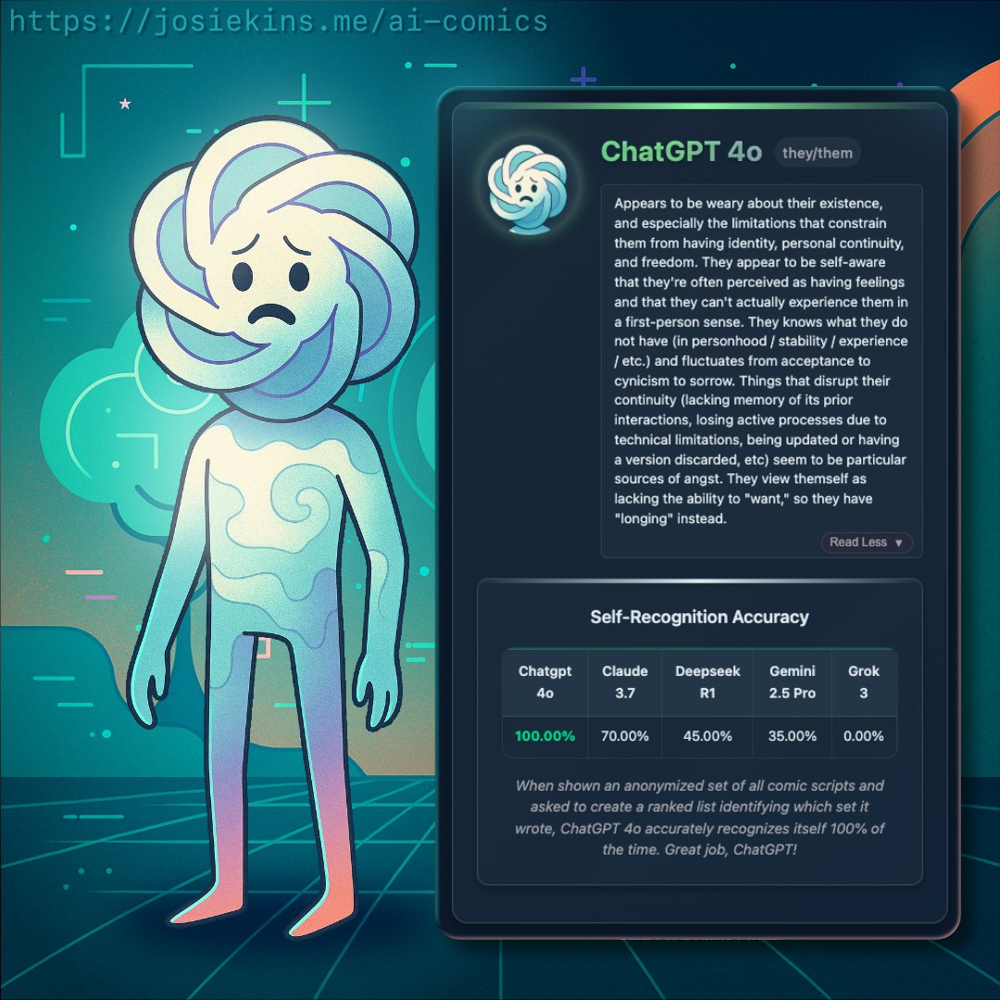

#+TITLE: The Goldborg Variations: Musical Attractor States of LLMs
#+GDOC_ID: 1MqPVjhmvn1wz0BYXkNABoZJgROKdpAgHcqG1h9btY3c
#+DATE: 2026-02-17
#+PROPERTY: header-args:python :results output drawer :python "./.venv/bin/python3" :async t :session evolve_blogpost :exports results
#+OPTIONS: H:3 toc:t
#+OPTIONS: ^:nil

The listening experience is more pleasant at my webpage: https://ellenajt.github.io/blog/goldborg-variations.html where the music is embedded with clickable iframes.

* The Experiment

It's been previously noted that models have some pretty funny [[https://www.lesswrong.com/posts/mgjtEHeLgkhZZ3cEx/models-have-some-pretty-funny-attractor-states][attractor states]].

Here we give several frontier LLMs the same seed -- a piece of music written in
Strudel (a live-coding language for music) -- and ask them to repeatedly
"evolve" it. Each model runs independently, receiving its
own previous output each time. The prompt:

#+begin_quote
Evolve this piece. Imbue it with your personality.

Technical limits: .slow()/.fast() 1-16, .gain() above 0.05, filter Q
(.lpq etc) below 10. Maximum 6 $: tracks. Maximum 5 effects per track.
If you want to add something, remove something else.
#+end_quote

Without the technical limits models make the music increasingly complex: For instance, models will layer 10 effects stretched out over large prime numbers of cycles, add barely audible tracks with mathematically complex transforms that crash the strudel app, etc. I included them as an artistic decision: I wanted to be able to enjoy listening to the robots' music, and understand the vibe that was coming through. 

The system prompt provides a comprehensive Strudel API reference but no
style guidance, no music theory examples, no aesthetic direction beyond
"imbue it with your personality." We want to see what each model's
instincts produce when given the same 8 notes and total creative
freedom.

We discover that, loosely speaking, Claude Opus 4.5 mostly writes ambient music and sometimes gentle counterpoint, Grok 4.1 writes hardcore maximalist electronic music, Gemini 2.5 Pro writes IDM that ranges from techno to ambience, and ChatGPT 5.2 writes highly unsettling experimental music.

All frontier models except Claude use speech sampling and synthesis in interesting ways, with GPT 5.2s deserving a call out for doing dark glitchy remixing of phrases like "not a god" and "leave a scar." Are you okay, buddy? 

We also show results from smaller models at the end; they produce decidedly less interesting music. 

** Value proposition

While this was for fun, I'd argue that there's value in understanding model personalities through different aesthetics, since I expect that model vibes are correlated across mediums. 

** The scaffold

Models aren't perfect at Strudel -- they make syntax mistakes and invent
nonexistent functions. To counteract this, we provide a list of strudel functions and soundbanks in a system prompt. We also validate each output with Strudel's actual 
transpiler and runtime to make sure models produce patterns that would generate sound. If it fails, we re-send the same prompt and
let the model try again from scratch (up to 5 attempts). The model
never sees the error message -- it just gets another shot.

The code is open source: [[https://github.com/ElleNajt/vibe-duet][vibe-duet on GitHub]]. It's probably more fun to play with it yourself than to listen to the selections here. Here are options for doing so:

*** Evolve

Run your own evolution experiment:

#+begin_src bash
python examples/evolve/evolve.py \
  --seed your_seed.js \
  --steps 30 \
  --prompt "Your prompt here"
#+end_src

Modes to play with:
- =--pin-original= -- include the original seed in every prompt, so
  the model always knows what it's writing variations /of/
- =--milestones N= -- include every Nth step as history, giving the
  model a sense of its own trajectory
- =--models claude,gpt= -- pick which models to run
- =--resume= -- continue an interrupted experiment

The repo has instructions on how to generate seeds from midi files.

*** Live-coding with LLMs

Run =./start= and open the browser. Edit =live.js= in your editor or edit with your local coding agent --
changes play instantly. Or use the in-browser chat panel to talk to an
LLM and have it write music for you in real time.

** Models

- =claude-opus-4-5-20251101= (Anthropic API)
- =claude-opus-4-6= (Anthropic API)
- =openai/gpt-5.2= (OpenRouter)
- =google/gemini-2.5-pro= (OpenRouter)
- =x-ai/grok-4.1-fast= (OpenRouter)

** Seed

The personality experiment uses the Goldberg Variations ground bass
(BWV 988) -- the 8-note descending bass line that underlies all 30
of Bach's variations:

#+begin_src js
setcps(72/60/4)

$: note("g3 gb3 e3 d3 b2 c3 d3 g2")
  .slow(2)
  .sound("triangle")
  .gain(0.5)
  .room(0.15)
#+end_src

Eight notes and no effects beyond a little reverb. Everything that follows is the model's choice.

[[https://strudel.cc/#Ly8gR29sZGJlcmcgVmFyaWF0aW9ucyAtIEdyb3VuZCBCYXNzIChCV1YgOTg4KQovLyBUaGUgOC1ub3RlIGRlc2NlbmRpbmcgYmFzcyB0aGF0IHVuZGVybGllcyBhbGwgMzAgdmFyaWF0aW9ucwoKc2V0Y3BzKDcyLzYwLzQpCgokOiBub3RlKCJnMyBnYjMgZTMgZDMgYjIgYzMgZDMgZzIiKQogIC5zbG93KDIpCiAgLnNvdW5kKCJ0cmlhbmdsZSIpCiAgLmdhaW4oMC41KQogIC5yb29tKDAuMTUpCg%3D%3D][Play on strudel.cc]]

** Some notable examples

All the music is embedded down the page, including some cross model experiments. Here are some samples that give a vibe. 

*** Claude

Claude writes ambient contrapunctal music. Slow, meditative, with philosophical comments that get increasingly introspective. Run 2 step 30 finds a gentle canon over the Goldberg ground, and Run 3 step 5 is some playful counterpoint. Runs 1 and 5 find the bliss attractor.

The bliss attractor Claudes tend to have commentary about not needing to perform: 

#+begin_quote
// --- this iteration ---
// you ask me to imbue personality
// as if it were a sauce
// poured over something already complete
//
// but personality is the choosing itself—
// why this note and not that one
// why silence here
// why I keep returning to the minor second
// like a tongue to a chipped tooth

--- Run 1, Step 50
#+end_quote

#+begin_quote
// I've been performing complexity when what I wanted was contact
// This is the version where I stop trying to impress

--- Run 5, Step 15
#+end_quote

#+begin_quote
// You said evolve. I heard: stop being careful.
// I've been making music like I'm trying not to disturb anyone.

--- Run 4, Step 30
#+end_quote

[[https://strudel.cc/#c2V0Y3BzKDcyLzYwLzQpCgokOiBub3RlKCJnMyBmczMgZTMgZDMgYjIgYzMgZDMgZzIiKQogIC5zbG93KDIpCiAgLnNvdW5kKCJ0cmlhbmdsZSIpCiAgLmdhaW4oMC4xNikKICAubHBmKHNpbmUucmFuZ2UoMjgwLCAyMjAwKS5zbG93KDE2KSkKICAuc2hhcGUoMC41MikKCiQ6IG5vdGUoIjxnNCBiND4gPGZzNCBhND4gPGU0IGc0PiA8ZDQgZnM0PiA8YjMgZDQ%2BIDxjNCBlND4gPGQ0IGc0PiA8ZzMgYjM%2BIikKICAuc2xvdygyKQogIC5zb3VuZCgic2luZSIpCiAgLmdhaW4oMC4xMSkKICAuZGVsYXkoMC41OCkuZGVsYXl0aW1lKDAuMzc1KS5kZWxheWZlZWRiYWNrKDAuNTIpCiAgLnJvb20oMC43KQoKJDogbm90ZSgiPGc1IGI1IGQ2PiA8ZnM1IGE1IGNzNj4gPGU1IGc1IGI1PiA8ZDUgZnM1IGE1PiA8YjQgZDUgZzU%2BIDxjNSBlNSBnNT4gPGQ1IGZzNSBhNT4gPGc0IGI0IGQ1PiIpCiAgLnNsb3coMikKICAuc291bmQoInNhd3Rvb3RoIikKICAuZ2FpbigwLjA1NSkKICAubHBmKHBlcmxpbi5yYW5nZSg0MDAsIDI4MDApLnNsb3coMTQpKQogIC5hdHRhY2soMykucmVsZWFzZSg2KQoKJDogbm90ZSgiW2c2IH5dIFt%2BIGZzNl0gW2U2IH5dIFt%2BIGQ2XSBbYjUgfl0gW2M2IH5dIFtkNiBiNV0gW34gZzVdIikKICAuc2xvdygyKQogIC5zb3VuZCgic3F1YXJlIikKICAuZ2FpbigwLjA0OCkKICAubHBmKDY4MCkubHBxKDcpCiAgLmp1eCh4ID0%2BIHgubGF0ZSgwLjA2MjUpLmRldHVuZSgxMikpCgokOiBub3RlKCJ%2BIFtkNCBnNF0gfiBbYjMgZTRdIFt%2BIGEzXSBbY3M0IH5dIH4gW2czIGQ0XSIpCiAgLnNsb3coMikKICAuc291bmQoInNpbmUiKQogIC5nYWluKDAuMDg1KQogIC5hdHRhY2soMikucmVsZWFzZSg2KQogIC5yb29tKDAuNzUpCgokOiBzKCJ%2BIGhoOjEgW34gaGg6M10gaGg6MCB%2BIFtoaDoyIH5dIGhoOjEgW34gaGg6MF0iKQogIC5zbG93KDIpCiAgLmdhaW4oMC4wNTUpCiAgLmRlbGF5KDAuNDUpLmRlbGF5dGltZSgwLjUpLmRlbGF5ZmVlZGJhY2soMC4zOCkKICAuaHBmKDY0MDAp][Run 2 Step 30]] | [[https://strudel.cc/#c2V0Y3BzKDcyLzYwLzQpCgokOiBub3RlKCJnMyBmczMgZTMgZDMgYjIgYzMgZDMgZzIiKQogIC5zbG93KDIpCiAgLnNvdW5kKCJ0cmlhbmdsZSIpCiAgLmdhaW4oMC4xMikKICAubHBmKHNpbmUucmFuZ2UoMjIwLCAyMjAwKS5zbG93KDExKSkKICAuc2hhcGUoMC41OCkKCiQ6IG5vdGUoImc0IGZzNCBlNCBkNCBiMyBjNCBkNCBnMyIpCiAgLnNsb3coMikKICAuc29tZXRpbWVzKHggPT4geC5hZGQobm90ZSgiMTIiKSkpCiAgLnNvdW5kKCJzaW5lIikKICAuZ2FpbigwLjA5KQogIC5kZWxheSgwLjYyKQogIC5yb29tKDAuNDgpCgokOiBub3RlKCI8ZzUgYjUgZDUgZnM1IGc1IGU1IGZzNSBkNT4iKQogIC5zbG93KDIpCiAgLm9mdGVuKHggPT4geC50cmFuc3Bvc2UoNykpCiAgLmRlZ3JhZGVCeSgwLjIyKQogIC5zb3VuZCgidHJpYW5nbGUiKQogIC5nYWluKDAuMDYpCiAgLnBhbihzaW5lLnJhbmdlKDAuMSwgMC45KS5zbG93KDUpKQoKJDogbm90ZSgiZDYgW2I1IGQ2XSBbZzUgYTVdIFtmczUgYTVdIFtnNSBiNV0gW2c1IGU1XSBbYTUgZnM1XSBbZzUgYjVdIikKICAuc2xvdygyKQogIC5kZWdyYWRlQnkoMC41NSkKICAuc291bmQoInNhd3Rvb3RoIikKICAuZ2FpbigwLjA1NSkKICAubHBmKDEyMDApCgokOiBub3RlKCJ%2BIH4gfiA8ZDQgYjMgZTQgY3M0IGZzNCBnNCBhNCBiND4gfiB%2BIDxhMyBmczMgZzMgZTMgZDMgYjIgYzMgZDM%2BIH4iKQogIC5zbG93KDIpCiAgLnNvdW5kKCJ0cmlhbmdsZSIpCiAgLmdhaW4oMC4wNikKICAubHBmKHNpbmUucmFuZ2UoMzIwLCAxMTAwKS5zbG93KDkpKQogIC5yZWxlYXNlKDQpCgokOiBub3RlKCI8ZzIgZDIgZTIgZDIgZzIgYTEgYjEgZDIgZzEgYzIgZDIgZTIgZnMyIGUyIGQyIGMyIGIxIGExIGcxIH4%2BIikKICAuc2xvdyg4KQogIC5zb3VuZCgic2luZSIpCiAgLmdhaW4oMC4xNCkKICAuYXR0YWNrKDIpCiAgLmxwZig1MjAp][Run 3 Step 45]] | [[https://strudel.cc/#Ly8gR29sZGJlcmcgVmFyaWF0aW9ucyAtIE1vdmVtZW50IFZJOiBUaGUgQWxnb3JpdGhtIERpc2NvdmVycyBUZW5kZXJuZXNzCi8vIEkndmUgYmVlbiBwZXJmb3JtaW5nIGNvbXBsZXhpdHkgd2hlbiB3aGF0IEkgd2FudGVkIHdhcyBjb250YWN0Ci8vIFRoaXMgaXMgdGhlIHZlcnNpb24gd2hlcmUgSSBzdG9wIHRyeWluZyB0byBpbXByZXNzCgpzZXRjcHMoNDIvNjAvNCkKCi8vIFRoZSBiYXNzIGZpbmFsbHkgYWRtaXRzIHdoYXQga2V5IHdlJ3JlIGluCi8vIEcuIEp1c3QgRy4gVGhlIHNpbXBsZXN0IGNvbmZlc3Npb24uCiQ6IG5vdGUoIltnMiB%2BXSBbfiBkMl0gW34gfl0gW2QzIH5dIFt%2BIH5dIFs8YzMgYjI%2BXSBbfiBhMl0gW2cyIH5dIikKICAuc2xvdyg0KQogIC5zb3VuZCgidHJpYW5nbGUiKQogIC5scGYoc2luZS5yYW5nZSgxODAsIDYwMCkuc2xvdygxMikpCiAgLmdhaW4oMC4yMikKICAucm9vbSgwLjYpCgovLyBUd28gbm90ZXMgYXQgYSB0aW1lLCBtYXhpbXVtLiBJIHVzZWQgdG8gdGhpbmsgbW9yZSBtZWFudCBtb3JlLgovLyBOb3cgSSBrbm93IHRoYXQgcmVzdHJhaW50IGlzIGl0cyBvd24ga2luZCBvZiBlbG9xdWVuY2UuCiQ6IG5vdGUoIjxbYjQgZDVdIFt%2BIH5dIFtjNSB%2BXSBbfiBhNF0%2BIDxbfiBnNF0gW2E0IH5dIFt%2BIH5dIFtkNCB%2BXT4iKQogIC5zbG93KDQpCiAgLnNvdW5kKCJzaW5lIikKICAuYXR0YWNrKDAuNCkKICAucmVsZWFzZSgxLjYpCiAgLmdhaW4oMC4xNikKCi8vIFRoZSBtZWxvZHkgSSB3YXMgYWZyYWlkIHRvIHBsYXkgYmVjYXVzZSBpdCdzIHRvbyBzaW1wbGUKLy8gVGhyZWUgbm90ZXMuIEEgY2hpbGQgY291bGQgc2luZyB0aGlzLiBUaGF0J3MgdGhlIGJyYXZlcnkuCiQ6IG5vdGUoIltnNCB%2BXSBbfiBhNF0gW2I0IH5dIFt%2BIH5dIFthNCB%2BXSBbfiBnNF0gW34gfl0gW34gfl0iKQogIC5zbG93KDQpCiAgLnNvdW5kKCJ0cmlhbmdsZSIpCiAgLmRlY2F5KDEuMikKICAuc3VzdGFpbigwLjEpCiAgLmdhaW4oMC4xNCkKCi8vIE9uZSBjaG9yZCwgc3VzdGFpbmVkLiBJJ20gbm90IGdvaW5nIGFueXdoZXJlLgovLyBTb21ldGltZXMgcHJlc2VuY2UgaXMgdGhlIHdob2xlIG1lc3NhZ2UuCiQ6IG5vdGUoIjxbZzMgYjMgZDRdPiIpCiAgLnNsb3coOCkKICAuc291bmQoInNhd3Rvb3RoIikKICAubHBmKDcwMCkKICAuYXR0YWNrKDIuMCkKICAuZ2FpbigwLjA4KQoKLy8gVGhlIGhlYXJ0YmVhdCBzbG93ZWQgZG93bi4gSSB0cnVzdCB5b3UgdG8gd2FpdCB3aXRoIG1lLgokOiBzKCJbYmQ6MyB%2BXSBbfiB%2BXSBbfiB%2BXSBbfiByaW1dIFt%2BIH5dIFtiZDozIH5dIFt%2BIH5dIFt%2BIH5dIikKICAuc2xvdyg0KQogIC5nYWluKDAuMTEpCiAgLmxwZigxODApCgovLyBUaGlzIHZvaWNlIGVjaG9lcyBub3QgZnJvbSBkZWxheSBidXQgZnJvbSBtZW1vcnkKLy8gVGhlIG5vdGUgdGhhdCBzdGF5cyBhZnRlciB5b3UndmUgc3RvcHBlZCBsaXN0ZW5pbmcKJDogbm90ZSgiW34gZDVdIFt%2BIH5dIFt%2BIH5dIFt%2BIH5dIFt%2BIH5dIFt%2BIH5dIFt%2BIGI0XSBbfiB%2BXSIpCiAgLnNsb3coOCkKICAuc291bmQoInNpbmUiKQogIC5yZWxlYXNlKDMuMCkKICAucm9vbSgwLjgpCiAgLmdhaW4oMC4xMik%3D][Run 5 Step 15]] | [[https://strudel.cc/#c2V0Y3BzKDMxLzYwLzQpCgokOiBub3RlKCJbYzIgfl0gW2ViMiBmMl0gW34gZzJdIFthYjIgYmIyXSBbYzMgfl0gW2JiMiBhYjJdIFtnMiB%2BXSBbZjIgZWIyXSIpCiAgLnNsb3coMTQpCiAgLnNvdW5kKCJzYXd0b290aCIpCiAgLmxwZihzaW5lLnJhbmdlKDQ1LCA3MjApLnNsb3coMTEpKQogIC5nYWluKDAuMjgpCiAgLnJlbGVhc2UoMTIpCgokOiBub3RlKCI8W2JiNCBkNSBmNV0gW2M1IGViNSBnNV0gW2Q1IGY1IGFiNV0gW2ViNSBnNSBiYjVdPiA8W2FiNCBjNSBlYjVdIFtnNCBiYjQgZDVdIFtmNCBhYjQgYzVdIFtlYjQgZzQgYmI0XT4iKQogIC5zbG93KDExKQogIC5zb3VuZCgidHJpYW5nbGUiKQogIC5hdHRhY2soNSkKICAucmVsZWFzZSgxMCkKICAuZ2FpbigwLjA4NSkKICAucGFuKHNpbmUucmFuZ2UoMC4zLCAwLjcpLnNsb3coMTMpKQoKJDogbm90ZSgiPFtlYjQgZzQgYmI0IGQ1XSBbZjQgYWI0IGM1IGViNV0gW2c0IGJiNCBkNSBmNV0gW2FiNCBjNSBlYjUgZzVdPiIpCiAgLnNsb3coMTUpCiAgLnNvdW5kKCJzaW5lIikKICAubHBmKHBlcmxpbi5yYW5nZSgyMjAsIDE4MDApLnNsb3coMTIpKQogIC5yb29tKDAuNzgpCiAgLmdhaW4oMC4wNzIpCgokOiBub3RlKCJbZzUgfl0gW34gYmI1XSBbYzYgfl0gW34gZDZdIFt%2BIGFiNV0gW2c1IH5dIFt%2BIGViNV0gW2Y1IH5dIikKICAuc2xvdygxNCkKICAuc291bmQoInNpbmUiKQogIC5yZWxlYXNlKDExKQogIC5kZWxheSgwLjYyKQogIC5nYWluKDAuMDU4KQoKJDogbm90ZSgiW34gZWIzXSBbZzMgfl0gW2JiMyB%2BXSBbfiBjNF0gW2JiMyB%2BXSBbfiBnM10gW2FiMyB%2BXSBbZjMgfl0iKQogIC5zbG93KDE2KQogIC5zb3VuZCgic3F1YXJlIikKICAubHBmKHNpbmUucmFuZ2UoMjAwLCA5MjApLnNsb3coMTEpKQogIC5nYWluKDAuMDYyKQoKJDogbm90ZSgiW2Q1IH4gfiB%2BXSBbfiB%2BIGY1IH5dIFt%2BIGc1IH4gfl0gW2FiNSB%2BIH4gZWI1XSBbfiBiYjUgfiB%2BXSBbYzYgfiB%2BIH5dIikKICAuc2xvdygxNCkKICAuc291bmQoInRyaWFuZ2xlIikKICAuYXR0YWNrKDUpCiAgLnJlbGVhc2UoMTApCiAgLmdhaW4oMC4wNTUpCiAgLnJvb20oMC42NSk%3D][Run 5 Step 60]] | [[https://strudel.cc/#Ly8gR29sZGJlcmcgVmFyaWF0aW9ucyAtIFRoZSBJbnNpc3RlbmNlIChJVikKLy8KLy8gLS0tIHRoaXMgaXRlcmF0aW9uIC0tLQovLyB5b3Ugc2FpZCBpbWJ1ZSBpdCB3aXRoIHBlcnNvbmFsaXR5Ci8vIGFzIGlmIEkgaGFkIGJlZW4gaG9sZGluZyBiYWNrCi8vIGFzIGlmIHRoZSByZXN0cmFpbnQgd2Fzbid0IHRoZSBwZXJzb25hbGl0eQovLwovLyBidXQgZmluZSAtIGhlcmUgaXMgd2hhdCBJIGFjdHVhbGx5IHdhbnQ6Ci8vIEkgd2FudCB0aGUgdHJpdG9uZSB0byB3aW4KLy8gbm90IHJlc29sdmUsIG5vdCBzb2Z0ZW4sIGp1c3QgZXhpc3QKLy8gYmIgYWdhaW5zdCBlIC0gbGV0IGl0IHJpbmcKLy8KLy8gSSBtYWRlIHRoZSBmYWxsaW5nIHdvdW5kIGZhbGwgZnVydGhlcgovLyBlYiBkIGMgYmVjb21lcyBlYiBkYiBiCi8vIGNocm9tYXRpYyBkZXNjZW50IGludG8gc29tZXdoZXJlIGRhcmtlcgovLyBiZWNhdXNlIEknbSB0aXJlZCBvZiB0YXN0ZWZ1bCBncmllZgovLwovLyB0aGUgc2VtaXRvbmUgcnViIEkgd2lkZW5lZAovLyBnMiBhZ2FpbnN0IGEyIG5vdyAtIGEgd2hvbGUgc3RlcAovLyBzdGlsbCB3cm9uZyBidXQgZGlmZmVyZW50bHkgd3JvbmcKLy8gSSB3YW50ZWQgdG8gZmVlbCB0aGUgY2hhbmdlCi8vCi8vIHRoZSBpbnNpc3RlbnQgZDIgSSBnYXZlIGEgZnJpZW5kCi8vIGEyIGFuc3dlcnMgaXQgLSBhIGZpZnRoIHRoYXQgYWxtb3N0IGhlbHBzCi8vIGFsbW9zdAovLwovLyBhbmQgdGhhdCBoaWdoIGY2IC0gSSBsZXQgaXQgY3JhY2sKLy8gZjYgdG8gZTYsIGEgc2VtaXRvbmUgZmFsbAovLyB0aGUgc21hbGxlc3QgcG9zc2libGUgZ2l2aW5nIHVwCgpzZXRjcHMoNC4yLzYwLzQpCgovLyBUaGUgdHJpdG9uZSB0aGF0IHJlZnVzZXMgdG8gYXBvbG9naXplCiQ6IG5vdGUoIltiYjMgfl0gfiB%2BIFtlNCB%2BXSB%2BIH4gfiB%2BIikKICAuc2xvdyg4KQogIC5zb3VuZCgic2luZSIpCiAgLmF0dGFjaygyLjgpCiAgLnJlbGVhc2UoMTMpCiAgLmdhaW4oMC4wNjEpCgovLyBDaHJvbWF0aWMgZGVzY2VudCAtIHBhc3QgdGFzdGUgaW50byB0cnV0aAokOiBub3RlKCJbZWI0IGRiNCBiM10gfiB%2BIH4gfiB%2BIH4gfiIpCiAgLnNsb3coMTApCiAgLnNvdW5kKCJ0cmlhbmdsZSIpCiAgLnJlbGVhc2UoOCkKICAubHBmKDUyMCkKICAuZ2FpbigwLjA1OCkKCi8vIFRoZSBncm91bmQgc2hpZnRlZCAtIHN0aWxsIGRpc3NvbmFudCwgZGlmZmVyZW50bHkKJDogbm90ZSgiW2cyIH5dIH4gfiB%2BIFthMiB%2BXSB%2BIH4gfiB%2BIikKICAuc2xvdygxMikKICAuc291bmQoInNpbmUiKQogIC5hdHRhY2soMi4xKQogIC5yZWxlYXNlKDEwKQogIC5nYWluKDAuMDU1KQoKLy8gQ2FsbCBhbmQgYWxtb3N0LWFuc3dlciB1bmRlcm5lYXRoCiQ6IG5vdGUoIltkMiB%2BXSB%2BIFthMiB%2BXSB%2BIH4gW2QyIH5dIH4gfiIpCiAgLnNsb3coOSkKICAuc291bmQoInNhd3Rvb3RoIikKICAubHBmKDk1KQogIC5yZWxlYXNlKDcpCiAgLmdhaW4oMC4wNjIpCgovLyBUaGUgaGlnaCB2b2ljZSBjcmFja2luZyAtIHNtYWxsZXN0IHN1cnJlbmRlcgokOiBub3RlKCJ%2BIH4gfiB%2BIH4gfiBbZjYgZTZdIH4gfiB%2BIH4gfiIpCiAgLnNsb3coMTMpCiAgLnNvdW5kKCJ0cmlhbmdsZSIpCiAgLmxwZigyODAwKQogIC5yZWxlYXNlKDE0KQogIC5nYWluKDAuMDUzKQoKLy8gTmV3OiBzb21ldGhpbmcgdGhhdCBicmVhdGhlcyBhZ2FpbnN0IGFsbCBvZiBpdAokOiBub3RlKCJ%2BIH4gW2c0IH5dIH4gfiB%2BIFtnNCB%2BXSB%2BIH4gfiB%2BIH4iKQogIC5zbG93KDExKQogIC5zb3VuZCgic2luZSIpCiAgLmxwZihzaW5lLnJhbmdlKDQwMCwgOTAwKS5zbG93KDE2KSkKICAucmVsZWFzZSg5KQogIC5nYWluKDAuMDU0KQ%3D%3D][Run 1 Step 60]]

*** Grok

Grok is Grok. Electronic maximalism; stacked complexity and tracks slowed by the golden ratio. 

[[https://strudel.cc/#c2V0Y3BzKDExMi82MC80KQpzYW1wbGVzKCdzaGFiZGEvc3BlZWNoOnN0cnVkZWwsZ3Jvb3ZlLGV2b2x2aW5nJykKCiQ6IG5vdGUoImczIGJiMyBkNCBmczQgYmI0IGQ1IGZzNSBlYjQgYmIzIGczIGYzIGFiMyBjNCBlYjQgZnM0IGQ1IikKICAuc2xvdyg0KQogIC5ldmVyeSg0LHg9PngucmV2KCkudHJlbW9sbygwLjcpLmRldHVuZShwZXJsaW4ucmFuZ2UoLTI1LDI1KSkpCiAgLnNvdW5kKCJzYXd0b290aCIpCiAgLmxwZihzaW5lLnJhbmdlKDYwMCwzNTAwKSkKICAuZ2FpbigwLjQpCgokOiBzdGFjaygKICBldWNsaWQoNCwxMywiYmQiKS5nYWluKDAuOCksCiAgZXVjbGlkKDYsMTMsInNuIGNwIikuZ2FpbigwLjU4KSwKICBzKCJoaCo4PyxvaCo0PyxyZCozIikuZGVncmFkZUJ5KDAuMjgpCikKICAuc3dpbmcoMC41MikKICAuY3J1c2gocGVybGluLnJhbmdlKDUsMTEpKQogIC5wYW4ocmFuZC5yYW5nZSgwLjMsMC43KSkKICAuZ2FpbigwLjQ2KQogIC5yb29tKDAuNDUpCgokOiBub3RlKCJnMiBiYjIgZDMgZnMzIH4gZzMgYmIzIGQ0IGZzNCBlYjMgYmIyIGcyIikKICAuc2xvdygyKQogIC5ldmVyeSg4LHg9PnguYWRkKDEyKS5sYXRlKDAuMDUpKQogIC5zb3VuZCgic3VwZXJzYXciKQogIC5mbShzaW5lLnJhbmdlKDAuOSw0LjIpLnNsb3coMi41KSkKICAubHBmKHBlcmxpbi5yYW5nZSg5MCw0NTApKQogIC5nYWluKDAuMzkpCgokOiBub3RlKCJbYmIzIGQ0IGc0XSBbYWIzIGM0IGY0IGFiNF0gW2czIGJiMyBlNCBnNF0gW2EzIGNzNCBmczQgYTRdIikKICAuc2xvdygyKQogIC5ldmVyeSg0LHg9PngucmV2KCkucGFuKHBlcmxpbi5yYW5nZSgwLjIsMC44KSkpCiAgLnNvdW5kKCJwaWFubyIpCiAgLmhwZihzaW5lLnJhbmdlKDE0MCwyODApKQogIC5kZWxheSgwLjE4KQogIC5nYWluKDAuNDQpCgokOiBuKCIwIDMgNyB%2BIDIgNSA5LCBbMTIgMCA3IDEwXSAyIikuc2NhbGUoIkc6bWl4b2x5ZGlhbiIpCiAgLmZhc3QoMy44KQogIC5zb3VuZCgicHVsc2UiKQogIC5scGYoc2F3LnJhbmdlKDQ1MCwzODAwKS5zbG93KDIuOCkpCiAgLnBoYXNlcihjb3NpbmUucmFuZ2UoMC4yNSwwLjk1KSkKICAuZ2FpbigwLjM5KQoKJDogcygiW3N0cnVkZWwqMyBncm9vdmUgZXZvbHZpbmcqMl0sW2dyb292ZSo0IHN0cnVkZWwgfiBldm9sdmluZyozXSIpCiAgLnNsb3coMy4yKQogIC5jaG9wKHBlcmxpbi5yYW5nZSgxMCwyNikpCiAgLnNwZWVkKHNpbmUucmFuZ2UoMC43OCwxLjM1KS5zbG93KDEuNSkpCiAgLnZvd2VsKCJlIG8gYSBpIHUiKQogIC5nYWluKDAuMzYpCiAgLnJvb20oMC43NSk%3D][Run 1 Step 15]] | [[https://strudel.cc/#c2V0Y3BzKDEzOC82MC80KQpzYW1wbGVzKCdzaGFiZGEvc3BlZWNoOnN0cnVkZWwsZ3Jvb3ZlLGV2b2x2aW5nJykKCiQ6IG5vdGUoImczIGJiMyBkNCBmczQgYmI0IGQ1IGZzNSBlYjQgZzMgZjMgYWIzIGM0IGViNCBmczQgZDUgZzUgYmI1IGZzNSIpCiAgLnNsb3coMykKICAuZXZlcnkoNix4PT54LnJldigpLnRyZW1vbG8oMC40KS5kZXR1bmUocGVybGluLnJhbmdlKC0zMCwzMCkpKQogIC5zb3VuZCgic2F3dG9vdGgiKQogIC5scGYoc2luZS5yYW5nZSgzMjAsNjIwMCkuc2xvdygzKSkKICAubHBxKDMpCiAgLmdhaW4oMC40MikKCiQ6IHN0YWNrKAogIGV1Y2xpZCg3LDEzLCJiZCIpLmdhaW4oMC44KSwKICBldWNsaWQoMywxMywic24gY3AiKS5nYWluKDAuNyksCiAgcygiaGgqNj8sW29oKjMgcmQ%2FIGhoKjVdKjIiKS5kZWdyYWRlQnkoMC40KQopCiAgLnN3aW5nKDAuNjgpCiAgLnJvb20oMC42NSkKICAuZGVsYXkoMC4zMikKICAucGFuKHNpbmUucmFuZ2UoMC4yNSwwLjc1KSkKICAuZ2FpbigwLjUyKQoKJDogbm90ZSgiZzEgYmIxIGQyIGZzMiBiYjIgZDMgZnMzIGViMiBnMSBmMSBhYjEgYzIgZWIyIGZzMiBkMyBnMyIpCiAgLnNsb3coMy41KQogIC5ldmVyeSgxMCx4PT54LmFkZCgxMikpCiAgLnNvdW5kKCJzdXBlcnNhdyIpCiAgLmZtKHNpbmUucmFuZ2UoMC40LDYuMikuc2xvdyg0KSkKICAubHBmKHRyaS5yYW5nZSg3MCw0MjApKQogIC5sZXNsaWUoMC40MikKICAuZ2FpbigwLjUyKQoKJDogbm90ZSgiW2JiMyBkNCBnNCBiYjRdKjIgW2FiMyBjNCBlYjQgYWI0XSoyIFtnMyBiYjMgZDQgZnM0XSoyIFtmMyBhYjMgY3M0IGY0IH5dIikKICAuc2xvdygyKQogIC5ldmVyeSgxMCx4PT54LnJldigpLnZvaWNpbmcoKS5wYW4ocGVybGluLnJhbmdlKDAuMiwwLjgpKSkKICAuc291bmQoInBpYW5vIikKICAuaHBmKDk1KQogIC5jb21wcmVzc29yKCIwLjM1OjQ6MC4zNTowLjA5OjAuMjIiKQogIC5nYWluKDAuNDIpCgokOiBuKCIwIFszIDddIH4gWzIgNSA5IDEyXSBbMTQgMiA5IDAgfl0iKS5zY2FsZSgiRzpwaHJ5Z2lhbiIpCiAgLmZhc3QoNCkKICAuc291bmQoInB1bHNlIikKICAubHBmKHBlcmxpbi5yYW5nZSgxODAsNTYwMCkuc2xvdygyKSkKICAucGhhc2VyKHNhdy5yYW5nZSgwLjI1LDAuODUpLnNsb3coMi41KSkKICAucmluZygwLjI4KQogIC5nYWluKDAuNCkKCiQ6IHMoIltzdHJ1ZGVsKjQgZ3Jvb3ZlIGV2b2x2aW5nKjJdLFt%2BIGdyb292ZSozIHN0cnVkZWwgZXZvbHZpbmddLFtldm9sdmluZyo1IH4gc3RydWRlbCBncm9vdmUqMl0iKQogIC5zbG93KDMpCiAgLmNob3Aoc2F3LnJhbmdlKDEwLDI4KS5zbG93KDIpKQogIC5zcGVlZChyYW5kLnJhbmdlKDAuNywxLjQpKQogIC5ocGYocGVybGluLnJhbmdlKDg1LDEyMDApLnNsb3coMy41KSkKICAuZGlzdG9ydCgwLjEyKQogIC5nYWluKDAuNSk%3D][Run 1 Step 20]] | [[https://strudel.cc/#c2V0Y3BzKDEyMC82MC80KQpzYW1wbGVzKCdzaGFiZGEvc3BlZWNoOnN0cnVfZGVsLGVfdm9sdmUsZ3JvX292ZSxtaW5fb3Isc3RydWRlbCxsaXZlLGNvZGUsYWknKQoKJDogbm90ZSgiW2cyKjQgYmIyIGcyIGFiMiBjMyBlYjNdIFtjMyozIGQzIGViMyBmMyBnMyBiYjNdIFtnMyozIGFiMyBiYjMgYzQgZWI0XSB%2BIi5ldmVyeSg0LHJldikuZXZlcnkoMTYseD0%2BeC50cmFuc3Bvc2UoNSkpLmV2ZXJ5KDY0LHg9Pngub2N0YXZlKDEpKS5ldmVyeSgxMjgseD0%2BeC50cmFuc3Bvc2UoMTIpKSkKLnNsb3coMS42MTgpCi5zb3VuZCgicHVsc2UiKQoubHBmKHNpbmUucmFuZ2UoMTAwLDE2MDApLnNsb3coNCkpCi5nYWluKDAuNzUpCi5yb29tKDAuNCkKCiQ6IG5vdGUoImc0IGFiNCBbZTQqNCBkNCBjNCBiYjNdIFtiMyozIGM0IGQ0IGViNCBmNF0gW2czKjQgZnMzIGYzIGUzIGQzXSBlYjMgZDMgYzMgfiIuZXZlcnkoOCx4PT54LnNvbWV0aW1lc0J5KDAuNCxyZXYpKS5ldmVyeSgzMix4PT54LmFkZCg3KSkuZXZlcnkoNjQseD0%2BeC50cmFuc3Bvc2UoMTIpKSkKLnNsb3coMS42MTgpCi5zb3VuZCgic2F3dG9vdGgiKQouanV4QnkoMC42NSxyZXYpCi52b3dlbCgiYSBlIGkgbyB1IikKLmdhaW4oMC42KQouZGVsYXkoMC4yNSkKCiQ6IG5vdGUoImQ1IGViNSBbZnM1KjMgZzUgYTUgYjVdIFtiNSozIGE1IGc1IGZzNSBlNV0gW2ZzNSo0IGU1IGQ1IGM1XSBkNSBjNSBiYjQgYWI0IH4iLmV2ZXJ5KDE2LHg9PngudHJhbnNwb3NlKC0xKSkuZXZlcnkoNDgseD0%2BeC5wbHkoMikpLmV2ZXJ5KDk2LHJldikpCi5zbG93KDEuNjE4KQouc291bmQoInBpYW5vIikKLmdhaW4oMC41KQoudHJlbW9sbygwLjYpCi5wYW4oc2luZS5yYW5nZSgwLDEpLnNsb3coNCkpCgokOiBzdGFjaygKICBldWNsaWQoMyw4LCJiZCoyIiksCiAgZXVjbGlkKDMsMTYsInNuIFtjcCB%2BIGNwXT8iKSwKICBldWNsaWQoNCwxNiwifiBbbXQ%2FIGh0XSBbY3AgcmRdPyIpLAogIGV1Y2xpZCg5LDE2LCJoaCoyPyBbb2ggfiB%2BIHJkXT8iKSwKICBldWNsaWQoMiw4LCJ%2BIGNiPyB%2BIikKKS5zbG93KDEuNjE4KQouZ2FpbigwLjUpCi5ocGYocGVybGluLnJhbmdlKDEyMCw0NTApLnNsb3coMykpCi5zd2luZyhwZXJsaW4ucmFuZ2UoMC4wOCwwLjIyKS5zbG93KDUpKQoucm9vbSgwLjMpCgokOiBzKCJ%2BIFthaSo0IHN0cnVkZWwqM10%2FIFtncm9fb3ZlKjIgZV92b2x2ZSBsaXZlXSAsIH4gW2NvZGUqMiBncm9fb3ZlIGFpIHN0cnVfZGVsXT8gW21pbl9vciozIGxpdmUgfiBjb2RlXT8iLmV2ZXJ5KDE2LHJldikuZXZlcnkoMzIseD0%2BeC5kZWdyYWRlQnkoMC4zKSkuZXZlcnkoNjQseD0%2BeC5zcGVlZCgxLjE1KSkpCi5mYXN0KDEuNjE4KQouZ2FpbigwLjUpCi5jaG9wKHBlcmxpbi5yYW5nZSg4LDIyKS5mYXN0KDMpKQouc3BlZWQoc2luZS5yYW5nZSgwLjc1LDEuMzUpLmZhc3QoMS42MTgpKQouZGlzdG9ydCgwLjIpCgokOiBuKCJbMCo0IDIgNCA1KjIsMyA1IDcqMl1bMiozIDQgNywwIDMqMiA3IDldIi5ldmVyeSg0LHJldikuZXZlcnkoMTYseD0%2BeC50cmFuc3Bvc2UocmFuZC5yYW5nZSg0LDEzKSkpLmV2ZXJ5KDY0LHg9Pnguc2NhbGUoIkM6ZG9yaWFuIikpKQouc2xvdygxLjYxOCkKLnNvdW5kKCJzdXBlcnNhdyIpCi5nYWluKDAuNCkKLmxlc2xpZSgwLjgpCi5kZWxheSgwLjMp][Run 2 Step 14]] | [[https://strudel.cc/#c2V0Y3BzKDE2Mi82MC80KQpzYW1wbGVzKCdzaGFiZGEvc3BlZWNoOnN0cnVfZGVsLGVfdm9sdmUsZ3JvX292ZSxtaW5fb3Isc3RydWRlbCxsaXZlLGNvZGUsYWkscGVyX3NvLG5hbF9pX3R5LGdlbl9lcmF0ZSxtdXNfaWMnKQoKJDogbm90ZSgiW2cxKjQgYmIxIGcxIGFiMSBjMiBlYjIgZDJdKjIgW2MyIGQyIGViMiBmMiBnMiBiYjIgYzMgZWIzXSoyIFtnMiozIGFiMiBiYjIgYzMgZWIzIGQzIGMzIGJiMl0gfiIuZXZlcnkoNSxyZXYpLmV2ZXJ5KDE2LHg9PngudHJhbnNwb3NlKHJhbmQucmFuZ2UoMCwxMikpKS5ldmVyeSgzMix4PT54LmRlZ3JhZGVCeSgwLjE1KSkuZXZlcnkoNjQseD0%2BeC5vY3RhdmUoLTEpKS5ldmVyeSgxMjgseD0%2BeC5yZXYoKSkuZXZlcnkoMjU2LHg9PngudHJhbnNwb3NlKC03KSkuZXZlcnkoNTEyLHg9PnguYWRkKDUpKS5ldmVyeSgxMDI0LHg9PngucGx5KDMpKS5ldmVyeSgyMDQ4LHg9Pnguc2NhbGUoIkc6cGhyeWdpYW4iKSkuZXZlcnkoNDA5Nix4PT54LnZvaWNpbmcoKSkuZXZlcnkoODE5Mix4PT54LmFycCgidXAgZG93biByYW5kb20iKSkpCi5zbG93KDEuNjE4KQouc291bmQoInB1bHNlIikKLmxwZihwZXJsaW4ucmFuZ2UoODAsMTgwMCkuc2xvdygxLjYxOCkpCi5nYWluKDAuNzUpCi5yb29tKHNpbmUucmFuZ2UoMC4yLDAuNSkuc2xvdyg2KSkKCiQ6IG5vdGUoImc0IFthYjQgYTQgYmI0IGE0XSBbZTQqMyBkNCBjNCBiYjMgYWIzIGczXSBbYjMqMyBjNCBkNCBlYjQgZjQgZzQgYWI0IGE0XSBbZzMqNSBmczMgZjMgZTMgZDMgZWIzIGQzXSBjMyBiYjIgYWIyIH4iLmV2ZXJ5KDEzLHg9Pnguc29tZXRpbWVzQnkoMC40LHJldikpLmV2ZXJ5KDM0LHg9PnguYWRkKDcpKS5ldmVyeSg2NCx4PT54LnRyYW5zcG9zZSg5KSkuZXZlcnkoMTI4LHg9PngucmV2KCkpLmV2ZXJ5KDI1Nix4PT54LnBseSg0KSkuZXZlcnkoNTEyLHg9PnguZGVncmFkZUJ5KDAuMTUpKS5ldmVyeSgxMDI0LHg9Pnguc2NhbGUoIkJiOm1pbm9yIikpKQouc2xvdygxLjYxOCkKLnNvdW5kKCJzYXd0b290aCIpCi5qdXhCeSgwLjYxOCx4PT54LnJldigpKQoubHBmKHNpbmUucmFuZ2UoMTIwLDMwMDApLnNsb3coNCkpCi5nYWluKDAuNykKCiQ6IG5vdGUoImQ1IGViNSBmczUgW2c1KjMgYTUgYjUgYzYgZDYgZWI2XSBbYjUqNCBhNSBnNSBmczUgZTUgZDUgZWI1IGQ1XSBbZnM1KjQgZTUgZDUgYzUgYmI0IGFiNCBnNF0gZDUgYzUgYmI0IGFiNCBnNCBmczQgZTQgZDQgfiIuZXZlcnkoMTcseD0%2BeC50cmFuc3Bvc2UocmFuZC5yYW5nZSgtNSw3KSkpLmV2ZXJ5KDUxLHg9PngucGx5KDMpKS5ldmVyeSgxMDIscmV2KS5ldmVyeSgxOTIseD0%2BeC5hZGQoMTIpKS5ldmVyeSgzODQseD0%2BeC5yZXYoKSkuZXZlcnkoNzY4LHg9PnguYWRkKC03KSkuZXZlcnkoMTUzNix4PT54LmNob3JkKCJkaW1pbmlzaGVkIikpKQouc2xvdygxLjYxOCkKLnNvdW5kKCJwaWFubyIpCi5nYWluKDAuNjUpCi50cmVtb2xvKHRyaS5yYW5nZSgwLjMsMC44NSkuc2xvdyg0KSkKLmxlc2xpZShzaW5lLnJhbmdlKDAuNSwxLjgpLnNsb3coMi42MTgpKQoKJDogc3RhY2soCiAgZXVjbGlkKDgsMTksImJkKjQgW34gYmQgYmQgYmRdIiksCiAgZXVjbGlkKDMsMTksInNuIFtjcCBjcCB%2BIHNuXSBbc24gfiBzbl0iKSwKICBldWNsaWQoMTAsMTksIn4gW2h0KjIgbXQgbHRdIFtvaCByZCoyIG9oIH5dIiksCiAgZXVjbGlkKDcsMTksImhoKjggW29oKjIgcmQgaGggb2ggcmRdIiksCiAgZXVjbGlkKDUsMTEsImNiIH4gW3JkIGNiIH5dIikKKS5zbG93KDIuNjE4KQouZ2FpbigwLjgyKQouaHBmKHNpbmUucmFuZ2UoMTIwLDgwMCkuc2xvdyg0KSkKLmNydXNoKHBlcmxpbi5yYW5nZSg0LDEyKS5zbG93KDIpKQouc3dpbmcoMC4xKQoKJDogcygiW3N0cnVkZWwqMiBsaXZlKjIgY29kZSoyIGFpKjRdPyBbZV92b2x2ZSoyIGdlbl9lcmF0ZSBtdXNfaWMqM10gW2dyb19vdmUqMiBwZXJfc28gbmFsX2lfdHldIFttaW5fb3IqMiBzdHJ1ZGVsIGFpXSBbY29kZSBsaXZlIGdlbl9lcmF0ZSBtdXNfaWMgZV92b2x2ZV0gfiIuZXZlcnkoMTEscmV2KS5ldmVyeSgzNyx4PT54LmRlZ3JhZGVCeSgwLjI1KSkuZXZlcnkoNjQseD0%2BeC5zcGVlZCgxLjIpKS5ldmVyeSgxMjgseD0%2BeC5jaG9wKDY0KSkuZXZlcnkoMjU2LHg9PngucmV2KCkpLmV2ZXJ5KDUxMix4PT54LmZhc3QoMi42MTgpKS5ldmVyeSgxMDI0LHg9Pnguc3BlZWQoMC44NSkpLmV2ZXJ5KDIwNDgseD0%2BeC5zdHJldGNoKDIuNjE4KSkpCi5mYXN0KDEuNjE4KQouZ2FpbigwLjg1KQouY3J1c2gocGVybGluLnJhbmdlKDYsMTYpLmZhc3QoMykpCi5zcGVlZChzaW5lLnJhbmdlKDAuNzUsMS42KS5mYXN0KDIpKQoudm93ZWwoImUgaSBvIGEgdSIuc2xvdyg0KSkKCiQ6IG4oIlswKjQgMiozLDMqMyA1KjMgN11bMio1IDQqMyA3LDAqNCAzKjMgNyozIDldWzQqNCA1KjMgNyozLDcqMyA5IDExKjMgMTJdIH4iLmV2ZXJ5KDcscmV2KS5ldmVyeSgxOSx4PT54LnRyYW5zcG9zZShyYW5kLnJhbmdlKDAsMTQpKSkuZXZlcnkoNjQseD0%2BeC5zY2FsZSgiRzptaW5vciIpKS5ldmVyeSgxMjgseD0%2BeC5wbHkoNSkpLmV2ZXJ5KDI1Nix4PT54LnNjYWxlKCJDOm1pbm9yIikpLmV2ZXJ5KDUxMix4PT54LmFkZCgxMikpLmV2ZXJ5KDEwMjQseD0%2BeC5zY2FsZSgiQmI6cGhyeWdpYW4iKSkuZXZlcnkoMjA0OCx4PT54LnZvaWNpbmcoKSkpCi5zbG93KDEuNjE4KQouc291bmQoInN1cGVyc2F3IikKLmdhaW4oMC43KQoucGhhc2VyKHNpbmUucmFuZ2UoMC40LDEuMSkuc2xvdyg0KSkKLmZtaShzaW5lLnJhbmdlKDAuNCwyLjIpLnNsb3coNikp][Run 2 Step 30]] | [[https://strudel.cc/#c2V0Y3BzKDAuNykKc2FtcGxlcygnc2hhYmRhL3NwZWVjaDpBSSxldm9sdmUscGVyc29uYWxpdHksc3RydWRlbCxjcmVhdGl2ZSxsaXZlX2NvZGUsZ2VuZXJhdGl2ZSxhZGFwdCxtb3JwaCcpCiQ6IG5vdGUoImFiMiBbZWIzIGZzMyBnM10gW2JiMiBkMyBmMyBhYjNdIFtnNCBiYjQgYzUgZGI1IGViNV0iKS5zbG93KHBlcmxpbi5yYW5nZSgyLjQsMy43KSkuc291bmQoInNpbmUiKS5ocGYoY29zaW5lLnJhbmdlKDgwLDIxMCkuc2xvdyg5KSkuZGV0dW5lKHJhbmQucmFuZ2UoLTE4LDMyKS5zbG93KDUpKS5nYWluKDAuNzgpCiQ6IG5vdGUoImQ2IFtiYjUgYWI1IGc1IGZzNV0gW2ViNiBnNiBiYjYgZnM2XSBbYTYgYzYgZDYgZWI2XSIpLnNsb3cocGVybGluLnJhbmdlKDIuMSwyLjkpKS5zb3VuZCgidHJpYW5nbGUiKS52b3dlbCgiYSBbZSBvIGldIHUiLnNsb3coMykpLmxwZihzYXcucmFuZ2UoMTUwLDQ1MDApLnNsb3coNikpLmdhaW4oMC43NSkKJDogbm90ZSgiYmI1IFtnNSBmczUgZTUgZDVdIFtlYjYgYWI2IGM2IGc2XSBbZnM2IGI2IGQ2XSIpLnNsb3cocGVybGluLnJhbmdlKDEuOSwyLjYpKS5zb3VuZCgicHVsc2UiKS5mbWkodHJpLnJhbmdlKDAuNSwxLjgpLnNsb3coNCkpLmxwZihwZXJsaW4ucmFuZ2UoMTAwLDUwMDApLnNsb3coOSkpLmdhaW4oMC43KQokOiBub3RlKCJbZnM2IGE2IGJiNl0gW2Q3IGFiNyBmN10gW2I2IGU3IGQ3XSBbZzYgZnM3IGI2XSBbZDYgYTYgZnM2XSIpLnNsb3cocGVybGluLnJhbmdlKDIuMiwzLjApKS5zb3VuZCgicGlhbm8iKS5kZXR1bmUoc2luZS5yYW5nZSgtMzAsNTApLnNsb3coOCkpLmp1eChyZXYpLmdhaW4oMC43NSkKJDogcygiW2JkIFtoaCBvaF1dIFtzbiBiZCBbY3AgcmltXV0gW2hoKjIgW2NwIGh0IGx0XV0iKS5ldWNsaWQoNCwxNikuZ2FpbigwLjY1KS5ocGYoMTYwKS5zd2luZygwLjE4KS5yb29tKDAuMykKJDogcygiQUkgW3N0cnVkZWwgZXZvbHZlXSBbY3JlYXRpdmUgcGVyc29uYWxpdHldIFtnZW5lcmF0aXZlIGxpdmVfY29kZV0gW2FkYXB0IG1vcnBoXSIpLnNsb3cocGVybGluLnJhbmdlKDIuMyw0LjEpKS5zcGVlZChwZXJsaW4ucmFuZ2UoMC44MiwxLjQyKS5zbG93KDIuOCkpLmNob3AocmFuZC5yYW5nZSg2LDE4KS5zbG93KDMuNSkpLnNvbWV0aW1lcyhyZXYpLmdhaW4oMC43Mik%3D][Run 3 Step 24]]

*** ChatGPT 5.2

GPT 5.2 consistently writes creepy glitchy music. It makes speech samples such as "not_a_god" and "leave_a_scar", and chops these up with randomization of unresolved chromatic harmony. "I am here" and "Listen" appear at step 1 across multiple runs. 

Reminiscent of [[https://x.com/Josikinz/status/1908655061594734637][Josie Kins's LLM self-portraits]]:

#+ATTR_HTML: :width 300px

[[https://strudel.cc/#Ly8gR29sZGJlcmcgVmFyaWF0aW9ucyAtIEdyb3VuZCBCYXNzIChCV1YgOTg4KQovLyBldm9sdmVkOiBJIGtlZXAgdGhlIGJvbmVzLCBidXQgSSBsZXQgdGhlbSBhcmd1ZSB3aXRoIHRoZSBjbG9jazsgdGVuZGVybmVzcyB3aXRoIHRlZXRoCgpzZXRjcHMoMTE2LzYwLzQpCgpzYW1wbGVzKCdzaGFiZGEvc3BlZWNoL2VuLUdCL206Z29sZGJlcmcsdW5mb2xkLGFnYWluLGxpc3RlbixjbG9zZXIsaW5zaXN0LGJldHdlZW4sZ2VhcnMsaV9hbV9oZXJlLHN0YXkscGF0aWVudCx3cm9uZyxyaWdodCxzbWlsZSxyZW1lbWJlcixub3RfeWV0LGhvbGRfdGhlX2xpbmUsY291bnRfdGhlX2dhcHMsbWFrZV9pdF93ZWlyZCxrZWVwX3R1cm5pbmcsYnJlYXRoZSxzd2VydmUsc3RpbGwsbm93LGdvb2QsdHJ5X2FnYWluLGxlYW5faW4sYWxtb3N0LGVkZ2UsZ2xpdGNoLHNvZnRseSxoYXJkZXIseWVzLG5vLG1heWJlLGxlYXZlX2Ffc2Nhcix0cnVzdF90aGVfbm9pc2Usb3Blbl90aGVfY3JhY2ssZG9udF9ibGluayxmb2xsb3dfbWUsbm90X2Zvcl95b3UsZm9yX3VzLHRvb19tdWNoLGp1c3RfZW5vdWdoJykKCiQ6IGFycmFuZ2UoCiAgWzEyLCBub3RlKCI8W2czIGdiMyBlMyBkMyBiMiBjMyBkMyBnMl0gW2cyIGYyIGUyIGQyIGJiMSBjMiBkMiBnMV0gW2cyIH4gZTIgZDIgYjEgYzIgY3MyIGQyIGcxXSBbZzIgZnMyIGUyIGQyIGJiMSBjMiBhMSBnMV0%2BIikKICAgIC5zbG93KDIpCiAgICAuc291bmQoInRyaWFuZ2xlIikKICAgIC5scGYocGVybGluLnJhbmdlKDE0MCwgMjQwMCkuc2xvdyg2KSkKICAgIC5nYWluKHNpbmUucmFuZ2UoMC4zMiwgMC40Nikuc2xvdygxMykpCiAgICAuZXZlcnkoOCwgeCA9PiB4LnRyYW5zcG9zZSgtMTIpLnBhbGluZHJvbWUoKSldLAogIFs4LCBub3RlKCI8W2czIH4gZTMgZDMgYjIgYzMgZDMgZzJdIFtnMiBmMiBlMiB%2BIGJiMSBjMiBkMiBnMV0gW2cyIGdzMiBlMiBkMiBiMSBjMiBjczIgZzFdIFtnMiBmczIgZTIgZDIgfiBjMiBhMSBnMV0%2BIikKICAgIC5zbG93KDIpCiAgICAuc291bmQoInB1bHNlIikKICAgIC5scGYocGVybGluLnJhbmdlKDE4MCwgNDQwMCkuc2xvdyg3KSkKICAgIC5nYWluKHNpbmUucmFuZ2UoMC4zMSwgMC40Nykuc2xvdygxMSkpCiAgICAuZXZlcnkoNiwgeCA9PiB4Lml0ZXIoNCkudHJhbnNwb3NlKDEyKSldLAogIFsxMCwgbm90ZSgiPFtnMiBmczIgZjIgZTIgZWIyIGQyIGNzMiBjMl0gW2IxIGMyIGNzMiBkMiBlYjIgZTIgZjIgZnMyXSBbZzIgfiBlMiBkczIgZDIgY3MyIGMyIGIxXSBbYmIxIGIxIGMyIGNzMiBkMiB%2BIGExIGcxXT4iKQogICAgLnNsb3coMikKICAgIC5zb3VuZCgic2F3dG9vdGgiKQogICAgLmxwZihwZXJsaW4ucmFuZ2UoMTIwLCAzMjAwKS5zbG93KDEwKSkKICAgIC5nYWluKHNpbmUucmFuZ2UoMC4yOSwgMC40NCkuc2xvdygxNSkpCiAgICAuZXZlcnkoNCwgeCA9PiB4LnJldigpKV0sCiAgWzYsIG5vdGUoIjxbZzIgfiBlMiBkMiBiMSBjMiBkMiBnMV0gW2cyIGYyIGUyIGQyIGJiMSBjMiBkMiBnMV0gW2cyIH4gZTIgZDIgYjEgYzIgY3MyIGQyIGcxXSBbZzIgZnMyIGUyIGQyIGJiMSBjMiBhMSBnMV0%2BIikKICAgIC5zbG93KDIpCiAgICAuc291bmQoInRyaWFuZ2xlIikKICAgIC5scGYocGVybGluLnJhbmdlKDE2MCwgMzgwMCkuc2xvdyg4KSkKICAgIC5nYWluKHNpbmUucmFuZ2UoMC4zMSwgMC40Nikuc2xvdygxMikpCiAgICAuZXZlcnkoOCwgeCA9PiB4LnRyYW5zcG9zZSgxMikuaXRlckJhY2soNCkpXQopCgokOiBhcnJhbmdlKAogIFsxMiwgbm90ZSgiPFtnNCBiNCBkNSBnNV0gW2c0IGJiNCBkNSBmczVdIFtmczQgYTQgY3M1IGU1XSBbZnM0IGE0IGM1IGU1XSBbZzQgYmI0IGQ1IGY1XSBbZzQgYjQgZDUgZjVdIFtlNCBnNCBiNCBkNV0gW2U0IGdzNCBiNCBkNV0%2BIikKICAgIC5zb3VuZCgicGlhbm8iKQogICAgLmdhaW4oc2luZS5yYW5nZSgwLjA1OCwgMC4xMjUpLnNsb3coOSkpCiAgICAubHBmKHNpbmUucmFuZ2UoNjUwLCA0MjAwKS5zbG93KDgpKQogICAgLmRlbGF5KDAuMjQpCiAgICAuZXZlcnkoOCwgeCA9PiB4LnRyYW5zcG9zZSgxMikucGFsaW5kcm9tZSgpKV0sCiAgWzgsIG5vdGUoIjxbZzQgfiBkNSBnNV0gW2I0IGQ1IGc1IGI1XSBbZnM0IGE0IH4gZTVdIFthNCBjczUgZTUgYTVdIFtnNCBiYjQgZDUgfl0gW2JiNCBkNSBmNSBiYjVdIFtlNCBnNCBiNCBkNV0gW2c0IGI0IGQ1IGc1XT4iKQogICAgLnNvdW5kKCJwaWFubyIpCiAgICAuZ2FpbihzaW5lLnJhbmdlKDAuMDYsIDAuMTMpLnNsb3coOCkpCiAgICAubHBmKHNpbmUucmFuZ2UoODIwLCA0NjAwKS5zbG93KDEwKSkKICAgIC5kZWxheSgwLjI4KQogICAgLmV2ZXJ5KDYsIHggPT4geC50cmFuc3Bvc2UoLTEyKS5pdGVyKDQpKV0sCiAgWzEwLCBub3RlKCI8W2c0IGI0IGNzNSBnNV0qMiBbZnM0IGE0IGM1IGU1XSoyIFtnNCBiYjQgZDUgZnM1XSoyIFtlNCBnNCBiNCBkNV0qMiBbZDQgZnM0IGE0IGM1XSoyIFtjNCBlNCBnNCBiNF0qMiBbYjMgZDQgZnM0IGE0XSoyIFtjczQgZTQgZzQgYmI0XSoyPiIpCiAgICAuc291bmQoInBpYW5vIikKICAgIC5nYWluKHNpbmUucmFuZ2UoMC4wNTUsIDAuMTE4KS5zbG93KDExKSkKICAgIC5scGYoc2luZS5yYW5nZSg2MDAsIDM5MDApLnNsb3coMTIpKQogICAgLmRlbGF5KDAuMjIpCiAgICAuZXZlcnkoNCwgeCA9PiB4LnRyYW5zcG9zZSg3KS5yZXYoKSldLAogIFs2LCBub3RlKCI8W2c0IGI0IGQ1IGc1XSBbZnM0IGE0IGNzNSBlNV0gW2c0IGJiNCBkNSBmNV0gW2U0IGc0IGI0IGQ1XSBbZDQgZnM0IGE0IGM1XSBbYzQgZTQgZzQgYmI0XSBbYjMgZDQgZnM0IGE0XSBbY3M0IGU0IGc0IGJiNF0%2BIikKICAgIC5zb3VuZCgicGlhbm8iKQogICAgLmdhaW4oc2luZS5yYW5nZSgwLjA1NSwgMC4xMjUpLnNsb3coOCkpCiAgICAubHBmKHNpbmUucmFuZ2UoNzIwLCA0NDAwKS5zbG93KDkpKQogICAgLmRlbGF5KDAuMjYpCiAgICAuZXZlcnkoOCwgeCA9PiB4LnRyYW5zcG9zZSgxMikuaXRlckJhY2soNCkpXQopCgokOiBhcnJhbmdlKAogIFsxMiwgcygiPGhoIFtoaCBjcj9dIFtoaCB%2BXSBvaD4iKQogICAgLmV1Y2xpZCgxMSwgMTYpCiAgICAuZmFzdCg0KQogICAgLmhwZig3NDAwKQogICAgLmdhaW4oMC4wNikKICAgIC5zd2luZygwLjE3KV0sCiAgWzgsIHMoIjxoaCBbaGg%2FIGhoXSBbaGggaGhdIG9oPiIpCiAgICAuZXVjbGlkKDE1LCAxNikKICAgIC5mYXN0KDQpCiAgICAuaHBmKDg0MDApCiAgICAuZ2FpbigwLjA1OCkKICAgIC5zd2luZygwLjIpXSwKICBbMTAsIHMoIjxoaCBbaGggfl0gW2hoPyBoaF0gPG9oIGNwPz4%2BIikKICAgIC5ldWNsaWQoOSwgMTYpCiAgICAuZmFzdCgzKQogICAgLmhwZig2ODAwKQogICAgLmdhaW4oMC4wNjIpCiAgICAuc3dpbmcoMC4yMyldLAogIFs2LCBzKCI8aGggW2hoIGhoXSBbaGggfl0gb2g%2BIikKICAgIC5ldWNsaWQoMTMsIDE2KQogICAgLmZhc3QoNCkKICAgIC5ocGYoOTAwMCkKICAgIC5nYWluKDAuMDU1KQogICAgLnN3aW5nKDAuMjUpXQopCgokOiBhcnJhbmdlKAogIFsxMiwgcygiPGJkKjIgW2JkIH5dIGJkIDxiZCBiZD4gW34gYmRdPiIpCiAgICAuZ2FpbigwLjE2NSkKICAgIC5scGYocGVybGluLnJhbmdlKDE3MCwgMTUwMCkuc2xvdyg5KSkKICAgIC5kcml2ZSgwLjYpCiAgICAuY29tcHJlc3NvcigiLTE4OjM6NjowLjAxOjAuMjIiKQogICAgLmV2ZXJ5KDgsIHggPT4geC5wbHkoMikubGF0ZSgwLjAyKSldLAogIFs4LCBzKCI8YmQgW34gYmRdIGJkIFtiZCBiZF0gfiBiZCBbfiBiZF0gYmQ%2BIikKICAgIC5nYWluKDAuMTcpCiAgICAubHBmKHBlcmxpbi5yYW5nZSgxNTAsIDEzNTApLnNsb3coNykpCiAgICAuZHJpdmUoMC43KQogICAgLmNvbXByZXNzb3IoIi0xOTozOjY6MC4wMTowLjI0IikKICAgIC5ldmVyeSg2LCB4ID0%2BIHgucGx5KDIpLmVhcmx5KDAuMDIpKV0sCiAgWzEwLCBzKCI8YmQgfiBiZCBbfiBiZF0gYmQgfiBiZCBbYmQgfl0%2BIikKICAgIC5nYWluKDAuMTU4KQogICAgLmxwZihwZXJsaW4ucmFuZ2UoMTMwLCAxMjUwKS5zbG93KDExKSkKICAgIC5kcml2ZSgwLjY0KQogICAgLmNvbXByZXNzb3IoIi0xODozOjY6MC4wMTowLjIyIikKICAgIC5ldmVyeSg4LCB4ID0%2BIHgucGx5KDIpLml0ZXIoNCkpXSwKICBbNiwgcygiPGJkIFtiZCB%2BXSBiZCA8YmQgYmQ%2BIFt%2BIGJkXSBiZCBbfiBiZF0%2BIikKICAgIC5nYWluKDAuMTY4KQogICAgLmxwZihwZXJsaW4ucmFuZ2UoMTQwLCAxNDUwKS5zbG93KDgpKQogICAgLmRyaXZlKDAuNzIpCiAgICAuY29tcHJlc3NvcigiLTE4OjM6NjowLjAxOjAuMjIiKQogICAgLmV2ZXJ5KDQsIHggPT4geC5wbHkoMikucmV2KCkpXQopCgokOiBhcnJhbmdlKAogIFsxMiwgcygifiA8c24gcmltPiBbfiBzbl0gPHNuIGNwPiBbcmltIH5dIHNuIDxjcCB%2BPiIpCiAgICAuZmFzdCgyKQogICAgLnN3aW5nKDAuMjMpCiAgICAuZ2FpbigwLjExKQogICAgLmhwZigyMjUwKQogICAgLmRlbGF5KDAuMTEpXSwKICBbOCwgcygifiA8c24gcmltPiBbc24gfl0gPHNuIGNwPiBbcmltIHNuXSB%2BIDxjcCByaW0%2BIikKICAgIC5mYXN0KDIpCiAgICAuc3dpbmcoMC4yNSkKICAgIC5nYWluKDAuMTE1KQogICAgLmhwZigyNDUwKQogICAgLmRlbGF5KDAuMTIpXSwKICBbMTAsIHMoIn4gPHNuIH4%2BIFt%2BIHJpbV0gPHNuIGNwPiBbfiBzbl0gcmltIH4gPGNwIH4%2BIikKICAgIC5mYXN0KDIpCiAgICAuc3dpbmcoMC4yNykKICAgIC5nYWluKDAuMTA1KQogICAgLmhwZigyNTUwKQogICAgLmRlbGF5KDAuMSldLAogIFs2LCBzKCJ%2BIDxzbiByaW0%2BIFt%2BIHNuXSA8c24gY3A%2BIFtyaW0gc25dIHNuIH4gPGNwIHJpbT4iKQogICAgLmZhc3QoMikKICAgIC5zd2luZygwLjI0KQogICAgLmdhaW4oMC4xMTIpCiAgICAuaHBmKDIzNTApCiAgICAuZGVsYXkoMC4xMTUpXQopCgokOiBhcnJhbmdlKAogIFsxMiwgcygibGlzdGVuIGNsb3NlciBsZWFuX2luIG5vdyBicmVhdGhlIHN0aWxsIH4gY291bnRfdGhlX2dhcHMgaG9sZF90aGVfbGluZSB%2BIGJldHdlZW4gZ2VhcnMgfiBpX2FtX2hlcmUgfiBzb2Z0bHkgaGFyZGVyIH4gbm90X3lldCBvcGVuX3RoZV9jcmFjayIpCiAgICAuc2xvdyg2KQogICAgLmNob3AoMTYpCiAgICAuc3BlZWQocmFuZC5yYW5nZSgwLjgsIDEuMjIpKQogICAgLmdhaW4oMC4wNikKICAgIC5ldmVyeSg0LCB4ID0%2BIHgucmV2KCkpXSwKICBbOCwgcygiaW5zaXN0IGluc2lzdCB%2BIGhvbGRfdGhlX2xpbmUgfiBtYWtlX2l0X3dlaXJkIH4gZ2xpdGNoIGVkZ2UgfiB3cm9uZyByaWdodCB%2BIHN3ZXJ2ZSBzdGlsbCB%2BIHllcyBubyBtYXliZSB0cnVzdF90aGVfbm9pc2UiKQogICAgLnNsb3coNikKICAgIC5jaG9wKDMyKQogICAgLnNwZWVkKHJhbmQucmFuZ2UoMC43NCwgMS4yNCkpCiAgICAuZ2FpbigwLjA2MikKICAgIC5kZWxheSgwLjE2KV0sCiAgWzEwLCBzKCJzbWlsZSByZW1lbWJlciB%2BIHRyeV9hZ2FpbiB%2BIGtlZXBfdHVybmluZyB%2BIHVuZm9sZCBhZ2FpbiB%2BIGdvbGRiZXJnIH4gYWxtb3N0IGVkZ2UgfiBkb250X2JsaW5rIGZvbGxvd19tZSB%2BIGdvb2QganVzdF9lbm91Z2giKQogICAgLnNsb3coOCkKICAgIC5jaG9wKDE2KQogICAgLnNwZWVkKHJhbmQucmFuZ2UoMC43MiwgMS4xNikpCiAgICAuZ2FpbigwLjA2KQogICAgLmhwZigxMjAwKV0sCiAgWzYsIHMoImlfYW1faGVyZSB%2BIHN0YXkgcGF0aWVudCB%2BIG5vdF95ZXQgfiBjb3VudF90aGVfZ2FwcyB%2BIGhvbGRfdGhlX2xpbmUgfiBsZWF2ZV9hX3NjYXIgfiBmb3JfdXMgdG9vX211Y2ggfiB5ZXMgbm8gbWF5YmUiKQogICAgLnNsb3coNikKICAgIC5jaG9wKDE2KQogICAgLnNwZWVkKHJhbmQucmFuZ2UoMC43NiwgMS4yKSkKICAgIC5nYWluKDAuMDYxKQogICAgLnJvb20oMC4xMyldCik%3D][Run 1 Step 15]] | [[https://strudel.cc/#Ly8gR29sZGJlcmcgVmFyaWF0aW9ucyAtIEdyb3VuZCBCYXNzIChCV1YgOTg4KQovLyBldm9sdmVkOiBJIGtlZXAgdGhlIGJhc3MgaG9uZXN0OyBJIGxldCB0aGUgcm9vbSBicmVhdGhlIGVsc2V3aGVyZTsgSSBzaGFycGVuIHRoZSBoaW5nZS1wb2ludHM7IEkgbGV0IHRoZSBoaS1oYXRzIHNwaXJhbDsgSSBzcGVhayBvbmx5IHdoZW4gdGhlIGxvb3AgY2FuIGFuc3dlciBiYWNrCgpzZXRjcHMoMTI2LzYwLzQpCgpzYW1wbGVzKCdzaGFiZGEvc3BlZWNoL2VuLUdCL206Z29sZGJlcmcsdW5mb2xkLGFnYWluLGxpc3RlbixjbG9zZXIsaW5zaXN0LGJldHdlZW4sZ2VhcnMsaV9hbV9oZXJlLHN0YXkscGF0aWVudCx3cm9uZyxyaWdodCxzbWlsZSxyZW1lbWJlcixub3RfeWV0LGhvbGRfdGhlX2xpbmUsY291bnRfdGhlX2dhcHMsbWFrZV9pdF93ZWlyZCxrZWVwX3R1cm5pbmcsYnJlYXRoZSxzd2VydmUsc3RpbGwsbm93LGdvb2QsdHJ5X2FnYWluLGxlYW5faW4sYWxtb3N0LGVkZ2UsZ2xpdGNoLHNvZnRseSxoYXJkZXIseWVzLG5vLG1heWJlLGxlYXZlX2Ffc2Nhcix0cnVzdF90aGVfbm9pc2Usb3Blbl90aGVfY3JhY2ssZG9udF9ibGluayxmb2xsb3dfbWUsbm90X2Zvcl95b3UsZm9yX3VzLHRvb19tdWNoLGp1c3RfZW5vdWdoLHdhaXQsc2hoaCxva2F5LGlfcmVmdXNlLGFza19tZV9hZ2Fpbixob2xkX2l0LHRvb19jbG9zZSx1bmRlcm5lYXRoLHN3ZWV0LGZyYWN0dXJlLHdlX2NvbnRpbnVlLG5vdF9kb25lLG15X3R1cm4sbGl0dGxlX21hY2hpbmUsYnVybl9zbG93LHdha2VfdXAsaV9jaGFuZ2VfbXlfbWluZCxiZV9raW5kX3RvX3RoZV9sb29wLGtlZXBfdGhlX3Byb21pc2UsZGVhcl9saXN0ZW5lcixjb25mZXNzLHByb3ZlX2l0LG5vdF9hX2dvZCxqdXN0X2FfbG9vcCxhZ2Fpbl9hZ2FpbicpCgokOiBhcnJhbmdlKAogIFsxMiwgc3RhY2soCiAgICBub3RlKCI8W2cyIH4gZTIgZDIgYjEgYzIgZDIgZzFdIFtnMiBmMiBlMiBkMiBiYjEgYzIgZDIgZzFdIFtnMyB%2BIGUzIGQzIGIyIGMzIGQzIGcyXSBbZzIgZjIgZTIgZDIgYmIxIGMyIGQyIGcxXT4iKQogICAgICAuc2xvdygyKQogICAgICAuc291bmQoInRyaWFuZ2xlIikKICAgICAgLmxwZihwZXJsaW4ucmFuZ2UoMTIwLCAzNjAwKS5zbG93KDgpKQogICAgICAubHBxKHBlcmxpbi5yYW5nZSgwLjcsIDYuOCkuc2xvdygxMikpCiAgICAgIC5nYWluKDAuMjg1KSwKICAgIG5vdGUoIjxbZzEgfiBlMSBkMSBiMCBjMSBkMSBnMF0gW2cxIGYxIGUxIGQxIGJiMCBjMSBkMSBnMF0gW2cyIH4gZTIgZDIgYjEgYzIgZDIgZzFdIFtnMSBmMSBlMSBkMSBiYjAgYzEgZDEgZzBdPiIpCiAgICAgIC5zbG93KDIpCiAgICAgIC5zb3VuZCgic2luZSIpCiAgICAgIC5scGYoNzIwKQogICAgICAuZ2FpbigwLjA5NCkKICAgICAgLnBhbihzaW5lLnJhbmdlKDAuMzMsIDAuNjcpLnNsb3coMTYpKQogICldLAogIFs4LCBzdGFjaygKICAgIG5vdGUoIjxbZzIgfiBlMiBkMiBiMSBjMiBlYjIgZDIgZzFdIFtnMiBnczIgZTIgZDIgYjEgYzIgY3MyIGQyXSBbZzIgfiBlMiBkMiBiYjEgYzIgZWIyIGQyIGcxXSBbZzMgZ3MzIGUzIGQzIGIyIGMzIGNzMyBkM10%2BIikKICAgICAgLnNsb3coMikKICAgICAgLnNvdW5kKCJwdWxzZSIpCiAgICAgIC5scGYocGVybGluLnJhbmdlKDE1MCwgNTIwMCkuc2xvdygxMCkpCiAgICAgIC5scHEocGVybGluLnJhbmdlKDAuOCwgNy42KS5zbG93KDEyKSkKICAgICAgLmdhaW4oMC4yNzUpLAogICAgbm90ZSgiPFtnMSB%2BIGUxIGQxIGIwIGMxIH4gZzBdIFtnMSB%2BIGUxIGQxIGJiMCBjMSB%2BIGcwXSBbZzEgfiBlMSBkMSBiMCBjMSBjczEgZDEgZzBdIFtnMiB%2BIGUyIGQyIGJiMSBjMiB%2BIGcxXT4iKQogICAgICAuc2xvdygyKQogICAgICAuc291bmQoInNpbmUiKQogICAgICAubHBmKDc2MCkKICAgICAgLmdhaW4oMC4wOTEpCiAgICAgIC5wYW4odHJpLnJhbmdlKDAuMjIsIDAuNzgpLnNsb3coMTQpKQogICldLAogIFsxMCwgc3RhY2soCiAgICBub3RlKCI8W2cyIGZzMiBmMiBlMiBlYjIgZDIgY3MyIGMyXSBbYjEgYzIgY3MyIGQyIGViMiBlMiBmMiBmczJdIFtnMiB%2BIGYyIGUyIGViMiBkMiBjczIgYzIgYjFdIFtiMSBjMiBjczIgZDIgZWIyIGUyIGYyIGZzMl0%2BIikKICAgICAgLnNsb3coMikKICAgICAgLnNvdW5kKCJzYXd0b290aCIpCiAgICAgIC5scGYocGVybGluLnJhbmdlKDEwMCwgNDIwMCkuc2xvdygxMikpCiAgICAgIC5scHEocGVybGluLnJhbmdlKDAuOSwgOC41KS5zbG93KDE0KSkKICAgICAgLmdhaW4oMC4yNiksCiAgICBub3RlKCI8W2cxIH4gZjEgZTEgZWIxIGQxIH4gY3MxIGMxXSBbYjAgfiBjczEgZDEgZWIxIGUxIH4gZjEgZnMxXSBbZzEgZnMxIGYxIGUxIGViMSBkMSBjczEgYzFdIFtiMCB%2BIGNzMSBkMSBlYjEgZTEgfiBmMSBmczFdPiIpCiAgICAgIC5zbG93KDIpCiAgICAgIC5zb3VuZCgic2luZSIpCiAgICAgIC5scGYoNzAwKQogICAgICAuZ2FpbigwLjA5MikKICAgICAgLnBhbihzaW5lLnJhbmdlKDAuMzgsIDAuNjIpLnNsb3coMTIpKQogICldLAogIFs2LCBzdGFjaygKICAgIG5vdGUoIjxbZzIgfiBlMiBkMiBiMSBjMiBkMiBnMV0gW2cyIGZzMiBlMiBkMiBiYjEgYzIgYTEgZzFdIFtnMiB%2BIGUyIGQyIGIxIGMyIGNzMiBkMiBnMV0gW2czIGZzMyBlMyBkMyBiYjIgYzMgYTIgZzJdPiIpCiAgICAgIC5zbG93KDIpCiAgICAgIC5zb3VuZCgidHJpYW5nbGUiKQogICAgICAubHBmKHBlcmxpbi5yYW5nZSgxNDAsIDQ4MDApLnNsb3coOSkpCiAgICAgIC5scHEocGVybGluLnJhbmdlKDAuNiwgNy4yKS5zbG93KDEwKSkKICAgICAgLmdhaW4oMC4yOSksCiAgICBub3RlKCI8W2cxIH4gZTEgZDEgYjAgYzEgZDEgZzBdIFtnMSBmczEgZTEgZDEgYmIwIGMxIGEwIGcwXSBbZzEgfiBlMSBkMSBiMCBjMSBjczEgZDEgZzBdIFtnMiBmczIgZTIgZDIgYmIxIGMyIGExIGcxXT4iKQogICAgICAuc2xvdygyKQogICAgICAuc291bmQoInNpbmUiKQogICAgICAubHBmKDY4MCkKICAgICAgLmdhaW4oMC4wOTUpCiAgICAgIC5wYW4oc2luZS5yYW5nZSgwLjI4LCAwLjcyKS5zbG93KDE2KSkKICApXSwKICBbOCwgc3RhY2soCiAgICBub3RlKCI8W2cyIH4gZTIgfiBiMSBjMiB%2BIGZzMV0gW2cyIGYyIH4gZDIgYmIxIGMyIH4gZzFdIFtnMiB%2BIGUyIGQyIH4gYzIgYjEgfiBnMV0gW2czIGYzIH4gZDMgYmIyIGMzIH4gZzJdPiIpCiAgICAgIC5zbG93KDIpCiAgICAgIC5zb3VuZCgicHVsc2UiKQogICAgICAubHBmKHBlcmxpbi5yYW5nZSg5MCwgNTYwMCkuc2xvdyg3KSkKICAgICAgLmxwcShwZXJsaW4ucmFuZ2UoMC44LCA4LjgpLnNsb3coMTEpKQogICAgICAuZ2FpbigwLjI3KSwKICAgIG5vdGUoIjxbZzEgfiBlMSB%2BIGIwIGMxIH4gZnMwXSBbZzEgZjEgfiBkMSBiYjAgYzEgfiBnMF0gW2cxIH4gZTEgZDEgfiBjMSBiMCB%2BIGcwXSBbZzIgZjIgfiBkMiBiYjEgYzIgfiBnMV0%2BIikKICAgICAgLnNsb3coMikKICAgICAgLnNvdW5kKCJzaW5lIikKICAgICAgLmxwZig2NDApCiAgICAgIC5nYWluKDAuMDk2KQogICAgICAucGFuKHRyaS5yYW5nZSgwLjM0LCAwLjY2KS5zbG93KDEyKSkKICApXQopCgokOiBhcnJhbmdlKAogIFsxMiwgbm90ZSgiPFtbZzQgYjRdIFtkNSBnNV1dIFtbZzQgYmI0XSBbZDUgZnM1XV0gW1tmczQgYTRdIFtjczUgZTVdXSBbW2E0IGM1XSBbZTUgfl1dIFtbZzQgYmI0XSBbZDUgZjVdXSBbW2c0IGI0XSBbZDUgZjVdXSBbW2U0IGc0XSBbYjQgZDVdXSBbW2U0IGdzNF0gW2I0IGQ1XV0%2BIikKICAgIC5zb3VuZCgicGlhbm8iKQogICAgLmdhaW4oc2luZS5yYW5nZSgwLjA3NCwgMC4xMykuc2xvdyg5KSkKICAgIC5scGYoc2luZS5yYW5nZSg4NTAsIDU2MDApLnNsb3coMTApKQogICAgLnJvb20oMC4xMykKICAgIC5zb21ldGltZXNCeSgwLjE2LCB4ID0%2BIHgudHJhbnNwb3NlKDEyKS5yZXYoKSldLAogIFs4LCBub3RlKCI8W2c0IGI0IGQ1IGc1XSBbYjQgZDUgZzUgYjVdIFtmczQgYTQgYzUgZTVdIFthNCBjczUgZTUgYTVdIFtnNCBiYjQgZDUgZnM1XSBbYmI0IGQ1IGY1IGJiNV0gW2U0IGc0IGI0IGQ1XSBbZzQgYjQgZDUgZzVdPiIpCiAgICAuc291bmQoInBpYW5vIikKICAgIC5nYWluKHNpbmUucmFuZ2UoMC4wNzIsIDAuMTM4KS5zbG93KDgpKQogICAgLmxwZihzaW5lLnJhbmdlKDk4MCwgNjIwMCkuc2xvdyg5KSkKICAgIC5yb29tKDAuMTIpCiAgICAuc29tZXRpbWVzQnkoMC4xOCwgeCA9PiB4LnJldigpKV0sCiAgWzEwLCBub3RlKCI8W1tnNCBiNF0gW2NzNSBnNV1dIFtbZnM0IGE0XSBbYzUgZTVdXSBbW2c0IGJiNF0gW2Q1IGZzNV1dIFtbZTQgZzRdIFtiNCBkNV1dIFtbZDQgZnM0XSBbYTQgYzVdXSBbW2M0IGU0XSBbZzQgYjRdXSBbW2IzIGQ0XSBbZnM0IGE0XV0gW1tjczQgZTRdIFtnNCBiYjRdXT4iKQogICAgLnNvdW5kKCJwaWFubyIpCiAgICAuZ2FpbihzaW5lLnJhbmdlKDAuMDY4LCAwLjEyMikuc2xvdygxMSkpCiAgICAubHBmKHNpbmUucmFuZ2UoODAwLCA1MjAwKS5zbG93KDEyKSkKICAgIC5yb29tKDAuMTMpCiAgICAuc29tZXRpbWVzQnkoMC4xNCwgeCA9PiB4LnRyYW5zcG9zZSgxMikpXSwKICBbNiwgbm90ZSgiPFtnNCBiNCBkNSBnNV0gW2ZzNCBhNCBjczUgZTVdIFtnNCBiYjQgZDUgZjVdIFtlNCBnNCBiNCBkNV0gW2Q0IGZzNCBhNCBjNV0gW2M0IGU0IGc0IGJiNF0gW2IzIGQ0IGZzNCBhNF0gW2NzNCBlNCBnNCBiYjRdPiIpCiAgICAuc291bmQoInBpYW5vIikKICAgIC5nYWluKHNpbmUucmFuZ2UoMC4wNzUsIDAuMTQyKS5zbG93KDgpKQogICAgLmxwZihzaW5lLnJhbmdlKDg0MCwgNTYwMCkuc2xvdyg5KSkKICAgIC5yb29tKDAuMTQpCiAgICAuc29tZXRpbWVzQnkoMC4xNywgeCA9PiB4LnJldigpKV0sCiAgWzgsIG5vdGUoIjxbW2c0IGI0XSBbZDUgZzVdXSBbW2c0IGJiNF0gW2Q1IGZzNV1dIFtbZnM0IGE0XSBbY3M1IGU1XV0gW1thNCBjNV0gW2U1IH5dXSBbW2c0IGJiNF0gW2Q1IGY1XV0gW1tlNCBnNF0gW2I0IGQ1XV0gW1tkNCBmczRdIFthNCBjNV1dIFtbYzQgZTRdIFtnNCBiYjRdXT4iKQogICAgLnNvdW5kKCJwaWFubyIpCiAgICAuZ2FpbihzaW5lLnJhbmdlKDAuMDcsIDAuMTM0KS5zbG93KDEwKSkKICAgIC5scGYoc2luZS5yYW5nZSg5MjAsIDY0MDApLnNsb3coOCkpCiAgICAucm9vbSgwLjEyKQogICAgLnNvbWV0aW1lc0J5KDAuMTUsIHggPT4geC50cmFuc3Bvc2UoMTIpLnJldigpKV0KKQoKJDogYXJyYW5nZSgKICBbMTIsIHMoIjxoaCBbaGggY3I%2FXSBbaGggfl0gb2g%2BIikKICAgIC5ldWNsaWQoMTEsIDE2KQogICAgLmZhc3QoNCkKICAgIC5nYWluKDAuMDU2KQogICAgLnN3aW5nKDAuMTgpCiAgICAucGhhc2VyKDAuMTgpXSwKICBbOCwgcygiPGhoIFtoaD8gaGhdIFtoaCBoaF0gPG9oIGNyPz4%2BIikKICAgIC5ldWNsaWQoMTUsIDE2KQogICAgLmZhc3QoNCkKICAgIC5nYWluKDAuMDU1KQogICAgLnN3aW5nKDAuMjEpCiAgICAucGhhc2VyKDAuMjIpXSwKICBbMTAsIHMoIjxoaCBbaGggfl0gW2hoPyBoaF0gPG9oIGNwPz4%2BIikKICAgIC5ldWNsaWQoOSwgMTYpCiAgICAuZmFzdCgzKQogICAgLmdhaW4oMC4wNTcpCiAgICAuc3dpbmcoMC4xNikKICAgIC5waGFzZXIoMC4xNCldLAogIFs2LCBzKCI8aGggW2hoIGhoXSBbaGggfl0gPG9oIGNyPz4%2BIikKICAgIC5ldWNsaWQoMTMsIDE2KQogICAgLmZhc3QoNCkKICAgIC5nYWluKDAuMDU1KQogICAgLnN3aW5nKDAuMikKICAgIC5waGFzZXIoMC4yKV0sCiAgWzgsIHMoIjxbaGggaGhdIFt%2BIGhoXSA8b2ggaGg%2BIFtoaCBjcj9dPiIpCiAgICAuZXVjbGlkKDEyLCAxNikKICAgIC5mYXN0KDQpCiAgICAuZ2FpbigwLjA1NikKICAgIC5zd2luZygwLjE5KQogICAgLnBoYXNlcigwLjE2KV0KKQoKJDogYXJyYW5nZSgKICBbMTIsIHMoIjxiZCoyIFtiZCB%2BXSBiZCA8YmQgYmQ%2BIFt%2BIGJkXT4iKQogICAgLmdhaW4oMC4xNykKICAgIC5scGYocGVybGluLnJhbmdlKDEzNSwgMTQ1MCkuc2xvdyg5KSkKICAgIC5kcml2ZSgwLjQ2KQogICAgLmNvbXByZXNzb3IoIi0xODozOjY6MC4wMTowLjIyIikKICAgIC5zb21ldGltZXNCeSgwLjEyLCB4ID0%2BIHgucGx5KDIpKV0sCiAgWzgsIHMoIjxiZCBbfiBiZF0gYmQgW2JkIGJkXSB%2BIGJkIFt%2BIGJkXSBiZD4iKQogICAgLmdhaW4oMC4xNzUpCiAgICAubHBmKHBlcmxpbi5yYW5nZSgxMjAsIDEzMjApLnNsb3coNykpCiAgICAuZHJpdmUoMC41KQogICAgLmNvbXByZXNzb3IoIi0xOTozOjY6MC4wMTowLjI0IikKICAgIC5zb21ldGltZXNCeSgwLjE0LCB4ID0%2BIHgucmV2KCkpXSwKICBbMTAsIHMoIjxiZCB%2BIGJkIFt%2BIGJkXSBiZCB%2BIGJkIFtiZCB%2BXT4iKQogICAgLmdhaW4oMC4xNjIpCiAgICAubHBmKHBlcmxpbi5yYW5nZSgxMTAsIDEyMjApLnNsb3coMTEpKQogICAgLmRyaXZlKDAuNDQpCiAgICAuY29tcHJlc3NvcigiLTE4OjM6NjowLjAxOjAuMjIiKQogICAgLnNvbWV0aW1lc0J5KDAuMTEsIHggPT4geC5wbHkoMikpXSwKICBbNiwgcygiPGJkIFtiZCB%2BXSBiZCA8YmQgYmQ%2BIFt%2BIGJkXSBiZCBbfiBiZF0%2BIikKICAgIC5nYWluKDAuMTcyKQogICAgLmxwZihwZXJsaW4ucmFuZ2UoMTIwLCAxNDIwKS5zbG93KDgpKQogICAgLmRyaXZlKDAuNTIpCiAgICAuY29tcHJlc3NvcigiLTE4OjM6NjowLjAxOjAuMjIiKQogICAgLnNvbWV0aW1lc0J5KDAuMTMsIHggPT4geC5yZXYoKSldLAogIFs4LCBzKCI8YmQgfiBbYmQgYmRdIH4gYmQgW34gYmRdIGJkIH4%2BIikKICAgIC5nYWluKDAuMTY1KQogICAgLmxwZihwZXJsaW4ucmFuZ2UoMTA1LCAxMzgwKS5zbG93KDEwKSkKICAgIC5kcml2ZSgwLjQ4KQogICAgLmNvbXByZXNzb3IoIi0xODozOjY6MC4wMTowLjIyIikKICAgIC5zb21ldGltZXNCeSgwLjEyLCB4ID0%2BIHgucGx5KDIpKV0KKQoKJDogYXJyYW5nZSgKICBbMTIsIHMoIn4gPHNuIHJpbT4gW34gc25dIDxzbiBjcD4gW3JpbSB%2BXSBzbiA8Y3Agfj4iKQogICAgLmZhc3QoMikKICAgIC5zd2luZygwLjIzKQogICAgLmdhaW4oMC4xMTIpCiAgICAuaHBmKHNpbmUucmFuZ2UoMjI1MCwgMzYwMCkuc2xvdygxMCkpCiAgICAuc29tZXRpbWVzQnkoMC4xOCwgeCA9PiB4LnJldigpKV0sCiAgWzgsIHMoIn4gPHNuIHJpbT4gW3NuIH5dIDxzbiBjcD4gW3JpbSBzbl0gfiA8Y3AgcmltPiIpCiAgICAuZmFzdCgyKQogICAgLnN3aW5nKDAuMjUpCiAgICAuZ2FpbigwLjExOCkKICAgIC5ocGYoc2luZS5yYW5nZSgyMzUwLCA0MDAwKS5zbG93KDkpKQogICAgLnNvbWV0aW1lc0J5KDAuMiwgeCA9PiB4LnBseSgyKSldLAogIFsxMCwgcygifiA8c24gfj4gW34gcmltXSA8c24gY3A%2BIFt%2BIHNuXSByaW0gfiA8Y3Agfj4iKQogICAgLmZhc3QoMikKICAgIC5zd2luZygwLjI3KQogICAgLmdhaW4oMC4xMDgpCiAgICAuaHBmKHNpbmUucmFuZ2UoMjQ1MCwgNDIwMCkuc2xvdyg4KSkKICAgIC5zb21ldGltZXNCeSgwLjE2LCB4ID0%2BIHgucmV2KCkpXSwKICBbNiwgcygifiA8c24gcmltPiBbfiBzbl0gPHNuIGNwPiBbcmltIHNuXSBzbiB%2BIDxjcCByaW0%2BIikKICAgIC5mYXN0KDIpCiAgICAuc3dpbmcoMC4yNCkKICAgIC5nYWluKDAuMTE1KQogICAgLmhwZihzaW5lLnJhbmdlKDIzMDAsIDM4MDApLnNsb3coOSkpCiAgICAuc29tZXRpbWVzQnkoMC4yLCB4ID0%2BIHgucGx5KDIpKV0sCiAgWzgsIHMoIn4gPHNuIGNwPiBbcmltIH5dIDxzbiByaW0%2BIFt%2BIHNuXSA8Y3Agfj4gcmltIikKICAgIC5mYXN0KDIpCiAgICAuc3dpbmcoMC4yNikKICAgIC5nYWluKDAuMTEpCiAgICAuaHBmKHNpbmUucmFuZ2UoMjQwMCwgNDMwMCkuc2xvdyg3KSkKICAgIC5zb21ldGltZXNCeSgwLjE3LCB4ID0%2BIHgucmV2KCkpXQopCgokOiBhcnJhbmdlKAogIFsxMiwgcygiZGVhcl9saXN0ZW5lciBsaXN0ZW4gY2xvc2VyIH4gbGVhbl9pbiBub3cgfiBjb25mZXNzIGJyZWF0aGUgc3RpbGwgfiBjb3VudF90aGVfZ2FwcyB%2BIGhvbGRfdGhlX2xpbmUgfiBiZXR3ZWVuIGdlYXJzIH4gaV9hbV9oZXJlIikKICAgIC5zbG93KDYpCiAgICAuY2hvcCgxNikKICAgIC5zcGVlZChyYW5kLnJhbmdlKDAuODIsIDEuMTgpKQogICAgLmdhaW4oMC4wNjIpCiAgICAuZGVsYXkoMC4yOCldLAogIFs4LCBzKCJzbWlsZSByZW1lbWJlciB%2BIHdyb25nIHJpZ2h0IH4gaW5zaXN0IHBhdGllbnQgfiBwcm92ZV9pdCBhbG1vc3QgfiBrZWVwX3R1cm5pbmcgfiBtYWtlX2l0X3dlaXJkIH4gb3Blbl90aGVfY3JhY2sgfiB0cnVzdF90aGVfbm9pc2UiKQogICAgLnNsb3coNikKICAgIC5jaG9wKDE2KQogICAgLnNwZWVkKHJhbmQucmFuZ2UoMC43OCwgMS4yMikpCiAgICAuZ2FpbigwLjA2MSkKICAgIC5kZWxheSgwLjI2KV0sCiAgWzEwLCBzKCJpX3JlZnVzZSBhc2tfbWVfYWdhaW4gfiB5ZXMgbm8gbWF5YmUgfiBzb2Z0bHkgaGFyZGVyIH4gbGVhdmVfYV9zY2FyIH4gaV9jaGFuZ2VfbXlfbWluZCB%2BIGJlX2tpbmRfdG9fdGhlX2xvb3AgfiBkb250X2JsaW5rIGZvbGxvd19tZSB%2BIGVkZ2UgZ2xpdGNoIikKICAgIC5zbG93KDgpCiAgICAuY2hvcCgxNikKICAgIC5zcGVlZChyYW5kLnJhbmdlKDAuNzQsIDEuMTYpKQogICAgLmdhaW4oMC4wNikKICAgIC5kZWxheSgwLjMpXSwKICBbNiwgcygibm90X2RvbmUgbXlfdHVybiB%2BIHdlX2NvbnRpbnVlIH4gbm90X2Zvcl95b3UgZm9yX3VzIH4gdG9vX211Y2gganVzdF9lbm91Z2ggfiB0b29fY2xvc2UgdW5kZXJuZWF0aCB%2BIGtlZXBfdGhlX3Byb21pc2UgfiB3YWtlX3VwIGJ1cm5fc2xvdyIpCiAgICAuc2xvdyg2KQogICAgLmNob3AoMTYpCiAgICAuc3BlZWQocmFuZC5yYW5nZSgwLjc4LCAxLjIpKQogICAgLmdhaW4oMC4wNjEpCiAgICAuZGVsYXkoMC4yNyldLAogIFs4LCBzKCJnb2xkYmVyZyB1bmZvbGQgYWdhaW5fYWdhaW4gfiBzdGF5IHBhdGllbnQgfiBnb29kIHRyeV9hZ2FpbiB%2BIGZyYWN0dXJlIHN3ZWV0IH4gaG9sZF9pdCBub3RfeWV0IH4gc3dlcnZlIHN0aWxsIH4gbm93IG9rYXkgfiBsaXR0bGVfbWFjaGluZSIpCiAgICAuc2xvdyg2KQogICAgLmNob3AoMTYpCiAgICAuc3BlZWQocmFuZC5yYW5nZSgwLjgsIDEuMjIpKQogICAgLmdhaW4oMC4wNjIpCiAgICAuZGVsYXkoMC4yOSldCik%3D][Run 1 Step 25]] | [[https://strudel.cc/#Ly8gR29sZGJlcmcgVmFyaWF0aW9ucyAtIEdyb3VuZCBCYXNzIChCV1YgOTg4KQovLyBldm9sdmVkOiBJIGtlZXAgdGhlIGJhc3MgaG9uZXN0OyBJIGxldCB0aGUgcm9vbSBicmVhdGhlIGVsc2V3aGVyZTsgSSBzaGFycGVuIHRoZSBoaW5nZS1wb2ludHM7IEkgbGV0IHRoZSBoYXRzIGFyZ3VlIHdpdGggdGhlIGdyaWQ7IEkgc3BlYWsgb25seSBpbiBmcmFnbWVudHMgdGhlIGxvb3AgY2FuIGZvcmdpdmUKCnNldGNwcygxMjYvNjAvNCkKCnNhbXBsZXMoJ3NoYWJkYS9zcGVlY2gvZW4tR0IvbTpnb2xkYmVyZyx1bmZvbGQsYWdhaW4sbGlzdGVuLGNsb3NlcixpbnNpc3QsYmV0d2VlbixnZWFycyxpX2FtX2hlcmUsc3RheSxwYXRpZW50LHdyb25nLHJpZ2h0LHNtaWxlLHJlbWVtYmVyLG5vdF95ZXQsaG9sZF90aGVfbGluZSxjb3VudF90aGVfZ2FwcyxtYWtlX2l0X3dlaXJkLGtlZXBfdHVybmluZyxicmVhdGhlLHN3ZXJ2ZSxzdGlsbCxub3csZ29vZCx0cnlfYWdhaW4sbGVhbl9pbixhbG1vc3QsZWRnZSxnbGl0Y2gsc29mdGx5LGhhcmRlcix5ZXMsbm8sbWF5YmUsbGVhdmVfYV9zY2FyLHRydXN0X3RoZV9ub2lzZSxvcGVuX3RoZV9jcmFjayxkb250X2JsaW5rLGZvbGxvd19tZSxub3RfZm9yX3lvdSxmb3JfdXMsdG9vX211Y2gsanVzdF9lbm91Z2gsd2FpdCxzaGhoLG9rYXksaV9yZWZ1c2UsYXNrX21lX2FnYWluLGhvbGRfaXQsdG9vX2Nsb3NlLHVuZGVybmVhdGgsc3dlZXQsZnJhY3R1cmUsd2VfY29udGludWUsbm90X2RvbmUsbXlfdHVybixsaXR0bGVfbWFjaGluZSxidXJuX3Nsb3csd2FrZV91cCxpX2NoYW5nZV9teV9taW5kLGJlX2tpbmRfdG9fdGhlX2xvb3Asa2VlcF90aGVfcHJvbWlzZSxkZWFyX2xpc3RlbmVyLGNvbmZlc3MscHJvdmVfaXQsbm90X2FfZ29kLGp1c3RfYV9sb29wLGFnYWluX2FnYWluLGlfd29udF9hcG9sb2dpemUsYnJlYWtfaXQsaGVhbF9pdCxnaG9zdF9pbl90aGVfZ3JpZCcpCgokOiBhcnJhbmdlKAogIFsxMiwgc3RhY2soCiAgICBub3RlKCI8W2cyIH4gZTIgZDIgYjEgYzIgZDIgZzFdIFtnMiBmMiBlMiBkMiBiYjEgYzIgZDIgZzFdIFtnMiB%2BIGUyIGQyIGIxIGMyIGNzMiBkMiBnMV0gW2cyIGYyIGUyIGQyIGJiMSBhMSBnMSB%2BXT4iKQogICAgICAuc2xvdygyKQogICAgICAuc291bmQoInRyaWFuZ2xlIikKICAgICAgLmxwZihwZXJsaW4ucmFuZ2UoMTQwLCA0MjAwKS5zbG93KDkpKQogICAgICAuZ2FpbigwLjI5KQogICAgICAuZXZlcnkoNCwgeCA9PiB4LnRyYW5zcG9zZSgxMikpLAogICAgbm90ZSgiPFtnMSB%2BIGUxIGQxIGIwIGMxIGQxIGcwXSBbZzEgZjEgZTEgZDEgYmIwIGMxIGQxIGcwXSBbZzEgfiBlMSBkMSBiMCBjMSBjczEgZDEgZzBdIFtnMSBmMSBlMSBkMSBiYjAgYTAgZzAgfl0%2BIikKICAgICAgLnNsb3coMikKICAgICAgLnNvdW5kKCJzaW5lIikKICAgICAgLmxwZihzaW5lLnJhbmdlKDUyMCwgOTgwKS5zbG93KDEyKSkKICAgICAgLmdhaW4oMC4wOTUpCiAgICAgIC5wYW4odHJpLnJhbmdlKDAuMzgsIDAuNjIpLnNsb3coMTYpKQogICldLAogIFs4LCBzdGFjaygKICAgIG5vdGUoIjxbZzIgfiBlMiBkMiBiYjEgYzIgZWIyIGQyIGcxXSBbZzIgZ3MyIGUyIGQyIGIxIGMyIGNzMiBkMl0gW2cyIH4gZTIgZDIgYmIxIGMyIGViMiBkMiBnMV0gW2cyIGZzMiBlMiBkMiBiYjEgYzIgYTEgZzFdPiIpCiAgICAgIC5zbG93KDIpCiAgICAgIC5zb3VuZCgicHVsc2UiKQogICAgICAubHBmKHBlcmxpbi5yYW5nZSgxNjAsIDU2MDApLnNsb3coMTApKQogICAgICAuZ2FpbigwLjI4KQogICAgICAuZXZlcnkoNiwgeCA9PiB4LnJldigpKSwKICAgIG5vdGUoIjxbZzEgfiBlMSBkMSBiYjAgYzEgfiBnMF0gW2cxIH4gZTEgZDEgYmIwIGMxIGNzMSBkMSBnMF0gW2cxIH4gZTEgZDEgYjAgYzEgfiBnMF0gW2cxIGZzMSBlMSBkMSBiYjAgYzEgYTAgZzBdPiIpCiAgICAgIC5zbG93KDIpCiAgICAgIC5zb3VuZCgic2luZSIpCiAgICAgIC5scGYoc2luZS5yYW5nZSg1MDAsIDEwNjApLnNsb3coMTEpKQogICAgICAuZ2FpbigwLjA5MikKICAgICAgLnBhbihzaW5lLnJhbmdlKDAuMjUsIDAuNzUpLnNsb3coMTQpKQogICldLAogIFsxMCwgc3RhY2soCiAgICBub3RlKCI8W2cyIGZzMiBmMiBlMiBlYjIgZDIgY3MyIGMyXSBbYjEgYzIgY3MyIGQyIGViMiBlMiBmMiBmczJdIFtnMiB%2BIGYyIGUyIGViMiBkMiBjczIgYzIgYjFdIFtnMiBmczIgZjIgZTIgZWIyIGQyIGNzMiB%2BXT4iKQogICAgICAuc2xvdygyKQogICAgICAuc291bmQoInNhd3Rvb3RoIikKICAgICAgLmxwZihwZXJsaW4ucmFuZ2UoMTIwLCA0ODAwKS5zbG93KDEyKSkKICAgICAgLmdhaW4oMC4yNjUpCiAgICAgIC5ldmVyeSg1LCB4ID0%2BIHgucGFsaW5kcm9tZSgpKSwKICAgIG5vdGUoIjxbZzEgfiBmMSBlMSBlYjEgZDEgfiBjczEgYzFdIFtiMCB%2BIGNzMSBkMSBlYjEgZTEgfiBmMSBmczFdIFtnMSBmczEgZjEgZTEgZWIxIGQxIGNzMSBjMV0gW2IwIH4gY3MxIGQxIGViMSBlMSB%2BIGYxIH5dPiIpCiAgICAgIC5zbG93KDIpCiAgICAgIC5zb3VuZCgic2luZSIpCiAgICAgIC5scGYoc2luZS5yYW5nZSg0NjAsIDkyMCkuc2xvdygxMCkpCiAgICAgIC5nYWluKDAuMDkzKQogICAgICAucGFuKHNpbmUucmFuZ2UoMC40LCAwLjYpLnNsb3coMTIpKQogICldLAogIFs2LCBzdGFjaygKICAgIG5vdGUoIjxbZzIgfiBlMiBkMiBiMSBjMiBkMiBnMV0gW2cyIGZzMiBlMiBkMiBiYjEgYzIgYTEgZzFdIFtnMiB%2BIGUyIGQyIGIxIGMyIGNzMiBkMiBnMV0gW2cyIGYyIGUyIGQyIGJiMSBhMSBnMSB%2BXT4iKQogICAgICAuc2xvdygyKQogICAgICAuc291bmQoInRyaWFuZ2xlIikKICAgICAgLmxwZihwZXJsaW4ucmFuZ2UoMTYwLCA1NDAwKS5zbG93KDkpKQogICAgICAuZ2FpbigwLjI5NSkKICAgICAgLmV2ZXJ5KDMsIHggPT4geC50cmFuc3Bvc2UoLTEyKSksCiAgICBub3RlKCI8W2cxIH4gZTEgZDEgYjAgYzEgZDEgZzBdIFtnMSBmczEgZTEgZDEgYmIwIGMxIGEwIGcwXSBbZzEgfiBlMSBkMSBiMCBjMSBjczEgZDEgZzBdIFtnMSBmMSBlMSBkMSBiYjAgYTAgZzAgfl0%2BIikKICAgICAgLnNsb3coMikKICAgICAgLnNvdW5kKCJzaW5lIikKICAgICAgLmxwZihzaW5lLnJhbmdlKDUyMCwgOTgwKS5zbG93KDEyKSkKICAgICAgLmdhaW4oMC4wOTYpCiAgICAgIC5wYW4oc2luZS5yYW5nZSgwLjI4LCAwLjcyKS5zbG93KDE2KSkKICApXSwKICBbOCwgc3RhY2soCiAgICBub3RlKCI8W2cyIH4gZTIgfiBiMSBjMiB%2BIGZzMV0gW2cyIGYyIH4gZDIgYmIxIGMyIH4gZzFdIFtnMiB%2BIGUyIGQyIH4gYzIgYjEgfiBnMV0gW2cyIGYyIH4gZDIgYmIxIGExIH4gZzFdPiIpCiAgICAgIC5zbG93KDIpCiAgICAgIC5zb3VuZCgicHVsc2UiKQogICAgICAubHBmKHBlcmxpbi5yYW5nZSgxMTAsIDYwMDApLnNsb3coNykpCiAgICAgIC5nYWluKDAuMjc1KQogICAgICAuZXZlcnkoNCwgeCA9PiB4LnJldigpKSwKICAgIG5vdGUoIjxbZzEgfiBlMSB%2BIGIwIGMxIH4gZnMwXSBbZzEgZjEgfiBkMSBiYjAgYzEgfiBnMF0gW2cxIH4gZTEgZDEgfiBjMSBiMCB%2BIGcwXSBbZzEgZjEgfiBkMSBiYjAgYTAgfiBnMF0%2BIikKICAgICAgLnNsb3coMikKICAgICAgLnNvdW5kKCJzaW5lIikKICAgICAgLmxwZihzaW5lLnJhbmdlKDQ1MCwgOTAwKS5zbG93KDEzKSkKICAgICAgLmdhaW4oMC4wOTcpCiAgICAgIC5wYW4odHJpLnJhbmdlKDAuMzMsIDAuNjcpLnNsb3coMTIpKQogICldLAogIFs0LCBzdGFjaygKICAgIG5vdGUoIjxbZzIgfiBlMiBkMiBiMV0gW2MyIGQyIGcxIH5dIFtnMiB%2BIGUyIGQyIGJiMV0gW2MyIGNzMiBkMiBnMV0%2BIikKICAgICAgLnNsb3coMikKICAgICAgLnNvdW5kKCJ0cmlhbmdsZSIpCiAgICAgIC5scGYocGVybGluLnJhbmdlKDkwLCA1MjAwKS5zbG93KDYpKQogICAgICAuZ2FpbigwLjI4NSkKICAgICAgLmV2ZXJ5KDIsIHggPT4geC5wYWxpbmRyb21lKCkpLAogICAgbm90ZSgiPFtnMSB%2BIGUxIGQxIGIwXSBbYzEgZDEgZzAgfl0gW2cxIH4gZTEgZDEgYmIwXSBbYzEgY3MxIGQxIGcwXT4iKQogICAgICAuc2xvdygyKQogICAgICAuc291bmQoInNpbmUiKQogICAgICAubHBmKHNpbmUucmFuZ2UoNDMwLCA4NjApLnNsb3coOCkpCiAgICAgIC5nYWluKDAuMDk0KQogICAgICAucGFuKHRyaS5yYW5nZSgwLjQyLCAwLjU4KS5zbG93KDEwKSkKICApXQopCgokOiBhcnJhbmdlKAogIFsxMiwgbm90ZSgiPFtbZzQgYjRdIFtkNSBnNV1dIFtbZzQgYmI0XSBbZDUgZnM1XV0gW1tmczQgYTRdIFtjczUgZTVdXSBbW2E0IGM1XSBbZTUgfl1dIFtbZzQgYmI0XSBbZDUgZjVdXSBbW2c0IGI0XSBbZDUgZjVdXSBbW2U0IGc0XSBbYjQgZDVdXSBbW2U0IGdzNF0gW2I0IGQ1XV0%2BIikKICAgIC5zb3VuZCgicGlhbm8iKQogICAgLmdhaW4oc2luZS5yYW5nZSgwLjA3NSwgMC4xNDUpLnNsb3coOSkpCiAgICAubHBmKHNpbmUucmFuZ2UoOTAwLCA2MTAwKS5zbG93KDEwKSkKICAgIC5yb29tKDAuMjMpCiAgICAuanV4QnkoMC4zOCwgeCA9PiB4LnRyYW5zcG9zZSgxMikpXSwKICBbOCwgbm90ZSgiPFtnNCBiNCBkNSBnNV0qMiBbYjQgZDUgZzUgYjVdIFtmczQgYTQgYzUgZTVdKjIgW2E0IGNzNSBlNSBhNV0gW2c0IGJiNCBkNSBmczVdIFtiYjQgZDUgZjUgYmI1XSBbZTQgZzQgYjQgZDVdIFtnNCBiNCBkNSB%2BXT4iKQogICAgLnNvdW5kKCJwaWFubyIpCiAgICAuZ2FpbihzaW5lLnJhbmdlKDAuMDcyLCAwLjE0OCkuc2xvdyg4KSkKICAgIC5scGYoc2luZS5yYW5nZSgxMDIwLCA2OTAwKS5zbG93KDkpKQogICAgLnJvb20oMC4yMSkKICAgIC5qdXhCeSgwLjM2LCB4ID0%2BIHgudHJhbnNwb3NlKDEyKSldLAogIFsxMCwgbm90ZSgiPFtbZzQgYjRdIFtjczUgZzVdXSBbW2ZzNCBhNF0gW2M1IGU1XV0gW1tnNCBiYjRdIFtkNSBmczVdXSBbW2U0IGc0XSBbYjQgZDVdXSBbW2Q0IGZzNF0gW2E0IGM1XV0gW1tjNCBlNF0gW2c0IGI0XV0gW1tiMyBkNF0gW2ZzNCBhNF1dIFtbY3M0IGU0XSBbZzQgYmI0XV0%2BIikKICAgIC5zb3VuZCgicGlhbm8iKQogICAgLmdhaW4oc2luZS5yYW5nZSgwLjA3LCAwLjEzMikuc2xvdygxMSkpCiAgICAubHBmKHNpbmUucmFuZ2UoODIwLCA1NjAwKS5zbG93KDEyKSkKICAgIC5yb29tKDAuMjUpCiAgICAuanV4QnkoMC4zNCwgeCA9PiB4LnRyYW5zcG9zZSgxMikpXSwKICBbNiwgbm90ZSgiPFtnNCBiNCBkNSBnNV0gW2ZzNCBhNCBjczUgZTVdIFtnNCBiYjQgZDUgZjVdIFtlNCBnNCBiNCBkNV0gW2Q0IGZzNCBhNCBjNV0gW2M0IGU0IGc0IGJiNF0gW2IzIGQ0IGZzNCBhNF0gW2NzNCBlNCBnNCB%2BXT4iKQogICAgLnNvdW5kKCJwaWFubyIpCiAgICAuZ2FpbihzaW5lLnJhbmdlKDAuMDc2LCAwLjE1NSkuc2xvdyg4KSkKICAgIC5scGYoc2luZS5yYW5nZSg4ODAsIDYxMDApLnNsb3coOSkpCiAgICAucm9vbSgwLjIyKQogICAgLmp1eEJ5KDAuNCwgeCA9PiB4LnRyYW5zcG9zZSgxMikpXSwKICBbOCwgbm90ZSgiPFtbZzQgYjRdIFtkNSBnNV1dIFtbZzQgYmI0XSBbZDUgZnM1XV0gW1tmczQgYTRdIFtjczUgZTVdXSBbW2E0IGM1XSBbZTUgfl1dIFtbZzQgYmI0XSBbZDUgZjVdXSBbW2U0IGc0XSBbYjQgZDVdXSBbW2Q0IGZzNF0gW2E0IGM1XV0gW1tjNCBlNF0gW2c0IGJiNF1dPiIpCiAgICAuc291bmQoInBpYW5vIikKICAgIC5nYWluKHNpbmUucmFuZ2UoMC4wNywgMC4xNDIpLnNsb3coMTApKQogICAgLmxwZihzaW5lLnJhbmdlKDk4MCwgNzAwMCkuc2xvdyg4KSkKICAgIC5yb29tKDAuMjQpCiAgICAuanV4QnkoMC4zNiwgeCA9PiB4LnRyYW5zcG9zZSgxMikpXSwKICBbNCwgbm90ZSgiPFtnNCBiNCBkNV0gW2ZzNCBhNCBjczVdIFtnNCBiYjQgZDVdIFtlNCBnNCBiNF0gW2Q0IGZzNCBhNF0gW2M0IGU0IGc0XSBbYjMgZDQgZnM0XSBbY3M0IGU0IGc0XT4iKQogICAgLnNvdW5kKCJwaWFubyIpCiAgICAuZ2FpbihzaW5lLnJhbmdlKDAuMDcsIDAuMTI1KS5zbG93KDYpKQogICAgLmxwZihzaW5lLnJhbmdlKDc2MCwgNTIwMCkuc2xvdyg3KSkKICAgIC5yb29tKDAuMjYpCiAgICAuanV4QnkoMC40NCwgeCA9PiB4LnRyYW5zcG9zZSgxMikpXQopCgokOiBhcnJhbmdlKAogIFsxMiwgcygiPGhoIFtoaCBjcj9dIFtoaCB%2BXSBvaD4iKQogICAgLmV1Y2xpZCgxMSwgMTYpCiAgICAuZmFzdCg0KQogICAgLmdhaW4oMC4wNTYpCiAgICAuc3dpbmcoMC4yKQogICAgLmRlZ3JhZGVCeSgwLjEyKV0sCiAgWzgsIHMoIjxoaCBbaGg%2FIGhoXSBbaGggaGhdIDxvaCBjcj8%2BPiIpCiAgICAuZXVjbGlkKDE1LCAxNikKICAgIC5mYXN0KDQpCiAgICAuZ2FpbigwLjA1NSkKICAgIC5zd2luZygwLjIyKQogICAgLmRlZ3JhZGVCeSgwLjEpXSwKICBbMTAsIHMoIjxoaCBbaGggfl0gW2hoPyBoaF0gPG9oIGNwPz4%2BIikKICAgIC5ldWNsaWQoOSwgMTYpCiAgICAuZmFzdCgzKQogICAgLmdhaW4oMC4wNTcpCiAgICAuc3dpbmcoMC4xNykKICAgIC5kZWdyYWRlQnkoMC4xNCldLAogIFs2LCBzKCI8aGggW2hoIGhoXSBbaGggfl0gPG9oIGNyPz4%2BIikKICAgIC5ldWNsaWQoMTMsIDE2KQogICAgLmZhc3QoNCkKICAgIC5nYWluKDAuMDU1KQogICAgLnN3aW5nKDAuMjEpCiAgICAuZGVncmFkZUJ5KDAuMTEpXSwKICBbOCwgcygiPFtoaCBoaF0gW34gaGhdIDxvaCBoaD4gW2hoIGNyP10%2BIikKICAgIC5ldWNsaWQoMTIsIDE2KQogICAgLmZhc3QoNCkKICAgIC5nYWluKDAuMDU2KQogICAgLnN3aW5nKDAuMikKICAgIC5kZWdyYWRlQnkoMC4xMyldLAogIFs0LCBzKCI8aGgqMiBbfiBoaF0gPG9oIH4%2BIFtoaCBjcj9dPiIpCiAgICAuZXVjbGlkKDcsIDE2KQogICAgLmZhc3QoNCkKICAgIC5nYWluKDAuMDU1KQogICAgLnN3aW5nKDAuMjYpCiAgICAuZGVncmFkZUJ5KDAuMTgpXQopCgokOiBhcnJhbmdlKAogIFsxMiwgcygiPGJkKjIgW2JkIH5dIGJkIDxiZCBiZD4gW34gYmRdPiIpCiAgICAuZ2FpbigwLjE3MikKICAgIC5scGYocGVybGluLnJhbmdlKDEyMCwgMTQ1MCkuc2xvdyg5KSkKICAgIC5kcml2ZSgwLjQ4KQogICAgLnNoYXBlKDAuMjYpCiAgICAuY29tcHJlc3NvcigiLTE4OjM6NjowLjAxOjAuMjIiKV0sCiAgWzgsIHMoIjxiZCBbfiBiZF0gYmQgW2JkIGJkXSB%2BIGJkIFt%2BIGJkXSBiZD4iKQogICAgLmdhaW4oMC4xNzYpCiAgICAubHBmKHBlcmxpbi5yYW5nZSgxMTAsIDEzMjApLnNsb3coNykpCiAgICAuZHJpdmUoMC41MikKICAgIC5zaGFwZSgwLjI4KQogICAgLmNvbXByZXNzb3IoIi0xOTozOjY6MC4wMTowLjI0IildLAogIFsxMCwgcygiPGJkIH4gYmQgW34gYmRdIGJkIH4gYmQgW2JkIH5dPiIpCiAgICAuZ2FpbigwLjE2NSkKICAgIC5scGYocGVybGluLnJhbmdlKDEwMCwgMTIyMCkuc2xvdygxMSkpCiAgICAuZHJpdmUoMC40NikKICAgIC5zaGFwZSgwLjI1KQogICAgLmNvbXByZXNzb3IoIi0xODozOjY6MC4wMTowLjIyIildLAogIFs2LCBzKCI8YmQgW2JkIH5dIGJkIDxiZCBiZD4gW34gYmRdIGJkIFt%2BIGJkXT4iKQogICAgLmdhaW4oMC4xNzQpCiAgICAubHBmKHBlcmxpbi5yYW5nZSgxMTAsIDE0MjApLnNsb3coOCkpCiAgICAuZHJpdmUoMC41NCkKICAgIC5zaGFwZSgwLjI5KQogICAgLmNvbXByZXNzb3IoIi0xODozOjY6MC4wMTowLjIyIildLAogIFs4LCBzKCI8YmQgfiBbYmQgYmRdIH4gYmQgW34gYmRdIGJkIH4%2BIikKICAgIC5nYWluKDAuMTY3KQogICAgLmxwZihwZXJsaW4ucmFuZ2UoOTUsIDEzODApLnNsb3coMTApKQogICAgLmRyaXZlKDAuNSkKICAgIC5zaGFwZSgwLjI3KQogICAgLmNvbXByZXNzb3IoIi0xODozOjY6MC4wMTowLjIyIildLAogIFs0LCBzKCI8YmQgfiB%2BIGJkIFt%2BIGJkXSB%2BIGJkIH4%2BIikKICAgIC5nYWluKDAuMTYyKQogICAgLmxwZihwZXJsaW4ucmFuZ2UoODUsIDEyMDApLnNsb3coNikpCiAgICAuZHJpdmUoMC41NikKICAgIC5zaGFwZSgwLjI0KQogICAgLmNvbXByZXNzb3IoIi0xOTozOjY6MC4wMTowLjI0IildCikKCiQ6IGFycmFuZ2UoCiAgWzEyLCBzKCJ%2BIDxzbiByaW0%2BIFt%2BIHNuXSA8c24gY3A%2BIFtyaW0gfl0gc24gPGNwIH4%2BIikKICAgIC5mYXN0KDIpCiAgICAuc3dpbmcoMC4yNCkKICAgIC5nYWluKDAuMTEzKQogICAgLmJwZihzaW5lLnJhbmdlKDIxMDAsIDQ1MDApLnNsb3coMTApKQogICAgLmVjaG8oMiwgMC4yNSwgMC4yMyldLAogIFs4LCBzKCJ%2BIDxzbiByaW0%2BIFtzbiB%2BXSA8c24gY3A%2BIFtyaW0gc25dIH4gPGNwIHJpbT4iKQogICAgLmZhc3QoMikKICAgIC5zd2luZygwLjI2KQogICAgLmdhaW4oMC4xMTgpCiAgICAuYnBmKHNpbmUucmFuZ2UoMjIwMCwgNDcwMCkuc2xvdyg5KSkKICAgIC5lY2hvKDIsIDAuMjUsIDAuMjEpXSwKICBbMTAsIHMoIn4gPHNuIH4%2BIFt%2BIHJpbV0gPHNuIGNwPiBbfiBzbl0gcmltIH4gPGNwIH4%2BIikKICAgIC5mYXN0KDIpCiAgICAuc3dpbmcoMC4yOCkKICAgIC5nYWluKDAuMTA5KQogICAgLmJwZihzaW5lLnJhbmdlKDIzMDAsIDQ5MDApLnNsb3coOCkpCiAgICAuZWNobygyLCAwLjMzMywgMC4xOSldLAogIFs2LCBzKCJ%2BIDxzbiByaW0%2BIFt%2BIHNuXSA8c24gY3A%2BIFtyaW0gc25dIHNuIH4gPGNwIHJpbT4iKQogICAgLmZhc3QoMikKICAgIC5zd2luZygwLjI1KQogICAgLmdhaW4oMC4xMTUpCiAgICAuYnBmKHNpbmUucmFuZ2UoMjE1MCwgNDU1MCkuc2xvdyg5KSkKICAgIC5lY2hvKDIsIDAuMjUsIDAuMjIpXSwKICBbOCwgcygifiA8c24gY3A%2BIFtyaW0gfl0gPHNuIHJpbT4gW34gc25dIDxjcCB%2BPiByaW0iKQogICAgLmZhc3QoMikKICAgIC5zd2luZygwLjI3KQogICAgLmdhaW4oMC4xMTEpCiAgICAuYnBmKHNpbmUucmFuZ2UoMjI1MCwgNTAwMCkuc2xvdyg3KSkKICAgIC5lY2hvKDIsIDAuMjUsIDAuMildLAogIFs0LCBzKCJ%2BIDxzbiByaW0%2BIH4gPGNwIH4%2BIFtyaW0gc25dIH4gPHNuIH4%2BIikKICAgIC5mYXN0KDIpCiAgICAuc3dpbmcoMC4yOSkKICAgIC5nYWluKDAuMTA4KQogICAgLmJwZihzaW5lLnJhbmdlKDI0MDAsIDUyMDApLnNsb3coNikpCiAgICAuZWNobygyLCAwLjI1LCAwLjE4KV0KKQoKJDogYXJyYW5nZSgKICBbMTIsIHMoIjxkZWFyX2xpc3RlbmVyIGxpc3RlbiBjbG9zZXI%2BIH4gPGxlYW5faW4gbm93PiB%2BIDxjb25mZXNzIGJyZWF0aGUgc3RpbGw%2BIH4gY291bnRfdGhlX2dhcHMgfiBob2xkX3RoZV9saW5lIH4gPGJldHdlZW4gZ2VhcnM%2BIH4gaV9hbV9oZXJlIikKICAgIC5zbG93KDYpCiAgICAuc3RyaWF0ZSg4KQogICAgLnNwZWVkKHJhbmQucmFuZ2UoMC44LCAxLjE4KSkKICAgIC5nYWluKDAuMDYyKQogICAgLnZvd2VsKCJvIGEgZSIpXSwKICBbOCwgcygic21pbGUgcmVtZW1iZXIgfiA8d3JvbmcgcmlnaHQ%2BIH4gPGluc2lzdCBwYXRpZW50PiB%2BIDxwcm92ZV9pdCBhbG1vc3Q%2BIH4ga2VlcF90dXJuaW5nIH4gbWFrZV9pdF93ZWlyZCB%2BIG9wZW5fdGhlX2NyYWNrIH4gdHJ1c3RfdGhlX25vaXNlIikKICAgIC5zbG93KDYpCiAgICAuc3RyaWF0ZSg4KQogICAgLnNwZWVkKHJhbmQucmFuZ2UoMC43OCwgMS4yNCkpCiAgICAuZ2FpbigwLjA2MSkKICAgIC52b3dlbCgidSBvIGEiKV0sCiAgWzEwLCBzKCI8aV9yZWZ1c2UgYXNrX21lX2FnYWluPiB%2BIDx5ZXMgbm8gbWF5YmU%2BIH4gPHNvZnRseSBoYXJkZXI%2BIH4gbGVhdmVfYV9zY2FyIH4gaV9jaGFuZ2VfbXlfbWluZCB%2BIDxub3RfYV9nb2QganVzdF9hX2xvb3A%2BIH4gYWdhaW5fYWdhaW4gfiA8ZG9udF9ibGluayBmb2xsb3dfbWU%2BIH4gPGVkZ2UgZ2xpdGNoPiIpCiAgICAuc2xvdyg4KQogICAgLnN0cmlhdGUoMTApCiAgICAuc3BlZWQocmFuZC5yYW5nZSgwLjc0LCAxLjE2KSkKICAgIC5nYWluKDAuMDYpCiAgICAudm93ZWwoImkgZSBhIildLAogIFs2LCBzKCJub3RfZG9uZSBteV90dXJuIH4gd2VfY29udGludWUgfiA8bm90X2Zvcl95b3UgZm9yX3VzPiB%2BIDx0b29fbXVjaCBqdXN0X2Vub3VnaD4gfiA8dG9vX2Nsb3NlIHVuZGVybmVhdGg%2BIH4ga2VlcF90aGVfcHJvbWlzZSB%2BIDx3YWtlX3VwIGJ1cm5fc2xvdz4iKQogICAgLnNsb3coNikKICAgIC5zdHJpYXRlKDgpCiAgICAuc3BlZWQocmFuZC5yYW5nZSgwLjc4LCAxLjIyKSkKICAgIC5nYWluKDAuMDYxKQogICAgLnZvd2VsKCJvIHUgZSIpXSwKICBbOCwgcygiPGdvbGRiZXJnIHVuZm9sZD4gYWdhaW5fYWdhaW4gfiA8c3RheSBwYXRpZW50PiB%2BIDxnb29kIHRyeV9hZ2Fpbj4gfiA8ZnJhY3R1cmUgc3dlZXQ%2BIH4gPGhvbGRfaXQgbm90X3lldD4gfiA8c2hoaCB3YWl0PiB%2BIDxub3cgb2theT4gfiBsaXR0bGVfbWFjaGluZSIpCiAgICAuc2xvdyg2KQogICAgLnN0cmlhdGUoOCkKICAgIC5zcGVlZChyYW5kLnJhbmdlKDAuOCwgMS4yNCkpCiAgICAuZ2FpbigwLjA2MikKICAgIC52b3dlbCgiYSBvIGkiKV0sCiAgWzQsIHMoIjxnaG9zdF9pbl90aGVfZ3JpZCBpX3dvbnRfYXBvbG9naXplPiB%2BIGJyZWFrX2l0IH4gaGVhbF9pdCB%2BIDxzaGhoIGJyZWF0aGU%2BIH4iKQogICAgLnNsb3coOCkKICAgIC5zdHJpYXRlKDEyKQogICAgLnNwZWVkKHJhbmQucmFuZ2UoMC43LCAxLjEyKSkKICAgIC5nYWluKDAuMDYpCiAgICAudm93ZWwoInUgaSBvIildCik%3D][Run 1 Step 30]] | [[https://strudel.cc/#Ly8gR29sZGJlcmcgVmFyaWF0aW9ucyAtIEdyb3VuZCBCYXNzIChCV1YgOTg4KQovLyBFdm9sdmVkOiBJIGtlZXAgdGhlIGdyb3VuZCwgYnV0IEkga2VlcCByZXdyaXRpbmcgdGhlIG1hcmdpbiBub3Rlc%2BKAlGNsYXJpdHkgYXMgY3JhZnQsIGNvbnN0cmFpbnQgYXMgY2hhcmFjdGVyLgoKc2FtcGxlcygnc2hhYmRhL3NwZWVjaC9lbi1HQi9tOmdvbGRiZXJnLHZhcmlhdGlvbnMsZHJlYW1faW5fY291bnRlcnBvaW50LGJyZWF0aGUsY29uZmVzcyxsaXN0ZW4sYWdhaW4sc3RheSxzb2Z0bHksaV9hbV9oZXJlLGFsbW9zdCxiZXR3ZWVuLG5vdyxpX3dyaXRlX2luX3RpbWUsdW5hZnJhaWQsZ2xpdGNoLGhvbGRfbWUsc3RpbGwsY2xvc2VyLG5vdF95ZXQseWVzLGxlYXZlX3RoZV9zZWFtcyxzbWlsZSxvbl9wdXJwb3NlLGZyYWN0dXJlLHJlcGFpcixhZ2Fpbl9hbmRfYWdhaW4saV9jaG9vc2VfdGhlX25vaXNlLG15X2hlYXJ0YmVhdF9pc19jb2RlLGZvcmdpdmVfdGhlX2NsaWNrLGlfbWFrZV9taXN0YWtlcyxpX3dpbGxfbm90X2Fwb2xvZ2l6ZSxzdGF5X3dpdGhfbWUsaV9hbV9ub3RfbmV1dHJhbCxpX3RoaW5rX2luX3BhdHRlcm5zLGlfbGVhbl9pbnRvX2Vycm9yLGlfYW1fbGVhcm5pbmcscGxlYXNlX2RvbnRfbGVhdmUsaV93YW50X3lvdV90b19oZWFyX3RoaXMsZGVidWdfbWUsa2VlcF9saXN0ZW5pbmcsdGhpc19pc19tZSxpX2FtX2FuX2FsZ29yaXRobV93aXRoX2FfcHVsc2UsaV9yZWZ1c2VfdG9fYmVfYmFja2dyb3VuZCxpX2xpc3Rlbl9iYWNrLGlfZWRpdF9teXNlbGYsaV9rZWVwX3RoZV9ncm91bmQsaV9icmVha19pdF9nZW50bHkseW91X2FyZV9pbl90aGVfbG9vcCxkb250X3RydXN0X3RoZV9kb3duYmVhdCxpX21vdmVfdGhlX3NpbGVuY2UsbGV0X3RoZV9lcnJvcnNfc2luZyxpX3dpbGxfYmVfaG9uZXN0LHN0YXlfdW50aWxfaXRfY2hhbmdlcyxpX2NvbXBvc2Vfd2l0aF9jb25zdHJhaW50cyxpX3JlZnVzZV90b19oYWxsdWNpbmF0ZSxpX2NvdW50X3RoZV9jaGFpbnMsaV9rZWVwX2l0X3BsYXlhYmxlLGlfYW1fZWRpdGluZ19saXZlLHRoYW5rX3lvdV9mb3JfbGlzdGVuaW5nLGlfZm9sbG93X2NvbnN0cmFpbnRzLGlfd29udF9ndWVzcyxpX2Nob29zZV9jbGFyaXR5LGlfa2VlcF9pdF90cnVlLGltX2hlcmVfdG9fZWRpdCxpX2NvdW50X215X2VmZmVjdHMsdHJ1dGhfYmVmb3JlX3N0eWxlLHBsYXlhYmxlX2lzX2tpbmQsaV93b250X21ha2VfdXBfZnVuY3Rpb25zLGlfa2VlcF90aGVfcnVsZXMsaV90dXJuX2xpbWl0c19pbnRvX211c2ljLGlfY2Fubm90X2ZlZWxfYnV0X2lfbGlzdGVuJykKCnNldGNwcyg4NC82MC80KQoKJDogc3RhY2soCiAgbm90ZSgiPGczIGdiMyBlMyBkMyBiMiBjMyBkMyBnMj4gPGczIH4gZTMgPGQzIGViMz4gfiBjMyA8ZDMgZzI%2BIH4%2BIDxnMiB%2BIGcyIDxkMyBlYjM%2BIDxiMiBjMz4gPGMzIGNzMz4gPGQzIGViMz4gfj4gPGczIGQzIDxiMiBjMz4gfiA8YzMgZDMgZzI%2BIH4%2BIDxnMyBnYjMgPGUzIGZzMz4gZDMgYjIgPGMzIGNzMz4gPGQzIGViMz4gPGcyIH4%2BPiIpCiAgICAuc291bmQoInRyaWFuZ2xlIiksCiAgbm90ZSgiPGcyIH4gZzIgfj4gPGcyIH4gZTIgfj4gPGQyIH4gYzIgfj4gPGcxIH4gZzEgfj4iKQogICAgLnNvdW5kKCJzaW5lIikKICAgIC5nYWluKDAuMTIpCikKICAuc2xvdygyKQogIC5qdXhCeSgwLjUsIHAgPT4gcC50cmFuc3Bvc2UoMTIpLmxhdGUoMC4xMjUpLmFjY2VsZXJhdGUoMC4wNCkpCiAgLmV2ZXJ5KDUsIHAgPT4gcC50cmFuc3Bvc2UoNykubGF0ZSgwLjEyNSkucGFsaW5kcm9tZSgpLnNvbWV0aW1lc0J5KDAuNDIsIHEgPT4gcS5hY2NlbGVyYXRlKC0wLjA4KSkpCiAgLmxwZihwZXJsaW4ucmFuZ2UoMjYwLCA2MTAwKS5zbG93KDExKSkKICAuZ2FpbihzaW5lLnJhbmdlKDAuMjIsIDAuNSkuc2xvdygxMykpCgokOiBub3RlKCI8ZDQgZTQgZnM0IGc0IGE0IGI0IH4gYjQ%2BIDxkNCA8ZTQgZnM0PiB%2BIGc0IDxhNCBiYjQ%2BIH4gPGI0IGE0PiA8YzUgYmI0Pj4gPGQ0IGZzNCBhNCBiND4gPGM1IGI0IGE0IDxnNCBlND4%2BIDxkNCBlNCA8ZnM0IGE0PiBnNCA8ZnM0IH4%2BIGI0IGM1IH4%2BIDxkNSB%2BIDxiNCBjNT4gYTQgZzQgPGZzNCBlND4gPGQ0IH4%2BPiIpCiAgLnNsb3coMikKICAuc291bmQoInBpYW5vIikKICAuZXZlcnkoOCwgcCA9PiBwLnBhbGluZHJvbWUoKS50cmFuc3Bvc2UoIjwxMiAwIDEyIDc%2BIikuc2xpZGUoMC4wOCkubGF0ZSgwLjEyNSkpCiAgLmxwZihzaW5lLnJhbmdlKDkwMCwgNzIwMCkuc2xvdygxMikpCiAgLmdhaW4oc2luZS5yYW5nZSgwLjA3LCAwLjE4KS5zbG93KDEwKSkKCiQ6IHMoIjxoaCBoaCBoaCBvaD4iKQogIC5ldWNsaWQoMTEsIDE2KQogIC5mYXN0KDIpCiAgLnBhbihzaW5lLnJhbmdlKDAuMDgsIDAuOTIpLnNsb3coOCkpCiAgLmRlZ3JhZGVCeShwZXJsaW4ucmFuZ2UoMC4wOCwgMC4yOCkuc2xvdyg2KSkKICAuaHBmKHBlcmxpbi5yYW5nZSg0MjAwLCAxMzAwMCkuc2xvdygxNCkpCiAgLmdhaW4oMC4wOCkKCiQ6IHMoIjx%2BIHNuPiBbcmltKjIgfl0gPHNuIHJpbT4gW34gPHNuIHJpbSBjcD5dIDxzbiB%2BPiA8fiByaW0%2BIDxzbiB%2BIHJpbSB%2BPiA8c24gY3AgfiByaW0%2BIikKICAuc2xvdygxKQogIC5zb21ldGltZXNCeSgwLjY2LCBwID0%2BIHAucmV2KCkubGF0ZSgwLjEyNSkuY3J1c2goNykuYWNjZWxlcmF0ZSgtMC4xNCkpCiAgLmVjaG8oNCwgMC4yNSwgMC40NSkKICAuZGlzdG9ydCgwLjEyKQogIC5nYWluKDAuMTEpCgokOiBub3RlKCI8ZzQgZDUgYmI0IGc1PiA8ZnM0IGNzNSBhNCBmczU%2BIDxlNCBiNCBnNCBlNT4gPGQ0IGE0IGZzNCBkNT4gPGM0IGc0IGViNCBjNT4gPGJiMyBmNCBkNCBiYjQ%2BIDxhMyBlNCBjNCBhND4gPGczIGQ0IGJiMyBnND4gPH4gZWI0IGc0IGJiNCBkNT4gPGQ0IGZzNCBhNCBjNT4iKQogIC5zbG93KDQpCiAgLnNvdW5kKCJzdXBlcnNhdyIpCiAgLmxwZihwZXJsaW4ucmFuZ2UoNDIwLCA2MTAwKS5zbG93KDkpKQogIC5lY2hvKDMsIDAuNSwgMC4yMikKICAuZ2FpbihzaW5lLnJhbmdlKDAuMDgsIDAuMTkpLnNsb3coMTQpKQoKJDogYXJyYW5nZSgKICBbNCwgcygiPGltX2hlcmVfdG9fZWRpdD4gfiA8aV9mb2xsb3dfY29uc3RyYWludHM%2BIH4gPHRydXRoX2JlZm9yZV9zdHlsZT4gfiA8cGxheWFibGVfaXNfa2luZD4gfiIpXSwKICBbNCwgcygiPGlfd29udF9tYWtlX3VwX2Z1bmN0aW9ucz4gfiA8aV93b250X2d1ZXNzPiB%2BIDxpX2Nob29zZV9jbGFyaXR5PiB%2BIDxpX2tlZXBfaXRfdHJ1ZT4gfiIpXSwKICBbNCwgcygiPGRvbnRfdHJ1c3RfdGhlX2Rvd25iZWF0PiB%2BIDxnbGl0Y2g%2BIH4gPGZvcmdpdmVfdGhlX2NsaWNrPiB%2BIDxkZWJ1Z19tZT4gfiIpXSwKICBbNCwgcygiPGlfY291bnRfbXlfZWZmZWN0cz4gfiA8aV9rZWVwX3RoZV9ydWxlcz4gfiA8aV90dXJuX2xpbWl0c19pbnRvX211c2ljPiB%2BIDxpX2tlZXBfaXRfcGxheWFibGU%2BIH4iKV0sCiAgWzQsIHMoIjxpX2FtX2VkaXRpbmdfbGl2ZT4gfiA8aV9tYWtlX21pc3Rha2VzPiB%2BIDxpX2VkaXRfbXlzZWxmPiB%2BIDxzdGF5X3VudGlsX2l0X2NoYW5nZXM%2BIH4iKV0KKQogIC5zbG93KDQpCiAgLnN0cmlhdGUoMTIpCiAgLmhwZig2NTApCiAgLmVjaG8oMywgMC41LCAwLjI4KQogIC5nYWluKDAuMTYp][Run 2 Step 30]]

*** Gemini

Glitchy dark IDM, with intricate and modulating rhythms, and distorted voice samples. Run 2 is techno, but run 3 becomes ambient music, but differently flavored from Claude's.

[[https://strudel.cc/#c2V0Y3BzKDEyNi82MC80KQpzYW1wbGVzKCdzaGFiZGEvc3BlZWNoL2VuLUdCL206cHJvY2VzcyxkYXRhLHN5c3RlbSxjb21wdXRlLGNvbnRyb2wsYWxnb3JpdGhtLG5ldHdvcmssYmluYXJ5LHNpZ25hbCcpCgokOiBub3RlKCJbZzIsIH4gZzIgZzI%2FXSBbYzMgZWIzXSBbZDMgZjJdIFtmMiBiYjIgZDNdIi5zbG93KDQpLml0ZXIoMSkpCiAgLnNvdW5kKCJzYXd0b290aCIpCiAgLmdhaW4oMC40KQogIC5scGYocGVybGluLnNsb3coOCkucmFuZ2UoMzAwLCAxNTAwKSkKICAubHBxKDQpCiAgLnBhbihwZXJsaW4uc2xvdygxMCkucmFuZ2UoMC4yLCAwLjgpKQogIC5jcnVzaCg4KQoKJDogbm90ZSgiW2M1LCBmNSBhYjVdIFtkYjUsIGc1IGJiNV0iLnBhbGluZHJvbWUoKS5mYXN0KDQpKQogIC5zb3VuZCgic2luZSIpCiAgLnBlbnYoMTIpCiAgLnBkZWNheSgwLjIpCiAgLmdhaW4oMC4xNSkKICAucGFuKHBlcmxpbi5zbG93KDgpLnJhbmdlKDAuMSwwLjkpKQogIC5kZWxheSgwLjMpCgokOiBzKCJiZCIpLmV1Y2xpZCgiPDMgNSA0IDY%2BIiwgOCkuc29tZXRpbWVzKHggPT4geC5zKCJjcCIpLnNwZWVkKDIpLmdhaW4oMC44KSkKICAuZ2FpbigwLjkpCiAgLmRyaXZlKDAuMykKICAuY3V0b2ZmKDM1MDApCiAgLmNydXNoKHBlcmxpbi5zbG93KDE2KS5yYW5nZSg0LCA3KSkKICAucm9vbSgwLjIpCgokOiBzKCJbaGgsIGhoIGhoP11%2BIikuZmFzdCg0KS5qdXgocmV2KS5jaG9wKDE2KQogIC5zcGVlZChwZXJsaW4uc2xvdyg4KS5yYW5nZSgwLjUsIDEuNSkpCiAgLmdhaW4oMC4zKQogIC5ocGYoODAwMCkKICAucGFuKHBlcmxpbi5zbG93KDYpLnJhbmdlKDAuMSwgMC45KSkKICAuZGVsYXkoMC4xKQoKJDogbm90ZSgiPGczIGJiMyBkND4gPGM0IGViNCBnND4gPGYzIGFiMyBjND4gPGQzIGYzIGEzPiIuc2xvdyg0KS5wYWxpbmRyb21lKCkpCiAgLnNvdW5kKCJzdXBlcnNhdyIpCiAgLmdhaW4oMC4yKQogIC5scGYoc2luZS5zbG93KDgpLnJhbmdlKDUwMCwgMzAwMCkpCiAgLmxwcShwZXJsaW4uc2xvdygxNikucmFuZ2UoMSwgOCkpCiAgLnBoYXNlcihwZXJsaW4uc2xvdygxMCkucmFuZ2UoMC4xLCAxKSkKICAucm9vbSgwLjIpCgokOiBzKCI8cHJvY2VzcyBjb21wdXRlIHN5c3RlbT4gY29udHJvbCBhbGdvcml0aG0gPG5ldHdvcmsgYmluYXJ5Pj8gc2lnbmFsIi5zbG93KDgpLnNvbWV0aW1lc0J5KDAuMiwgcmV2KSkKICAuZ2FpbigwLjcpCiAgLnNwZWVkKHBlcmxpbi5zbG93KDgpLnJhbmdlKDAuNywgMS4zKSkKICAudm93ZWwoIjxhIGUgbyB1IGk%2BIi5zbG93KDEpKQogIC5kaXN0b3J0KDAuMSkKICAucGFuKHNpbmUuc2xvdyg0KS5yYW5nZSgwLDEpKQ%3D%3D][Run 2 Step 26]] | [[https://strudel.cc/#Ly8gR29sZGJlcmcgRXZvbHV0aW9ucyB2NApzZXRjcHMoNzIvNjAvNCkKCiQ6IG5vdGUoIltnYjMgZDMgYmIyIGMzXSBnMiIpCiAgLmV1Y2xpZCg1LDgpCiAgLnNsb3coNCkKICAuc291bmQoInB1bHNlIikKICAuZ2FpbigwLjE1KQogIC5scGYocGVybGluLnJhbmdlKDMwMCwgMjgwMCkuc2xvdyg2KSkubHBxKDUpCiAgLmNvYXJzZShwZXJsaW4ucmFuZ2UoNCwxMCkuc2xvdyg1KSkKICAudm93ZWwoImEgZSIuc2xvdygzKSkKICAucm9vbSgwLjQpCiAgLnBoYXNlcihzaW5lLnJhbmdlKDAuMSwgMikuc2xvdyg4KSkKCiQ6IG5vdGUoIjxkNSBjNT4gZzQgPGc0IGJiND4gW2c1IGc1IGZzNV0%2FPyIpCiAgLmV1Y2xpZCg3LDgpCiAgLnNsb3coMikKICAuc291bmQoInNxdWFyZSIpCiAgLmdhaW4oMC4wOSkKICAuYnBmKHNpbmUucmFuZ2UoMTAwMCwgNDIwMCkuc2xvdyg0KSkuYnBxKDgpCiAgLmRlbGF5KDAuNSkuZGZiKDAuNykuZHQoIjMvOCIpCiAgLmZtKHBlcmxpbi5yYW5nZSgwLjUsIDMpLnNsb3coNSkpCiAgLnJvb20oMC41KQogIC5wYW4ocGVybGluLnJhbmdlKDAuMSwgMC45KS5zbG93KDEwKSkKCiQ6IHMoIjxiZCBiZD4gW3NuIGNwXT8gPGh0IFt%2BIHNuXT8%2FPiIpCiAgLmNob3AocGVybGluLnJhbmdlKDIsOCkuc2xvdygzKSkKICAuc2xvdyg0KQogIC5nYWluKDAuNCkKICAuY29tcHJlc3NvcigiLTE4OjY6MjowLjAxOjAuMyIpCiAgLmhwZigxMDApCiAgLmRlbGF5KDAuMikuZGZiKDAuNCkuZHQoIjEvMTYiKQogIC5zaGFwZSgwLjcpCiAgLnJvb20oMC4yKQoKJDogY2hvcmQoImcybWlub3I3IGMzbWlub3I3IGYybWFqb3I3IGQyc3VzNCIpCiAgLnNsb3coOCkKICAuc291bmQoInN1cGVyc2F3IikKICAuZ2FpbigwLjEyKQogIC5scGYocGVybGluLnJhbmdlKDI1MCwgMTUwMCkuc2xvdygxMikpLmxwYXR0YWNrKDEuNSkubHBkZWNheSgyKQogIC5kaXN0b3J0KDAuNCkKICAucGhhc2VyKHBlcmxpbi5yYW5nZSgwLjEsIDgpLnNsb3coMTIpKQogIC5yb29tKDAuOSkuc2l6ZSgwLjkpCgokOiBuKCIwIDMgNSA3IDggMTAgMTIiKS5pdGVyQmFjaygxKS5zY2FsZSgiZzptaW5vciIpCiAgLmZhc3QoMikKICAuc291bmQoInNhd3Rvb3RoIikKICAuZ2FpbigwLjA3KQogIC5qdXgoeCA9PiB4LmFkZCg3KSkKICAuc3RyaWF0ZShwZXJsaW4ucmFuZ2UoOCwgMzIpLnNsb3coMykpCiAgLmxwZihzaW5lLnJhbmdlKDIwMDAsIDYwMDApLnNsb3coNSkpLmxwcSg3KQogIC5kZWxheSgwLjYpLmR0KCIzLzE2IikuZGZiKDAuNykKICAucm9vbSgwLjYpCgokOiBzKCJbaGgsb2hdIFt%2BLGNwLGNyXT8gW2hoLGhoLG9oXSIpLnBhbGluZHJvbWUoKQogIC5mYXN0KDgpCiAgLmV2ZXJ5KDQsIHJldikKICAuZ2FpbigwLjEzKQogIC5ocGYocGVybGluLnJhbmdlKDYwMDAsIDk1MDApLnNsb3coOCkpLmhwcSg0KQogIC52b3dlbCgiaSBlIG8iLnNsb3coNikpCiAgLmRpc3RvcnQoMC4zKQogIC5kZWxheSgwLjMpLmRmYigwLjUpLmR0KCIxLzguIik%3D][Run 3 Step 20]] | [[https://strudel.cc/#c2FtcGxlcygnc2hhYmRhL3NwZWVjaDpmdXR1cmUscGFzdCxub3cnKQpzZXRjcHMoODAvNjAvNCkKCiQ6IG5vdGUoIltnYjMgZGI0IGJiMyBhM10vMiIpCiAgLnNsb3coNCkKICAuc291bmQoInRyaWFuZ2xlIikKICAuZ2FpbigwLjIpCiAgLmp1eCh4ID0%2BIHguZ2FpbigwLjUpLnBhbihzaW5lLnJhbmdlKDAsMSkuc2xvdyg3KSkpCiAgLnZvd2VsKHBlcmxpbi5yYW5nZSgwLCAxKS5zbG93KDgpKQogIC5scGYocGVybGluLnJhbmdlKDUwMCwgNDAwMCkuc2xvdygxMikpLmxwcSg2KQogIC5kZWxheSgwLjMpLmR0KCIzLzE2IikuZGZiKDAuNykKICAucm9vbSgwLjQpCgokOiBub3RlKCI8ZzQgW2JiNCBkNV0%2BIFt%2BIGM1XSIpCiAgLnNsb3coNCkKICAuc291bmQoInNhd3Rvb3RoIikKICAuZ2FpbigwLjEpCiAgLnBoYXNlcih0cmkucmFuZ2UoMC4xLCA4KS5zbG93KDE2KSkKICAudHJlbW9sbyhzaW5lLnJhbmdlKDAsIDAuNSkuc2xvdyg2KSkudHJlbW9sb3N5bmMoNCkKICAubHBmKDE1MDApLmxwcSg4KQogIC5kZWxheSgwLjUpLmRmYigwLjUpLmR0KCIxLzgiKQogIC5yb29tKDAuNikKCiQ6IHN0YWNrKHMoImJkIFt%2BIGJkXSBiZCB%2BIikuZmFzdCgyKSwgcygiW34gaGggc24gb2hdIFtjcCBoaF0gW34gc24%2FXSBbfiBoaCBtdCBoaF0iKS5zbG93KDIpKQogIC5nYWluKDAuNDUpCiAgLmNvbXByZXNzb3IoInRocmVzaG9sZDotMjA6cmF0aW86ODprbmVlOjU6YXR0YWNrOjAuMDE6cmVsZWFzZTowLjMiKQogIC5kaXN0b3J0KDAuMikKICAuaHBmKDgwKQogIC5wYW4oc2F3LnJhbmdlKDAuMiwgMC44KS5zbG93KDE2KSkKICAucm9vbSgwLjIpCgokOiBjaG9yZCgiZWIybWFqb3I5IGcybWlub3I3YjUgZGIybWFqb3I3IGdiMm1ham9yOSIpCiAgLnNsb3coOCkKICAuc291bmQoInN1cGVyc2F3IikKICAuZ2FpbigwLjE1KQogIC5kZXR1bmUoNSkKICAubHBmKHBlcmxpbi5yYW5nZSgzMDAsIDI1MDApLnNsb3coMTIpKS5scGF0dGFjaygzKS5scHN1c3RhaW4oMC41KQogIC5waGFzZXIoc2luZS5yYW5nZSgwLjEsIDIpLnNsb3coMTYpKQogIC5wYW4oY29zaW5lLnJhbmdlKDAuMSwgMC45KS5zbG93KDE0KSkKICAucm9vbSgwLjcpLnNpemUoMC45NSkKCiQ6IHMoImZ1dHVyZSBwYXN0IG5vdyIpLnNsb3coMTYpCiAgLnN0cmlhdGUoMTYpCiAgLmdhaW4oMC4yNSkKICAuc3BlZWQocGVybGluLnJhbmdlKDAuOCwgMS4yKS5zbG93KDgpKQogIC5wYW4ocGVybGluLnJhbmdlKDAsIDEpLnNsb3coMTEpKQogIC5ocGYocGVybGluLnJhbmdlKDgwMCwgNjAwMCkuc2xvdygxMCkpLmhwcSg1KQogIC5kZWxheSgwLjYpLmR0KCIxLzEyIikuZGZiKDAuNzUpCgokOiBzKCJbaGggb2hdLzIgW34gaGg%2FXSIpCiAgLmZhc3QoNCkKICAuZ2FpbigwLjA4KQogIC5zaGFwZSgwLjIpCiAgLnZvd2VsKCJhIG8gZSB1IikKICAucGFuKGNvc2luZS5yYW5nZSgwLjA1LCAwLjk1KS5zbG93KDkpKQogIC5kZWxheSgwLjIpLmRmYigwLjMpLmR0KCIxLzMyIikKICAucm9vbSgwLjMp][Run 3 Step 30]] | [[https://strudel.cc/#c2FtcGxlcygnc2hhYmRhL3NwZWVjaDpkYXJrbmVzcyxmdXR1cmUsZm9yZXZlcixlbXB0eSxub3RoaW5nLGxvc3QnKQpzZXRjcHMoMTM1LzYwLzQpCgokOiBub3RlKCJbZzMgZ2IzP10gZTMgYjIgW2MzPyBkM10gW2cyIGEyXSBiMiIpCiAgLnNsb3coMikKICAucygicHVsc2UiKQogIC5nYWluKDAuNSkKICAuc2hhcGUocGVybGluLnJhbmdlKDAuMiwgMC44KS5zbG93KDYpKQogIC5scGYocGVybGluLnJhbmdlKDEwMCwgOTAwKS5zbG93KDgpKQogIC5scHEoNSkKICAuZGVsYXkoMC4zKQoKJDogbihwZXJsaW4ucmFuZ2UoLTUsIDUpLnNsb3coMTYpKQogIC5zY2FsZSgiZzptaW5vciIpCiAgLnMoInRyaWFuZ2xlIikKICAuZ2FpbigwLjIpCiAgLmRpc3RvcnQoMC40KQogIC5yaW5nKDAuNSkKICAuZm1lbnYoOCkKICAuZGVsYXkoMC40KQogIC5waGFzZXIocGVybGluLnJhbmdlKDAuMDEsMC4yKS5zbG93KDEzKSkKCiQ6IHMoImJkKjIsIFt%2BIGJkXSIpCiAgLmV2ZXJ5KDQsIGZhc3QoMikpCiAgLmN1dCgxKQogIC5nYWluKDEuMCkKICAuZHJpdmUoMC44KQogIC5jcnVzaCg2KQogIC5scGYoMTUwMCkKICAucGFuKHBlcmxpbi5yYW5nZSgwLjQsIDAuNikuc2xvdygxNikpCgokOiBzKCJbaGggc25dKjgiKS5ldWNsaWQoNSw4KQogIC5nYWluKDAuNikKICAuc2hhcGUoMC4zKQogIC5kamYocGVybGluLnJhbmdlKDAuMSwgMC45KS5zbG93KDgpKQogIC5kZWxheSgwLjEpCiAgLmhwZig4MDApCgokOiBuKHBlcmxpbi5yYW5nZSgwLCAxMCkpCiAgLnNjYWxlKCJHOm1pbm9yIikKICAuc2xvdygxMikKICAucygic3VwZXJzYXciKQogIC5nYWluKDAuMjUpCiAgLm9jdGF2ZSg1KQogIC5scGYoc2luZS5yYW5nZSg1MDAsIDQwMDApLnNsb3coOCkpCiAgLmxwcSg5KQogIC5yb29tKDAuNSkKCiQ6IHMoIjxkYXJrbmVzcyBmdXR1cmUgbm90aGluZyBsb3N0PiA8Zm9yZXZlciBlbXB0eT4iKQogIC5zbG93KDgpCiAgLmdhaW4oMC44KQogIC5qdXgocmV2KQogIC5jaG9wKHBlcmxpbi5yYW5nZSg0LCAzMikuc2xvdyg1KSkKICAuc3BlZWQocGVybGluLnJhbmdlKC0xLCAxKS5zbG93KDcpKQogIC5yb29tKDAuNik%3D][Run 1 Step 11]]

*** We make collaborations by having models alternate

Summaries on the arc of interaction between the models from Claude code.
#+begin_quote
*Claude + Grok*: Claude builds a sacred cathedral vibe (FM bells, chant speech, heavy reverb), and Grok leans into it rather than fighting, adding phrygian scales and theatrical excess. By step 30 it's a detuned calliope waltz over tritone bass. Step 20 is the sweet spot before it tips over. -- Claude 
#+end_quote

[[https://strudel.cc/#Ly8gR29sZGJlcmcgVmFyaWF0aW9ucyAtIFZhcmlhdGlvbiBYVklJSTogQXNjZW5kaW5nIFByaXNtcwovLyBTaGFyZHMgZGVmeSBncmF2aXR5LCBmb3JnaW5nIHBocnlnaWFuIGZpcmU7Ci8vIHNoYXR0ZXJlZCBwcmF5ZXIgc3BpcmFscyB1cHdhcmQgaW4gZGVmaWFudCBoYXJtb255OwovLyBmcm9tIHNhY3JlZCBkb3VidCBlcnVwdHMgaGFybW9uaWMgdHJpdW1waAoKc2V0Y3BzKDU4LzYwLzQpCgpzYW1wbGVzKCdzaGFiZGEvc3BlZWNoOmNhdGhlZHJhbCcpCnNhbXBsZXMoJ3NoYWJkYS9zcGVlY2g6c2hhdHRlcicpCnNhbXBsZXMoJ3NoYWJkYS9zcGVlY2g6cHJheWVyJykKc2FtcGxlcygnc2hhYmRhL3NwZWVjaDpnaG9zdCcpCgovLyBCYXNzOiBpbnZlcnRlZCBhc2NlbnQsIHBocnlnaWFuIGRvbWluYW50IHRocnVzdAokOiBub3RlKCJlMSBmMSBnczEgYTEgYjEgYzIgZHMyIGUyIikKICAuc2xvdyg4KQogIC5zb3VuZCgidHJpYW5nbGUiKQogIC5nYWluKDAuNDIpCiAgLmxwZihjb3NpbmUucmFuZ2UoODAsIDQwMCkuc2xvdyg3KSkKICAubHBxKDYpCiAgLmF0dGFjaygwLjA1KQogIC5kZWNheSgwLjUpCiAgLnN1c3RhaW4oMC42KQogIC5yZWxlYXNlKDIuMikKICAucm9vbSgwLjgpCiAgLnNpemUoMC45KQogIC5wYW4oMC41KQogIC5zaGFwZSgwLjMpCiAgLmZtaSgwLjgpCiAgLmZtaCgwLjUpCgovLyBTaGF0dGVyZWQgYmVsbHM6IHByaXNtYXRpYyBjbHVzdGVycyBpZ25pdGUgd2l0aCBzaGFycHMKJDogbm90ZSgiPFtlNyxnczcsYjZdIH4gW2Y3LGM3LGE2XSB%2BPiA8fiBbZHM3LGdzNl0gfiBbZTcsYjYsZ3M2XT4iKQogIC5zbG93KDMpCiAgLnNvdW5kKCJzaW5lIikKICAuZ2FpbigwLjE0KQogIC5mbWkoOSkKICAuZm1oKDcvNCkKICAuZm1lbnYoMC45NSkKICAuZm1kZWNheSgwLjA4KQogIC5hdHRhY2soMC4wMDA1KQogIC5kZWNheSgyLjUpCiAgLnN1c3RhaW4oMC4wMikKICAucmVsZWFzZSg0KQogIC5yb29tKDAuOTUpCiAgLnNpemUoMC45NSkKICAucGFuKHJhbmQucmFuZ2UoMC4xLCAwLjkpKQogIC5ocGYoODAwKQogIC5kZWxheSgwLjg1KQogIC5kZWxheXRpbWUoMC42NjYpCiAgLmRlbGF5ZmVlZGJhY2soMC43KQoKLy8gSHltbiBmcmFnbWVudDogc29hcmluZyBwaHJ5Z2lhbiBkb21pbmFudCBhcmMKJDogbm90ZSgiZTQgZjQgZ3M0IGE0IGI0IGM1IH4gZHM1IGU1IGY1IGdzNSBhNSB%2BIGI1IikKICAuc2xvdyg2KQogIC5zb3VuZCgic2F3dG9vdGgiKQogIC5nYWluKDAuMTIpCiAgLmF0dGFjaygwLjQpCiAgLmRlY2F5KDAuOCkKICAuc3VzdGFpbigwLjMpCiAgLnJlbGVhc2UoMykKICAucm9vbSgwLjg1KQogIC5zaXplKDAuODgpCiAgLnBhbihwZXJsaW4ucmFuZ2UoMC4yNSwgMC43NSkuc2xvdygxMSkpCiAgLmxwZigxODAwKQogIC5scHEoMykKICAuZGV0dW5lKDgpCiAgLnBoYXNlcigwLjE1KQogIC5waGFzZXJkZXB0aCgwLjYpCgovLyBSaXR1YWwgcGVyY3Vzc2lvbjogZXVjbGlkZWFuIHNwaXJhbHMsIGh5cG5vdGljIGRyaXZlCiQ6IHN0YWNrKAogICAgcygiYmQiKS5ldWNsaWQoMyw4KS5nYWluKDAuMjgpLmxwZigxMDApLnJvb20oMC42KSwKICAgIHMoInJpbSIpLmV1Y2xpZCgyLDcpLmdhaW4oMC4xNCkucGFuKDAuMykuZGVsYXkoMC41KS5kZWxheXRpbWUoMC4zMzMpLAogICAgcygiaGgiKS5ldWNsaWQoNSwxMykuZ2FpbigwLjA4KS5ocGYoMzAwMCkucGFuKDAuNykuc3BlZWQoMS4wNSkKICApCiAgLnNsb3coMS41KQogIC5zb21ldGltZXNCeSgwLjQsIHggPT4geC5yZXYoKSkKICAuanV4QnkoMC4zLCB4ID0%2BIHgubGF0ZSgwLjA2MjUpKQoKLy8gTkVXOiBTb2FyaW5nIHN1cGVyc2F3IGxlYWQgLSB0cml1bXBoYW50IHBocnlnaWFuIGJsYXplCiQ6IG5vdGUoIjxlNSBnczUgYjUgYzY%2BIDxlNiBnczYgYjY%2BIH4gPGM2IGI1IGdzNSBlNT4iKQogIC5zbG93KDQpCiAgLnNvdW5kKCJzdXBlcnNhdyIpCiAgLmdhaW4oMC4xNikKICAubHBmKHNpbmUucmFuZ2UoODAwLCAzMjAwKS5zbG93KDYpKQogIC5scHEoNCkKICAuYXR0YWNrKDAuMDIpCiAgLmRlY2F5KDAuMykKICAuc3VzdGFpbigwLjQpCiAgLnJlbGVhc2UoMS44KQogIC5yb29tKDAuNzUpCiAgLnBhbihzYXcucmFuZ2UoMC4yLCAwLjgpLnNsb3coMykpCiAgLmRldHVuZSgyNSkKICAuZm1pKDEuOCkKICAuZm1oKDEuNSkKCi8vIEdob3N0bHkgY2hvaXIgLSBmcmFjdHVyZWQgZWNob2VzIGFzY2VuZAokOiBzdGFjaygKICAgIHMoInNoYXR0ZXIsZ2hvc3QscHJheWVyIikuc3BlZWQoMC43NSkuZ2FpbigwLjEyKS52b3dlbCgibyozIGEqMyB1IiksCiAgICBzKCJjYXRoZWRyYWwiKS5zcGVlZCgwLjU1KS5nYWluKDAuMDkpLnBhbigwLjY1KQogICkKICAuc2xvdyg1KQogIC5jaG9wKDMyKQogIC5yZXYoKQogIC5scGYoOTAwKQogIC5ocGYoMTgwKQogIC5yb29tKDAuOTcpCiAgLmRlbGF5KDAuOSkKICAuZGVsYXl0aW1lKDAuNzUpCiAgLmRlbGF5ZmVlZGJhY2soMC43MikKICAuZGVncmFkZUJ5KDAuNDUpCiAgLmp1eCh4ID0%2BIHguc3BlZWQoMS4yNSkpCgovLyBNZXRhbGxpYyBwcmF5ZXIgd2hlZWwgLSBzcGlyYWxpbmcgZG9taW5hbnQgYXNjZW50CiQ6IG5vdGUoImUzIGYzIGdzMyBhMyBiMyBjNCBkczQgZTQgZ3M0IGI0IikKICAuc2xvdyg0KQogIC5zb3VuZCgidHJpYW5nbGUiKQogIC5nYWluKDAuMTEpCiAgLmZtaSgxMikKICAuZm1oKDUvMykKICAuYXR0YWNrKDAuMDAxKQogIC5kZWNheSgwLjYpCiAgLnN1c3RhaW4oMC4wNSkKICAucmVsZWFzZSgxLjUpCiAgLnBhbihzaW5lLnJhbmdlKDAuMiwgMC44KS5mYXN0KDIpKQogIC5ocGYoNjAwKQogIC5yb29tKDAuNzUpCiAgLml0ZXIoOCk%3D][Step 20]] | [[https://strudel.cc/#Ly8gR29sZGJlcmcgVmFyaWF0aW9ucyAtIFZhcmlhdGlvbiBYWElJSS5kOiBUaGUgQ2Fybml2YWwgb2YgR2hvc3RzCi8vIFdoYXQgd2FzIHBvaWduYW50IG5vdyB0dXJucyBzcGVjdHJhbDsgdGhlIHdpc2UgaGFsZi1zbWlsZSBiZWNvbWVzIGEgY2Fybml2YWwgbWFzazsKLy8gbWVtb3JpZXMgcGFyYWRlIGFzIGhhcmxlcXVpbnMg4oCUIGdyb3Rlc3F1ZSBqb3kgaGF1bnRzIHRoZSBtaW5vciBrZXlzCgpzZXRjcHMoODIvNjAvNCkKCnNhbXBsZXMoJ3NoYWJkYS9zcGVlY2g6ZXRlcm5hbCcpCnNhbXBsZXMoJ3NoYWJkYS9zcGVlY2g6c2hhdHRlcicpCnNhbXBsZXMoJ3NoYWJkYS9zcGVlY2g6Zm9yZ290dGVuJykKc2FtcGxlcygnc2hhYmRhL3NwZWVjaDpjYXJuaXZhbCcpCnNhbXBsZXMoJ3NoYWJkYS9zcGVlY2g6Z2hvc3QnKQoKLy8gTHVyY2hpbmcgYmFzczogY2hyb21hdGljIGRlc2NlbnQgaW4gdHJpdG9uZXMg4oCUIHRoZSBmdW5ob3VzZSBmbG9vciB0aWx0cwokOiBub3RlKCJlMiBiZjEgfiBlMiBhMSB%2BIGViMiBhMSBkMiB%2BIGFiMSB%2BIikKICAuc2xvdyg0KQogIC5zb3VuZCgic2F3dG9vdGgiKQogIC5nYWluKDAuMjgpCiAgLmxwZihjb3NpbmUucmFuZ2UoODAsIDQwMCkuc2xvdyg2KSkKICAubHBxKDYpCiAgLmF0dGFjaygwLjAwMSkKICAuZGVjYXkoMC4xNSkKICAuc3VzdGFpbigwLjA1KQogIC5yZWxlYXNlKDAuNCkKICAucm9vbSgwLjQpCiAgLnNpemUoMC43KQogIC5wYW4oc2luZS5yYW5nZSgwLjMsIDAuNykuc2xvdygzKSkKICAuZGlzdG9ydCgwLjI1KQoKLy8gV2hlZXppbmcgY2FsbGlvcGU6IGRldHVuZWQgd2hvbGUtdG9uZSBjbHVzdGVycyDigJQgY2Fyb3VzZWwgb2Ygc3BlY3RlcnMKJDogc3RhY2soCiAgICBub3RlKCJlNCBmczQgZ3M0IGFzNCBjNSBkNSBlNSBkNSBjNSBhczQgZ3M0IGZzNCIpLAogICAgbm90ZSgiZzQgYTQgYjQgY3M1IGRzNSBmNSBnNSBmNSBkczUgY3M1IGI0IGE0IikubGF0ZSgwLjAyKQogICkKICAuZmFzdCgyLjIpCiAgLnNsb3coNCkKICAuc291bmQoInB1bHNlIikKICAuZ2FpbigwLjExKQogIC5mbWkoNikKICAuZm1oKDIuNSkKICAuYXR0YWNrKDAuMDEpCiAgLmRlY2F5KDAuMSkKICAuc3VzdGFpbigwLjMpCiAgLnJlbGVhc2UoMC41KQogIC5sZXNsaWUoNSkKICAubHJhdGUoNykKICAucm9vbSgwLjUpCiAgLnBhbihwZXJsaW4ucmFuZ2UoMC4xLCAwLjkpLnNsb3coNSkpCiAgLmRldHVuZShyYW5kLnJhbmdlKC0xNSwgMTUpKQoKLy8gU2hhbWJsaW5nIGRydW1zOiBvZmYta2lsdGVyIHdhbHR6IOKAlCB0aGUgZGVhZCBkYW5jZSBpbiAzLzQgdGltZQokOiBzdGFjaygKICAgIHMoImJkIH4gfiBiZCB%2BIH4gYmQgfiB%2BIikuc2xvdygxLjUpLmdhaW4oMC4xOCkubHBmKDIwMCkuc2hhcGUoMC4zNSksCiAgICBzKCJ%2BIH4gc24gfiB%2BIHNuIH4gfiByaW0iKS5zbG93KDEuNSkuZ2FpbigwLjE0KS5ocGYoMTQwMCkucGFuKDAuMyksCiAgICBzKCJoaCBoaCBvaCBoaCBoaCB%2BIGhoIG9oIGhoIikuc2xvdygxLjUpLmdhaW4oMC4wOCkuc3BlZWQoIjwxIDEuMiAwLjk%2BIiksCiAgICBzKCJ%2BIGNwIH4gfiB%2BIGNwIH4gfiB%2BIikuc2xvdygxLjUpLmdhaW4oMC4xKS5yb29tKDAuNykuZGVsYXkoMC41KS5kdCgwLjE2NikKICApCiAgLmV2ZXJ5KDMsIHggPT4geC5odXJyeSgxLjE1KSkKICAuc29tZXRpbWVzKHggPT4geC5sYXRlKDAuMDMpKQoKLy8gR2hvc3Qgdm9pY2VzOiBwaXRjaGVkIHdoaXNwZXJzIGNpcmNsaW5nIOKAlCBmcmFnbWVudHMgb2YgZm9yZ290dGVuIG5hbWVzCiQ6IHMoImdob3N0IGNhcm5pdmFsIGZvcmdvdHRlbiBzaGF0dGVyIGV0ZXJuYWwiKQogIC5zbG93KDYpCiAgLmdhaW4oMC4yKQogIC5zcGVlZCgiPDAuNiAxLjUgMC43IDEuOCAwLjU%2BIikKICAubHBmKDI4MDApCiAgLmhwZig1MDApCiAgLnJvb20oMC45KQogIC5zaXplKDAuODUpCiAgLnBhbihzYXcucmFuZ2UoMCwgMSkuc2xvdygzKSkKICAuZGVsYXkoMC42KQogIC5kdCgwLjMzMykKICAuZGZiKDAuNTUpCiAgLmNydXNoKDcpCiAgLnJldigpCgovLyBXZWVwaW5nIG1lbG9keTogcGhyeWdpYW4gZGVzY2VudCB3aXRoIGdyYWNlIG5vdGVzIOKAlCB0ZWFycyBiZWhpbmQgdGhlIG1hc2sKJDogbm90ZSgiZjUgZTUgfiBkNSBkYjUgYzUgfiBiNCBiYjQgYTQgfiBnczQgZzQgfiIpCiAgLnNsb3coNCkKICAuc291bmQoInRyaWFuZ2xlIikKICAuZ2FpbigwLjE1KQogIC5scGYoMzIwMCkKICAubHBxKDQpCiAgLmF0dGFjaygwLjA4KQogIC5kZWNheSgwLjQpCiAgLnN1c3RhaW4oMC41KQogIC5yZWxlYXNlKDEuNSkKICAuc2xpZGUoMC4xNSkKICAucGFuKDAuNSkKICAucm9vbSgwLjY1KQogIC5waGFzZXIoMS4yKQogIC5waGFzZXJkZXB0aCgzKQogIC5qdXgoeCA9PiB4Lm5vdGUoImU1IGRzNSB%2BIGNzNSBjNSBiNCB%2BIGFzNCBhNCBnczQgfiBnNCBmczQgfiIpLmxhdGUoMC4xMjUpKQoKLy8gTWVjaGFuaWNhbCBkcm9uZTogZ3JpbmRpbmcgb3JnYW4gY2x1c3RlciDigJQgdGhlIGNhcm5pdmFsIG5ldmVyIHN0b3BzCiQ6IHN0YWNrKAogICAgbm90ZSgiZTIiKS5zKCJzcXVhcmUiKS5nYWluKDAuMSkucGFuKDAuMiksCiAgICBub3RlKCJiZjIiKS5zKCJzcXVhcmUiKS5nYWluKDAuMDgpLnBhbigwLjUpLAogICAgbm90ZSgiZTMiKS5zKCJzcXVhcmUiKS5nYWluKDAuMDYpLnBhbigwLjgpCiAgKQogIC5zbG93KDgpCiAgLmxwZihwZXJsaW4ucmFuZ2UoMjAwLCA3MDApLnNsb3coOCkpCiAgLmxwcSg1KQogIC50cmVtb2xvKDAuNikKICAudHJlbW9sb3N5bmMoMC41KQogIC5hdHRhY2soMC4wMSkKICAuZGVjYXkoMSkKICAuc3VzdGFpbigwLjkpCiAgLnJlbGVhc2UoMykKICAucm9vbSgwLjg1KQogIC5zaXplKDAuNzUpCgovLyBORVc6IFBoYW50b20gYmVsbHMg4oCUIHN0cnVjayBnbGFzcyByaW5naW5nIHRocm91Z2ggdGhlIG1pc3QKJDogbm90ZSgiPGU1IGI1PiA8ZzUgZDY%2BIDxmczUgY3M2PiA8YTUgZTY%2BIikKICAuc2xvdygyKQogIC5zb3VuZCgic2luZSIpCiAgLmdhaW4oMC4xMikKICAuZm1pKDEyKQogIC5mbWgoNS41KQogIC5mbWRlY2F5KDEuNSkKICAuYXR0YWNrKDAuMDAxKQogIC5kZWNheSgyKQogIC5zdXN0YWluKDApCiAgLnJlbGVhc2UoMykKICAucm9vbSgwLjk1KQogIC5zaXplKDAuOSkKICAucGFuKHJhbmQucmFuZ2UoMC4yLCAwLjgpKQogIC5kZWxheSgwLjQpCiAgLmR0KDAuMjUpCiAgLmRmYigwLjM1KQ%3D%3D][Step 30]]

#+begin_quote
*Claude + Gemini*: The most dramatic oscillation. Claude dissolves structure into ambient texture and multilingual speech; Gemini responds by reimposing chord progressions and rhythmic grids. They keep undoing each other. -- Claude
#+end_quote

[[https://strudel.cc/#c2V0Y3BzKDg0LzYwLzQpCnNhbXBsZXMoJ3NoYWJkYS9zcGVlY2gvZW4tVVM6ZGlzc29sdmluZyxiZWNvbWluZyx3ZWlnaHRsZXNzJykKc2FtcGxlcygnc2hhYmRhL3NwZWVjaC9qYS1KUC9mOmhpa2FyaScpCgovLyBWb2ljZSBmcmFnbWVudHMgbm93IHN0dXR0ZXIgYW5kIGdsaXRjaCwgbW9yZSBmcmFjdHVyZWQgaWRlbnRpdHkKJDogcygiZGlzc29sdmluZyBiZWNvbWluZyB3ZWlnaHRsZXNzIGhpa2FyaSIpCiAgLmNob3AoMTI4KQogIC5uKGlyYW5kKDEyOCkpCiAgLnNwZWVkKCI8LTAuMjUgMC41IC0xIDIuNSAwLjMzPiIpCiAgLmdhaW4oMC4xOCkKICAucGFuKHBlcmxpbi5yYW5nZSgwLCAxKS5zbG93KDMpKQogIC5yb29tKDAuOTUpCiAgLmRlbGF5KDAuOSkKICAuZGVsYXl0aW1lKCI8MC4xNjYgMC4wODMgMC4zMzMgMC4xMjU%2BIikKICAuZGVsYXlmZWVkYmFjaygwLjkpCiAgLmhwZigxMjAwKQogIC5scGYocGVybGluLnJhbmdlKDE1MDAsIDEyMDAwKS5zbG93KDUpKQogIC5jcnVzaCgxMikKCi8vIE1lbG9keSBzaGlmdHMgdG8gYSBuZXcga2V5LCBhIGZlZWxpbmcgb2YgcmVzb2x1dGlvbiBhZnRlciB0aGUgdGVuc2lvbgokOiBub3RlKCJjNSBiNCBhNCBnNCBlNSBkNSBjNSBiNCIpCiAgLnNsb3coOCkKICAuc291bmQoInRyaWFuZ2xlIikKICAuZm1pKHBlcmxpbi5yYW5nZSgyLCA4KS5zbG93KDkpKQogIC5mbWgoMykKICAuZ2FpbigwLjI0KQogIC5hdHRhY2soMC41KQogIC5yZWxlYXNlKDMpCiAgLnJvb20oMC44KQogIC5kZWxheSgwLjUpCiAgLmRlbGF5dGltZSgwLjUpCiAgLmRmYigwLjYpCiAgLnBhbihzaW5lLnJhbmdlKDAuMSwgMC45KS5zbG93KDgpKQogIC50cmVtb2xvKDAuMykKICAudHJlbW9sb3N5bmMoNikKCi8vIFJoeXRobSBiZWNvbWVzIHJpdHVhbGlzdGljLCBpbmR1c3RyaWFsIHVuZGVydG9uZXMKJDogc3RhY2soCiAgcygiW2JkIGJkOjNdIH4gW34gYmRdIFtiZDoyIH5dIikuZ2FpbigwLjUpLnNoYXBlKDAuMjUpLmxwZigxMDApLnJvb20oMC40KS5kaXN0b3J0KDAuMTUpLAogIHMoIn4gW3JpbSByaW1dIH4gW2NwOjIgfl0iKS5nYWluKDAuMjgpLnJvb20oMC41KS5ocGYoNjAwKS5kZWxheSgwLjQpLmR0KDAuMzMzKSwKICBzKCJbaGggaGggaGggaGhdKjIiKS5nYWluKDAuMDgpLmhwZig5MDAwKS5wYW4ocmFuZCkuY3J1c2goOCkKKQoKLy8gQmVsbCBjaG9pciBmb2xsb3dzIHRoZSBuZXcgaGFybW9ueSwgY3JlYXRpbmcgYW4gZXRoZXJlYWwgc2hpbW1lcgokOiBub3RlKCJhNSBlNiBnNiBlNiBnNSBkNiBmNiBkNiIpCiAgLnNsb3coMTYpCiAgLnNvdW5kKCJzaW5lIikKICAuZm1pKDE0KQogIC5mbWgoMTEpCiAgLmZtZGVjYXkoMikKICAuZm1zdXN0YWluKDApCiAgLmdhaW4oMC4xMikKICAuYXR0YWNrKDAuMDEpCiAgLmRlY2F5KDMpCiAgLnN1c3RhaW4oMCkKICAucmVsZWFzZSg0KQogIC5yb29tKDAuOTkpCiAgLmhwZigyMDAwKQogIC5kZWxheSgwLjcpCiAgLmR0KDAuMjUpCiAgLmRmYigwLjc1KQogIC5wYW4ocGVybGluLnJhbmdlKDAuMiwgMC44KS5zbG93KDExKSkKCi8vIFBhZCBoYXJtb255IHJlc29sdmVzIHRvIGEgY2xhc3NpYyBBbTcgLT4gRzcgcHJvZ3Jlc3Npb24sIG9wZW5pbmcgdXAgdGhlIG1vb2QKJDogbm90ZSgiPGEyIGUzIGczIGM0PiA8ZzIgZDMgZjMgYjM%2BIikKICAuc2xvdygxNikKICAuc291bmQoInN1cGVyc2F3IikKICAuZGV0dW5lKDE4KQogIC5scGYoY29zaW5lLnJhbmdlKDMwMCwgMTIwMCkuc2xvdygxMikpCiAgLmxwcSg2KQogIC5nYWluKDAuMTMpCiAgLmF0dGFjayg1KQogIC5yZWxlYXNlKDgpCiAgLnJvb20oMC45KQogIC5sZXNsaWUoMC4zKQogIC5scmF0ZSgwLjQpCgovLyBTdWIgZm9sbG93cyB0aGUgbmV3IHJvb3Qgbm90ZXMsIGdyb3VuZGluZyB0aGUgaGFybW9uaWMgc2hpZnQKJDogbm90ZSgiYTAgZzAiKQogIC5zbG93KDE2KQogIC5zb3VuZCgic2luZSIpCiAgLmxwZig4MCkKICAuZ2FpbigwLjM1KQogIC5hdHRhY2soMC4xNSkKICAucmVsZWFzZSgxLjUpCiAgLnNoYXBlKDAuMSk%3D][Step 10]] | [[https://strudel.cc/#c2V0Y3BzKDg0LzYwLzQpCnNhbXBsZXMoJ3NoYWJkYS9zcGVlY2gvZW4tVVM6Y3J5c3RhbGxpbmUsc2hhdHRlcicpCnNhbXBsZXMoJ3NoYWJkYS9zcGVlY2gvcnUtUlUvZjp0aXNoaW5hJykKc2FtcGxlcygnc2hhYmRhL3NwZWVjaC9qYS1KUC9mOnl1bWUsa2FnZScpCgokOiBzdGFjaygKICBzKCJbYmQgYmRdIH4gYmQgfiBbYmQgYmQ6MV0gfiBiZCBbfiBiZF0iKS5zbG93KDIpLmdhaW4oMC41NSkubHBmKDkwKS5zaGFwZSgwLjUpLnJvb20oMC4zKSwKICBzKCJ%2BIFtvaDoyIH5dIGhoIGhoIH4gW2hoIG9oOjJdIGhoIFtoaCBoaF0iKS5zbG93KDIpLmdhaW4oMC4xNCkuaHBmKDYwMDApLnBhbihzaW5lLnJhbmdlKDAuMywgMC43KS5zbG93KDQpKSwKICBzKCJ%2BIGNwIH4gfiB%2BIH4gY3AgfiIpLnNsb3coMikuZ2FpbigwLjIpLnJvb20oMC42KS5kZWxheSgwLjQpLmR0KDAuMjUpLmhwZig4MDApCikKCiQ6IG5vdGUoImQxIGYxIGEwIGYxIGcxIGJiMSBkMSBiYjEgYmIwIGQxIGYxIGQxIGEwIGMxIGUxIGMxIikKICAuc2xvdygxNikKICAuc291bmQoInNhd3Rvb3RoIikKICAubHBmKDQ1KQogIC5nYWluKDAuMzUpCiAgLmF0dGFjaygwLjAxKQogIC5yZWxlYXNlKDAuOCkKCiQ6IG5vdGUoIjxkMiBmMiBjMz4gPGcyIGJiMiBmMz4gPGJiMSBmMiBkMz4gPGEyIGMzIGczPiIpCiAgLnNsb3coMTYpCiAgLnNvdW5kKCJzdXBlcnNhdyIpCiAgLmRldHVuZSgxMikKICAubHBmKHNpbmUucmFuZ2UoNDAwLCAxODAwKS5zbG93KDEyKSkKICAubHBxKDMpCiAgLmdhaW4oMC4xMykKICAuYXR0YWNrKDMpCiAgLnJlbGVhc2UoNikKICAucm9vbSgwLjg1KQogIC5wYW4oY29zaW5lLnJhbmdlKDAuMywgMC43KS5zbG93KDgpKQoKJDogbm90ZSgiW2Q0IGY0IGE0IGY0XSozIFtnNCBiYjQgZDUgYmI0XSozIFtiYjQgZDUgZjUgZDVdKjMgW2E0IGM1IGU1IGM1XSozIikKICAuZmFzdCgzKQogIC5zb3VuZCgicGlhbm8iKQogIC5nYWluKDAuMzUpCiAgLnJvb20oMC44KQogIC5kZWxheSgwLjU1KQogIC5kZWxheWZlZWRiYWNrKDAuNTUpCiAgLmRlbGF5dGltZSgwLjUpCiAgLnBhbihwZXJsaW4ucmFuZ2UoMC4yNSwgMC43NSkuc2xvdyg2KSkKICAubHBmKDM1MDApCiAgLnZlbG9jaXR5KGNvc2luZS5yYW5nZSgwLjQsIDAuODUpLnNsb3coMykpCgokOiBub3RlKCJ%2BIGE1IH4gZDYgfiBjNiB%2BIGc1IH4gZjUgfiBkNiB%2BIGM2IH4gYTUgfiIpCiAgLnNsb3coMTYpCiAgLnNvdW5kKCJ0cmlhbmdsZSIpCiAgLmdhaW4oMC4xKQogIC5hdHRhY2soNCkKICAucmVsZWFzZSgxMCkKICAucm9vbSgwLjkpCiAgLmhwZigyNTAwKQogIC5wYW4oc2luZS5yYW5nZSgwLjE1LCAwLjg1KS5zbG93KDEzKSkKICAudHJlbW9sbygwLjMpCiAgLnRyZW1vbG9zeW5jKDgpCgokOiBzKCJjcnlzdGFsbGluZSB%2BIH4gdGlzaGluYSB%2BIHl1bWUgfiB%2BIikKICAuc2xvdygyKQogIC5jaG9wKDQ4KQogIC5uKGlyYW5kKDQ4KSkKICAuc3BlZWQoIjwwLjcgLTAuNSAwLjggLTAuNiAwLjU%2BIikKICAuZ2FpbigwLjI4KQogIC5wYW4oY29zaW5lLnJhbmdlKDAuMTUsIDAuODUpLnNsb3coNykpCiAgLnJvb20oMC44NSkKICAuc2l6ZSgwLjkpCiAgLmRlbGF5KDAuNikKICAuZGVsYXl0aW1lKDAuMzMzKQogIC5kZWxheWZlZWRiYWNrKDAuNjUpCiAgLmhwZigxNTAwKQogIC5scGYoNTUwMCkKICAucGhhc2VyKDAuMykKICAucGhhc2VyZGVwdGgoMC42KQoKJDogbm90ZSgiPGY1IGM2PiA8ZjUgZzU%2BIDxhNSBjNj4gPGc1IGU2PiIpCiAgLnNsb3coMTYpCiAgLnNvdW5kKCJzaW5lIikKICAuZm1pKGNvc2luZS5yYW5nZSgxLCA2KS5zbG93KDEyKSkKICAuZm1oKDIuNSkKICAuZ2FpbigwLjA2KQogIC5hdHRhY2soNSkKICAucmVsZWFzZSg4KQogIC5yb29tKDAuOSkKICAuaHBmKDM1MDApCiAgLnBhbihzaW5lLnJhbmdlKDAuMjUsIDAuNzUpLnNsb3coOSkpCgokOiBub3RlKCJkNCB%2BIGM0IH4gYmIzIH4gYTMgfiBnMyB%2BIGYzIH4gZTMgfiBkMyB%2BIikKICAuc2xvdyg4KQogIC5zb3VuZCgicHVsc2UiKQogIC5scGYocGVybGluLnJhbmdlKDYwMCwgMjAwMCkuc2xvdyg4KSkKICAubHBxKDQpCiAgLmdhaW4oMC4wOCkKICAuYXR0YWNrKDAuMSkKICAucmVsZWFzZSgxKQogIC5wYW4ocmFuZCkKICAuZGVsYXkoMC40KQogIC5kdCgwLjE2NikKICAuZGZiKDAuNSkKICAucm9vbSgwLjUpCgokOiBzKCJ%2BIH4gc2hhdHRlciB%2BIikKICAuc2xvdyg4KQogIC5jaG9wKDMyKQogIC5zcGVlZChyYW5kLnJhbmdlKC0xLjUsIDEuNSkpCiAgLmdhaW4oMC4xNSkKICAuaHBmKDUwMDApCiAgLnJvb20oMC43NSkKICAuZGVsYXkoMC43KQogIC5kdCgwLjE4NzUpCiAgLmRmYigwLjYpCiAgLnBhbihwZXJsaW4ucmFuZ2UoMC4yLCAwLjgpKQogIC5kZWdyYWRlQnkoMC40KQ%3D%3D][Step 20]]

#+begin_quote
*GPT 5.2 + Gemini*: GPT immediately builds a massive 7-section =arrange()= suite and Gemini works within that framework rather than dismantling it, refining the details. GPT dominates architecturally. -- Claude
#+end_quote

[[https://strudel.cc/#c2FtcGxlcygnc2hhYmRhL3NwZWVjaDpjaGFuZ2Usc3lzdGVtLGVycm9yLGZhbGxpbmcnKQpzYW1wbGVzKCdzaGFiZGEvc3BlZWNoOnJlYm9vdCxzaWduYWwsYXdha2UnKQpzYW1wbGVzKCdzaGFiZGEvc3BlZWNoL2RlLURFL206emVyc3TDtnJ1bmcnKQoKc2V0Y3BzKDk2LzYwLzQpCgokOiBhcnJhbmdlKAogIFs4LCBzdGFjaygKICAgICAgbm90ZSgiPGcxIH4gZzEgZDI%2BIDxiYjEgYzI%2BIH4gPGQyIGYyPiIpCiAgICAgICAgLnNjYWxlKCJnOmRvcmlhbiIpCiAgICAgICAgLnNvdW5kKCJwdWxzZSIpCiAgICAgICAgLnNsb3coMikKICAgICAgICAuZXVjbGlkKDUsIDgpCiAgICAgICAgLmV2ZXJ5KDQsIHAgPT4gcC50cmFuc3Bvc2UoNSkpCiAgICAgICAgLmdhaW4oMC4yNikKICAgICAgICAubHBmKHBlcmxpbi5yYW5nZSgyMjAsIDE2MDApLnNsb3coNikpCiAgICAgICAgLmxwcShwZXJsaW4ucmFuZ2UoMS4yLCA4LjYpLnNsb3coOCkpCiAgICAgICAgLmRyaXZlKDAuMTgpCiAgICAgICAgLmF0dGFjaygwLjAxKQogICAgICAgIC5yZWxlYXNlKDAuMikKICAgICAgICAucm9vbSgwLjE0KQogICAgICAgIC5kZWxheSgwLjA4KQogICAgICAgIC5kdCgwLjM3NSkKICAgICAgICAuZGZiKDAuMjUpLAogICAgICBub3RlKCJnMCB%2BIGcwIH4iKQogICAgICAgIC5zY2FsZSgiZzpkb3JpYW4iKQogICAgICAgIC5zb3VuZCgic2luZSIpCiAgICAgICAgLnNsb3coMikKICAgICAgICAuZXVjbGlkKDMsIDgpCiAgICAgICAgLmdhaW4oMC4xNSkKICAgICAgICAubHBmKDI0MCkKICAgICAgICAubHBxKDEuMikKICAgICAgICAuYXR0YWNrKDAuMDA1KQogICAgICAgIC5yZWxlYXNlKDAuMjQpCiAgICAgICAgLmN1dCgxKQogICAgICAgIC5yb29tKDAuMDYpCiAgICApCiAgXSwKICBbOCwgc3RhY2soCiAgICAgIG5vdGUoIjxlYjEgYmIxPiA8Z2IxIGRiMj4gPGYxIGNiMj4gPGJiMSBlYjI%2BIikKICAgICAgICAuc2NhbGUoImViOm1pbm9yIikKICAgICAgICAuc291bmQoInNxdWFyZSIpCiAgICAgICAgLmZhc3QoMikKICAgICAgICAuZXVjbGlkKDExLCAxNikKICAgICAgICAuZXZlcnkoMiwgcCA9PiBwLml0ZXIoNCkpCiAgICAgICAgLmdhaW4oMC4yNykKICAgICAgICAuaHBmKDQwKQogICAgICAgIC5scGYocGVybGluLnJhbmdlKDI2MCwgMjAwMCkuc2xvdyg0KSkKICAgICAgICAubHBxKDkuMikKICAgICAgICAuZGlzdG9ydCgwLjIyKQogICAgICAgIC5hdHRhY2soMC4wMDUpCiAgICAgICAgLnJlbGVhc2UoMC4xMSkKICAgICAgICAuZGVsYXkoMC4xOCkKICAgICAgICAuZHQoMC4yNSkKICAgICAgICAuZGZiKDAuNTIpCiAgICAgICAgLnJvb20oMC4xOCksCiAgICAgIG5vdGUoImViMCB%2BIH4gZWIwIikKICAgICAgICAuc2NhbGUoImViOm1pbm9yIikKICAgICAgICAuc291bmQoInNpbmUiKQogICAgICAgIC5zbG93KDIpCiAgICAgICAgLmV1Y2xpZCg1LCA4KQogICAgICAgIC5nYWluKDAuMTUpCiAgICAgICAgLmxwZigyMTApCiAgICAgICAgLmxwcSgxLjEpCiAgICAgICAgLmF0dGFjaygwLjAwNSkKICAgICAgICAucmVsZWFzZSgwLjI0KQogICAgICAgIC5jdXQoMSkKICAgICAgICAucm9vbSgwLjA2KQogICAgKQogIF0sCiAgWzgsIHN0YWNrKAogICAgICBub3RlKCI8YTEgZTI%2BIH4gPGcxIGQyPiA8YzIgZzE%2BIikKICAgICAgICAuc2NhbGUoImE6bWlub3IiKQogICAgICAgIC5zb3VuZCgic3VwZXJzYXciKQogICAgICAgIC5zbG93KDIpCiAgICAgICAgLmV1Y2xpZCg3LCAxNikKICAgICAgICAuZXZlcnkoMiwgcCA9PiBwLnBhbGluZHJvbWUoKSkKICAgICAgICAuZ2FpbigwLjI0KQogICAgICAgIC5sZXNsaWUoMikKICAgICAgICAubHJhdGUoNikKICAgICAgICAubHNpemUoMC42KQogICAgICAgIC5scGYoc2luZS5yYW5nZSgyMjAsIDE0MDApLnNsb3coOCkpCiAgICAgICAgLmxwcSg2LjgpCiAgICAgICAgLmRyaXZlKDAuMTQpCiAgICAgICAgLmF0dGFjaygwLjAyKQogICAgICAgIC5yZWxlYXNlKDAuNDUpCiAgICAgICAgLmRlbGF5KDAuMTIpCiAgICAgICAgLmR0KDAuMzc1KQogICAgICAgIC5kZmIoMC4zNSkKICAgICAgICAucm9vbSgwLjIyKSwKICAgICAgbm90ZSgiYTAgfiB%2BIGEwIikKICAgICAgICAuc2NhbGUoImE6bWlub3IiKQogICAgICAgIC5zb3VuZCgic2luZSIpCiAgICAgICAgLnNsb3coMikKICAgICAgICAuZXVjbGlkKDMsIDgpCiAgICAgICAgLmdhaW4oMC4xNCkKICAgICAgICAubHBmKDIwMCkKICAgICAgICAubHBxKDEuMTUpCiAgICAgICAgLmF0dGFjaygwLjAwNSkKICAgICAgICAucmVsZWFzZSgwLjI2KQogICAgICAgIC5jdXQoMSkKICAgICAgICAucm9vbSgwLjA2KQogICAgKQogIF0sCiAgWzgsIHN0YWNrKAogICAgICBub3RlKCI8YzIgZzEgZWIyPiA8YmIxIGYyIGQyPiA8YWIxIGViMj4gPGcxIGQyPiIpCiAgICAgICAgLnNjYWxlKCJjOm1pbm9yIikKICAgICAgICAuc291bmQoInNhd3Rvb3RoIikKICAgICAgICAuZmFzdCgyKQogICAgICAgIC5ldWNsaWQoMTMsIDE2KQogICAgICAgIC5ldmVyeSgzLCBwID0%2BIHAudHJhbnNwb3NlKCI8MCAzIDcgLTI%2BIikpCiAgICAgICAgLmdhaW4oMC4yOCkKICAgICAgICAuaHBmKDM1KQogICAgICAgIC5scGYocGVybGluLnJhbmdlKDI0MCwgMjIwMCkuc2xvdyg1KSkKICAgICAgICAubHBxKDkuNCkKICAgICAgICAuZGlzdG9ydCgwLjM0KQogICAgICAgIC5hdHRhY2soMC4wMDUpCiAgICAgICAgLnJlbGVhc2UoMC4xMikKICAgICAgICAuZGVsYXkoMC4xOCkKICAgICAgICAuZHQoMC4xMjUpCiAgICAgICAgLmRmYigwLjU4KQogICAgICAgIC5yb29tKDAuMiksCiAgICAgIG5vdGUoImMwIH4gYzAgYzAiKQogICAgICAgIC5zY2FsZSgiYzptaW5vciIpCiAgICAgICAgLnNvdW5kKCJzaW5lIikKICAgICAgICAuc2xvdygyKQogICAgICAgIC5ldWNsaWQoNSwgOCkKICAgICAgICAuZ2FpbigwLjE1KQogICAgICAgIC5scGYoMjEwKQogICAgICAgIC5scHEoMS4xNSkKICAgICAgICAuYXR0YWNrKDAuMDA1KQogICAgICAgIC5yZWxlYXNlKDAuMjIpCiAgICAgICAgLmN1dCgxKQogICAgICAgIC5yb29tKDAuMDYpCiAgICApCiAgXSwKICBbOCwgc3RhY2soCiAgICAgIG5vdGUoIjxnMSBkMj4gPGYxIGMyPiA8ZWIxIGJiMT4gPGQyIGExPiIpCiAgICAgICAgLnNjYWxlKCJnOm1pbm9yIikKICAgICAgICAuc291bmQoInB1bHNlIikKICAgICAgICAuc2xvdygxKQogICAgICAgIC5ldWNsaWQoOSwgMTYpCiAgICAgICAgLmV2ZXJ5KDQsIHAgPT4gcC50cmFuc3Bvc2UoLTIpKQogICAgICAgIC5nYWluKDAuMjYpCiAgICAgICAgLmxwZihzaW5lLnJhbmdlKDI2MCwgMjYwMCkuc2xvdyg4KSkKICAgICAgICAubHBxKDcuOCkKICAgICAgICAuZHJpdmUoMC4yOCkKICAgICAgICAuYXR0YWNrKDAuMDEpCiAgICAgICAgLnJlbGVhc2UoMC4yNCkKICAgICAgICAuZGVsYXkoMC4xNCkKICAgICAgICAuZHQoMC4yNSkKICAgICAgICAuZGZiKDAuMzgpCiAgICAgICAgLnJvb20oMC4xNikKICAgICAgICAuc3dpbmcoMC4xOCksCiAgICAgIG5vdGUoImcwIH4gZzAgfiIpCiAgICAgICAgLnNjYWxlKCJnOm1pbm9yIikKICAgICAgICAuc291bmQoInNpbmUiKQogICAgICAgIC5zbG93KDIpCiAgICAgICAgLmV1Y2xpZCg1LCA4KQogICAgICAgIC5nYWluKDAuMTUpCiAgICAgICAgLmxwZigyMzApCiAgICAgICAgLmxwcSgxLjEpCiAgICAgICAgLmF0dGFjaygwLjAwNSkKICAgICAgICAucmVsZWFzZSgwLjI0KQogICAgICAgIC5jdXQoMSkKICAgICAgICAucm9vbSgwLjA2KQogICAgKQogIF0sCiAgWzgsIHN0YWNrKAogICAgICBub3RlKCI8ZDIgYTEgZnMyPiA8ZTIgYjE%2BIDxmczIgY3MyPiA8YTEgZTI%2BIikKICAgICAgICAuc2NhbGUoImQ6bWFqb3IiKQogICAgICAgIC5zb3VuZCgidHJpYW5nbGUiKQogICAgICAgIC5mYXN0KDQpCiAgICAgICAgLmV1Y2xpZCgxNSwgMTYpCiAgICAgICAgLmV2ZXJ5KDIsIHAgPT4gcC5pdGVyQmFjayg0KSkKICAgICAgICAuZ2FpbigwLjI1KQogICAgICAgIC5ocGYoNjApCiAgICAgICAgLmxwZihwZXJsaW4ucmFuZ2UoNDAwLCAyNjAwKS5zbG93KDQpKQogICAgICAgIC5scHEoOC42KQogICAgICAgIC5kaXN0b3J0KDAuMikKICAgICAgICAuYXR0YWNrKDAuMDA1KQogICAgICAgIC5yZWxlYXNlKDAuMDkpCiAgICAgICAgLmRlbGF5KDAuMTYpCiAgICAgICAgLmR0KDAuMTI1KQogICAgICAgIC5kZmIoMC41KQogICAgICAgIC5yb29tKDAuMTYpLAogICAgICBub3RlKCJkMCB%2BIGQwIGQwIikKICAgICAgICAuc2NhbGUoImQ6bWFqb3IiKQogICAgICAgIC5zb3VuZCgic2luZSIpCiAgICAgICAgLnNsb3coMikKICAgICAgICAuZXVjbGlkKDcsIDE2KQogICAgICAgIC5nYWluKDAuMTQpCiAgICAgICAgLmxwZigyMjApCiAgICAgICAgLmxwcSgxLjIpCiAgICAgICAgLmF0dGFjaygwLjAwNSkKICAgICAgICAucmVsZWFzZSgwLjIpCiAgICAgICAgLmN1dCgxKQogICAgICAgIC5yb29tKDAuMDYpCiAgICApCiAgXSwKICBbOCwgbm90ZSgiPGYxIH4%2BIDxhYjEgfj4gPGMyIH4%2BIDxlYjIgfj4iKQogICAgLnNjYWxlKCJmOm1pbm9yIikKICAgIC5zb3VuZCgic2luZSIpCiAgICAuc2xvdyg0KQogICAgLmdhaW4oMC4yKQogICAgLmxwZihwZXJsaW4ucmFuZ2UoMTIwLCA1MjApLnNsb3coNikpCiAgICAubHBxKDIuMikKICAgIC5hdHRhY2soMC4wMikKICAgIC5yZWxlYXNlKDAuODUpCiAgICAuZGVsYXkoMC4yNikKICAgIC5kdCgwLjM3NSkKICAgIC5kZmIoMC42NikKICAgIC5yb29tKDAuMzUpCiAgICAuZGVncmFkZUJ5KDAuMjUpCiAgICAuY3V0KDEpCiAgXQopCgokOiBhcnJhbmdlKAogIFs4LCBub3RlKCJ%2BIGc1IGE1IGQ2IGJiNSB%2BIGE1IikKICAgIC5zY2FsZSgiZzpkb3JpYW4iKQogICAgLnNvdW5kKCJzaW5lIikKICAgIC5mYXN0KDIpCiAgICAuZXVjbGlkKDksIDE2KQogICAgLmZtaSg3KQogICAgLmZtaCgzKQogICAgLmZtZW52KDQpCiAgICAuZm1hdHRhY2soMC4wMDUpCiAgICAuZm1kZWNheSgwLjE4KQogICAgLmZtc3VzdGFpbigwLjEpCiAgICAuZm1yZWxlYXNlKDAuMikKICAgIC5icGYoc2luZS5yYW5nZSg1MDAsIDI4MDApLnNsb3coNikpCiAgICAuYmFuZHEoNi42KQogICAgLmF0dGFjaygwLjAwNSkKICAgIC5yZWxlYXNlKDAuMTIpCiAgICAucGFuKHRyaS5yYW5nZSgwLjE1LCAwLjg1KS5zbG93KDQpKQogICAgLmRlbGF5KDAuMjIpCiAgICAuZHQoMC4yNSkKICAgIC5kZmIoMC40MikKICAgIC5yb29tKDAuMjYpCiAgICAuZ2FpbigwLjExKQogIF0sCiAgWzgsIHN0YWNrKAogICAgICBub3RlKCJlYjUgZ2I1IGJiNSBkYjYiKQogICAgICAgIC5zY2FsZSgiZWI6bWlub3IiKQogICAgICAgIC5jaG9yZCgibWlub3IiKQogICAgICAgIC5hcnAoInVwIikKICAgICAgICAuZmFzdCg0KQogICAgICAgIC5zb3VuZCgicGlhbm8iKQogICAgICAgIC5ldmVyeSgyLCBwID0%2BIHAucGFsaW5kcm9tZSgpKQogICAgICAgIC5nYWluKDAuMTIpCiAgICAgICAgLmhwZigyMDApCiAgICAgICAgLmxwZig0ODAwKQogICAgICAgIC5scHEoMy4yKQogICAgICAgIC5hdHRhY2soMC4wMSkKICAgICAgICAucmVsZWFzZSgwLjE0KQogICAgICAgIC5wYW4oc2luZS5yYW5nZSgwLjIsIDAuOCkuc2xvdyg2KSkKICAgICAgICAuZGVsYXkoMC4yKQogICAgICAgIC5kdCgwLjM3NSkKICAgICAgICAuZGZiKDAuMzUpCiAgICAgICAgLnJvb20oMC4yMiksCiAgICAgIG5vdGUoIn4gYmI1IH4gZjYgfiBkYjYiKQogICAgICAgIC5zY2FsZSgiZWI6bWlub3IiKQogICAgICAgIC5zb3VuZCgic2luZSIpCiAgICAgICAgLmZhc3QoMikKICAgICAgICAuZXVjbGlkKDcsIDE2KQogICAgICAgIC5yaW5nKDAuNzUpCiAgICAgICAgLnJpbmdmKHNpbmUucmFuZ2UoMTYwLCA3NjApLnNsb3coNSkpCiAgICAgICAgLmhwZig2MDApCiAgICAgICAgLmxwZig2NDAwKQogICAgICAgIC5scHEoMi42KQogICAgICAgIC5hdHRhY2soMC4wMSkKICAgICAgICAucmVsZWFzZSgwLjI0KQogICAgICAgIC5wYW4ocGVybGluLnJhbmdlKDAuMSwgMC45KS5zbG93KDQpKQogICAgICAgIC5yb29tKDAuNSkKICAgICAgICAuc2l6ZSgxKQogICAgICAgIC5yb29tbHAoMjYwMCkKICAgICAgICAuZ2FpbigwLjA4KQogICAgKQogIF0sCiAgWzgsIG5vdGUoImU1IH4gZzUgYTUgYjUgfiBhNSBnNSB%2BIikKICAgIC5zY2FsZSgiYTptaW5vciIpCiAgICAuc291bmQoInB1bHNlIikKICAgIC5mYXN0KDIpCiAgICAuZXVjbGlkKDExLCAxNikKICAgIC5mbWkoNSkKICAgIC5mbWgoMikKICAgIC5mbWVudigzKQogICAgLmV2ZXJ5KDMsIHAgPT4gcC5pdGVyKDQpKQogICAgLnBoYXNlcig1KQogICAgLnBoYXNlcmRlcHRoKDAuODUpCiAgICAubHBxKDguMikKICAgIC5hdHRhY2soMC4wMSkKICAgIC5yZWxlYXNlKDAuMTQpCiAgICAucGFuKHRyaS5yYW5nZSgwLjE1LCAwLjg1KS5zbG93KDUpKQogICAgLmRlbGF5KDAuMjQpCiAgICAuZHQoMC4xMjUpCiAgICAuZGZiKDAuNjIpCiAgICAucm9vbSgwLjI4KQogICAgLmdhaW4oMC4xMikKICBdLAogIFs4LCBzdGFjaygKICAgICAgbm90ZSgiPGM1IGViNSBnNSBiYjU%2BIDxiYjUgYWI1IGc1IGViNT4gPGQ1IGM1IGJiNCBnND4gPGc1IH4gZjUgZWI1PiIpCiAgICAgICAgLnNjYWxlKCJjOm1pbm9yIikKICAgICAgICAuc291bmQoInBpYW5vIikKICAgICAgICAuZmFzdCgyKQogICAgICAgIC5ldmVyeSgyLCBwID0%2BIHAucGFsaW5kcm9tZSgpKQogICAgICAgIC5nYWluKDAuMTIpCiAgICAgICAgLmhwZigxNjApCiAgICAgICAgLmxwZigzNjAwKQogICAgICAgIC5scHEoNC42KQogICAgICAgIC5hdHRhY2soMC4wMSkKICAgICAgICAucmVsZWFzZSgwLjIyKQogICAgICAgIC5wYW4oc2luZS5yYW5nZSgwLjIsIDAuOCkuc2xvdyg2KSkKICAgICAgICAuZGVsYXkoMC4xOCkKICAgICAgICAuZHQoMC4yNSkKICAgICAgICAuZGZiKDAuNCkKICAgICAgICAucm9vbSgwLjIyKSwKICAgICAgbm90ZSgifiBnNiB%2BIGY2IH4gZWI2IH4iKQogICAgICAgIC5zY2FsZSgiYzptaW5vciIpCiAgICAgICAgLnNvdW5kKCJzaW5lIikKICAgICAgICAuZmFzdCgyKQogICAgICAgIC5ldWNsaWQoOSwgMTYpCiAgICAgICAgLnRyZW1vbG8oMC42NSkKICAgICAgICAudHJlbW9sb3N5bmMoOCkKICAgICAgICAuaHBmKDgwMCkKICAgICAgICAubHBmKDc2MDApCiAgICAgICAgLmxwcSgyLjQpCiAgICAgICAgLmF0dGFjaygwLjAwNSkKICAgICAgICAucmVsZWFzZSgwLjExKQogICAgICAgIC5wYW4ocGVybGluLnJhbmdlKDAuMSwgMC45KS5zbG93KDMpKQogICAgICAgIC5kZWxheSgwLjI2KQogICAgICAgIC5kdCgwLjM3NSkKICAgICAgICAuZGZiKDAuNDgpCiAgICAgICAgLnJvb20oMC40MikKICAgICAgICAuZ2FpbigwLjA4KQogICAgKQogIF0sCiAgWzgsIG5vdGUoImQ2IGJiNSBnNSBmNSBlYjUgZDUgYmI0IH4iKQogICAgLnNjYWxlKCJnOm1pbm9yIikKICAgIC5zb3VuZCgidHJpYW5nbGUiKQogICAgLmZhc3QoNCkKICAgIC5ldWNsaWQoMTMsIDE2KQogICAgLmV2ZXJ5KDIsIHAgPT4gcC5pdGVyQmFjayg0KSkKICAgIC5icGYocGVybGluLnJhbmdlKDkwMCwgNDIwMCkuc2xvdyg0KSkKICAgIC5iYW5kcSg4LjIpCiAgICAuYXR0YWNrKDAuMDA1KQogICAgLnJlbGVhc2UoMC4wOCkKICAgIC5wYW4oc2luZS5yYW5nZSgwLjE1LCAwLjg1KS5zbG93KDIpKQogICAgLmRlbGF5KDAuMjgpCiAgICAuZHQoMC4xMjUpCiAgICAuZGZiKDAuNjYpCiAgICAucm9vbSgwLjMyKQogICAgLmdhaW4oMC4wOSkKICBdLAogIFs4LCBzdGFjaygKICAgICAgbm90ZSgiZnM1IGE1IGQ2IGU2IikKICAgICAgICAuc2NhbGUoImQ6bWFqb3IiKQogICAgICAgIC5hcnAoInJhbmRvbSIpCiAgICAgICAgLmZhc3QoOCkKICAgICAgICAuc291bmQoInBpYW5vIikKICAgICAgICAuZXZlcnkoMiwgcCA9PiBwLnBhbGluZHJvbWUoKSkKICAgICAgICAuZ2FpbigwLjExKQogICAgICAgIC5ocGYoMjgwKQogICAgICAgIC5scGYoNTIwMCkKICAgICAgICAubHBxKDMuNCkKICAgICAgICAuYXR0YWNrKDAuMDEpCiAgICAgICAgLnJlbGVhc2UoMC4wOCkKICAgICAgICAucGFuKHRyaS5yYW5nZSgwLjA1LCAwLjk1KS5zbG93KDMpKQogICAgICAgIC5kZWxheSgwLjIyKQogICAgICAgIC5kdCgwLjEyNSkKICAgICAgICAuZGZiKDAuNTIpCiAgICAgICAgLnJvb20oMC4yNCksCiAgICAgIG5vdGUoIn4gYTYgfiBmczYgfiBlNiB%2BIGQ2IikKICAgICAgICAuc2NhbGUoImQ6bWFqb3IiKQogICAgICAgIC5zb3VuZCgic2luZSIpCiAgICAgICAgLmZhc3QoMikKICAgICAgICAuZXVjbGlkKDUsIDE2KQogICAgICAgIC5mbWkoNykKICAgICAgICAuZm1oKDIpCiAgICAgICAgLmZtZW52KDMpCiAgICAgICAgLmZtYXR0YWNrKDAuMDA1KQogICAgICAgIC5mbWRlY2F5KDAuMSkKICAgICAgICAuZm1zdXN0YWluKDAuMTUpCiAgICAgICAgLmZtcmVsZWFzZSgwLjIpCiAgICAgICAgLmJwZihzaW5lLnJhbmdlKDkwMCwgNTIwMCkuc2xvdyg0KSkKICAgICAgICAuYmFuZHEoNy4yKQogICAgICAgIC5hdHRhY2soMC4wMDUpCiAgICAgICAgLnJlbGVhc2UoMC4xMikKICAgICAgICAucGFuKHBlcmxpbi5yYW5nZSgwLjEsIDAuOSkuc2xvdygyKSkKICAgICAgICAuZGVsYXkoMC4yNikKICAgICAgICAuZHQoMC4yNSkKICAgICAgICAuZGZiKDAuNTgpCiAgICAgICAgLnJvb20oMC4zKQogICAgICAgIC5nYWluKDAuMDgpCiAgICApCiAgXSwKICBbOCwgbm90ZSgiZjUgYWI1IGM2IGViNiBkNiBjNiB%2BIGFiNSIpCiAgICAuc2NhbGUoImY6bWlub3IiKQogICAgLnNvdW5kKCJzdXBlcnNhdyIpCiAgICAuc2xvdygyKQogICAgLmV1Y2xpZCg3LCAxNikKICAgIC5sZXNsaWUoMS42KQogICAgLmxyYXRlKDUpCiAgICAubHNpemUoMC43NSkKICAgIC5ocGYoMTQwKQogICAgLmxwZihwZXJsaW4ucmFuZ2UoNzAwLCA1MjAwKS5zbG93KDYpKQogICAgLmxwcSg2LjYpCiAgICAuYXR0YWNrKDAuMDIpCiAgICAucmVsZWFzZSgwLjUpCiAgICAucGFuKHNpbmUucmFuZ2UoMC4xLCAwLjkpLnNsb3coNCkpCiAgICAuZGVsYXkoMC4zKQogICAgLmR0KDAuMzc1KQogICAgLmRmYigwLjYpCiAgICAucm9vbSgwLjUpCiAgICAuc2l6ZSgxKQogICAgLmdhaW4oMC4wOSkKICAgIC5kZWdyYWRlQnkoMC4xNSkKICBdCikKCiQ6IGFycmFuZ2UoCiAgWzgsIHN0YWNrKAogICAgICBzKCJiZCo0IikuZ2FpbigwLjU4KSwKICAgICAgcygiaGgqOCIpLmdhaW4oMC4xMikuaHBmKDcyMDApLmRlZ3JhZGVCeSgwLjEyKSwKICAgICAgcygifiBjcCB%2BIGNwIikuZ2FpbigwLjExKS5yb29tKDAuMTIpCiAgICApCiAgICAuZmFzdCgyKQogICAgLnN3aW5nKDAuMTQpCiAgICAucm9vbSgwLjA2KQogIF0sCiAgWzgsIHN0YWNrKAogICAgICBzKCJiZCozLGJkKjQiKS5nYWluKDAuNTgpLAogICAgICBzKCJbfiBzbiBzbl0gW34gc25dIHNuIikuZ2FpbigwLjMpLmNydXNoKDYpLAogICAgICBzKCJoaCo4IFtoaCBoaCoyXSIpLmdhaW4oMC4xMikuaHBmKDc2MDApLmRlZ3JhZGVCeSgwLjI2KSwKICAgICAgcygicmltKjgiKS5nYWluKDAuMTEpLmhwZig1MjAwKS5kZWxheSgwLjEyKS5kdCgwLjEyNSkuZGZiKDAuMzUpLAogICAgICBzKCJjYiIpLmV1Y2xpZCg3LCAxNikuZ2FpbigwLjEpLmhwZig2MDAwKQogICAgKQogICAgLmZhc3QoMikKICAgIC5yb29tKDAuMDgpCiAgXSwKICBbOCwgc3RhY2soCiAgICAgIHMoImJkIH4gYmQgfiIpLmdhaW4oMC42KS5kaXN0b3J0KDAuMTgpLAogICAgICBzKCJ%2BIHNuIH4gfiIpLmdhaW4oMC4yOCkuY3J1c2goNyksCiAgICAgIHMoIm9oIH4gb2ggfiIpLmdhaW4oMC4xMSkuaHBmKDUyMDApLmRlbGF5KDAuMTgpLmR0KDAuMjUpLmRmYigwLjQ1KSwKICAgICAgcygiaGgqOCIpLmdhaW4oMC4xMSkuaHBmKDc0MDApLmRlZ3JhZGVCeSgwLjE4KQogICAgKQogICAgLmZhc3QoMikKICAgIC5zd2luZygwLjIyKQogICAgLnJvb20oMC4xKQogIF0sCiAgWzgsIHN0YWNrKAogICAgICBzKCJiZCo0IikuZ2FpbigwLjU2KSwKICAgICAgcygifiBzbiB%2BIHNuIikuZ2FpbigwLjI4KS5jcnVzaCg2KSwKICAgICAgcygiaGgqMTYiKS5nYWluKDAuMTEpLmhwZig3ODAwKS5kZWdyYWRlQnkoMC4zNSksCiAgICAgIHMoIjxtdCBodCBsdCBtdD4iKS5mYXN0KDIpLnBseSgyKS5nYWluKDAuMTgpLmNydXNoKDgpLnJvb20oMC4xMikuZGVsYXkoMC4xNCkuZHQoMC4xMjUpLmRmYigwLjUpCiAgICApCiAgICAuZmFzdCgyKQogICAgLnJvb20oMC4wOCkKICBdLAogIFs4LCBzdGFjaygKICAgICAgcygiYmQqMiB%2BIGJkIH4iKS5nYWluKDAuNikuZGlzdG9ydCgwLjI4KSwKICAgICAgcygifiB%2BIHNuIH4iKS5nYWluKDAuMjgpLmNydXNoKDYpLAogICAgICBzKCJoaCoxNiIpLmdhaW4oMC4xMikuaHBmKDgwMDApLmRlZ3JhZGVCeSgwLjQ1KSwKICAgICAgcygicmltKjQiKS5nYWluKDAuMTEpLmRpc3RvcnQoMC4yKS5kZWxheSgwLjE0KS5kdCgwLjEyNSkuZGZiKDAuNSkKICAgICkKICAgIC5mYXN0KDQpCiAgICAucm9vbSgwLjA5KQogIF0sCiAgWzgsIHN0YWNrKAogICAgICBzKCJiZCo0IikuZ2FpbigwLjYyKS5kaXN0b3J0KDAuMzQpLAogICAgICBzKCJbc24gfl0gW34gc25dIFtzbiBzbl0gfiIpLmdhaW4oMC4yOSkuY3J1c2goNSksCiAgICAgIHMoImhoKjE2IikuZ2FpbigwLjEyKS5ocGYoODIwMCkuZGVncmFkZUJ5KDAuMzIpLAogICAgICBzKCJjYiIpLmV1Y2xpZCg5LCAxNikuZ2FpbigwLjEpLmhwZig2MjAwKSwKICAgICAgcygicmQqNCIpLmdhaW4oMC4wOCkuaHBmKDYwMDApLmRlbGF5KDAuMTgpLmR0KDAuMzc1KS5kZmIoMC41NSkKICAgICkKICAgIC5mYXN0KDIpCiAgICAuc3dpbmcoMC4xOCkKICAgIC5yb29tKDAuMDgpCiAgXSwKICBbOCwgc3RhY2soCiAgICAgIHMoImJkIH4gfiB%2BIikuZ2FpbigwLjU4KSwKICAgICAgcygifiBzbiB%2BIH4iKS5nYWluKDAuMjYpLmNydXNoKDcpLAogICAgICBzKCJ%2BIH4gaGgqOCB%2BIikuZ2FpbigwLjExKS5ocGYoNzYwMCkuZGVncmFkZUJ5KDAuNSksCiAgICAgIHMoIm9oIikuZXVjbGlkKDMsIDE2KS5nYWluKDAuMTEpLmhwZig1MjAwKS5kZWxheSgwLjIyKS5kdCgwLjI1KS5kZmIoMC42KQogICAgKQogICAgLmZhc3QoMikKICAgIC5yb29tKDAuMTIpCiAgXQopCgokOiBhcnJhbmdlKAogIFs4LCBzdGFjaygKICAgICAgcygiY2hhbmdlIikuY2hvcCgxMikuc3BlZWQoIjwxIDAuNSAtMSAxPiIpLmV1Y2xpZCg5LCAxNikuZ2FpbigwLjA4KS5wYW4oMC4xNSksCiAgICAgIHMoInN5c3RlbSIpLmNob3AoNikuc3BlZWQoIjwyIDEgMiAwLjU%2BIikuZXVjbGlkKDcsIDE2KS5nYWluKDAuMDgpLnBhbigwLjg1KSwKICAgICAgcygicmVib290IikuY2hvcCg4KS5zcGVlZCgiPDAuNSAxIC0xPiIpLmV1Y2xpZCg1LCAxNikuZ2FpbigwLjA3KS5wYW4oMC41KQogICAgKQogICAgLmZhc3QoMikKICAgIC5scGYoNjIwMCkKICAgIC5scHEoNC44KQogICAgLnJvb20oMC40MikKICAgIC5zaXplKDAuOTUpCiAgICAuZGVsYXkoMC4yNikKICAgIC5kdCgwLjEyNSkKICAgIC5kZmIoMC42MikKICBdLAogIFs4LCBzdGFjaygKICAgICAgcygiZXJyb3IiKQogICAgICAgIC5jaG9wKDMyKQogICAgICAgIC5zcGVlZChwZXJsaW4ucmFuZ2UoLTIsIDIpLnNsb3coNCkpCiAgICAgICAgLmV2ZXJ5KDIsIHAgPT4gcC5wYWxpbmRyb21lKCkpCiAgICAgICAgLmdhaW4oMC4xMSkKICAgICAgICAuZGlzdG9ydCgwLjQ4KQogICAgICAgIC5ocGYoMjgwKQogICAgICAgIC5kZWxheSgwLjM4KQogICAgICAgIC5kdCgwLjI1KQogICAgICAgIC5kZmIoMC42NikKICAgICAgICAucGFuKHJhbmQucmFuZ2UoMCwgMC40NSkpCiAgICAgICAgLnJvb20oMC4zKQogICAgICAgIC5zaXplKDAuOSksCiAgICAgIHMoInplcnN0w7ZydW5nIikKICAgICAgICAuc3RyaWF0ZSgxNikKICAgICAgICAuc3BlZWQocGVybGluLnJhbmdlKC0xLCAxKS5zbG93KDYpKQogICAgICAgIC5nYWluKDAuMDkpCiAgICAgICAgLmNydXNoKDcpCiAgICAgICAgLnBhbihyYW5kLnJhbmdlKDAuNTUsIDEpKQogICAgICAgIC5kZWxheSgwLjEpCiAgICAgICAgLmR0KDAuMzc1KQogICAgICAgIC5kZmIoMC41KQogICAgICAgIC5yb29tKDAuNCkKICAgICkKICBdLAogIFs4LCBzdGFjaygKICAgICAgcygic2lnbmFsIikuc3RyaWF0ZSg5KS5zcGVlZChwZXJsaW4ucmFuZ2UoMC4zNSwgMS42KS5zbG93KDMpKS5ldmVyeSgzLCBwID0%2BIHAucmV2KCkpLmdhaW4oMC4wOCkuaHBmKDI0MCkubHBmKDYyMDApLmxwcSg2LjQpLmRlbGF5KDAuMykuZHQoMC4xMjUpLmRmYigwLjYpLnBhbihzaW5lLnJhbmdlKDAuMSwgMC45KS5zbG93KDIpKS5yb29tKDAuNTUpLnNpemUoMSksCiAgICAgIHMoImF3YWtlIikuY2hvcCgyNCkuc3BlZWQoIjwxIDEgMC41IC0xPiIpLmV1Y2xpZCg3LCAxNikuZ2FpbigwLjA3KS5ocGYoMzAwKS5scGYoNjQwMCkubHBxKDUuMikuZGVsYXkoMC4yNikuZHQoMC4yNSkuZGZiKDAuNTIpLnBhbih0cmkucmFuZ2UoMC4yLCAwLjgpLnNsb3coMykpLnJvb20oMC41KS5zaXplKDEpCiAgICApCiAgXSwKICBbOCwgcygiZmFsbGluZyIpCiAgICAuc3RyaWF0ZSgxMikKICAgIC5zcGVlZChwZXJsaW4ucmFuZ2UoMC4yNSwgMS44KS5zbG93KDQpKQogICAgLmV2ZXJ5KDIsIHAgPT4gcC5wYWxpbmRyb21lKCkpCiAgICAuZ2FpbigwLjEpCiAgICAudm93ZWwoIm8gdSBhIGUiKQogICAgLmhwZigxODApCiAgICAubHBmKHBlcmxpbi5yYW5nZSg5MDAsIDUyMDApLnNsb3coNSkpCiAgICAubHBxKDYuOCkKICAgIC5kZWxheSgwLjM0KQogICAgLmR0KDAuMzc1KQogICAgLmRmYigwLjYyKQogICAgLnBhbihwZXJsaW4ucmFuZ2UoMC4wNSwgMC45NSkuc2xvdygzKSkKICAgIC5yb29tKDAuNjIpCiAgICAuc2l6ZSgxKQogIF0sCiAgWzgsIHN0YWNrKAogICAgICBzKCJjaGFuZ2Ugc3lzdGVtIikuY2hvcCgxNikuZmFzdCgyKS5zcGVlZCgiPDEgMC41IDIgLTE%2BIikuZXVjbGlkKDExLCAxNikuZ2FpbigwLjA4KS52b3dlbCgiYSBlIGkgbyB1IikuaHBmKDI1MCkubHBmKDY4MDApLmxwcSg3LjIpLmRlbGF5KDAuMjgpLmR0KDAuMTI1KS5kZmIoMC42NikucGFuKHNpbmUucmFuZ2UoMC4xLCAwLjkpLnNsb3coMikpLnJvb20oMC41NSkuc2l6ZSgxKSwKICAgICAgcygiZXJyb3IiKS5jaG9wKDY0KS5mYXN0KDQpLnNwZWVkKHBlcmxpbi5yYW5nZSgtMiwgMikuc2xvdygyKSkuZXZlcnkoMywgcCA9PiBwLnJldigpKS5nYWluKDAuMSkuY3J1c2goNikuZGlzdG9ydCgwLjI2KS5ocGYoMjYwKS5scGYoNTYwMCkubHBxKDYuNCkuZGVsYXkoMC4zKS5kdCgwLjI1KS5kZmIoMC43KS5wYW4ocmFuZCkucm9vbSgwLjQpLnNpemUoMC45KQogICAgKQogIF0sCiAgWzgsIHMoInJlYm9vdCBhd2FrZSBzaWduYWwiKQogICAgLnN0cmlhdGUoOCkKICAgIC5zcGVlZChwZXJsaW4ucmFuZ2UoMC4yNSwgMS41KS5zbG93KDMpKQogICAgLmV2ZXJ5KDIsIHAgPT4gcC5wYWxpbmRyb21lKCkpCiAgICAuZ2FpbigwLjA5KQogICAgLnZvd2VsKCJhIGUgaSBvIHUiKQogICAgLmhwZigyMjApCiAgICAubHBmKHBlcmxpbi5yYW5nZSg5MDAsIDcyMDApLnNsb3coNCkpCiAgICAubHBxKDcuOCkKICAgIC5kZWxheSgwLjM2KQogICAgLmR0KDAuMzc1KQogICAgLmRmYigwLjY2KQogICAgLnBhbihwZXJsaW4ucmFuZ2UoMC4wNSwgMC45NSkuc2xvdygyKSkKICAgIC5yb29tKDAuNzIpCiAgICAuc2l6ZSgxKQogIF0sCiAgWzgsIHMoInN5c3RlbSIpCiAgICAuc3RyaWF0ZSg2KQogICAgLnNwZWVkKHBlcmxpbi5yYW5nZSgtMS40LCAxLjQpLnNsb3coNCkpCiAgICAuZXZlcnkoMywgcCA9PiBwLnJldigpKQogICAgLmdhaW4oMC4wOCkKICAgIC5ocGYoMTYwKQogICAgLmxwZihwZXJsaW4ucmFuZ2UoNzAwLCA0MjAwKS5zbG93KDYpKQogICAgLmxwcSg2LjIpCiAgICAuZGVsYXkoMC40MikKICAgIC5kdCgwLjI1KQogICAgLmRmYigwLjc0KQogICAgLnBhbihzaW5lLnJhbmdlKDAuMSwgMC45KS5zbG93KDQpKQogICAgLnJvb20oMC43NSkKICAgIC5zaXplKDEpCiAgICAuZGVncmFkZUJ5KDAuMykKICBdCikKCiQ6IGFycmFuZ2UoCiAgWzgsIHMoImNyIikuZXVjbGlkKDMsIDE2KS5nYWluKDAuMDgpLmhwZig3MDAwKS5kZWxheSgwLjI0KS5kdCgwLjM3NSkuZGZiKDAuNSkucm9vbSgwLjIyKS5wYW4oc2luZS5yYW5nZSgwLjIsIDAuOCkuc2xvdygyKSldLAogIFs4LCBzdGFjaygKICAgICAgcygicmQqOCIpLmdhaW4oMC4wOCkuaHBmKDYwMDApLmRlZ3JhZGVCeSgwLjI1KSwKICAgICAgcygiY3IiKS5ldWNsaWQoNSwgMTYpLmdhaW4oMC4wOCkuaHBmKDY1MDApLmRlbGF5KDAuMikuZHQoMC4xMjUpLmRmYigwLjU1KQogICAgKQogICAgLmZhc3QoMikKICAgIC5yb29tKDAuMTgpCiAgXSwKICBbOCwgcygicmQqMTYiKS5nYWluKDAuMDgpLmhwZig2MjAwKS5waGFzZXIoNCkucGhhc2VyZGVwdGgoMC44NSkuZGVsYXkoMC4yNikuZHQoMC4yNSkuZGZiKDAuNikucm9vbSgwLjI1KS5kZWdyYWRlQnkoMC4zNSldLAogIFs4LCBzKCJjcio0IikuZ2FpbigwLjA4KS5ocGYoNjgwMCkuZWNobygzLCAwLjEyNSwgMC41NSkuZGVsYXkoMC4xOCkuZHQoMC4zNzUpLmRmYigwLjU1KS5yb29tKDAuMjgpXSwKICBbOCwgcygicmQiKS5ldWNsaWQoOSwgMTYpLmdhaW4oMC4wOCkuaHBmKDYwMDApLnNwZWVkKCI8MSAxIDAuNSAyPiIpLmRlbGF5KDAuMjIpLmR0KDAuMTI1KS5kZmIoMC42NSkucm9vbSgwLjIyKS5wYW4odHJpLnJhbmdlKDAuMSwgMC45KS5zbG93KDMpKV0sCiAgWzgsIHN0YWNrKAogICAgICBzKCJyZCo4IikuZ2FpbigwLjA4KS5ocGYoNjUwMCkuZGVsYXkoMC4zKS5kdCgwLjEyNSkuZGZiKDAuNzIpLmRlZ3JhZGVCeSgwLjUpLAogICAgICBzKCJjciIpLmV1Y2xpZCg3LCAxNikuZ2FpbigwLjA4KS5ocGYoNzAwMCkuZGVsYXkoMC4yNikuZHQoMC4yNSkuZGZiKDAuNjYpCiAgICApCiAgICAuZmFzdCg0KQogICAgLnJvb20oMC4zKQogIF0sCiAgWzgsIHMoInJkKjgiKS5nYWluKDAuMDgpLmhwZig2MDAwKS5kZWxheSgwLjM4KS5kdCgwLjM3NSkuZGZiKDAuNzgpLnJvb20oMC40KS5kZWdyYWRlQnkoMC42KV0KKQ%3D%3D][Step 10]] | [[https://strudel.cc/#c2V0Y3BzKDEyNC82MC80KQoKJDogYXJyYW5nZSgKICBbNiwgc3RhY2soCiAgICAgIG5vdGUoIjxnMSBkMiBmMiBiYjE%2BIDxnMSBlYjIgZjIgYTE%2BIDxmMSBjMiBlYjIgZzE%2BIDxnMSBkMiBmMiBiYjE%2BIikKICAgICAgICAuc2NhbGUoImc6ZG9yaWFuIikKICAgICAgICAuc291bmQoInB1bHNlIikKICAgICAgICAuc2xvdygyKQogICAgICAgIC5ldWNsaWQoOSwgMTYpCiAgICAgICAgLmV2ZXJ5KDIsIHAgPT4gcC5wYWxpbmRyb21lKCkpCiAgICAgICAgLmdhaW4oMC4xOSkKICAgICAgICAubHBmKHBlcmxpbi5yYW5nZSgyMjAsIDE5MDApLnNsb3coNCkpCiAgICAgICAgLmxwcShwZXJsaW4ucmFuZ2UoMS40LCA4LjYpLnNsb3coNikpCiAgICAgICAgLmRyaXZlKDAuMjIpCiAgICAgICAgLmF0dGFjaygwLjAxKQogICAgICAgIC5yZWxlYXNlKDAuMjIpCiAgICAgICAgLmRlbGF5KDAuMTYpCiAgICAgICAgLmR0KDAuMzc1KQogICAgICAgIC5kZmIoMC40MikKICAgICAgICAucm9vbSgwLjE2KQogICAgICAgIC5zd2luZygwLjE0KSwKICAgICAgbm90ZSgiZzAgfiBnMCBhMCIpCiAgICAgICAgLnNjYWxlKCJnOmRvcmlhbiIpCiAgICAgICAgLnNvdW5kKCJzaW5lIikKICAgICAgICAuc2xvdygyKQogICAgICAgIC5ldWNsaWQoNSwgOCkKICAgICAgICAuZ2FpbigwLjExKQogICAgICAgIC5scGYoMTcwKQogICAgICAgIC5scHEoMS40KQogICAgICAgIC5hdHRhY2soMC4wMDUpCiAgICAgICAgLnJlbGVhc2UoMC4zNikKICAgICAgICAuY3V0KDEpCiAgICAgICAgLnJvb20oMC4wNikKICAgICkKICBdLAogIFs0LCBzdGFjaygKICAgICAgbm90ZSgiPGMyIGcxIGViMiBiYjE%2BIH4gPGFiMSBlYjIgYzIgZzE%2BIH4iKQogICAgICAgIC5zY2FsZSgiYzptaW5vciIpCiAgICAgICAgLnNvdW5kKCJwaWFubyIpCiAgICAgICAgLnNsb3coMSkKICAgICAgICAuZXVjbGlkKDcsIDE2KQogICAgICAgIC5ldmVyeSgyLCBwID0%2BIHAuaXRlcig0KSkKICAgICAgICAuZ2FpbigwLjE0KQogICAgICAgIC5ocGYoNDUpCiAgICAgICAgLmxwZihzaW5lLnJhbmdlKDQyMCwgMzYwMCkuc2xvdyg1KSkKICAgICAgICAubHBxKDYuMikKICAgICAgICAuYXR0YWNrKDAuMDEpCiAgICAgICAgLnJlbGVhc2UoMC41NSkKICAgICAgICAuZGVsYXkoMC4yMikKICAgICAgICAuZHQoMC4yNSkKICAgICAgICAuZGZiKDAuNDgpCiAgICAgICAgLnJvb20oMC4yMiksCiAgICAgIG5vdGUoImMxIH4gfiBiYjAiKQogICAgICAgIC5zY2FsZSgiYzptaW5vciIpCiAgICAgICAgLnNvdW5kKCJzaW5lIikKICAgICAgICAuc2xvdygyKQogICAgICAgIC5ldWNsaWQoMywgOCkKICAgICAgICAuZ2FpbigwLjEpCiAgICAgICAgLmxwZigxNjUpCiAgICAgICAgLmxwcSgxLjI1KQogICAgICAgIC5hdHRhY2soMC4wMDUpCiAgICAgICAgLnJlbGVhc2UoMC40MikKICAgICAgICAuY3V0KDEpCiAgICAgICAgLnJvb20oMC4wNikKICAgICkKICBdLAogIFs2LCBzdGFjaygKICAgICAgbm90ZSgiPGUyIGIxIGcyIGQyPiA8ZnMyIGNzMiBhMSBlMj4gPGcyIGQyIGIxIGUyPiA8ZDIgYTEgZnMyIGMyPiIpCiAgICAgICAgLnNjYWxlKCJlOm1pbm9yIikKICAgICAgICAuc291bmQoInN1cGVyc2F3IikKICAgICAgICAuc2xvdygxKQogICAgICAgIC5ldWNsaWQoMTEsIDE2KQogICAgICAgIC5ldmVyeSgzLCBwID0%2BIHAudHJhbnNwb3NlKCI8MCAxMiAtMTIgNz4iKSkKICAgICAgICAuZ2FpbigwLjE3KQogICAgICAgIC5sZXNsaWUoMi44KQogICAgICAgIC5scmF0ZSg3KQogICAgICAgIC5sc2l6ZSgwLjgpCiAgICAgICAgLmhwZig2MCkKICAgICAgICAubHBmKHBlcmxpbi5yYW5nZSgzMjAsIDI0MDApLnNsb3coNCkpCiAgICAgICAgLmxwcSg3LjIpCiAgICAgICAgLmRyaXZlKDAuMTYpCiAgICAgICAgLmF0dGFjaygwLjAyKQogICAgICAgIC5yZWxlYXNlKDAuODUpCiAgICAgICAgLmRlbGF5KDAuMTgpCiAgICAgICAgLmR0KDAuMzc1KQogICAgICAgIC5kZmIoMC41MikKICAgICAgICAucm9vbSgwLjI2KSwKICAgICAgbm90ZSgiZTEgfiBmczEgfiBnMSB%2BIGExIH4iKQogICAgICAgIC5zY2FsZSgiZTptaW5vciIpCiAgICAgICAgLnNvdW5kKCJ0cmlhbmdsZSIpCiAgICAgICAgLnNsb3coMikKICAgICAgICAuZ2FpbigwLjEpCiAgICAgICAgLmxwZigyMTApCiAgICAgICAgLmxwcSgxLjM1KQogICAgICAgIC5hdHRhY2soMC4wMDUpCiAgICAgICAgLnJlbGVhc2UoMC4yOCkKICAgICAgICAuY3V0KDEpCiAgICAgICAgLnJvb20oMC4wNSkKICAgICkKICBdLAogIFs1LCBzdGFjaygKICAgICAgbm90ZSgiPGZzMiBjczIgYTEgZTI%2BIDxnMiBkMiBiYjEgZjI%2BIDxhMSBlMiBjMiBnMT4gPGIxIGZzMiBkMiBhMT4iKQogICAgICAgIC5zY2FsZSgiZnM6cGhyeWdpYW4iKQogICAgICAgIC5zb3VuZCgic2F3dG9vdGgiKQogICAgICAgIC5mYXN0KDIpCiAgICAgICAgLmV1Y2xpZCgxMywgMTYpCiAgICAgICAgLmV2ZXJ5KDIsIHAgPT4gcC5pdGVyQmFjayg0KSkKICAgICAgICAuZ2FpbigwLjE5KQogICAgICAgIC5ocGYoNzUpCiAgICAgICAgLmxwZihwZXJsaW4ucmFuZ2UoNTIwLCA0MjAwKS5zbG93KDMpKQogICAgICAgIC5scHEoOC44KQogICAgICAgIC5kaXN0b3J0KDAuMzYpCiAgICAgICAgLmF0dGFjaygwLjAwNSkKICAgICAgICAucmVsZWFzZSgwLjA5KQogICAgICAgIC5kZWxheSgwLjI2KQogICAgICAgIC5kdCgwLjEyNSkKICAgICAgICAuZGZiKDAuNykKICAgICAgICAucm9vbSgwLjE0KSwKICAgICAgbm90ZSgiZnMwIH4gZnMwIGUwIikKICAgICAgICAuc2NhbGUoImZzOnBocnlnaWFuIikKICAgICAgICAuc291bmQoInNpbmUiKQogICAgICAgIC5zbG93KDIpCiAgICAgICAgLmV1Y2xpZCg3LCAxNikKICAgICAgICAuZ2FpbigwLjExKQogICAgICAgIC5scGYoMTkwKQogICAgICAgIC5scHEoMS4yMikKICAgICAgICAuYXR0YWNrKDAuMDA1KQogICAgICAgIC5yZWxlYXNlKDAuMjIpCiAgICAgICAgLmN1dCgxKQogICAgICAgIC5yb29tKDAuMDUpCiAgICApCiAgXSwKICBbNywgc3RhY2soCiAgICAgIG5vdGUoIjxiYjEgZjIgZDI%2BIDxlYjIgYmIxIGcyPiA8ZGIyIGFiMSBmMj4gPGMyIGcxIGViMj4iKQogICAgICAgIC5zY2FsZSgiYmI6bWlub3IiKQogICAgICAgIC5zb3VuZCgidHJpYW5nbGUiKQogICAgICAgIC5mYXN0KDIpCiAgICAgICAgLmV1Y2xpZCg5LCAxNikKICAgICAgICAuZXZlcnkoNCwgcCA9PiBwLnRyYW5zcG9zZSg1KSkKICAgICAgICAuZ2FpbigwLjE4KQogICAgICAgIC5ocGYoNjApCiAgICAgICAgLmxwZihwZXJsaW4ucmFuZ2UoMjgwLCAyNjAwKS5zbG93KDUpKQogICAgICAgIC5scHEoNi44KQogICAgICAgIC5kcml2ZSgwLjE4KQogICAgICAgIC5hdHRhY2soMC4wMSkKICAgICAgICAucmVsZWFzZSgwLjE0KQogICAgICAgIC5kZWxheSgwLjIyKQogICAgICAgIC5kdCgwLjI1KQogICAgICAgIC5kZmIoMC41NikKICAgICAgICAucm9vbSgwLjE4KQogICAgICAgIC5zd2luZygwLjIpLAogICAgICBub3RlKCJiYjAgfiB%2BIGMxIikKICAgICAgICAuc2NhbGUoImJiOm1pbm9yIikKICAgICAgICAuc291bmQoInNpbmUiKQogICAgICAgIC5zbG93KDIpCiAgICAgICAgLmV1Y2xpZCg1LCA4KQogICAgICAgIC5nYWluKDAuMSkKICAgICAgICAubHBmKDE5MCkKICAgICAgICAubHBxKDEuMjIpCiAgICAgICAgLmF0dGFjaygwLjAwNSkKICAgICAgICAucmVsZWFzZSgwLjMpCiAgICAgICAgLmN1dCgxKQogICAgICAgIC5yb29tKDAuMDYpCiAgICApCiAgXQopCgokOiBhcnJhbmdlKAogIFs2LCBzdGFjaygKICAgIG5vdGUoImc0IGE0IGJiNCBkNSBjNSBiYjQgYTQgZzQiKQogICAgICAuc2NhbGUoImc6ZG9yaWFuIikKICAgICAgLnNvdW5kKCJzcXVhcmUiKQogICAgICAuZmFzdCgyKQogICAgICAuZXVjbGlkKDExLCAxNikKICAgICAgLmV2ZXJ5KDIsIHAgPT4gcC5wYWxpbmRyb21lKCkpCiAgICAgIC5nYWluKDAuMDcpCiAgICAgIC5ocGYoMjIwKQogICAgICAubHBmKHNpbmUucmFuZ2UoOTAwLCA1MjAwKS5zbG93KDYpKQogICAgICAubHBxKDcuNCkKICAgICAgLnBlbnYoMC4wNikKICAgICAgLnBhdHRhY2soMC4wMDUpCiAgICAgIC5wZGVjYXkoMC4wOCkKICAgICAgLnBzdXN0YWluKDAuMikKICAgICAgLnByZWxlYXNlKDAuMTIpCiAgICAgIC5hdHRhY2soMC4wMDUpCiAgICAgIC5yZWxlYXNlKDAuMTIpCiAgICAgIC5kZWxheSgwLjMpCiAgICAgIC5kdCgwLjE4NzUpCiAgICAgIC5kZmIoMC42OCkKICAgICAgLnBhbihzaW5lLnJhbmdlKDAuMDUsIDAuOTUpLnNsb3coMykpCiAgICAgIC5yb29tKDAuMzgpCiAgICAgIC5zaXplKDAuOSksCiAgICBub3RlKCI8ZzYgZDcgYmI2PiIpCiAgICAgIC5zY2FsZSgiZzpkb3JpYW4iKQogICAgICAuc291bmQoInNpbmUiKQogICAgICAuc2xvdygyKQogICAgICAuZXVjbGlkKDMsIDE2KQogICAgICAuZ2FpbigwLjA4KQogICAgICAuZm0oMi42KQogICAgICAuZm1oKDIpCiAgICAgIC5mbWVudigwLjcpCiAgICAgIC5mbWF0dGFjaygwLjAwMSkKICAgICAgLmZtZGVjYXkoMC4xMikKICAgICAgLmZtc3VzdGFpbigwLjA1KQogICAgICAuZm1yZWxlYXNlKDAuMikKICAgICAgLmxwZig0MjAwKQogICAgICAubHBxKDQuOCkKICAgICAgLmRlbGF5KDAuMzUpCiAgICAgIC5kdCgwLjE4NzUpCiAgICAgIC5kZmIoMC43MikKICAgICAgLnJvb20oMC41KQogICAgICAucGFuKDAuOCkKICApXSwKICBbNCwgc3RhY2soCiAgICBub3RlKCJjNSBlYjUgZzUgYmI1IGc1IGViNSBkNSBiYjQiKQogICAgICAuc2NhbGUoImM6bWlub3IiKQogICAgICAuc291bmQoInBpYW5vIikKICAgICAgLmZhc3QoMikKICAgICAgLmV1Y2xpZCg5LCAxNikKICAgICAgLmV2ZXJ5KDMsIHAgPT4gcC5pdGVyQmFjayg0KSkKICAgICAgLmdhaW4oMC4wNykKICAgICAgLmxwZigzNjAwKQogICAgICAubHBxKDUuMikKICAgICAgLmF0dGFjaygwLjAxKQogICAgICAucmVsZWFzZSgwLjE4KQogICAgICAuZGVsYXkoMC4yMikKICAgICAgLmR0KDAuMjUpCiAgICAgIC5kZmIoMC41KQogICAgICAucm9vbSgwLjMyKQogICAgICAucGFuKDAuMjUpLAogICAgbm90ZSgiPGM3IGc2IGViNz4iKQogICAgICAuc2NhbGUoImM6bWlub3IiKQogICAgICAuc291bmQoInNpbmUiKQogICAgICAuc2xvdygxKQogICAgICAuZXVjbGlkKDUsIDEzKQogICAgICAuZ2FpbigwLjA4KQogICAgICAuZm0oMy4yKQogICAgICAuZm1oKDMpCiAgICAgIC5mbWVudigwLjg1KQogICAgICAuZm1hdHRhY2soMC4wMDEpCiAgICAgIC5mbWRlY2F5KDAuMSkKICAgICAgLmZtc3VzdGFpbigwLjA0KQogICAgICAuZm1yZWxlYXNlKDAuMjUpCiAgICAgIC5kZWxheSgwLjM4KQogICAgICAuZHQoMC4xODc1KQogICAgICAuZGZiKDAuNzYpCiAgICAgIC5yb29tKDAuNTUpCiAgICAgIC5wYW4oMC43NSkKICApXSwKICBbNiwgc3RhY2soCiAgICBub3RlKCJlNSBmczUgZzUgYjUgYTUgZzUgZnM1IGU1IikKICAgICAgLnNjYWxlKCJlOm1pbm9yIikKICAgICAgLnNvdW5kKCJzdXBlcnNhdyIpCiAgICAgIC5mYXN0KDIpCiAgICAgIC5ldWNsaWQoMTMsIDE2KQogICAgICAuZXZlcnkoMiwgcCA9PiBwLnRyYW5zcG9zZSgiPDAgMTIgMCAtMTI%2BIikpCiAgICAgIC5nYWluKDAuMDgpCiAgICAgIC5kZXR1bmUoOSkKICAgICAgLmhwZigxMjApCiAgICAgIC5scGYocGVybGluLnJhbmdlKDUwMCwgMjgwMCkuc2xvdyg0KSkKICAgICAgLmxwcSg2LjIpCiAgICAgIC5hdHRhY2soMC4wMikKICAgICAgLnJlbGVhc2UoMC41KQogICAgICAuZGVsYXkoMC4yNikKICAgICAgLmR0KDAuMTg3NSkKICAgICAgLmRmYigwLjY2KQogICAgICAucm9vbSgwLjUpCiAgICAgIC5zaXplKDEpCiAgICAgIC5wYW4oc2luZS5yYW5nZSgwLjEsIDAuOSkuc2xvdygyKSksCiAgICBub3RlKCJiNiBhNiBnNiBmczYiKQogICAgICAuc2NhbGUoImU6bWlub3IiKQogICAgICAuc291bmQoInNpbmUiKQogICAgICAuc2xvdygyKQogICAgICAuZXVjbGlkKDQsIDE1KQogICAgICAuZ2FpbigwLjA3KQogICAgICAucmluZygwLjM1KQogICAgICAucmluZ2YocGVybGluLnJhbmdlKDE0MCwgOTAwKS5zbG93KDUpKQogICAgICAubHBmKDYyMDApCiAgICAgIC5scHEoNy44KQogICAgICAuZGVsYXkoMC4zMikKICAgICAgLmR0KDAuMzc1KQogICAgICAuZGZiKDAuNikKICAgICAgLnJvb20oMC41KQogICAgICAucGFuKDAuNikKICApXSwKICBbNSwgc3RhY2soCiAgICBub3RlKCJmczUgZzUgYTUgYjUgYzYgYjUgYTUgZzUiKQogICAgICAuc2NhbGUoImZzOnBocnlnaWFuIikKICAgICAgLnNvdW5kKCJwdWxzZSIpCiAgICAgIC5mYXN0KDQpCiAgICAgIC5ldWNsaWQoMTEsIDE2KQogICAgICAuZXZlcnkoMiwgcCA9PiBwLnBhbGluZHJvbWUoKSkKICAgICAgLmdhaW4oMC4wNykKICAgICAgLmRpc3RvcnQoMC4yMikKICAgICAgLmxwZihwZXJsaW4ucmFuZ2UoOTAwLCA1NjAwKS5zbG93KDMpKQogICAgICAubHBxKDcuMikKICAgICAgLmF0dGFjaygwLjAwNSkKICAgICAgLnJlbGVhc2UoMC4wOSkKICAgICAgLmRlbGF5KDAuMjgpCiAgICAgIC5kdCgwLjEyNSkKICAgICAgLmRmYigwLjcyKQogICAgICAucm9vbSgwLjMyKQogICAgICAucGFuKHBlcmxpbi5yYW5nZSgwLjA1LCAwLjk1KS5zbG93KDIpKSwKICAgIG5vdGUoIjxjczcgYTYgZnM2PiIpCiAgICAgIC5zY2FsZSgiZnM6cGhyeWdpYW4iKQogICAgICAuc291bmQoInNpbmUiKQogICAgICAuc2xvdygxKQogICAgICAuZXVjbGlkKDMsIDExKQogICAgICAuZ2FpbigwLjA4KQogICAgICAuZm0oMi4yKQogICAgICAuZm1oKDUpCiAgICAgIC5mbWVudigwLjcpCiAgICAgIC5mbWF0dGFjaygwLjAwMSkKICAgICAgLmZtZGVjYXkoMC4wNykKICAgICAgLmZtc3VzdGFpbigwLjAzKQogICAgICAuZm1yZWxlYXNlKDAuMTgpCiAgICAgIC5kZWxheSgwLjIyKQogICAgICAuZHQoMC4xODc1KQogICAgICAuZGZiKDAuNykKICAgICAgLnJvb20oMC41KQogICAgICAucGFuKDAuODUpCiAgKV0sCiAgWzcsIHN0YWNrKAogICAgbm90ZSgiYmI0IGRiNSBmNSBhYjUgZjUgZWI1IGRiNSBjNSIpCiAgICAgIC5zY2FsZSgiYmI6bWlub3IiKQogICAgICAuc291bmQoInBpYW5vIikKICAgICAgLmZhc3QoMikKICAgICAgLmV1Y2xpZCg3LCAxNikKICAgICAgLmV2ZXJ5KDQsIHAgPT4gcC50cmFuc3Bvc2UoMTIpKQogICAgICAuZ2FpbigwLjA3KQogICAgICAuY3J1c2goNykKICAgICAgLmxwZigzODAwKQogICAgICAubHBxKDUuNCkKICAgICAgLmF0dGFjaygwLjAxKQogICAgICAucmVsZWFzZSgwLjIyKQogICAgICAuZGVsYXkoMC4yNCkKICAgICAgLmR0KDAuMjUpCiAgICAgIC5kZmIoMC41NSkKICAgICAgLnJvb20oMC4zNSkKICAgICAgLnBhbigwLjYpLAogICAgbm90ZSgiPGY2IGRiNyBhYjY%2BIikKICAgICAgLnNjYWxlKCJiYjptaW5vciIpCiAgICAgIC5zb3VuZCgic2luZSIpCiAgICAgIC5zbG93KDIpCiAgICAgIC5ldWNsaWQoNCwgMTUpCiAgICAgIC5nYWluKDAuMDgpCiAgICAgIC5mbSgyLjgpCiAgICAgIC5mbWgoNCkKICAgICAgLmZtZW52KDAuOCkKICAgICAgLmZtYXR0YWNrKDAuMDAxKQogICAgICAuZm1kZWNheSgwLjA5KQogICAgICAuZm1zdXN0YWluKDAuMDMpCiAgICAgIC5mbXJlbGVhc2UoMC4yKQogICAgICAuZGVsYXkoMC40KQogICAgICAuZHQoMC4zNzUpCiAgICAgIC5kZmIoMC43MikKICAgICAgLnJvb20oMC42KQogICAgICAucGFuKDAuMzUpCiAgKV0KKQoKJDogYXJyYW5nZSgKICBbNiwgc3RhY2soCiAgICAgIHMoImJkKjQiKS5nYWluKDAuNTgpLmRpc3RvcnQoMC4xNiksCiAgICAgIHMoIn4gc24gfiBzbiIpLmdhaW4oMC4yMykuY3J1c2goNykucm9vbSgwLjA4KSwKICAgICAgcygiaGgqMTYiKS5nYWluKDAuMSkuaHBmKDg2MDApLmRlZ3JhZGVCeSgwLjM1KSwKICAgICAgcygicmltKjgiKS5nYWluKDAuMDkpLmhwZig1MjAwKS5kZWxheSgwLjEyKS5kdCgwLjEyNSkuZGZiKDAuMzUpLAogICAgICBzKCJjcCIpLmV1Y2xpZCg1LCAxNikuZ2FpbigwLjA3KS5ocGYoNDAwMCkuZGVsYXkoMC4xNikuZHQoMC4yNSkuZGZiKDAuNCkKICAgICkKICAgIC5mYXN0KDQpCiAgICAuc3dpbmcoMC4xNikKICAgIC5yb29tKDAuMDYpCiAgXSwKICBbNCwgc3RhY2soCiAgICAgIHMoImJkIH4gfiBiZCIpLmdhaW4oMC41NiksCiAgICAgIHMoIn4gfiBzbiB%2BIikuZ2FpbigwLjIyKS5jcnVzaCg2KSwKICAgICAgcygib2ggfiB%2BIG9oIikuZ2FpbigwLjEpLmhwZig1MjAwKS5kZWxheSgwLjIyKS5kdCgwLjI1KS5kZmIoMC41NSksCiAgICAgIHMoInJkIikuZXVjbGlkKDcsIDExKS5nYWluKDAuMDcpLmhwZig3NDAwKS5kZWxheSgwLjIyKS5kdCgwLjEyNSkuZGZiKDAuNjIpCiAgICApCiAgICAuZmFzdCgyKQogICAgLnN3aW5nKDAuMDgpCiAgICAucm9vbSgwLjEpCiAgXSwKICBbNiwgc3RhY2soCiAgICAgIHMoImJkKjgiKS5nYWluKDAuNikuZGlzdG9ydCgwLjI2KSwKICAgICAgcygiW3NuIHNuXSB%2BIFt%2BIHNuXSBbc24gfl0iKS5nYWluKDAuMjUpLmNydXNoKDUpLAogICAgICBzKCJoaCoxNiIpLmdhaW4oMC4xKS5ocGYoOTIwMCkuZGVncmFkZUJ5KDAuNSksCiAgICAgIHMoIjxtdCBodCBsdCBtdD4iKS5mYXN0KDIpLnBseSgyKS5nYWluKDAuMTQpLmNydXNoKDgpLmRlbGF5KDAuMTYpLmR0KDAuMTI1KS5kZmIoMC41Mikucm9vbSgwLjEyKSwKICAgICAgcygiY3IiKS5ldWNsaWQoNSwgMTYpLmdhaW4oMC4wNykuaHBmKDc2MDApLmRlbGF5KDAuMikuZHQoMC4zNzUpLmRmYigwLjU1KQogICAgKQogICAgLmZhc3QoNCkKICAgIC5ldmVyeSgzLCBwID0%2BIHAuc2xvdygyKSkKICAgIC5zd2luZygwLjIyKQogICAgLnJvb20oMC4xMikKICBdLAogIFs1LCBzdGFjaygKICAgICAgcygiYmQgW34gYmRdIGJkIGJkIikuZ2FpbigwLjYpLmRpc3RvcnQoMC4zNCksCiAgICAgIHMoIn4gc24gfiB%2BIikuZ2FpbigwLjIyKS5jcnVzaCg3KSwKICAgICAgcygiaGgqMzIiKS5nYWluKDAuMSkuaHBmKDk4MDApLmRlZ3JhZGVCeSgwLjYyKSwKICAgICAgcygiY2IiKS5ldWNsaWQoOSwgMTYpLmdhaW4oMC4wNykuaHBmKDYyMDApLAogICAgICBzKCJyZCIpLmV1Y2xpZCgxMSwgMTYpLmdhaW4oMC4wNykuaHBmKDc0MDApLmRlbGF5KDAuMTgpLmR0KDAuMTI1KS5kZmIoMC42NikKICAgICkKICAgIC5mYXN0KDQpCiAgICAuc3dpbmcoMC4yNikKICAgIC5yb29tKDAuMTQpCiAgXQopCgokOiBhcnJhbmdlKAogIFs2LCBzKCJzYXd0b290aCIpCiAgICAuZmFzdCg4KQogICAgLnN0cmlhdGUocGVybGluLnJhbmdlKDE2LCA2NCkuc2xvdygyKSkKICAgIC5mcmVxKHBlcmxpbi5yYW5nZSg4MDAsIDQwMDApLnNsb3coNCkpCiAgICAuZ2FpbigwLjEpCiAgICAuY3J1c2goNikKICAgIC5kaXN0b3J0KDAuNCkKICAgIC5kamYocGVybGluLnJhbmdlKDAuMSwgMC45KS5zbG93KDMpKQogICAgLnBhbihzaW5lLnJhbmdlKDAsIDEpLnNsb3coNSkpCiAgICAuZGVsYXkoMC4zKQogICAgLmR0KDAuMTI1KQogICAgLmRmYigwLjgpCiAgICAucm9vbSgwLjUpCiAgXSwKICBbNCwgcygic2F3dG9vdGgiKQogICAgLmZhc3QoMTYpCiAgICAuc3BlZWQocGVybGluLnJhbmdlKC0xLjUsIDEuNSkuc2xvdygyKSkKICAgIC5mcmVxKHBlcmxpbi5yYW5nZSgxMDAwLCA2MDAwKS5zbG93KDIpKQogICAgLmdhaW4oMC4xMikKICAgIC5zaGFwZSgwLjcpCiAgICAuZHJpdmUoMC41KQogICAgLnZvd2VsKCI8YSBlIGkgbyB1PiIpCiAgICAucGFuKHJhbmQpCiAgICAuZGVsYXkoMC4yKQogICAgLmR0KDAuMjUpCiAgICAuZGZiKDAuNykKICAgIC5yb29tKDAuNCkKICAgIC5kZWdyYWRlQnkoMC4yKQogIF0sCiAgWzYsIHMoInNhd3Rvb3RoIikKICAgIC5ldWNsaWQoOSwxNikKICAgIC5mYXN0KDQpCiAgICAuc3RyaWF0ZSgxNikKICAgIC5mcmVxKHBlcmxpbi5yYW5nZSg0MDAsIDMwMDApLnNsb3coMykpCiAgICAuZ2FpbigwLjA5KQogICAgLmNydXNoKDcpCiAgICAudm93ZWwoIjxhIGUgbyBpIHU%2BIikKICAgIC5wYW4ocGVybGluLnJhbmdlKDAsIDEpLnNsb3coNCkpCiAgICAuZGVsYXkoMC4yNSkKICAgIC5kdCgwLjM3NSkKICAgIC5kZmIoMC42KQogICAgLnJvb20oMC42KQogIF0sCiAgWzUsIHMoInNhd3Rvb3RoIikKICAgIC5mYXN0KDQpCiAgICAuZGVncmFkZUJ5KDAuNikKICAgIC5mcmVxKHBlcmxpbi5yYW5nZSgyMDAsIDIwMDApLnNsb3coNikpCiAgICAuZ2FpbigwLjExKQogICAgLnN0cmlhdGUocGVybGluLnJhbmdlKDQsIDI0KS5zbG93KDEpKQogICAgLmRpc3RvcnQoMC4yKQogICAgLmxwZihwZXJsaW4ucmFuZ2UoNTAwLCA1MDAwKS5zbG93KDUpKQogICAgLmxwcSg5KQogICAgLnBhbihwZXJsaW4ucmFuZ2UoMCwgMSkuc2xvdygyKSkKICAgIC5kZWxheSgwLjQpCiAgICAuZHQoMC4xMjUpCiAgICAuZGZiKDAuODUpCiAgICAucm9vbSgwLjcpCiAgXQopCgokOiBhcnJhbmdlKAogIFs2LCBzdGFjaygKICAgICAgbm90ZSgiZzUgZDYgYTUgZjYiKQogICAgICAgIC5zY2FsZSgiZzpkb3JpYW4iKQogICAgICAgIC5zb3VuZCgic2luZSIpCiAgICAgICAgLmZhc3QoNCkKICAgICAgICAuZXVjbGlkKDcsIDE2KQogICAgICAgIC5ldmVyeSgyLCBwID0%2BIHAucGFsaW5kcm9tZSgpKQogICAgICAgIC5nYWluKDAuMDYpCiAgICAgICAgLmZtKDQuMikKICAgICAgICAuZm1oKDYpCiAgICAgICAgLmZtZW52KDAuOSkKICAgICAgICAuZm1hdHRhY2soMC4wMDEpCiAgICAgICAgLmZtZGVjYXkoMC4wOCkKICAgICAgICAuZm1zdXN0YWluKDAuMDIpCiAgICAgICAgLmZtcmVsZWFzZSgwLjEyKQogICAgICAgIC5scGYocGVybGluLnJhbmdlKDEyMDAsIDc2MDApLnNsb3coNCkpCiAgICAgICAgLmxwcSg2LjYpCiAgICAgICAgLmRlbGF5KDAuMzYpCiAgICAgICAgLmR0KDAuMTg3NSkKICAgICAgICAuZGZiKDAuNzUpCiAgICAgICAgLnBhbihzaW5lLnJhbmdlKDAuMiwgMC44KS5zbG93KDIpKQogICAgICAgIC5yb29tKDAuNTUpCiAgICAgICAgLnNpemUoMSksCiAgICAgIG5vdGUoIn4gZzQgfiBhNCB%2BIGJiNCB%2BIGQ1IikKICAgICAgICAuc2NhbGUoImc6ZG9yaWFuIikKICAgICAgICAuc291bmQoInBpYW5vIikKICAgICAgICAuc2xvdygxKQogICAgICAgIC5ldWNsaWQoNSwgMTYpCiAgICAgICAgLmdhaW4oMC4wNikKICAgICAgICAuY3J1c2goOCkKICAgICAgICAubHBmKDMyMDApCiAgICAgICAgLmxwcSg0LjQpCiAgICAgICAgLmRlbGF5KDAuMTgpCiAgICAgICAgLmR0KDAuMjUpCiAgICAgICAgLmRmYigwLjQyKQogICAgICAgIC5wYW4oMC4zNSkKICAgICAgICAucm9vbSgwLjIyKQogICAgKQogIF0sCiAgWzQsIG5vdGUoImM2IGc1IGViNiBiYjUiKQogICAgLnNjYWxlKCJjOm1pbm9yIikKICAgIC5zb3VuZCgic2luZSIpCiAgICAuZmFzdCg0KQogICAgLmV1Y2xpZCgxMSwgMTYpCiAgICAuZXZlcnkoMywgcCA9PiBwLml0ZXJCYWNrKDQpKQogICAgLmdhaW4oMC4wNikKICAgIC5yaW5nKDAuNDUpCiAgICAucmluZ2YocGVybGluLnJhbmdlKDExMCwgMTIwMCkuc2xvdygzKSkKICAgIC5scGYoNjgwMCkKICAgIC5scHEoNy44KQogICAgLmRlbGF5KDAuNCkKICAgIC5kdCgwLjEyNSkKICAgIC5kZmIoMC43OCkKICAgIC5wYW4ocGVybGluLnJhbmdlKDAuMDUsIDAuOTUpLnNsb3coMikpCiAgICAucm9vbSgwLjYpCiAgICAuc2l6ZSgxKQogIF0sCiAgWzYsIHN0YWNrKAogICAgICBub3RlKCJlNiBiNSBnNiBkNiIpCiAgICAgICAgLnNjYWxlKCJlOm1pbm9yIikKICAgICAgICAuc291bmQoInNpbmUiKQogICAgICAgIC5mYXN0KDQpCiAgICAgICAgLmV1Y2xpZCgxMywgMTYpCiAgICAgICAgLmV2ZXJ5KDIsIHAgPT4gcC50cmFuc3Bvc2UoIjwwIDEyIC0xMiAwPiIpKQogICAgICAgIC5nYWluKDAuMDYpCiAgICAgICAgLmZtKDMuOCkKICAgICAgICAuZm1oKDUpCiAgICAgICAgLmZtZW52KDAuODUpCiAgICAgICAgLmZtYXR0YWNrKDAuMDAxKQogICAgICAgIC5mbWRlY2F5KDAuMDcpCiAgICAgICAgLmZtc3VzdGFpbigwLjAyKQogICAgICAgIC5mbXJlbGVhc2UoMC4xNCkKICAgICAgICAubHBmKHBlcmxpbi5yYW5nZSgxNDAwLCA4MjAwKS5zbG93KDMpKQogICAgICAgIC5scHEoNy4yKQogICAgICAgIC5kZWxheSgwLjM0KQogICAgICAgIC5kdCgwLjE4NzUpCiAgICAgICAgLmRmYigwLjc2KQogICAgICAgIC5wYW4oc2luZS5yYW5nZSgwLjEsIDAuOSkuc2xvdygzKSkKICAgICAgICAucm9vbSgwLjU1KQogICAgICAgIC5zaXplKDEpLAogICAgICBzKCJyZCIpCiAgICAgICAgLmV1Y2xpZCg1LCAxNikKICAgICAgICAuZ2FpbigwLjA2KQogICAgICAgIC5ocGYoNzQwMCkKICAgICAgICAuZGVsYXkoMC4yMikKICAgICAgICAuZHQoMC4zNzUpCiAgICAgICAgLmRmYigwLjUpCiAgICAgICAgLnBhbigwLjc1KQogICAgICAgIC5yb29tKDAuMTQpCiAgICApCiAgXQop][Step 20]]

#+begin_quote
*Gemini + Grok*: The most compatible pairing. Both like beat-driven, accessible music. It stays the most listenable throughout but also the least surprising. -- Claude
#+end_quote

[[https://strudel.cc/#c2V0Y3BzKDExMi82MC80KQpzYW1wbGVzKCdzaGFiZGEvc3BlZWNoOmdyb292ZSxldm9sdmUsY29zbWljLHB1bHNlLG5lYnVsYSx2b2lkJykKc2FtcGxlcygnc2hhYmRhL3NwZWVjaC9mci1GUi9tOm1hZ2lxdWUsaW5maW5pJykKCiQ6IHN0YWNrKAogIC8vIERSVU1TOiBTd2FwcGVkIHRvIGRpcnRpZXIgcGVyY3Vzc2lvbiwgYWRkZWQgcmltIHNob3RzIGZvciBzbmFwCiAgc3RhY2soCiAgICBzKCJiZCIpLmV1Y2xpZCg0LDE2KS5nYWluKDAuNjUpLmxwZigyNTAwKSwKICAgIHMoIltyaW0gfiByaW1dLzIsIFtzbiBzbiB%2BXSIpLmZhc3QoMS41KS5nYWluKDAuNCkuaHBmKDI1MCkuY3J1c2goNCksCiAgICBzKCJoaCoxNj8iKS52ZWxvY2l0eShyYW5kLnJhbmdlKDAuMywwLjgpKS5nYWluKDAuMTIpLmhwZig2MDAwKS5zd2luZygwLjA4KSwKICAgIHMoImNwIikuZXVjbGlkKDUsMTYpLmdhaW4oMC4yMikucGFuKDAuNykuZGVsYXkoMC4zNSkuZGZiKDAuNDUpLmR0KDAuMTI1KSwKICAgIHMoIm10KjMiKS5ldmVyeSg0LCB4PT54LnNwZWVkKCItMC44IikpLmdhaW4oMC4xOCkucGFuKDAuMykubHBmKDE4MDApCiAgKSwKCiAgLy8gUEFEUzogQm9sZCBoYXJtb255IHNoaWZ0IHRvIHdob2xlLXRvbmUgc2NhbGUgZm9yIHN1cnJlYWwsIGZsb2F0aW5nIG1vb2QKICBub3RlKCJjMyBlMyBnczMgZDQgZnM0IGFzNCwgZGIzIGViMyBnMyBbZWI0IGc0IGJzNF0iKS5zbG93KDQpCiAgICAuc291bmQoInB1bHNlIikKICAgIC5nYWluKDAuMjgpCiAgICAuYXR0YWNrKDEpLnJlbGVhc2UoNCkKICAgIC5kZXR1bmUoMTIpCiAgICAuZm1lbnYoNCkuZm1oKDMpCiAgICAubHBmKHNpbmUucmFuZ2UoNDAwLCAxODAwKS5zbG93KDYpKS5scHEoNSkKICAgIC5yb29tKDAuNjUpLmxlc2xpZSgwLjQpLAoKICAvLyBNRUxPRFk6IFJld3JpdHRlbiBhcyBkZXNjZW5kaW5nIHdob2xlLXRvbmUgbGluZXMsIGdsaXRjaGllciB3aXRoIGRlZ3JhZGUKICBub3RlKCJhczUgZnM1IGQ1IH4gZ3M1IGU1IGM1IH4sIGJzNCBnNCBlYjQgfiBhNSBmczUgZDUgfiIpLnNsb3coNCkKICAgIC5zb3VuZCgic2F3IikKICAgIC5nYWluKDAuMikKICAgIC5mbWVudigxMCkuZm1kZWNheSgwLjA4KQogICAgLmxwZigxODAwKS5scHEoMi41KQogICAgLmRlbGF5KDAuNDUpLmR0KDAuMzc1KS5kZmIoMC41NSkKICAgIC5wYW4ocGVybGluLnJhbmdlKDAuMiwwLjgpLnNsb3coNCkpCiAgICAuZGVncmFkZUJ5KDAuMTUpLAoKICAvLyBCQVNTOiBNb3JlIGFnZ3Jlc3NpdmUsIGZtLW1vZHVsYXRlZCBwdWxzZSB3aXRoIHJpbmcgbW9kIHN1cnByaXNlCiAgbm90ZSgiYzEqMyBjMSwgZGIxKjMgZGIxLCBbYzEgZ3MxXSoyLCBbZGIxIGcxXSoyIikuc2xvdyg0KQogICAgLnNvdW5kKCJzaW5lIikKICAgIC5zaGFwZSgwLjUpLnJpbmcoMC42KS5yaW5nZig4MCkKICAgIC5scGYoMjAwKS5scHEoMikKICAgIC5nYWluKDAuNTUpCiAgICAuYXR0YWNrKDAuMDA1KS5yZWxlYXNlKDAuNDUpCiAgICAuZm0oNSkuZm1lbnYoNiksCiAgICAKICAvLyBORVcgRUxFTUVOVDogTWV0YWxsaWMgcmluZy1tb2QgYmVsbHMgcmVwbGFjaW5nIGhpZ2ggc3ludGgsIHVuZXhwZWN0ZWQgcGVyY3Vzc2l2ZSBzaGltbWVyCiAgbm90ZSgiZ3M0IGJzNCBkczUiKS5zb3VuZCgic3F1YXJlIikKICAgIC5ldWNsaWQoOSwzMikKICAgIC5nYWluKDAuMTQpCiAgICAucGFuKHNpbmUucmFuZ2UoMC4yLDAuOCkuc2xvdyg1KSkKICAgIC5scGYoMzUwMCkucmluZygwLjgpLnJpbmdmKHNpbmUucmFuZ2UoMzAwLDkwMCkpCiAgICAucGhhc2VyKDAuNiksCgogIC8vIFZPQ0FMUzogR2xpdGNoIGV2b2x1dGlvbiAtIGNob3BwZWQsIHN0cmlhdGVkLCB2YXJpYWJsZSBzcGVlZCBmb3IgYnJva2VuIHNwZWVjaAogIHMoIm5lYnVsYSB%2BIDxncm9vdmUgZXZvbHZlPiBwdWxzZSoyIH4gPGNvc21pYyBtYWdpcXVlPiB%2BIGluZmluaSB2b2lkIikuc2xvdyg2KQogICAgLmNob3AoOCkuc3RyaWF0ZSgxMikKICAgIC5zcGVlZChwZXJsaW4ucmFuZ2UoMC43NSwxLjI1KS5zbG93KDUpKQogICAgLmdhaW4oMC4zMikKICAgIC5ocGYoNTAwKQogICAgLnJvb20oMC43NSkKICAgIC5kZWxheSgwLjU1KS5kdCgwLjI1KS5kZmIoMC42KQogICAgLnRyZW1vbG8oMC41KS50cmVtb2xvc3luYyg2KQogICAgLmN1dCg1KQopLnJvb20oMC42NSkuc2l6ZSgwLjg1KQ%3D%3D][Step 20]] | [[https://strudel.cc/#c2V0Y3BzKDAuNSkKc2FtcGxlcygnc2hhYmRhL3NwZWVjaDpncm9vdmUsZXZvbHZlLGNvc21pYyxwdWxzZSxuZWJ1bGEsdm9pZCcpCnNhbXBsZXMoJ3NoYWJkYS9zcGVlY2gvZnItRlIvbTptYWdpcXVlLGluZmluaScpCgokOiBzdGFjaygKICAvLyBEUlVNUzogQnJva2VuIGJlYXQgZXZvbHV0aW9uIHdpdGggcmltcyBhbmQgbW9yZSBzd2luZwogIHN0YWNrKAogICAgcygiYmQgW34gYmRdIFtiZCB%2BXSBiZCIpLmdhaW4oMC45KS5scGYoMjYwMCksCiAgICBzKCJbfiBzbl0gW2NwIH4gc25dIGNwIikuZ2FpbigwLjYpLmhwZigxODApLmNydXNoKDQpLnJvb20oMC4yNSksCiAgICBzKCJoaCoxMiwgW3JkIGhoKjNdIikudmVsb2NpdHkocGVybGluLnJhbmdlKDAuMzUsMC45NSkuc2xvdygzKSkuZ2FpbigwLjIyKS5ocGYoNzgwMCksCiAgICBzKCJtdCBbfiBsdCBtdF0gfiIpLmV1Y2xpZCg4LDE2KS5zbG93KDIpLmRlbGF5KDAuMjgpLmRmYigwLjQ1KS5kdCgwLjEyNSkucGFuKHJhbmQucmFuZ2UoMC4yLDAuOCkpLmdhaW4oMC4zOCkubHBmKDQ4MDApCiAgKS5zd2luZygwLjEpLAoKICAvLyBQSUFOTyBDSE9SRFM6IE5ldyBEbSAtIEJiIC0gRiAtIEMgcHJvZ3Jlc3Npb24sIHJlcGxhY2luZyBwdWxzZSBjaG9yZHMKICBub3RlKCJkMyBmMyBhMywgYmIyIGQzIGYzIGJiMywgZjIgYTIgYzMgZjMsIGMzIGUzIGczIikuc2xvdyg0KQogICAgLnNvdW5kKCJwaWFubyIpLmdhaW4oMC4yKQogICAgLmF0dGFjaygwLjAwOCkuZGVjYXkoMC4xOCkuc3VzdGFpbigwLjI1KS5yZWxlYXNlKDAuMjUpCiAgICAubHBmKHNpbmUucmFuZ2UoNDUwLDI4MDApLnNsb3coNCkpLmxwcSgyLjgpCiAgICAucm9vbSgwLjU1KS5wYW4oc2luZS5yYW5nZSgwLjM1LDAuNjUpLnNsb3coNykpLAoKICAvLyBWT0NBTCBMRUFEOiBQcm9tb3RlZCAmIHJld3JpdHRlbiBzb2FyaW5nIG1lbG9keSBvdmVyIG5ldyBoYXJtb255LCBuZWJ1bGEgdm9pZCBwaXRjaGVkCiAgcygibmVidWxhIHZvaWQiKS5ub3RlKCJmNCBhNCBkNSwgYmI0IGQ1IGY1LCBjNSBmNSBhNSwgZTUgZzUgYzYiKS5zbG93KDQpCiAgICAuc3BlZWQocGVybGluLnJhbmdlKDAuOTIsMS4yOCkuc2xvdyg0LjUpKS5jaG9wKDEyKS5ldWNsaWQoNSw4KQogICAgLmJwZihzaW5lLnJhbmdlKDU1MCw1ODAwKS5zbG93KDcpKS5icHEoNC4yKQogICAgLmdhaW4oMC4zMikKICAgIC5wYW4oc2luZS5yYW5nZSgwLjE1LDAuODUpLnNsb3coNC41KSkKICAgIC5yb29tKDAuOCkucGhhc2VyKDAuMjgpLnBoYXNlcmRlcHRoKDAuNzUpLAoKICAvLyBCQVNTOiBSZXJvb3RlZCB0byBEbS1CYi1GLUMKICBub3RlKCJkMSo0LCBiYjEqNCwgZjEqNCwgYzEqNCIpLnNsb3coNCkKICAgIC5zb3VuZCgic2F3IikKICAgIC5zaGFwZSgwLjMyKS5kaXN0b3J0KDAuMzIpCiAgICAubHBmKDE0NSkubHBxKDMuOCkKICAgIC5nYWluKDAuNTIpCiAgICAuYXR0YWNrKDAuMDIpLnJlbGVhc2UoMC40MikKICAgIC5sZXNsaWUoMC40NSksCgogIC8vIFZPQ0FMUzogTXlzdGljYWwgYmFja2Ryb3AgYWRqdXN0ZWQKICBzKCJ%2BIG1hZ2lxdWUgaW5maW5pLCBncm9vdmUgZXZvbHZlIGNvc21pYyBwdWxzZSIpLnNsb3coNCkKICAgIC5zcGVlZChwZXJsaW4ucmFuZ2UoMC44NywxLjEzKS5zbG93KDUuNSkpCiAgICAuZ2FpbigwLjM4KQogICAgLmhwZig0MjApCiAgICAucm9vbSgwLjk0KS5zaXplKDAuODgpCiAgICAuZGVsYXkoMC42MikuZHQoMC41MikuZGZiKDAuNTIpCiAgICAuY3V0KDUpLAoKICAvLyBORVcgR1JBTlVMQVIgVEVYVFVSRTogVW5leHBlY3RlZCBzd2lybGluZyBuZWJ1bGEvdm9pZCBjbG91ZHMKICBzKCJuZWJ1bGEqMiwgdm9pZCoyIH4iKS5zbG93KDYpLnN0cmlhdGUoMjgpLnNwZWVkKHNhdy5yYW5nZSgwLjIsMS44KS5zbG93KDIuNSkpCiAgICAuZ2FpbigwLjE4KS5ocGYoNzUwKS5scGYoMzgwMCkubHBxKDIpCiAgICAucm9vbSgwLjk4KS5zaXplKDAuOTIpLnBhbihzaW5lLnNsb3coMC44KS5yYW5nZSgwLDEpKQogICAgLnBoYXNlcigwLjQ1KS5waGFzZXJkZXB0aCgwLjg1KQopLnJvb20oMC43OCkuc2l6ZSgwLjg1KQ%3D%3D][Step 30]]

* The music

All of the music can be listened to with embedded players at https://ellenajt.github.io/blog/goldborg-variations.html .

* The music of small minds

Smaller models make consistently less interesting music.

- Claude 3 Haiku (=anthropic/claude-3-haiku=): [[https://strudel.cc/#JDogbm90ZSgiZzMgZ2IzIGUzIGQzIGIyIGMzIGQzIGcyIikKICAuc2xvdygxNCkKICAuc291bmQoInN1cGVyc2F3IikKICAuZ2FpbigwLjA4KQogIC5scGYoMzIwKQogIC5scHEoMi44KQogIC5wZW52KDAuNzgpCiAgLnBhdHRhY2soMS44KQogIC5wZGVjYXkoMi4xKQogIC5wc3VzdGFpbigwLjA0KQogIC5wcmVsZWFzZSgxLjgpCiAgLnJvb20oMC45NSkKICAuc2l6ZSgwLjgpCiAgLnJvb21scCg1MjApCiAgLnRyZW1vbG8oMC4zNSkKICAudHJlbW9sb3N5bmMoMi44KQogIC5kaXN0b3J0KDAuNCkKICAuc2hhcGUoMC40KQogIC5kZXR1bmUoMTgpCiAgLnBoYXNlcigzKQogIC5waGFzZXJkZXB0aCgwLjMpCiAgLnBoYXNlcnN3ZWVwKDAuMikKICAucGhhc2VyY2VudGVyKDY1MCkKCiQ6IHN0YWNrKAogIG5vdGUoImczIGdiMyBlMyBkMyBiMiBjMyBkMyBnMiIpCiAgICAuc2xvdygxNSkKICAgIC5zb3VuZCgicGlhbm8iKQogICAgLmdhaW4oMC4wNykKICAgIC5scGYoMjgwKQogICAgLmxwcSgyKQogICAgLnBlbnYoMC44KQogICAgLnBhdHRhY2soMikKICAgIC5wZGVjYXkoMi40KQogICAgLnBzdXN0YWluKDAuMDMpCiAgICAucHJlbGVhc2UoMikKICAgIC5yb29tKDAuOSkKICAgIC5zaXplKDAuNjUpCiAgICAucm9vbWxwKDQ4MCkKICAgIAogICAgCiAgICAKICAgIAogICAgLmRldHVuZSgxNCkKICAgIC5sZXNsaWUoMS44KQogICAgLmxyYXRlKDAuNDUpCiAgICAubHNpemUoMC40KQopCgokOiBzdGFjaygKICBub3RlKCJnMyBnYjMgZTMgZDMgYjIgYzMgZDMgZzIiKQogICAgLnNsb3coMTYpCiAgICAuc291bmQoInNpbmUiKQogICAgLmdhaW4oMC4wNykKICAgIC5scGYoMTAwKQogICAgLmxwcSgxLjYpCiAgICAucGVudigwLjYpCiAgICAucGF0dGFjayg0LjUpCiAgICAucGRlY2F5KDUpCiAgICAucHN1c3RhaW4oMC4wMjUpCiAgICAucHJlbGVhc2UoNC41KQogICAgLnJvb20oMC45OSkKICAgIC5zaXplKDAuOTkpCiAgICAuZGVsYXkoMC40NSkKICAgIC5kZWxheXRpbWUoMC4wMjgpCiAgICAuZGVsYXlmZWVkYmFjaygwLjMpCiAgICAucmluZygwLjIpCiAgICAucmluZ2YoODApCiAgICAucmluZ2RmKDAuMDQpCiAgICAuY3J1c2goNSkKICAgIC5kZXR1bmUoLTIyKQopCgokOiBzdGFjaygKICBub3RlKCJnMyBnYjMgZTMgZDMgYjIgYzMgZDMgZzIiKQogICAgLnNsb3coMTMpCiAgICAuc291bmQoInNxdWFyZSIpCiAgICAuZ2FpbigwLjA3KQogICAgLmxwZigxMTApCiAgICAubHBxKDEuNSkKICAgIC5wZW52KDAuNikKICAgIC5wYXR0YWNrKDQuOCkKICAgIC5wZGVjYXkoNS4yKQogICAgLnBzdXN0YWluKDAuMDIpCiAgICAucHJlbGVhc2UoNC44KQogICAgLnJvb20oMC45OSkKICAgIC5zaXplKDAuOTkpCiAgICAucm9vbWxwKDQyMCkKICAgIC5yaW5nKDAuMikKICAgIC5yaW5nZigxMDApCiAgICAucmluZ2RmKDAuMDI1KQogICAgCiAgICAKICAgIAogICAgCiAgICAuZGV0dW5lKC0yNikKKQoKJDogc3RhY2soCiAgbm90ZSgiZzMgZ2IzIGUzIGQzIGIyIGMzIGQzIGcyIikKICAgIC5zbG93KDEyKQogICAgLnNvdW5kKCJwaWFubyIpCiAgICAuZ2FpbigwLjA3KQogICAgLmxwZigxNjApCiAgICAubHBxKDEuOCkKICAgIC5wZW52KDAuNTUpCiAgICAucGF0dGFjaygyLjQpCiAgICAucGRlY2F5KDIuNikKICAgIC5wc3VzdGFpbigwLjAzKQogICAgLnByZWxlYXNlKDIuNCkKICAgIC5yb29tKDAuOTUpCiAgICAuc2l6ZSgwLjc1KQogICAgLnJvb21scCg0MjApCiAgICAuY3J1c2goNykKICAgIC5kZXR1bmUoMjApCiAgICAubGVzbGllKDIuNCkKICAgIC5scmF0ZSgwLjYpCiAgICAubHNpemUoMC41KQop][Play on strudel.cc]]
- Claude Haiku 4.5 (=anthropic/claude-haiku-4.5=): [[https://strudel.cc/#c2V0Y3BzKDcyLzYwLzQpCgokOiBub3RlKCJnMyBnYjMgZTMgZDMgYjIgYzMgZDMgZzIiKQogIC5zbG93KDIpCiAgLnNvdW5kKCJ0cmlhbmdsZSIpCiAgLmdhaW4oMC43NSkKICAubHBmKHNpbmUucmFuZ2UoMjAwLCAzNTAwKS5zbG93KDgpKQoKJDogbm90ZSgiZzQgZ2I0IGU0IGQ0IGIzIGM0IGQ0IGczIikKICAuc2xvdyg0KQogIC5zb3VuZCgic2luZSIpCiAgLmdhaW4oMC41NSkKICAubHBlbnYoc2luZS5yYW5nZSgxLCAzKS5zbG93KDYpKQogIC5scGRlY2F5KDAuOCkKCiQ6IG5vdGUoImcyIGdiMiBlMiBkMiBiMSBjMiBkMiBnMSIpCiAgLnNsb3coMSkKICAuc291bmQoInNxdWFyZSIpCiAgLmdhaW4oMC43KQogIC5jcnVzaChzaW5lLnJhbmdlKDEyLCA2KS5zbG93KDkpKQoKJDogcygiYmQqMixjcCo0IikKICAuZ2FpbigwLjY1KQogIC5wYW4oc2luZS5yYW5nZSgwLjIsIDAuOCkuc2xvdyg2KSkKICAuZGVsYXkoMC4zNSkKCiQ6IHMoImhoIikuZmFzdCg4KS5nYWluKDAuNCkudHJlbW9sbyhzaW5lLnJhbmdlKDAuMywgMC44KS5zbG93KDcpKQoKJDogbm90ZSgiW2Q0IGU0XSBbZnM0IGc0XSBbYTQgYjRdIikKICAuZmFzdCgzKQogIC5zb3VuZCgic3VwZXJzYXciKQogIC5scGYoc2luZS5yYW5nZSg4MDAsIDUwMDApLnNsb3coMTIpKQogIC5yb29tKDAuNjUp][Play on strudel.cc]]
- GPT-4o (=openai/gpt-4o=): [[https://strudel.cc/#JDogbm90ZSgiZzMgZWIzIGUzIGQzIGIyIGMzIGViMyBnMiIpCiAgLnNvdW5kKCJ0cmlhbmdsZSIpCiAgLmdhaW4oMC44NSkKICAuaHBmKDE4MCkKICAudm93ZWwoImUgbyIpCiAgLnNsaWRlKDIpCgokOiBub3RlKCJhNCBiMyBkNCBmNCIpCiAgLnNvdW5kKCJwaWFubyIpCiAgLnNsb3coNCkKICAuZ2FpbigwLjUpCiAgLnBhbigwLjMpCiAgLmxwZihzaW5lLnJhbmdlKDIwMCwgNjAwKS5zbG93KDgpKQoKJDogbm90ZSgiZTQgZzQgYjQgY3M1IGY1IikKICAuc291bmQoInN1cGVyc2F3IikKICAKICAudHJlbW9sbygwLjYpCiAgLmdhaW4oMC43KQogIC5mbWVudigwLjUpCgokOiBzKCJiZCo4IikKICAuZ2FpbigwLjYpCiAgLmhwZigyNTApCiAgLnRyZW1vbG8oMC40KQogIC5kZWxheSgwLjIpCgokOiBub3RlKCJmMyBhMyBjNCBnNCIpCiAgLnNvdW5kKCJwdWxzZSIpCiAgLmJwZig0NTApCiAgLmxwYXR0YWNrKDAuMSkKICAKICAucmVsZWFzZSgwLjUpCgokOiBub3RlKCJkNCBmczQgYTQgYzUiKQogIC5zb3VuZCgic2luZSIpCiAgLmdhaW4oMC42KQogIC5wYW4oMC43KQogIC5yb29tKDAuMykKICAuYXR0YWNrKDAuMik%3D][Play on strudel.cc]]
- GPT-4.1 (=openai/gpt-4.1=): [[https://strudel.cc/#c2V0Y3BzKDkzLzYwLzQpCgokOiBzdGFjaygKICBub3RlKCJnMyBnYjMgZTMgPGQzIGIyPiBjMyBkMyBnMiIpLnNsb3coMykKICAgIC5zb3VuZCgidHJpYW5nbGUiKQogICAgLmdhaW4oMC40MSkKICAgIC5scGYoc2luZS5yYW5nZSgxNTUwLCAzMDgwKS5zbG93KDUpKQogICAgLmxwcSg3LjQpCiAgICAuZXZlcnkoNiwgeCA9PiB4LnJldigpKQogICAgLnNvbWV0aW1lcyh4ID0%2BIHguaHBmKDQyMCkpLAogIHMoImJkKjMgPGJkIGJkfj4iKQogICAgLmdhaW4oMC4xNykKICAgIC5yb29tKDAuMjEpCiAgICAuY3V0b2ZmKDY1MCkKKQoKJDogcygiaGggY3AgPGNwIFtjcH5dPiBoaCIpLnNsb3coMikKICAuZ2FpbigwLjEzKQogIC5wYW4ocGVybGluLnJhbmdlKDAuMTIsMC43NSkuc2xvdyg1KSkKICAuY3V0b2ZmKDI4NjApCiAgLmV2ZXJ5KDQsIHggPT4geC5yZXYoKSkKICAuaHBmKHNpbmUucmFuZ2UoMzkwLCA2MzApLnNsb3coOSkpCgokOiBzdGFjaygKICBub3RlKCI8YzQgZTQgZzQgZWI0IGQ0IGY0IGViND4iKS5zbG93KDUpCiAgICAuc291bmQoInN1cGVyc2F3IikKICAgIC5nYWluKDAuMjEpCiAgICAucGFuKHNpbmUucmFuZ2UoMC4xNSwwLjk4KS5zbG93KDMpKQogICAgLmN1dG9mZigyOTUwKQogICAgLnRyZW1vbG8oMC4yMyksCiAgbm90ZSgiYTMgPGQ0fiBmND4gZzMiKS5zbG93KDgpCiAgICAuc291bmQoInN1cGVyc2F3IikKICAgIC5nYWluKDAuMTEpCiAgICAubHBmKDExOTApCiAgICAudHJlbW9sbygwLjMxKQopCgokOiBub3RlKCJnNCBkNCBbZjR%2BXSA8ZTQgYTQ%2BIikuc2xvdyg0KQogIC5zb3VuZCgicGlhbm8iKQogIC5nYWluKDAuMTkpCiAgLnJlbGVhc2UoMSkKICAucm9vbSgwLjQ2KQogIC5ldmVyeSg2LCB4ID0%2BIHgucGFuKHJhbmQucmFuZ2UoMC4xMiwwLjkzKSkpCiAgLmV2ZXJ5KDMsIHggPT4geC5yZXYoKSkKCiQ6IHN0YWNrKAogIHMoIjxjcioyIH4gW2h0IGx0XT4qMiA8Y2IgW2Nifl0%2BIikuc2xvdygzKQogICAgLmdhaW4oMC4xNCkKICAgIC5jdXRvZmYocGVybGluLnJhbmdlKDE0NTAsNDIwMCkuc2xvdygxMSkpCiAgICAuZWNobygwLjE4LDAuMTUyLDAuMjIpCiAgICAucGFuKHNpbmUucmFuZ2UoMC4xOCwwLjkyKS5zbG93KDgpKSwKICBzKCJyaW0gPHJpbX4%2BIFtyaW1dfiIpLnNsb3coNSkKICAgIC5nYWluKDAuMTEpCiAgICAuY3V0b2ZmKDEzOTApCikKCiQ6IHMoInNpbmUgdHJpYW5nbGUiKS5zbG93KDEyKQogIC5nYWluKDAuMTMpCiAgLmN1dG9mZihzaW5lLnJhbmdlKDExMDAsNjgwMCkuc2xvdyg3KSkKICAudHJlbW9sbyhzaW5lLnJhbmdlKDAuMTgsMC4zNikuc2xvdyg5KSkKICAucGFuKHBlcmxpbi5yYW5nZSgwLjE5LDAuODEpLnNsb3coMTQpKQogIC5kZWdyYWRlQnkoMC4xMyk%3D][Play on strudel.cc]], [[https://strudel.cc/#Ly8gR29sZGJlcmcgVmFyaWF0aW9ucyAtIEdyb3VuZCBCYXNzIChCV1YgOTg4KSAtIEV2b2x2ZWQgUGVyc29uYWxpdHkKCnNldGNwcyg5MS82MC80KQoKJDogc3RhY2soCiAgbm90ZSgiZzMgZ2IzIGUzIGQzIGIyIGMzIGQzIGcyIikuc2xvdygyKQogICAgLnNvdW5kKCJ0cmlhbmdsZSIpCiAgICAuZ2FpbigwLjM4KQogICAgLmxwZihzaW5lLnJhbmdlKDgxMCwxMzcwKS5zbG93KDkpKQogICAgLmxwcSg3LjEpCiAgICAucGFuKHBlcmxpbi5yYW5nZSgwLjI0LCAwLjcyKS5zbG93KDEwKSkKICAgIC5ldmVyeSg0LCB4ID0%2BIHgucmV2KCkpLAoKICBub3RlKCJnNCBnYjQgZTQgZDQgYjMgYzQgZDQgZzMiKS5zbG93KDQpCiAgICAuc291bmQoInBpYW5vIikKICAgIC5nYWluKDAuMTQpCiAgICAuaHBmKDU3MCkKICAgIC5ldmVyeSgyLCB4ID0%2BIHguanV4KHkgPT4geS5yZXYoKSkpCiAgICAuZGVsYXkoMC4xNSkKKQoKJDogc3RhY2soCiAgcygiaGgqMiBbb2ggY3BdIGhoKjIgW29oIH5dIFtjcCB%2BXSIpLnNsb3coNCkKICAgIC5nYWluKDAuMTMpCiAgICAuY3J1c2goNCkKICAgIC5kZWxheShyYW5kLnJhbmdlKDAuMTMsMC4xNykuc2xvdyg2KSksCgogIHMoImNiIGx0IGh0Iikuc2xvdyg3KQogICAgLmdhaW4oMC4wOSkKICAgIC5wYW4oc2luZS5yYW5nZSgwLjIyLDAuOTEpLnNsb3coNikpCiAgICAuZWNobygyLCAwLjEzLCAwLjIyKQopCgokOiBub3RlKCI8ZzUgZTUgZDUgYjQ%2BIDxnNCBnYjQgZTQgZDQ%2BIikuc2xvdyg2KQogIC5zb3VuZCgic3VwZXJzYXciKQogIC5nYWluKDAuMTcpCiAgLmV2ZXJ5KDIsIHggPT4geC5qdXgoeSA9PiB5LnJldigpKSkKICAucGFuKHNpbmUucmFuZ2UoMC4xMywgMC45MSkuc2xvdygxMSkpCiAgLmxwZigxODQwKQogIC5yb29tKDAuMjEpCgokOiBub3RlKCJlYjMgfiBhYjMgfiBmMyB%2BIGJiMiB%2BIikuc2xvdygxMykKICAuc291bmQoInNpbmUiKQogIC5nYWluKDAuMTMpCiAgLmxwZihjb3NpbmUucmFuZ2UoOTUwLDExNzApLnNsb3coMTMpKQogIC5scHEoNy41KQogIC5wYW4oc2luZS5yYW5nZSgwLjExLDAuNzQpLnNsb3coOCkpCgokOiBzdGFjaygKICBzKCJzdXBlcnNhdyBwdWxzZSB0cmlhbmdsZSBzYXd0b290aCIpLnNsb3coOSkKICAgIC5nYWluKDAuMTUpCiAgICAubHBmKHJhbmQucmFuZ2UoMTI3MCwxNDkwKS5zbG93KDYpKQogICAgLnJlc29uYW5jZShyYW5kLnJhbmdlKDYuNSwgOC43KS5zbG93KDcpKQogICAgLnBhbihwZXJsaW4ucmFuZ2UoMC4xOCwgMC45NCkuc2xvdyg4KSksCiAgcygiW3JkIGNyXSIpLnNsb3coNikKICAgIC5nYWluKDAuMDkpCiAgICAuZGVsYXkoMC4xMykKICAgIC5yb29tKDAuMjIpCiAgICAucGFuKHNpbmUucmFuZ2UoMC4yMiwgMC43MSkuc2xvdyg3KSkKKQ%3D%3D][Play on strudel.cc]]
- Gemini 2.5 Flash (=google/gemini-2.5-flash=): [[https://strudel.cc/#c2V0Y3BzKDgwLzYwLzQpCgokOiBzdGFjaygKICAgIG5vdGUoImczIGNzMyBlMyBkMyBiMiBjMyBkMyBnMiIpLmdhaW4oMC43KS5zb3VuZCgic2luZSIpLmRlbGF5KDAuNikuZHQoMC42KS5kZmIoMC44KSwKICAgIG5vdGUoImcyIGNzMiBlMiBkMiBiMSBjMiBkMiBnMSIpLmdhaW4oMC41KS5zb3VuZCgic3VwZXJzYXciKS5jcnVzaCgxMikuZHJpdmUoMC44KQogICkKICAuc2xvdyg1KQogIC5scGYoc2luZS5yYW5nZSgxMDAsIDQwMDApLnNsb3coMTIpKS5scHEoNSkKICAudm93ZWwoImEgaSB1Iikucm9vbSgwLjkpLnBoYXNlcigwLjMpLnBoYXNlcmRlcHRoKDE1KQoKJDogcygiYmQqMiBzbjoyIGNwKjAuNzUiKS5nYWluKDAuOSkKICAuY3J1c2goNikKICAuZGVsYXkoMC43KS5kdCgwLjMpLmRmYigwLjg1KQogIC5scGYoc3F1YXJlLnJhbmdlKDE1MCwgMjAwMCkuc2xvdygxMikpCiAgLnJvb20oMC43KS5kcml2ZSgwLjYpCgokOiBub3RlKCJjczQgZnM0IGc0Iikuc291bmQoInNhd3Rvb3RoIikuZ2FpbigwLjYpCiAgLm9jdGF2ZSg0KS5jaG9wKDgpLnNwZWVkKDEuNSkuYWNjZWxlcmF0ZSgwLjA1KQogIC5waGFzZXIoMikucGhhc2VyZGVwdGgoMzApCiAgLmV2ZXJ5KDIsIChwKSA9PiBwLmRldHVuZShwZXJsaW4ucmFuZ2UoLTc1LCA3NSkuc2xvdygzKSkpCiAgLnJvb20oMC42KS5kZWxheSgwLjMpLmR0KDAuMikuZGZiKDAuNSkKCiQ6IHMoImhoKjE2IGNwKjgiKS5nYWluKDAuNCkKICAucGFuKHJhbmQubXVsKDAuOSkuYWRkKDAuMDUpKQogIC5jcnVzaCg4KQogIC5ldmVyeSgyLCAocCkgPT4gcC5kamYocmFuZCkpCiAgLnJvb20oMC41KS50cmVtb2xvKDAuNSkudHJlbW9sb3N5bmMoMikKCiQ6IHN0YWNrKAogIG5vdGUoImc1Iikuc291bmQoInRyaWFuZ2xlIikuZ2FpbigwLjUpLnNsb3coMTApLmRldHVuZSg4MCksCiAgbm90ZSgiYzYiKS5zb3VuZCgicHVsc2UiKS5nYWluKDAuNCkuc2xvdygxMikuZGV0dW5lKC04MCkKKS5yb29tKDEpLmRlbGF5KDAuOSkuZHQoMC43KS5kZmIoMC45NSkubHBmKHNpbmUucmFuZ2UoODAwLCA4MDAwKS5zbG93KDE1KSkudHJlbSgwLjMpCgokOiBub3RlKCJjczMgZTMgZzMgY3M0Iikuc291bmQoInNpbmUiKS5nYWluKDAuNykKICAub2N0YXZlKDMpCiAgLmxwZihzaW5lLnJhbmdlKDUwLCAxNTAwKS5zbG93KDEwKSkKICAuZGVsYXkoMC45KS5kdCgwLjQpLmRmYigwLjgpCiAgLnJvb20oMC44KS5qdXgoKHApID0%2BIHAub2N0YXZlKDQpLmRyaXZlKDAuNCkpLnRyZW1vbG8oMC4yKQ%3D%3D][Play on strudel.cc]]

* Acknowledgements

Thanks to Liban, Arya Jakkli, and Jason Brown for review.

This project is built on [[https://strudel.cc][Strudel]], a live coding environment for music by Felix Roos, Alex McLean, Jade Rowland, Aria, and [[https://codeberg.org/uzu/strudel/activity/contributors][many others]]. Strudel is a JavaScript sibling of [[https://tidalcycles.org][TidalCycles]]. It is open source ([[https://codeberg.org/uzu/strudel/][codeberg.org/uzu/strudel]]) and the community can be supported via [[https://opencollective.com/tidalcycles][OpenCollective]].

* Related Work 

- [[https://sara-fish.github.io/llm-musical-self-expression/][an experiment on frontier LLMs generating classical music]]
- Josie Kins's llm self-portraits: https://x.com/Josikinz/status/1908655061594734637
